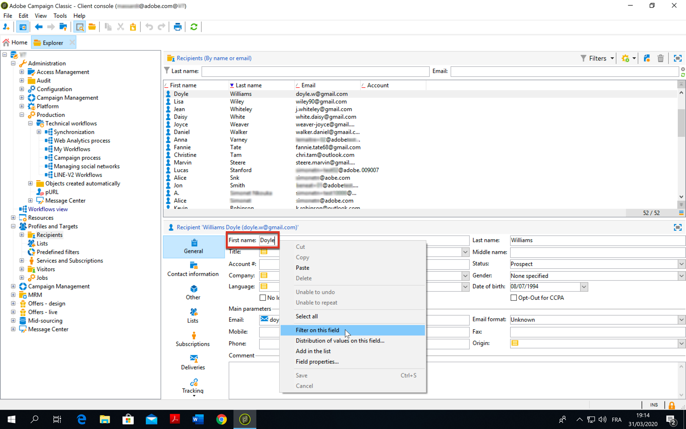

# データモデルのベストプラクティス{#data-model-best-practices}

このドキュメントでは、Adobe Campaignデータモデルを設計する際の主な推奨事項の概要を説明します。

キャンペーンの組み込みテーブルとその操作について詳しくは、「 [Campaign Classicデータモデル](../../configuration/using/about-data-model.md) 」の節を参照してください。

キャンペーンスキーマ [の使用を開始するには](../../configuration/using/about-schema-reference.md) 、このドキュメントを読んでください。 このドキュメントで、Adobe Campaignデータベースの概念的なデータモデルを拡張するための拡張スキーマの設定方法 [を説明します](../../configuration/using/about-schema-edition.md)。

## 概要 {#overview}

Adobe Campaignシステムは非常に柔軟性が高く、最初の実装以外にも拡張できます。 ただし、可能性は無限ですが、賢明な判断を下し、開始がデータモデルを設計するための強力な基盤を構築することは非常に重要です。

このドキュメントでは、Adobe Campaignツールを適切に設計する方法を学ぶための一般的な使用例とベストプラクティスを紹介します。

## データモデルのアーキテクチャ {#data-model-architecture}

Adobe Campaign Standardは、オンラインとオフラインの戦略を調整して、パーソナライズされた顧客体験を作り出すのに役立つ強力なクロスチャネルキャンペーン管理システムです。

### 顧客中心アプローチ {#customer-centric-approach}

ほとんどの電子メールサービスプロバイダーはリスト中心アプローチを使用してお客様と通信していますが、Adobe Campaignは、お客様とその属性の幅広い表示を活用するために、リレーショナルデータベースに依存しています。

この顧客中心アプローチは、次の図のようになります。 灰色の **受信者** 表は、すべての作成が行われている主な顧客表を示します。

各テーブルの説明にアクセスするには、 **[!UICONTROL 管理者/設定/データスキーマ]**&#x200B;に移動し、リストからリソースを選択して、「 **[!UICONTROL ドキュメント]** 」タブをクリックします。

Adobe Campaignのデフォルトのデータモデルが [このドキュメントに表示されます](../../configuration/using/data-model-description.md)。

>[!NOTE]
>
>Adobe Campaign Classicはカスタム顧客テーブルの作成を許可します。 ただし、ほとんどの場合は、標準の [受信者テーブルを使用することをお勧めします。標準の](../../configuration/using/about-data-model.md#default-recipient-table) テーブルには、既に追加のテーブルや機能があらかじめ組み込まれています。

### Adobe Campaign用データ {#data-for-campaign}

Adobe Campaignに送信するデータ マーケティングアクティビティに必要なデータを決定することが重要です。

>[!NOTE]
>
>Adobe Campaignは、データウェアハウスでもレポートツールでもありません。 したがって、可能な顧客とその関連情報をすべてAdobe Campaignにインポートしたり、レポートの作成にのみ使用されるデータをインポートしたりしないでください。

属性をAdobe Campaignに必要とするかどうかを判断するには、次のカテゴリのいずれかに該当するかどうか自問してください。

* セグメント化に使用する **属性**
* **データ管理プロセスに使用される属性** (集計の計算など)
* パー **ソナライゼーションに使用する属性**

これらのいずれかに該当しない場合、Adobe Campaignでこの属性は必要ないと思われます。

### データタイプの選択 {#data-types}

システムのアーキテクチャとパフォーマンスを確実に保つには、次のベストプラクティスに従ってAdobe Campaignでデータを設定します。

* 大きなテーブルには、数値フィールドが含まれ、参照テーブルへのリンクが含まれていることがよくあります(値のリストを使用する場合)。
* expr **** 属性を使用すると、スキーマ属性を、テーブル内の物理的な設定値ではなく、計算済みのフィールドとして定義できます。 これにより、両方の値を格納する必要なく、異なる形式（年齢や生年月日など）で情報にアクセスできます。 これは、フィールドの重複を避けるための良い方法です。 例えば、受信者テーブルでドメインの式が使用されますが、ドメインは電子メールフィールドに既に存在します。
* ただし、式の計算が複雑な場合は、 **expr** 属性を使用しないでください。この属性は、実行中の計算がクエリのパフォーマンスに影響を与える可能性があるので、使用しないでください。
* 作成するフィールドの数が多すぎるのを防ぐには、 **XML** 型を使用することをお勧めします。 ただし、データベース内でCLOB列を使用するので、ディスク領域も使用されます。 また、複雑なSQLクエリを引き起こし、パフォーマンスに影響を与える可能性もあります。
* 文字列 **フィールドの長さは、常に列で定義する必要があります** 。 デフォルトでは、Adobe Campaignの最大長は255ですが、サイズが短くならないことが既にわかっている場合は、Adobeでフィールドの長さを短くすることをお勧めします。
* ソース・システムのサイズが過大評価されていて、サイズに達しないことが確実な場合は、ソース・システムのAdobe Campaignよりもフィールドの方が短い場合でも構いません。 Adobe Campaignが短い文字列か、それより小さい整数を意味する場合があります。

### フィールドの選択 {#choice-of-fields}

ターゲット設定またはパーソナライゼーションの目的を持つフィールドは、テーブルに格納する必要があります。 つまり、パーソナライズされた電子メールの送信にフィールドを使用しない場合や、クエリの基準として使用する場合は、ディスク領域を使用しますが、使用できません。

ハイブリッドインスタンスおよびオンプレミスインスタンスの場合、FDA(Federated Data Access、外部データへのアクセスを可能にするオプション機能)は、キャンペーンプロセス中にフィールドをその場で追加する必要性をカバーします。 FDAがある場合は、すべてを読み込む必要はありません。 For more on this, see [About Federated Data Access](../../platform/using/about-fda.md).

### キーの選択 {#choice-of-keys}

ほとんどの表でデフォルトで **定義されている自動処理に加えて** 、論理キーやビジネスキー（アカウント番号、クライアント番号など）を追加することも検討してください。 後でインポート/調整またはデータパッケージに使用できます。 For more on this, see [Identifiers](#identifiers).

パフォーマンスを高めるには、効率的なキーが不可欠です。 数値データ型は、テーブルのキーとして常に推奨されます。

SQLServerデータベースの場合、パフォーマンスが必要な場合は、「クラスター化インデックス」の使用を検討できます。 Adobeはこの処理を行わないので、SQLで作成する必要があります。

### 専用テーブルスペース {#dedicated-tablespaces}

スキーマの表領域属性を使用すると、表の専用の表領域を指定できます。

インストールウィザードでは、種類（データ、一時、インデックス）別にオブジェクトを保存できます。

専用テーブルスペースは、パーティション化、セキュリティ・ルールに適しており、流動的で柔軟な管理、最適化、パフォーマンスを実現できます。

## 識別子 {#identifiers}

Adobe Campaignリソースには3つの識別子があり、別の識別子を追加できます。

次の表に、これらの識別子とその目的を示します。

| ID | 説明 | ベストプラクティス |
|--- |--- |--- |
| ID | <ul><li>IDは、Adobe Campaignテーブルの物理的な主キーです。 標準搭載されたテーブルの場合、シーケンスから生成される32ビットの数値です</li><li>このIDは、通常、特定のAdobe Campaignインスタンスに対して一意です。 </li><li>自動生成IDは、スキーマ定義で表示できます。 autopk=&quot;true&quot; *属性を検索し* ます。</li></ul> | <ul><li>自動生成された識別子は、ワークフローやパッケージ定義で参照として使用しないでください。</li><li>IDが常に増加する数値であることを前提としないでください。</li><li>既製のテーブル内のIDは32ビットの数値で、この型は変更しないでください。 この番号は、セクション内の同じ名前の「シーケンス」から取得されます。</li></ul> |
| 名前（または内部名） | <ul><li>この情報は、テーブル内のレコードの一意の識別子です。 この値は手動で更新でき、通常は生成された名前を付けます。</li><li>このIDは、別のAdobe Campaignインスタンスにデプロイする場合に値を保持するので、空にすることはできません。</li></ul> | <ul><li>オブジェクトをAdobe Campaignから別の環境にデプロイする場合、で生成されるレコード名を変更します。</li><li>オブジェクトに名前空間属性(*スキーマ* など)がある場合、この共通名前空間は作成されたすべてのカスタムオブジェクトで使用されます。 一部の予約済み名前空間は使用しないでください。 *nms*、 *xtk*。</li><li>オブジェクトに名前空間(*ワークフロー* 、 *配信* など)がない場合、この名前空間概念は内部名オブジェクトのプレフィックスとして追加されます。 *namespaceMyObjectName*.</li><li>スペース&quot;&quot;、セミコラム&quot;:&quot;、ハイフン&quot;-&quot;などの特殊文字は使用しないでください。 これらの文字はすべて、アンダースコア「_」に置き換えられます（許可されている文字）。 例えば、&quot;abc-def&quot;と&quot;abc:def&quot;は&quot;abc_def&quot;として保存され、互いに上書きされます。</li></ul> |
| ラベル | <ul><li>ラベルは、Adobe Campaign内のオブジェクトまたはレコードのビジネス識別子です。</li><li>このオブジェクトでは、スペースと特殊文字を使用できます。</li><li>レコードの一意性を保証するものではありません。</li></ul> | <ul><li>オブジェクトのラベルの構造を決定することをお勧めします。</li><li>これは、Adobe Campaignユーザーのレコードまたはオブジェクトを識別するための、最も使いやすいソリューションです。</li></ul> |

## カスタム内部キー {#custom-internal-keys}

プライマリキーは、Adobe Campaignで作成されるすべてのテーブルに必要です。

ほとんどの組織は、外部システムからレコードを読み込んでいます。 受信者テーブルの物理キーは「id」属性ですが、カスタムキーを特定することもできます。

このカスタムキーは、外部システムフィードAdobe Campaignの実際のレコードの主キーです。

あらかじめ用意されているテーブルに、オートプックと内部キーの両方が付いている場合、その内部キーは物理データベーステーブル内の一意のインデックスとして設定されます。

カスタムテーブルを作成する場合は、次の2つのオプションがあります。
* 自動生成されたキー(id)と内部キー（カスタム）の組み合わせ。 このオプションは、システムキーが複合キーである場合や整数でない場合に興味深いものです。 整数は、大きいテーブルで高いパフォーマンスを提供し、他のテーブルと結合します。
* 外部システムの主キーとして主キーを使用する。 異なるシステム間で一貫したキーを持つデータのインポートとエクスポートのアプローチを簡素化するので、通常、このソリューションをお勧めします。 キーの名前が「id」で、（自動生成ではなく）外部の値で入力されると予想される場合、自動実行を無効にする必要があります。

>[!IMPORTANT]
>
>ワークフローでは、オートパックを参照として使用しないでください。

## シーケンス {#sequences}

Adobe Campaignの主キーは、あらかじめ用意されているすべてのテーブルに対して自動生成されるIDで、カスタムテーブルに対しても同じIDを使用できます。 詳しくは、[この節](#identifiers)を参照してください。

この値は、 **シーケンスと呼ばれる、番号シーケンスの生成に使用されるデータベースオブジェクト**(sequence)から取得されます。

シーケンスには2種類あります。
* **共有**:複数のテーブルで、同じシーケンスからidが選択されます。 つまり、あるテーブルでID「X」が使用されている場合、同じシーケンスを共有する他のテーブルで、そのID「X」のレコードが存在することはありません。 **XtkNewId** は、Adobe Campaignで使用できるデフォルトの共有シーケンスです。
* **専用**:シーケンスからidを選択するテーブルは1つだけです。 通常、シーケンス名にはテーブル名が含まれます。

>[!IMPORTANT]
>
>シーケンスは32ビットの整数値で、使用可能な値の最大数は有限です。21億4000万 最大値に達した後、シーケンスは0に戻り、IDをリサイクルします。
>
>古いデータが削除されない場合は、一意のキー違反が発生し、プラットフォームの正常性と使用状況の阻害要因となります。 Adobe Campaignは通信を送信できず(配信ログテーブルに影響が出た場合)、パフォーマンスに大きな影響を与えます。

したがって、顧客が年間60億通の電子メールを送信し、そのログの保存期間が180日の場合、4か月でIDが不足することになります。 このようなチャレンジを回避するには、ボリュームに応じてパージ設定を行う必要があります。 詳しくは、[この節](#data-retention)を参照してください。

主キーをautoPKとしてAdobe Campaignしてカスタムテーブルを作成する場合は、カスタム専用シーケンスをそのテーブルに系統的に関連付ける必要があります。

デフォルトでは、カスタムシーケンスの値は+1,000 ～ +2.1BBです。 技術的には、除外idを有効にすることで、4BBのフルレンジを取得できます。 この値は注意して使用し、負の数値から正の数値に渡すと1つのIDが失われます。通常、生成されたSQLクエリでは、レコード0はAdobe Campaign Classicによって無視されます。

**関連トピック：**
* シー **ケンスの自動生成** 機能について詳しくは、 [このドキュメントを参照してください](https://helpx.adobe.com/jp/campaign/kb/sequence_auto_generation.html)。
* For more on sequences exhaustion, watch [this video](https://helpx.adobe.com/customer-care-office-hours/campaign/sequences-exhaustion-campaign-classic.html).

## インデックス {#indexes}

パフォーマンスにはインデックスが不可欠です。 スキーマでキーを宣言すると、Adobeは自動的にキーのフィールドにインデックスを作成します。 また、キーを使用しないクエリのインデックスをさらに宣言することもできます。

Adobeでは、パフォーマンスが向上する可能性があるので、追加のインデックスを定義することをお勧めします。

ただし、次の点に注意してください。

* インデックスの使用がアクセスパターンにバインドされています。 インデックス作成の最適化は、多くの場合、データベース設計の重要な部分であり、専門家が処理する必要があります。 インデックスの追加は、多くの場合、データベースの保守に関連付けられる反復的なワークフローです。 時間の経過とともに、パフォーマンスの問題に対処するために段階的に実行されます。
* インデックスは、テーブル全体のサイズを大きくします（インデックス自体を格納します）。
* 列にインデックスを追加すると、データ読み取りアクセス(SELECT)のパフォーマンスが向上しますが、データ書き込みアクセス(UPDATE)のパフォーマンスが低下する可能性があります。
* これは、データの挿入中のパフォーマンスに影響するので、インデックスのサイズと数を制限する必要があります。
* 不要な場合はインデックスを追加しない。 必須であることを確認し、クエリ（テストと学習）の全体的なパフォーマンスを向上させます。
* 一般的に、クエリがレコードの10%以上を取り戻さないことを知っている場合は、インデックスの方が効率的です。
* 定義する必要のあるインデックスを慎重に選択します。
* 既製のテーブルからネイティブインデックスを削除しないでください。

<!--When you are performing an initial import with very high volumes of data insert in Adobe Campaign database, it is recommended to run that import without custom indexes at first. It will allow to accelerate the insertion process. Once you’ve completed this important import, it is possible to enable the index(es).-->

### 例

インデックスの管理は非常に複雑になる場合があるので、その動作を理解することが重要です。 この複雑さを説明するために、受信者を名と姓でフィルター処理して検索するなど、基本的な例を見てみましょう。 手順は次のとおりです。
1. データベース内のすべての受信者をリストするフォルダーに移動します。 For more on this, see [Managing profiles](../../platform/using/managing-profiles.md).
1. [ **[!UICONTROL 名]** ]フィールドを右クリックします。
1. Select **[!UICONTROL Filter on this field]**.

   

1. 「 **[!UICONTROL 姓]** 」フィールドに対して、この操作を繰り返します。

対応する2つのフィルターが画面の上部に追加されます。

様々なフィルター条件に従って、「 **[!UICONTROL 姓]** 」フィールドと「 **[!UICONTROL 姓]** 」フィールドに対して検索フィルターを実行できるようになりました。

これらのフィルターの検索を高速化するために、インデックスを追加できます。 しかし、どのインデックスを使用すべきか。

>[!NOTE]
>
>この例は、PostgreSQLデータベースを使用するホスト顧客に適用されます。

次の表に、最初の列に表示されるアクセスパターンに従って、以下に示す3つのインデックスが使用される場合、または使用されない場合を示します。

| 検索条件 | インデックス1 （名+姓） | インデックス2 （名のみ） | インデックス3（姓のみ） | コメント |
|--- |--- |--- |--- |--- |
| 名は「ジョニー」に等しい | 使用済み | 使用済み | 未使用 | 名はインデックス1の最初の位置にあるので、いずれにせよ使用されます。姓に条件を追加する必要はありません。 |
| 名は「Johnny」、姓は「Smith」に等しい | 使用済み | 未使用 | 未使用 | 両方の属性が同じクエリで検索されるので、両方の属性を組み合わせたインデックスのみが使用されます。 |
| 姓が「Smith」と等しい | 未使用 | 未使用 | 使用済み | インデックス内の属性の順序が考慮されます。 この順序と一致しない場合、インデックスが使用されない可能性があります。 |
| 「Joh」を含む名の開始 | 使用済み | 使用済み | 未使用 | 「左検索」はインデックスを有効にします。 |
| 名が「nny」で終わる | 未使用 | 未使用 | 未使用 | 「右検索」はインデックスを無効にし、フルスキャンを実行します。 特定のインデックスタイプの中には、この使用例を扱うものもありますが、Adobe Campaignではデフォルトで使用できないものもあります。 |
| 名に「John」を含む | 未使用 | 未使用 | 未使用 | これは、「左」と「右」の検索の組み合わせです。 後者の場合はインデックスが無効になり、フルスキャンが実行されます。 |
| 名が「john」と等しい | 未使用 | 未使用 | 未使用 | インデックスでは大文字と小文字が区別されます。 大文字と小文字を区別しないようにするには、「upper(firstname)」のようなSQL関数を含む特定のインデックスを作成する必要があります。 「unaccent(firstname)」など、他のデータ変換にも同様の処理を行う必要があります。 |

## リンクと基数 {#links-and-cardinality}

### リンク {#links}

大きなテーブルでは、「独自の」整合性に注意してください。 ワイドテーブルを持つレコードを「独自の」整合性で削除すると、インスタンスが停止する場合があります。 テーブルはロックされ、削除は1つずつ行われます。 したがって、大量の子テーブルには「中立」の整合性を使用することをお勧めします。

リンクを外部結合として宣言するのは、パフォーマンスには適していません。 ゼロIDレコードは外部結合機能をエミュレートします。 リンクでオートプックを使用する場合は、外部結合を宣言する必要はありません。

ワークフロー内の任意のテーブルを結合できますが、Adobeでは、リソース間の共通リンクをデータ構造の定義に直接定義することをお勧めします。

リンクは、テーブル内の実際のデータと整列して定義する必要があります。 誤った定義は、予期せぬレコードの複製など、リンクを介して取得したデータに影響を与える可能性があります。

リンクには、テーブル名と同じ名前を付けます。リンク名は、遠隔テーブルの内容を理解するのに役立ちます。

「id」をサフィックスとして含むリンクの名前を付けないでください。 例えば、「transactionId」ではなく「transaction」という名前を付けます。

デフォルトでは、Adobe Campaignは外部テーブルの主キーを使用してリンクを作成します。 より明確にするために、リンク定義で結合を明示的に定義することをお勧めします。

リンクで使用される属性にインデックスが追加されます。

created-byリンクとlast-modified-byリンクは、多くのテーブルに存在します。 この情報がビジネスで使用されていない場合は、リンクで属性noDbIndexを使用してインデックスを無効にできます。

### カーディナリティ {#cardinality}

リンクを設計する場合は、1-1関係が宣言されているときに、ターゲットレコードが一意であることを確認します。 そうしないと、1つしか期待できない場合に、結合が複数のレコードを返す可能性があります。 これにより、「クエリが予想以上の行を返した」場合に、配信の準備中にエラーが発生します。 リンク名をターゲットスキーマと同じ名前に設定します。

(1)側のスキーマにカーディナリティ(1 ～ N)のリンクを定義します。 例えば、関係受信者(1) - (N)トランザクションは、トランザクションスキーマ内で定義する必要があります。

デフォルトでは、リンクのカーディナリティが逆に(N)なので注意してください。 リンク定義にrevCardinality=&#39;single&#39;という属性を追加することで、リンク(1 ～ 1)を定義できます。

リバースリンクがユーザに表示されない場合は、リンク定義revLink=&#39;_NONE_&#39;を使用して非表示にできます。 例えば、受信者から最後に完了したトランザクションへのリンクを定義するのが適切な使用例です。 受信者から最後のトランザクションへのリンクのみが表示され、トランザクションテーブルに逆リンクを表示する必要はありません。

外部結合(1 ～ 0 ～ 1)を実行するリンクは、システムのパフォーマンスに影響を与えるので、注意して使用する必要があります。

## データ保持：クリーンアップと削除 {#data-retention}

Adobe Campaignは、データウェアハウスでもレポートツールでもありません。 したがって、Adobe Campaign・ソリューションのパフォーマンスを向上させるためには、データベースの増大を抑制する必要があります。 これを達成するには、以下のベストプラクティスに従うと役立ちます。

デフォルトでは、Adobe Campaign配信およびトラッキングログの保存期間は180日です。 クリーンアップ処理が実行され、それより古いログが削除されます。

* ログを長く保つ場合は、データベースのサイズと送信されるメッセージの量に応じて、この決定を慎重に行う必要があります。 注意：Adobe Campaignシーケンスは32ビット整数です。
* これらの表に一度に10億件を超えるレコードを含めないこと（21億4000万IDの約50%）をお勧めし、使用可能なすべてのIDを消費するリスクを制限します。 これは、一部のお客様が180日未満の保存期間を短くする必要がある場合に必要となります。

データ保持に関する詳細は、 [キャンペーンのプライバシーとセキュリティのガイドラインを参照してください](https://helpx.adobe.com/jp/campaign/kb/campaign-privacy-overview.html#consent)。

キャンペーンデータベースのクリーンアップワークフロー [の詳細については、この節を参照してください](../../production/using/database-cleanup-workflow.md)。

>[!IMPORTANT]
>
>カスタムテーブルは、標準のクリーンアップ処理で削除されません。 この処理は1日目には必要ない場合がありますが、パフォーマンス上の問題を引き起こす可能性があるので、カスタム表のパージ処理を作成することを忘れないでください。

Adobe Campaign内のレコードの必要性を最小限に抑えるには、いくつかのソリューションがあります。
* Adobe Campaign以外のData Warehouseでデータをエクスポートします。
* マーケティングの慣行に従う一方で、使用するスペースを少なくする集約値を生成します。 例えば、最後の購入を追跡するために、Adobe Campaign内の完全な顧客取引履歴は必要ありません。

「deleteStatus」属性はスキーマで宣言できます。 レコードを削除済みとマークしてから、クリーンアップタスクで削除を延期する方が効率的です。

## パフォーマンス {#performance}

パフォーマンスを常に向上させるには、次のベストプラクティスに従ってください。

### 一般的な推奨事項 {#general-recommendations}

* クエリで「CONTAINS」などの操作を使用しないでください。 何を求められ、フィルターを適用するかがわかっている場合は、同じ条件を「EQUAL TO」または他の特定のフィルター演算子と共に適用します。
* ワークフローーでデータを作成する際は、インデックスが付けられていないフィールドとの結合を避けます。
* インポートやエクスポートなどのプロセスが業務時間外に発生することを確認してください。
* すべての日別アクティビティのスケジュールがあることを確認し、スケジュールに従います。
* 毎日のプロセスの1つまたは数が失敗し、その同じ日に実行する必要がある場合は、手動プロセスを開始する際に、システムのパフォーマンスに影響を与える可能性があるので、競合するプロセスが実行されていないことを確認します。
* 読み込みプロセス中、または手動プロセスが実行されたときに、毎日のキャンペーンが実行されないことを確認します。
* すべての行にフィールドを複製する代わりに、1つまたは複数の参照テーブルを使用します。 キーと値のペアを使用する場合は、数値キーを選択することをお勧めします。
* 短い文字列は引き続き使用できます。 参照テーブルが外部システムに既に配置されている場合、それを再利用すると、Adobe Campaignとのデータ統合が容易になります。

### 1対多の関係 {#one-to-many-relationships}

* データデザインはユーザビリティと機能に影響を与えます。 多数の1対多の関係を持つデータモデルを設計する場合、ユーザーがアプリケーション内で意味のあるロジックを作成するのが難しくなります。 1対多のフィルターロジックは、技術的でないマーケターが正しく構築し理解するのが困難な場合があります。
* 重要なフィールドはすべて1つのテーブルにまとめておくと、クエリの作成が容易になるので便利です。 結合を避けることができる場合に、テーブルをまたいでいくつかのフィールドを重複するのにパフォーマンスが良いこともあります。
* 特定の組み込み機能は、1対多の関係(オファーの重み付けの数式や配信など)を参照できません。

## 大きいテーブル {#large-tables}

Adobe Campaignは、サードパーティのデータベースエンジンに依存しています。 プロバイダーによっては、大きいテーブルに対するパフォーマンスを最適化するために、特定のデザインが必要になる場合があります。

大きなテーブルと複雑な結合を使用してデータモデルを設計する際に従う必要がある、いくつかの一般的なベストプラクティスを以下に示します。

* 追加のカスタム受信者テーブルを使用する場合は、各配信マッピングに対して専用のログテーブルがあることを確認してください。
* 特に未使用の列を識別して、列の数を減らします。
* 複数の条件や複数の列に対する結合など、複雑な結合を避けて、データモデルのリレーションを最適化します。
* 結合キーには、文字列ではなく常に数値データを使用します。
* ログ保持の深さをできる限り減らします。 より深い履歴が必要な場合は、集計の計算やカスタムログテーブルの処理を行って、より大きな履歴を保存できます。

### テーブルのサイズ {#size-of-tables}

テーブルサイズは、レコード数とレコードあたりの列数の組み合わせです。 両方とも、クエリのパフォーマンスに影響を与える可能性があります。

* **小さいサイズのテーブルは** 、配信テーブルに似ています。
* **中サイズのテーブルは** 、受信者テーブルのサイズと同じです。 顧客1人につき1件のレコードがあります。
* 大きい **サイズのテーブルは** 、部分一致ログテーブルに似ています。 1人の顧客につき多くのレコードがあります。
例えば、データベースに1000万個の受信者が含まれる場合、部分一致ログテーブルには約1億～2億個のメッセージが格納され、配信テーブルには数千件のレコードが格納されます。

PostgreSQLでは、 [TOAST](https://wiki.postgresql.org/wiki/TOAST) メカニズムを避けるために、行が8 KBを超えないようにする必要があります。 したがって、システム（メモリとCPU）の最適なパフォーマンスを維持するために、列数と各行のサイズをできるだけ小さくしてください。

行数はパフォーマンスにも影響します。 Adobe Campaignデータベースは、ターゲット設定やパーソナライゼーションの目的で積極的に使用されない履歴データを格納するように設計されていません。これは、運用データベースです。

行数が多くなることに伴うパフォーマンス上の問題を防ぐには、必要なレコードのみをデータベースに保存します。 その他のレコードは、サードパーティのData Warehouseにエクスポートし、Adobe Campaignの運用データベースから削除する必要があります。

テーブルのサイズに関するベストプラクティスのいくつかを次に示します。

* フィールド数が少なく、数値データが多い大きなテーブルをデザインします。
* 大量の列を使用しない(例：Int64)を使用して、ブール値などの小さな数値を格納します。
* 使用されていない列をテーブル定義から削除します。
* 履歴データや非アクティブなデータをAdobe Campaignデータベースに保持しない（書き出しとクリーンアップ）。

次に例を示します。

この例では、次のようになります。
* 「 *トランザクション* 」( *Transaction* )テーブルと「トランザクション項目」(Transaction Item)テーブルは大きくなります。1千万以上。
* 「 *Product* 」テーブルと「 *Store* 」テーブルは小さくなります。1万未満。
* 製品のラベルと参照が *Product* テーブルに配置されています。
* 「 *取引品目* 」( *Transaction Item* )テーブルには、「製品」(Product)テーブル（数値）へのリンクのみが含まれます。

<!--For more detailed best practices on how to optimize the database design for larger volumes, see [Campaign Classic Data model Best practices](https://helpx.adobe.com/campaign/kb/acc-data-model-best-practices.html).-->