# キャンペーンデータモデルの説明{#data-model-description}

Adobe Campaign には、事前定義済みのデータモデルが付属しています。 ここでは、Adobe Campaign データモデルのビルトインテーブルとそのインタラクションについて詳しく説明します。

各テーブルの記述にアクセスするには、**[!UICONTROL 管理／設定／データスキーマ]**&#x200B;に移動し、リストからリソースを選択して「**[!UICONTROL ドキュメント]**」タブをクリックします。

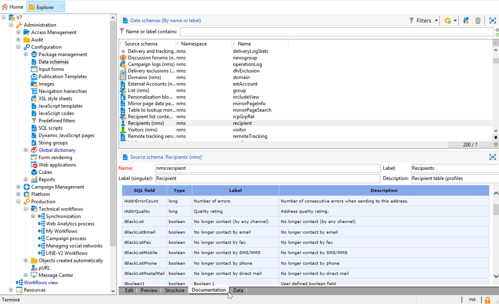

>[!NOTE]
>
>アプリケーションに格納されるデータの物理的および論理的構造は、XML で記述されます。 スキーマと呼ばれる Adobe Campaign 特有の文法に従います。 Adobe Campaign スキーマについて詳しくは、[この節](../../configuration/using/about-schema-reference.md)を参照してください。

## メインテーブルの説明 {#description-main-tables}

Adobe Campaignは、リンクされたテーブルを含むリレーショナルデータベースに依存しています。

次の図は、Adobe Campaign データモデルの主なビジネステーブルと、各データモデルの主なフィールドとの結合を示しています。

<!---->

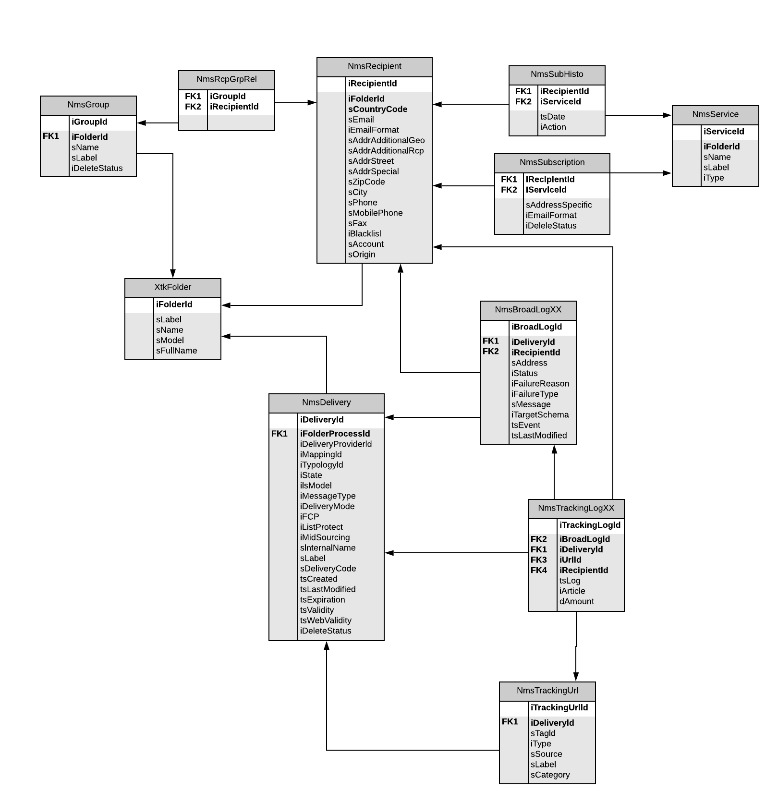

定義済みのAdobe Campaign データモデルには、次の主なテーブルが含まれています。

### NmsRecipient {#NmsRecipient}

このテーブルは&#x200B;**nms:recipient** スキーマと一致します。

これは、配信&#x200B;**の**&#x200B;受信者に使用されるデフォルトのテーブルです。 その結果、様々なチャネルを介した配信に必要な情報が含まれます。

* sEmail: メールアドレス。
* iEmailFormat：メールの優先フォーマット（テキストの場合は1、HTMLの場合は2、未定義の場合は0）。
* sAddress1、sAddress2、sAddress3、sAddress4、sZipCode、sCityを使用して、郵送先住所を作成します（1997年5月のXPZ 10-011 AFNOR標準に従います）。
* sPhone、sMobilePhone、sFaxには、それぞれ電話番号、携帯電話、FAX番号が含まれています。
* iBlackListは、プロファイルに使用されるデフォルトのオプトアウトフラグです（1は「登録解除」を意味し、それ以外は0を意味します）。

iFolderId フィールドは、受信者を実行フォルダーにリンクする外部キーです。 詳しくは、[XtkFolder](#XtkFolder)を参照してください。

sCountryCode フィールドは、受信者に関連付けられている国の3166-1 Alpha 2 ISO コード （2文字）です。 このフィールドは、国ラベルやその他の国コードデータを含む国参照テーブル（NmsCountry）の外部キーです。 国が入力されていない場合は、値「XX」が保存されます（ゼロ ID レコードの代わりに使用されます）。

受信者テーブルについて詳しくは、[この節](../../configuration/using/about-data-model.md#default-recipient-table)を参照してください。

### NmsGroup {#NmsGroup}

このテーブルは&#x200B;**nms:group** スキーマと一致します。

これにより、受信者の静的グループ **を作成できます**。 受信者とグループの間には多対多の関係があります。 例えば、1人の受信者は複数のグループに属することができ、1つのグループには複数の受信者を含めることができます。 グループは、読み込み経由または配信ターゲティング経由で手動で作成できます。 配信目標として、一般的にグループが使用されます。 sName グループの内部名を表すフィールドには、一意のインデックスがあります。 グループはフォルダーにリンクされています（キーはiFolderIdです。 詳しくは、[XtkFolder](#XtkFolder)）を参照してください。

### NmsRcpGrpRel {#NmsRcpGrpRel}

NmsRcpGrpRel関係テーブルには、iRecipientIdとiGroupIdのリンクされたテーブルの識別子に対応する2つのフィールドのみが含まれます。

### NmsService {#NmsService}

このテーブルは&#x200B;**nms:service** スキーマと一致します。

Adobe Campaignでは、情報サービス（トピック）のサブスクリプションを作成および管理できます。 NmsService テーブルには、受信者が購読する情報サービス（トピック）の定義（ニュースレターなど）が格納されます。

サービスは、グループ（静的な受信者グループ）と似たエンティティですが、より多くの情報を循環させ、フォームを介してサブスクリプションと登録解除を簡単に管理できる点が異なります。

sName サービスの内部名を表すフィールドには、一意のインデックスがあります。 サービスはフォルダーにリンクされています（キーはiFolderIdです。 詳しくは、[XtkFolder](#XtkFolder)）を参照してください。 最後に、「iType」フィールドで、このサービスの配信チャネルを指定します（電子メールの場合は0、SMSの場合は1、電話の場合は2、ダイレクトメールの場合は3、FAXの場合は4）。

### NmsSubscription {#NmsSubscription}

このテーブルは&#x200B;**nms:subscription** スキーマと一致します。

これにより、情報サービスに対する受信者のサブスクリプションを管理できます。

### NmsSubHisto {#NmsSubHisto}

このテーブルは&#x200B;**nms:subHisto** スキーマと一致します。

サブスクリプションがWeb フォームまたはアプリケーションのインターフェイスを使用して管理されている場合、すべてのサブスクリプションとサブスクリプション解除はNmsSubHisto テーブルに記録されます。 iAction フィールドは、tsDate フィールドに保存されている日付に実行されるアクション（購読解除の場合は0、購読解除の場合は1）を指定します。

### NmsDelivery {#NmsDelivery}

このテーブルは&#x200B;**nms:delivery** スキーマと一致します。

このテーブルの各レコードは、**配信アクション**&#x200B;または&#x200B;**配信テンプレート**&#x200B;を表します。 配信を実行するために必要なすべてのパラメーター（ターゲット、コンテンツなど）が含まれます。 配信（ブロードキャスト）ログ（NmsBroadLog）と関連するトラッキング URL （NmsTrackingUrl）は、分析フェーズで作成されます（両方のテーブルについて詳しくは、以下を参照）。

sInternalName配信またはシナリオの内部名を表すフィールドには、一意のインデックスがあります。 配信は実行フォルダーにリンクされます（外部キーはiFolderProcessIdです。 詳しくは、[XtkFolder](#XtkFolder)）を参照してください。

### XtkFolder {#XtkFolder}

コンソールの「**ナビゲーション**」タブに表示されているツリー&#x200B;**内のすべてのフォルダーが**&#x200B;含まれています。

フォルダーに入力されます。sModel フィールドの値は、フォルダーに含めることができるデータのタイプを指定します。 このフィールドは、クライアントコンソールが対応するフォームでデータを正しく表示するためにも使用できます。 このフィールドの可能な値は、navTreeで定義されます。

ツリーは、iParentId フィールドとiChildCount フィールドで管理されます。 sFullName フィールドは、ツリー内のフォルダーの完全なパスを示します。 最後に、sName フォルダーの内部名を表すフィールドに一意のインデックスがあります。

## 配信と追跡 {#delivery-and-tracking}

この一連のテーブルは&#x200B;**配信** モジュールにリンクされており、配信と、メッセージの送信時に発生する最終的な問題を監視できます。 詳しくは、[配信の監視](../../delivery/using/about-delivery-monitoring.md)を参照してください。 トラッキングについて詳しくは、[ メッセージのトラッキング ](../../delivery/using/about-message-tracking.md)を参照してください。

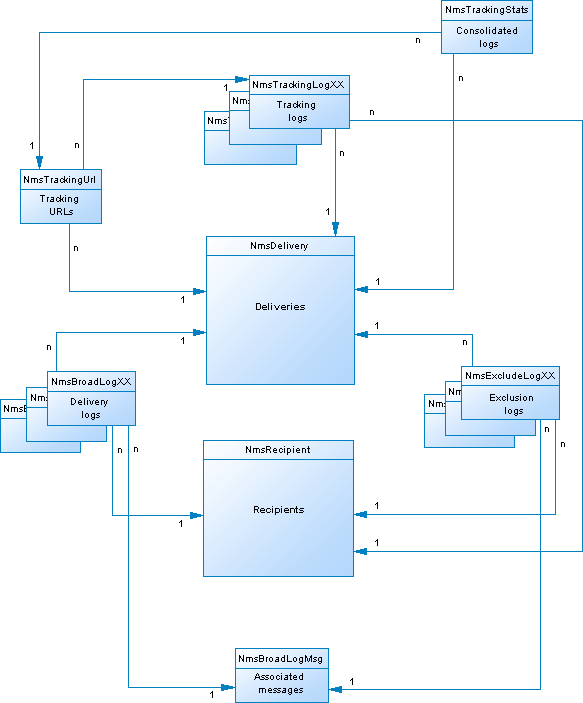

**NmsBroadLogMsg**：このテーブルは&#x200B;**nms:broadLogMsg** スキーマと一致します。 配信ログテーブルの拡張です。

## キャンペーン管理 {#campaign-management}

この一連のテーブルは&#x200B;**マーケティングキャンペーン** モジュールにリンクされており、コミュニケーションおよびマーケティングキャンペーンを定義、最適化、実行および分析できます。 詳しくは、[Campaign v8 ドキュメント](https://experienceleague.adobe.com/docs/campaign/campaign-v8/campaigns/campaigns.html?lang=ja){target=_blank}を参照してください。

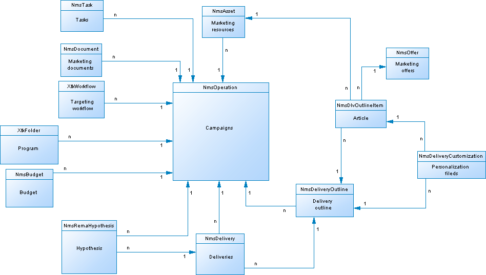

* **NmsOperation**：このテーブルは&#x200B;**nms:operation** スキーマと一致します。 マーケティングキャンペーンのデータが含まれています。
* **NmsDeliveryOutline**：このテーブルは&#x200B;**nms:deliveryOutline** スキーマと一致します。 配信の拡張プロパティ（配信の概要）が含まれます。
* **NmsDlvOutlineItem**：このテーブルは&#x200B;**nms:dlvOutlineItem** スキーマと一致します。 配信の概要の記事が含まれています。
* **NmsDeliveryCustomization**：このテーブルは&#x200B;**nms:deliveryCustomization** スキーマと一致します。 配信のパーソナライゼーションフィールドが含まれます。
* **NmsBudget**：このテーブルは&#x200B;**nms:budget** スキーマと一致します。 キャンペーン、計画、プログラム、タスク、配信に関する予算のデータが含まれます。
* **NmsDocument**：このテーブルは&#x200B;**nms:document** スキーマと一致します。 キャンペーンのマーケティングドキュメントをファイル（画像、ExcelまたはWord ファイルなど）の形式で含みます
* **XtkWorkflow**：このテーブルは&#x200B;**xtk:workflow** スキーマと一致します。 キャンペーンターゲティングが含まれています。
* **NmsTask**：このテーブルは&#x200B;**nms:task** スキーマと一致します。 これには、マーケティングタスクの定義が含まれます。
* **NmsAsset**：このテーブルは&#x200B;**nms:asset** スキーマと一致します。 マーケティングリソースの定義が含まれます。

## コミュニケーションの一貫性 {#communication-consistency}

この一連のテーブルは&#x200B;**Campaign Optimization** モジュールにリンクされており、配信の送信を制御、フィルタリング、監視できます。 詳しくは、[Campaign v8 ドキュメント](https://experienceleague.adobe.com/docs/campaign/automation/campaign-optimization/campaign-typologies.html?lang=ja){target="_blank"}を参照してください。

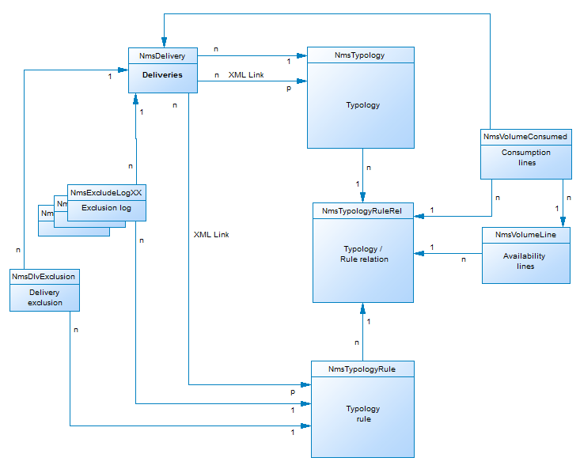

* **NmsTypologyRule**：このテーブルは&#x200B;**nms:typologyRule** スキーマと一致します。 これには、タイポロジに応じて配信に適用されるルールが含まれています。
* **NmsTypology**：このテーブルは&#x200B;**nms:typology** スキーマと一致します。 タイポロジに一致する配信に適用される一連のルールが含まれます。
* **NmsTypologyRuleRel**：このテーブルは&#x200B;**nms:typologyRuleRel** スキーマと一致します。 タイポロジとルールの関係が含まれています。
* **NmsVolumeLine**：このテーブルは&#x200B;**nms:volumeLine** スキーマと一致します。 これには、キャパシティルールの一連の可用性ラインが含まれます。
* **NmsVolumeConsumed**：このテーブルは&#x200B;**nms:volumeConsumed** スキーマと一致します。 キャパシティルールのすべての消費ラインが含まれます。

## 応答管理 {#response-management}

この一連のテーブルは&#x200B;**Response Manager** モジュールにリンクされており、すべてのコミュニケーションチャネルに対するマーケティングキャンペーンまたはオファー提案の成功と収益性を測定できます。 詳しくは、[応答マネージャーについて](../../response/using/about-response-manager.md)を参照してください。

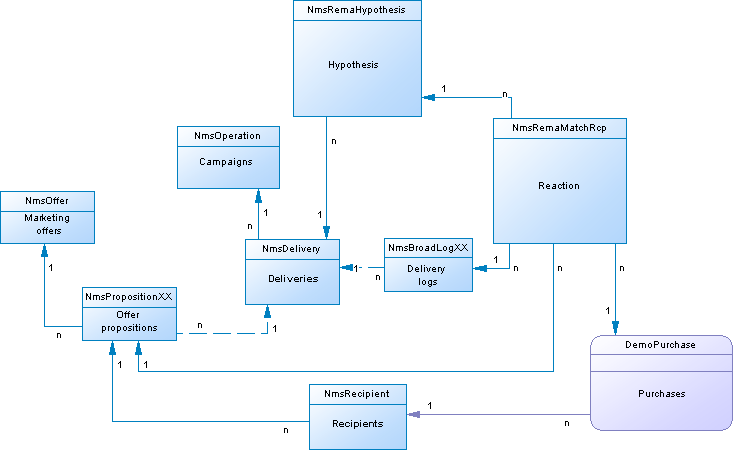

### NmsRemaHypothesis {#NmsRemaHypothesis}

このテーブルは&#x200B;**nms:remaHypothesis** スキーマと一致しています。 これには、測定仮説の定義が含まれます。

このテーブルには、次のようなXMLに格納された重要な情報が含まれています。

**実行コンテキスト （XMLに保存された情報）**

実行コンテキストは、測定の計算に考慮されるテーブルとフィールドに入力されます。つまり、次のようになります。
* nms:remaMatchRcp応答ログ ストレージ スキーマ。
* トランザクションテーブルスキーマ（購入など）。
* クエリ スキーマ。仮説条件の開始テーブルを定義できます。
* 個人へのリンク。クエリスキーマに基づいて個人を識別できます。
* 取引日。 このフィールドは必須ではありませんが、計算境界の制限に使用することをお勧めします。
* 取引金額：収益指標を自動的に計算するためのオプションのフィールドです。

**仮説の境界（XMLに保存された情報）**

仮説の境界は、クエリスキーマのテーブルに基づく仮説のフィルタリングで構成されます。

**仮説オーバーロード スクリプト （XMLに保存された情報）**

仮説オーバーロードスクリプトは、実行中に仮説の内容をオーバーロードできるようにするJavaScript コードです。

**測定指標**

次の指標は、仮説の実行中に自動的に更新されます。

* リアクション数：**iTransaction**。 反応ログ テーブルの行数。
* 連絡先の数：**iContactReacted** 仮説の対象となる連絡先の数を明確にします。
* コントロール グループ数：**iProofReacted**。 仮説の対象となるコントロールグループの連絡先の数を明確にします。
* 連絡先の応答率：**dContactReactedRate**。 仮説の対象となる連絡先の応答率。
* コントロール グループの応答率：**dProofReactedRate**。 仮説コントロール グループの応答率。
* 連絡先のある母集団の合計収益：**dContactReactedTotalAmount**。 仮説の対象となる連絡先の総収益。
* コントロール グループの平均収益：**dContactReactedAvgAmount**。 仮説の対象コントロール グループの連絡先の平均収益。
* コントロール グループの合計収益：**dProofReactedTotalAmount**。 仮説コントロール グループの総収益。
* コントロール グループの平均収益：**dProofReactedAvgAmount**。 仮説コントロール グループの平均収益。
* 取引先責任者ごとの合計利益率：**dContactReactedTotalMargin**。 仮説でターゲットとするコンタクトあたりのマージンの合計。
* 連絡先ごとの平均余白：**dContactReactedAvgMargin**。 仮説でターゲットにしたコンタクトあたりの平均余白。
* コントロール グループの合計マージン：**dProofReactedTotalMargin**。 仮説の対象となるコントロール グループのマージンの合計。
* コントロール グループの平均余白：**dProofReactedAvgMargin**。 仮説の対象となるコントロール グループの平均余白。
* 追加収益：**追加金額**。 （連絡先の平均収益 – コントロールグループの平均収益） *連絡先の数。
* 追加余白：**追加余白**。 （連絡先の平均余白 – コントロールグループの平均余白） / 連絡先の数。
* コンタクトあたりの平均コスト（SQL式）: 配信の計算コスト / 連絡先の数。
* ROI （SQL式）: 配信の計算コスト / 連絡の合計利益率。
* 効果的なROI （SQL式）: 配達の計算コスト / 追加マージン。
* 有意性：**iSignificativy** （SQL式）。 キャンペーンの有意性に応じて0 ～ 3の値を含みます。

### NmsRemaMatchRcp {#NmsRemaMatchRcp}

このテーブルは&#x200B;**nms:remaMatchRcp** スキーマと一致します。

特定の仮説に対する個人の反応を表すレコードが含まれます。 これらのレコードは、仮説の実行中に作成されました。

## シミュレーションと配信 {#simulation-and-delivery}

この一連のテーブルは&#x200B;**シミュレーション** モジュールにリンクされており、受信者に提案を送信する前に、カテゴリまたは環境に属するオファーの配布をテストできます。 詳しくは、[ オファーのシミュレーションについて](../../interaction/using/about-offers-simulation.md)を参照してください。

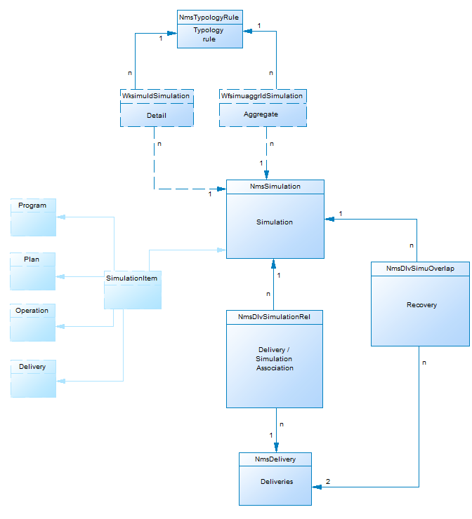

* **NmsSimulation**：このテーブルは&#x200B;**nms:simulation** スキーマと一致します。 特定の母集団に対する一連の配信またはオファーのシミュレーションを表します。
* **NmsDlvSimulationRel**：このテーブルは&#x200B;**nms:dlvSimulationRel** スキーマと一致します。 シミュレーションで考慮される配信のリストが含まれます。 シミュレーションの範囲はXMLに格納されます。
* **NmsOfferSimulationRel**：このテーブルは&#x200B;**nms:offerSimulationRel** スキーマと一致します。 シミュレーションとオファーをリンクさせることができます。

## インタラクションモジュール {#interaction-module}

この一連のテーブルは&#x200B;**インタラクション** モジュールにリンクされており、特定の連絡先とのインタラクション中に、1つまたは複数の適合したオファーを作成することで、リアルタイムで応答できます。 詳しくは、[ インタラクションとオファー管理](../../interaction/using/interaction-and-offer-management.md)を参照してください。

* **NmsOffer**：このテーブルは&#x200B;**nms:offer** スキーマと一致します。 各マーケティングオファーの定義が含まれます。
* **NmsPropositionRcp**：このテーブルは&#x200B;**nms:propositionRcp** スキーマと一致します。 各個人に送信されたマーケティング提案のクロスチャネルログが含まれます。 レコードは、個人に対して提案が準備または効果的に作成されたときに作成されます。
* **NmsOfferSpace**：このテーブルは&#x200B;**nms:offerSpace** スキーマと一致します。 提案が行われる場所の定義が含まれています。
* **NmsOfferContext**：このテーブルは&#x200B;**nms:offerContext** スキーマと一致します。 提案の適用可能性に関する追加の基準と、重量計算式の定義が含まれています。
* **NmsOfferView**：このテーブルは&#x200B;**nms:offerView**&#x200B;と一致します。 オファー表示域が含まれます。
* **NmsOfferCategory**：このテーブルは&#x200B;**nms:offerCategory**&#x200B;と一致します。 オファーカテゴリが含まれます。
* **NmsOfferEnv**：このテーブルは&#x200B;**nms:offerEnv**&#x200B;と一致します。 オファー環境が含まれます。

## Message Center モジュール {#message-center-module}

次の一連のテーブルは&#x200B;**トランザクションメッセージ** （Message Center）モジュールにリンクされており、ユーザーに送信され、情報システムからトリガーされたイベントから生成された個別および一意のコミュニケーションを管理できます。 詳しくは、「[ トランザクションメッセージについて](../../message-center/using/about-transactional-messaging.md)」を参照してください。

### NmsRtEvent {#NmsRtEvent}

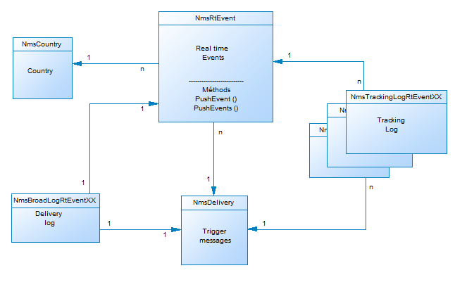

このテーブルは&#x200B;**nms:rtEvent** スキーマと一致します。 これには、リアルタイムイベントの定義が含まれます。

### NmsBatchEvent {#NmsBatchEvent}

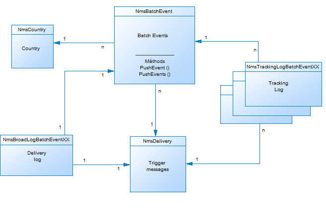

このテーブルは&#x200B;**nms:batchEvent** スキーマと一致します。 バッチ別のイベントの定義が含まれています。

<!--
## Microsites Module {#microsites-module}

This set of tables is linked to the **Web applications** functionality, which allows to create and publish dynamic and interactive web applications with data from the database and content adapted to the rights of the connected user. For more on this, see [About web applications](../../web/using/about-web-applications.md).

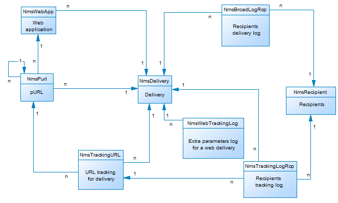

* **NmsTrackingUrl**: This table matches the **nms:trackingUrl** schema.

* **NmsPurl**: This table matches the **nms:purl** schema.
-->

## NMAC モジュール {#nmac-module}

この一連のテーブルは&#x200B;**モバイルアプリチャネル**&#x200B;にリンクされており、アプリ経由でiOSおよびAndroid端末にパーソナライズされた通知を送信できます。 詳しくは、[ モバイルアプリチャネルについて](../../delivery/using/about-mobile-app-channel.md)を参照してください。

* **NmsMobileApp**：このテーブルは&#x200B;**nms:mobileApp** スキーマと一致します。 Adobe Campaignで定義されたモバイルアプリケーションが含まれています。
* **NmsAppSubscription**：このテーブルは&#x200B;**nms:appSubscription** スキーマと一致します。 1つ以上のアプリケーションに関する購読者の情報が含まれます。
* **NmsAppSubscriptionRcp**：このテーブルは&#x200B;**nms:appSubscriptionRcp** スキーマと一致します。 これにより、アプリケーションを購読した訪問者を受信者テーブルにリンクできます。
* **NmsExcludeLogAppSubRcp**：このテーブルは&#x200B;**nms:excludeLogAppSubRcp** スキーマと一致します。
* **NmsTrackingLogAppSubRcp**：このテーブルは&#x200B;**nms:trackingLogAppSubRcp** スキーマと一致します。
* **NmsBroadLogAppSubRcp**：このテーブルは&#x200B;**nms:broadLogAppSubRcp** スキーマと一致します。

## ソーシャルマーケティングモジュール {#social-marketing-module}

この一連のテーブルは&#x200B;**ソーシャルネットワークの管理** モジュールにリンクされており、FacebookおよびX （旧Twitter）を介して顧客や見込み客と対話できます。 詳しくは、「[ ソーシャルマーケティングについて](../../social/using/about-social-marketing.md)」を参照してください。

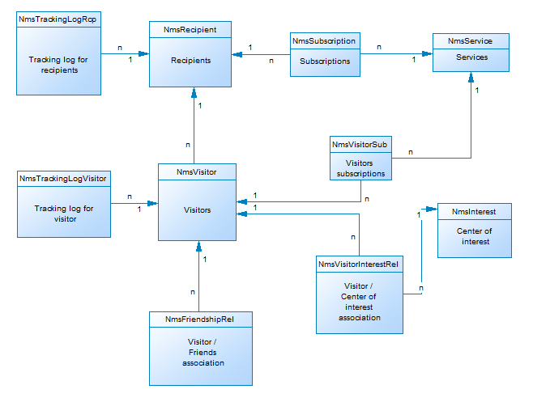

* **NmsVisitor**：このテーブルは&#x200B;**nms:visitor** スキーマと一致します。 訪問者に関する情報が含まれます。
* **NmsVisitorSub**：このテーブルは&#x200B;**nms:visitorSub** スキーマと一致します。 これにより、訪問者が購読しているサービス（XまたはFacebook）に訪問者をリンクできます。
* **NmsFriendShipRel**：このテーブルは&#x200B;**nms:friendshipRel** スキーマと一致します。 これにより、Facebook サービスのコンテキスト内で訪問者を友人とリンクさせることができます。
* **NmsVisitorInterestRel**：このテーブルは&#x200B;**nms:visitorInterestRel** スキーマと一致します。 訪問者とその興味をリンクさせることができます。
* **NmsInterest**：このテーブルは&#x200B;**nms:interest** スキーマと一致します。 各訪問者の関心のリストが含まれます。
