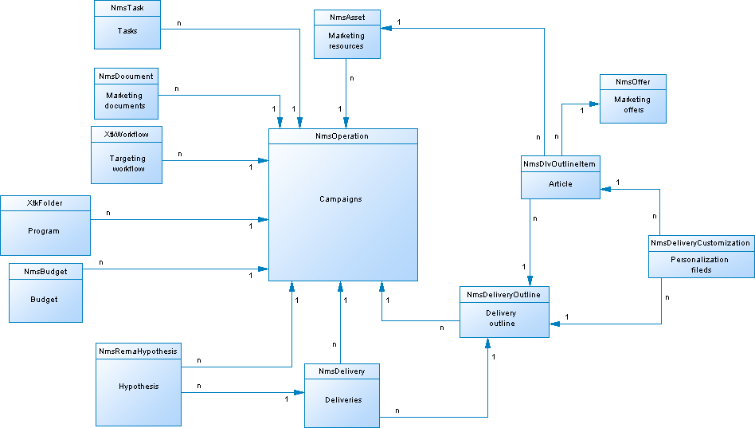

# キャンペーンデータモデルの説明{#data-model-description}

Adobe Campaignには、事前定義されたデータモデルが付属しています。 この節では、Adobe Campaignデータモデルの組み込みの表とそのインタラクションについて詳しく説明します。

各テーブルの説明にアクセスするには、に進み、リ **[!UICONTROL Admin > Configuration > Data schemas]**&#x200B;ストからリソースを選択し、タブをクリック **[!UICONTROL Documentation]** します。

>[!NOTE]
>
>アプリケーションに格納されるデータの物理的な構造と論理的な構造は、XMLで記述されます。 スキーマと呼ばれる、Adobe Campaign固有の文法に従います。 Adobe Campaignのスキーマについて詳しくは、この節を参照してく [ださい](../../configuration/using/about-schema-reference.md)。

## メインテーブルの説明 {#description-main-tables}

Adobe Campaignは、相互にリンクされたテーブルを含むリレーショナルデータベースに依存しています。

次の図に、Adobe Campaignデータモデルのメインビジネステーブルと各メインフィールドの結合を示します。

<!---->

事前定義されたAdobe Campaignデータモデルには、次の主な表が含まれています。

### NmsRecipient {#NmsRecipient}

このテーブルは **nms:recipient** スキーマと一致します。

これは、配信の受信者に対して使用されるデフ **ォルトのテーブルです**。 その結果、様々なチャネルを介した配信に必要な情報が含まれます。

* sEmail:電子メールアドレス。
* iEmailFormat:電子メールの推奨される形式（テキストの場合は1、HTMLの場合は2、未定義の場合は0）。
* sAddress1、sAddress2、sAddress3、sAddress4、sZipCode、sCityは、（1997年5月のXPZ 10-011 AFNOR標準に従って）住所の作成に使用されます。
* sPhone、sMobilePhone、sFaxには、それぞれ電話番号、携帯電話番号およびFAX番号が含まれます。
* プロファイルに使用されるデフォルトのオプトアウトフラグはiBlackListです（1は「登録解除」を意味し、それ以外の場合は0）。

iFolderIdフィールドは、受信者を実行フォルダーにリンクする外部キーです。 For more on this, see [XtkFolder](#XtkFolder).

sCountryCodeフィールドは、受信者に関連付けられた国の3166-1アルファ2 ISOコード（2文字）です。 このフィールドは、実際には国参照テーブル(NmsCountry)の外部キーで、国ラベルと他の国コードデータが含まれています。 国が入力されていない場合は、値「XX」が保存されます（ゼロのIDレコードの代わりに使用されます）。

「受信者」テーブルの詳細については、この節を参照して [ください](../../configuration/using/about-data-model.md#default-recipient-table)。

### NmsGroup {#NmsGroup}

この表は、 **nms:groupスキーマと一致します** 。

これにより、受信者の **統計グループを作成できます**。 受信者とグループには多対多の関係があります。 例えば、1人の受信者が複数のグループに属し、1人のグループに複数の受信者を含めることができます。 グループは、インポートまたは配信のターゲット設定を通じて、手動で作成できます。 グループは、多くの場合、配信ターゲットとして使用されます。 sNameグループの内部名を表す一意のインデックスがフィールドに存在します。 グループがフォルダーにリンクされている(キーはiFolderId。 For more on this, see [XtkFolder](#XtkFolder)).

### NmsRcpGrpRel {#NmsRcpGrpRel}

NmsRcpGrpRel関係テーブルには、iRecipientIdとiGroupIdのリンクテーブルの識別子に対応する2つのフィールドのみが含まれます。

### NmsService {#NmsService}

この表は、 **nms:serviceスキーマと一致します** 。

サービスとは、グループ（静的な受信者グループ）に似たエンティティです。ただし、より多くの情報が循環し、フォームを介して購読の管理や購読解除を簡単に行うことができます。

sNameサービスの内部名を表すフィールドに一意のインデックスがあります。 サービスがフォルダーにリンクされている(キーはiFolderId。 For more on this, see [XtkFolder](#XtkFolder)). 最後に、iTypeフィールドで、このサービスの配信チャネルを指定します（電子メールの場合は0、SMSの場合は1、電話の場合は2、ダイレクトメールの場合は3、ファックスの場合は4）。

### NmsSubscription {#NmsSubscription}

この表は、 **nms:subscriptionスキーマと一致します** 。

情報サービスの受信者の購読を管理できます。

### NmsSubHisto {#NmsSubHisto}

このテーブルは **nms:subHistoスキーマと一致します** 。

購読がWebフォームまたはアプリケーションのインターフェイスを使用して管理される場合、すべての購読と非購読がNmsSubHistoテーブルに履歴化されます。 [iAction]フィールドでは、[tsDate]フィールドに格納された日付に対して実行されるアクション（[0]は購読解除、[1]は購読）を指定します。

### NmsDelivery {#NmsDelivery}

このテーブルは **nms:deliveryスキーマと一致します** 。

この表の各レコードは、配信アクション **または配信テン** プレート **を表します**。 配信（ターゲット、コンテンツなど）を実行するために必要なすべてのパラメーターが含まれます。 配信（ブロードキャスト）ログ(NmsBroadLog)および関連する追跡URL(NmsTrackingUrl)は、分析フェーズ中に作成されます（これらの両方の表の詳細については、以下を参照）。

sInternalName配信またはシナリオの内部名を表すフィールドに一意のインデックスがあります。 配信は実行フォルダーにリンクされます（外部キーはiFolderProcessIdです）。 For more on this, see [XtkFolder](#XtkFolder)).

### XtkFolder {#XtkFolder}

コンソール **の「ナビゲーション」タブに表示されるツリー** 内のすべ **てのフォルダが含まれます** 。

次のフォルダーが入力されます。smodelフィールドの値は、フォルダに含めることができるデータのタイプを指定します。 また、このフィールドを使用すると、クライアントコンソールで対応するフォームと共にデータを正しく表示できます。 このフィールドに指定できる値は、navTreeで定義されます。

ツリーは、iParentIdフィールドとiChildCountフィールドで管理されます。 [sFullName]フィールドは、ツリー内のフォルダのフルパスを示します。 最後に、sNameフォルダーの内部名を表す一意のインデックスがフィールドに表示されます。

## 配信と追跡 {#delivery-and-tracking}

**NmsBroadLogMsg**:このテーブルは **nms:broadLogMsgスキーマと一致します** 。 配信ログテーブルの拡張です。

## Campaign management {#campaign-management}

* **NmsOperation**:このテーブルは **nms:operationスキーマと一致します** 。 マーケティングキャンペーンのデータが含まれます。
* **NmsDeliveryOutline**:このテーブルは **nms:deliveryOutlineスキーマと一致します** 。 配信の拡張プロパティ（配信の概要）が含まれます。
* **NmsDlvOutlineItem**:次の表は、 **nms:dlvOutlineItemスキーマと一致します** 。 配信概要の記事が含まれます。
* **NmsDeliveryCustomization**:この表は、 **nms:deliveryCustomizationスキーマと一致します** 。 配信のパーソナライゼーションフィールドが含まれます。
* **NmsBudget**:このテーブルは **nms:budgetスキーマと一致します** 。 キャンペーン、プラン、プログラム、タスク、配信の予算のデータが含まれます。
* **NmsDocument**:この表は、 **nms:document** schemaと一致します。 キャンペーンのマーケティングドキュメントをファイル（画像、Excel、Wordファイルなど）の形式で含みます。
* **XtkWorkflow**:次の表は、 **xtk:workflowスキーマと一致します** 。 キャンペーンのターゲット設定が含まれます。
* **NmsTask**:このテーブルは **nms:task** schemaと一致します。 マーケティングタスクの定義が含まれます。
* **NmsAsset**:この表は、 **nms:assetスキーマと一致します** 。 マーケティングリソースの定義が含まれます。

## 通信の一貫性 {#communication-consistency}

* **NmsTypologyRule**:この表は、 **nms:typologyRuleスキーマと一致します** 。 タイポロジに応じて配信に適用されるルールが含まれます。
* **NmsTypology**:この表は、 **nms:typologyスキーマと一致します** 。 タイポロジに一致する配信に適用される一連のルールが含まれます。
* **NmsTypologyRuleRel**:この表は、 **nms:typologyRuleRelスキーマと一致します** 。 タイポロジとルールの関係が含まれます。
* **NmsVolumeLine**:このテーブルは **nms:volumeLineスキーマと一致します** 。 容量ルールの可用性行のセットが含まれます。
* **NmsVolumeConsumed**:この表は、 **nms:volumeConsumedスキーマと一致します** 。 容量ルールのすべての消費ラインが含まれます。

## 応答管理 {#response-management}

### NmsRema仮説 {#NmsRemaHypothesis}

このテーブルは、nms:rema仮説 **スキーマと一致します** 。 測定仮説の定義が含まれます。

この表には、次のような重要な情報がXMLに保存されています。

**実行コンテキスト（XMLに保存される情報）**

実行コンテキストは、測定の計算に考慮されるテーブルとフィールド、すなわち次の値を設定します。
* nms:remaMatchRcp反応ログの保存スキーマ。
* トランザクションテーブルのスキーマ（購入など）。
* 仮説条件の開始テーブルを定義できるクエリースキーマ。
* 個人へのリンク。クエリースキーマに基づいて個人を識別できます。
* 取引日。 このフィールドは必須ではありませんが、このフィールドを使用して計算の枠を制限することをお勧めします。
* 取引金額：これは、売上高指標を自動的に計算するオプションのフィールドです。

**仮説の境界（XMLに保存された情報）**

仮説の境界は、クエリスキーマのテーブルに基づく仮説のフィルタリングで構成されます。

**仮説オーバーロードスクリプト（XMLに保存された情報）**

仮説オーバーロードスクリプトは、実行中に仮説の内容をオーバーロードできるJavaScriptコードです。

**測定指標**

仮説の実行中に、次のインジケーターが自動的に更新されます。

* 反応数： **iTransaction**。 反応ログテーブルの行数。
* 連絡数： **iContactRecoled**. 仮説のターゲットとなる連絡先の明確な数。
* コントロールグループ数： **iProofReacod**. 仮説内のターゲットコントロールグループの連絡先の個数。
* 連絡済み回答率： **dContactRecoledRate**。 仮説内のターゲットとなる連絡先の回答率。
* Response rate of the control group: **dProofReactedRate**. 仮説管理グループの応答率。
* Total revenue of population contacted: **dContactReactedTotalAmount**. 仮説内のターゲットとなる連絡先の合計売上高。
* Average revenue of control group: **dContactReactedAvgAmount**. 仮説の対象となるコントロールグループの平均売上高の接触。
* Total revenue of the control group: **dProofReactedTotalAmount**. 仮説コントロール母集団の合計売上高.
* Average revenue of control group: **dProofReactedAvgAmount**. 仮説管理グループの平均売上高。
* Total margin per contact: **dContactReactedTotalMargin**. 仮説のコンタクト先あたりの合計マージン.
* Average margin per contact: **dContactReactedAvgMargin**. 仮説でターゲット設定された連絡先あたりの平均利益。
* Total margin of control group: **dProofReactedTotalMargin**. 仮説でターゲット設定されたコントロールグループの合計利益。
* Average margin of control group: **dProofReactedAvgMargin**. 仮説でターゲット設定されたコントロールグループの平均利益率。
* 追加の売上高： **dAdditionalAmount**。 （連絡先の平均売上高 — 管理グループの平均売上高） *連絡先の数。
* 追加の利益幅： **AdditionalMargin**。 （連絡の平均利益率 — コントロールグループの平均利益率） /連絡数。
* 連絡1件あたりの平均コスト（SQL式）。 配信の計算済みコスト/連絡数。
* ROI （SQL式）。 配信の計算済みコスト/連絡の合計利益幅。
* 効果的なROI （SQL式）。 配信のコスト/追加利益幅の計算。
* 有意性：重 **要** （SQL式） キャンペーンの有意性に応じて0 ～ 3の値が含まれます。

### NmsRemaMatchRcp {#NmsRemaMatchRcp}

この表は、 **nms:remaMatchRcpスキーマと一致します** 。

特定の仮説に対する個人の反応を表す記録が含まれます。 これらのレコードは仮説の実行中に作成されました。

## シミュレーションと配信 {#simulation-and-delivery}

* **NmsSimulation**:この表は、 **nms:simulationスキーマと一致します** 。 特定の母集団に対する一連の配信またはオファーのシミュレーションを表します。
* **NmsDlvSimulationRel**:次の表は、 **nms:dlvSimulationRelスキーマと一致します** 。 シミュレーションで考慮される配信のリストが含まれます。 シミュレーションのスコープはXMLで保存されます。
* **NmsOfferSimulationRel**:この表は、 **nms:offerSimulationRelスキーマと一致します** 。 これにより、シミュレーションをオファーとリンクさせることができます。

## インタラクションモジュール {#interaction-module}

* **NmsOffer**:この表は、 **nms:offerスキーマと一致します** 。 各マーケティングオファーの定義が含まれます。
* **NmsPropositionRcp**:この表は、 **nms:propositionRcpスキーマと一致します** 。 各個人に送信されるマーケティング提案のチャネル間ログが含まれます。 レコードは、提案が準備された場合、または個人に対して効果的に作成された場合に作成されます。
* **NmsOfferSpace**:この表は、 **nms:offerSpaceスキーマと一致します** 。 提案を行う場所の定義が含まれます。
* **NmsOfferContext**:この表は、 **nms:offerContextスキーマと一致します** 。 提案の適用性に関する追加の条件と、重み付けの計算式の定義が含まれます。
* **NmsOfferView**:この表は、 **nms:offerViewと一致します**。 オファー表示が含まれます。
* **NmsOfferCategory**:この表は、 **nms:offerCategoryと一致します**。 オファーカテゴリが含まれます。
* **NmsOfferEnv**:この表は、 **nms:offerEnvと一致します**。 オファー環境が含まれます。

## Message Centerモジュール {#message-center-module}

### NmsRtEvent {#NmsRtEvent}

この表は、 **nms:rtEventスキーマと一致します** 。 リアルタイムイベントの定義が含まれます。

### NmsBatchEvent {#NmsBatchEvent}

この表は、 **nms:batchEventスキーマと一致します** 。 バッチ別のイベントの定義が含まれます。

## マイクロサイトモジュール {#microsites-module}

* **NmsTrackingUrl**:この表は、 **nms:trackingUrlスキーマと一致します** 。

* **NmsPurl**:この表は、 **nms:purlスキーマと一致します** 。

## NMACモジュール {#nmac-module}

* **NmsMobileApp**:この表は、 **nms:mobileAppスキーマと一致します** 。 Adobe Campaignで定義されたモバイルアプリが含まれます。
* **NmsAppSubscription**:この表は、 **nms:appSubscriptionスキーマと一致します** 。 1つ以上のアプリケーションに関するサブスクライバー情報が含まれます。
* **NmsAppSubscriptionRcp**:この表は、 **nms:appSubscriptionRcpスキーマと一致します** 。 これにより、アプリを購読している訪問者を受信者の表にリンクアップできます。
* **NmsExcludeLogAppSubRcp**:この表は、 **nms:excludeLogAppSubRcpスキーマと一致します** 。
* **NmsTrackingLogAppSubRcp**:この表は、 **nms:trackingLogAppSubRcpスキーマと一致します** 。
* **NmsBroadLogAppSubRcp**:次の表は、 **nms:broadLogAppSubRcpスキーマと一致します** 。

## Social Marketing Module {#social-marketing-module}

* **NmsVisitor**:この表は、 **nms:visitorスキーマと一致します** 。 訪問者に関する情報が含まれます。
* **NmsVisitorSub**:この表は、 **nms:visitorSubスキーマと一致します** 。 訪問者を、購読したサービス（TwitterまたはFacebook）にリンクさせることができます。
* **NmsFriendShipRel**:このテーブルは **nms:friendshipRelスキーマと一致します** 。 Facebookサービスのコンテキスト内で、訪問者を友人とリンクさせることができます。
* **NmsVisitorInterestRel**:このテーブルは **nms:visitorInterestRelスキーマと一致します** 。 訪問者とその興味をリンクさせることができます。
* **NmsInterest**:このテーブルは **nms:interestスキーマと一致します** 。 各訪問者の興味のリストが含まれます。