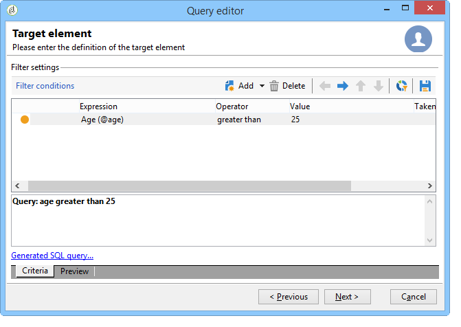

# データ指向API{#data-oriented-apis}

データ指向APIを使用すると、データモデル全体に対応できます。

## データモデルの概要 {#overview-of-the-datamodel}

Adobe Campaignでは、エンティティごとに専用の読み取りAPIを提供しません（getRecipient関数やgetDelivery関数などは提供しません）。 QUERY &amp; WRITERデータの読み取りおよび修正方法を使用して、モデルのデータにアクセスします。

Adobe Campaignでは、コレクションを管理できます。クエリーを使用すると、ベース全体で収集された情報のセットをリカバリできます。 SQLモードでのアクセスとは異なり、Adobe Campaign APIは、データ列ではなくXMLツリーを返します。 Adobe Campaignでは、収集されたすべてのデータを含む複合ドキュメントを作成します。

この操作モードでは、XMLドキュメントの属性と要素、およびデータベース内のテーブルの列の間の1対1のマッピングは提供されません。

XMLドキュメントは、データベースのMEMO型のフィールドに格納されます。

## モデルの説明 {#description-of-the-model}

スクリプト内のデータベースのフィールドにアドレスを設定するには、Adobe Campaignデータモデルに精通している必要があります。

データモデルの表示については、 [Adobe Campaignデータモデルの説明を参照してください](https://docs.campaign.adobe.com/doc/AC/en/technicalResources/_Datamodel_Description_of_the_main_tables.html)。

構造を生成するには、次の記事を参照してください。デー [タモデルまたはデータディクショナリの生成方法](https://helpx.adobe.com/campaign/kb/generate-data-model.html)。

## クエリとライタ {#query-and-writer}

以下の紹介スキーマは、データベースと顧客（WebページまたはAdobe Campaignクライアントコンソール）間の読み取り(ExecuteQuery)および書き込み(Writer)に関する低レベルの交換について詳しく説明しています。


### ExecuteQuery {#executequery}

列と条件に対しては、クエリーを使用できます。

これにより、基になるSQLを分離できます。 クエリ言語は、基になるエンジンに依存しません。一部の関数は再マップされ、SELECT SQLの注文が生成される場合があります。

この詳細については、スキ [ーマ&#39;xtk:queryDef&#39;の&#39;ExecuteQuery&#39;メソッドの例を参照してください](../../configuration/using/web-service-calls.md#example-on-the--executequery--method-of-schema--xtk-querydef-)。

ExecuteQueryメ **ソッドは** 、ExecuteQuery (xtk:queryDef) [で提供されます](#executequery--xtk-querydef-)。

### 書き込む {#write}

書き込みコマンドを使用すると、基本の1つ以上のテーブルにエントリを含む単純なドキュメントや複雑なドキュメントを作成できます。

トランザクションAPIを使用すると、updateOrInsertコマンドを使用して調整を **管理できます** 。1つのコマンドを使用して、データを作成または更新できます。 変更マージ(マージ&#x200B;****)も設定できます。この操作モードでは、部分的な更新を承認できます。

XML構造は、データを論理的に表示し、SQLテーブルの物理構造を回避できます。

Writeメソッドは、 [Write / writeCollection (xtk:session)で表されます](#write---writecollection--xtk-session-)。

## ExecuteQuery (xtk:queryDef) {#executequery--xtk-querydef-}

この方法を使用すると、スキーマに関連付けられたデータからクエリーを実行できます。 この関数は、認証文字列（ログインする必要があります）と、送信するクエリをパラメーターとして記述したXMLドキュメントを取ります。 returnパラメーターは、クエリーが参照するスキーマの形式でクエリーの結果を含むXMLドキュメントです。

「xtk:queryDef」スキーマの「ExecuteQuery」メソッドの定義：

```
<method name="ExecuteQuery" const="true">
  <parameters>
    <param desc="Output XML document" name="output" type="DOMDocument" inout="out"/>
  </parameters>
</method>
```

>[!NOTE]
>
>これは「const」メソッドです。 入力パラメーターは、「xtk:queryDef」スキーマの形式でXMLドキュメントに含まれます。

### 入力クエリのXMLドキュメントの形式 {#format-of-the-xml-document-of-the-input-query}

クエリーのXMLドキュメントの構造は、「xtk:queryDef」スキーマに記述されています。 このドキュメントでは、SQLクエリーの句について説明します。&quot;select&quot;、&quot;where&quot;、&quot;order by&quot;、&quot;group by&quot;、&quot;having&quot;

```
<queryDef schema="schema_key" operation="operation_type">
  <select>
    <node expr="expression1">
    <node expr="expression2">
    ...
  </select>
  <where> 
    <condition expr="expression1"/> 
    <condition expr="expression2"/>
    ... 
  </where>
  <orderBy>
    <node expr="expression1">
    <node expr="expression2">
    ...
  </orderBy>
  <groupBy>
    <node expr="expression1">
    <node expr="expression2">
    ...
  </groupBy>
  <having>
    <condition expr="expression1"/> 
    <condition expr="expression2"/>
    ...
  </having>
</queryDef>
```

サブクエリ( `<subquery>` )は要素内で定義でき `<condition> ` ます。 要素の構文 `<subquery> ` は、aの構文に基づきます `<querydef>`。

例 `<subquery>  : </subquery>`

```
<condition setOperator="NOT IN" expr="@id" enabledIf="$(/ignored/@ownerType)=1">
  <subQuery schema="xtk:operatorGroup">
     <select>
       <node expr="[@operator-id]" />
     </select>
     <where>
       <condition expr="[@group-id]=$long(../@owner-id)"/>
     </where>
   </subQuery>
</condition>  
  
```

クエリは、スキーマ属性から開始スキーマを参照する必要 **があります** 。

目的の操作のタイプは、操作属性に入 **力され** 、次の値のいずれかを含みます。

* **get**:テーブルからレコードを取得し、データが存在しない場合はエラーを返します。
* **getIfExists**:テーブルからレコードを取得し、データが存在しない場合は空のドキュメントを返します。
* **選択**:複数のレコードを返すカーソルを作成し、データがない場合は空のドキュメントを返します。
* **count**:データ数を返します。

XPath構 **文は** 、入力スキーマに基づいてデータを検索するために使用されます。 XPathの詳細については、「データスキーマ」を参照 [してください](../../configuration/using/data-schemas.md)。

#### 「get」操作の例 {#example-with-the--get--operation}

電子メール上のフィルターを使用して、受信者の姓と名（「nms:recipient」スキーマ）を取得します。

```
<queryDef schema="nms:recipient" operation="get">
  <!-- fields to retrieve -->
  <select>
    <node expr="@firstName"/>
    <node expr="@lastName"/>
  </select> 

  <!-- condition on email -->
  <where>  
    <condition expr="@email= 'john.doe@aol.com'"/>
  </where>
</queryDef>
```

#### 「select」操作の例 {#example-with-the--select--operation}

フォルダおよび電子メールドメインでフィルタされた受信者のリストを、生年月日の降順で並べ替えて返します。

```
<queryDef schema="nms:recipient" operation="select">
  <select>
    <node expr="@email"/>
    <!-- builds a string with the concatenation of the last name and first name separated by a dash -->      
    <node expr="@lastName+'-'+@firstName"/>
    <!-- get year of birth date -->
    <node expr="Year(@birthDate)"/>
  </select> 

  <where>  
     <condition expr="[@folder-id] = 1234 and @domain like 'Adobe%'"/>
  </where>

  <!-- order by birth date -->
  <orderBy>
    <node expr="@birthDate" sortDesc="true"/> <!-- by default sortDesc="false" -->
  </orderBy>
</queryDef>
```

式には、単純なフィールドや、算術演算や文字列の連結などの複雑な式を使用できます。

返すレコード数を制限するには、要素に **lineCount** 属性を追加し `<querydef>` ます。

クエリーによって返されるレコードの数を100に制限するには：

```
<queryDef schema="nms:recipient" operation="select" lineCount="100">
...
```

次の100件のレコードを取得するには、同じクエリを再実行し、 **startLine** 属性を追加します。

```
<queryDef schema="nms:recipient" operation="select" lineCount="100" startLine="100">
...
```

#### 「count」操作の例 {#example-with-the--count--operation}

クエリーのレコード数をカウントする手順は、次のとおりです。

```
<queryDef schema="nms:recipient" operation="count"">
  <!-- condition on the folder and domain of the e-mail -->
  <where>  
    <condition expr="[@folder-id] = 1234" and @domain like 'Adobe%'"/>
  </where>
</queryDef>
```

>[!NOTE]
>
>ここでも、前の例の条件を使用します。 AND句 `<select>` は使用されません。 </select>`

#### データのグループ化 {#data-grouping}

複数回参照される電子メールアドレスを取得するには：

```
<queryDef schema="nms:recipient" operation="select">
  <select>
    <node expr="@email"/>
    <node expr="count(@email)"/>
  </select>

  <!-- e-mail grouping clause -->
  <groupby>
    <node expr="@email"/>
  </groupby>

  <!-- grouping condition -->
  <having>
    <condition expr="count(@email) > 1"/>
  </having>

</queryDef>
```

グループ化するフィールドに **groupBy** 属性を直接追加すると、クエリーを簡単にできます。

```
<select>
  <node expr="@email" groupBy="true"/>
</select>
```

>[!NOTE]
>
>要素を設定する必要はなくなりま `<groupby>` した。

#### 条件でのかぎ取り {#bracketing-in-conditions}

同じ条件での括弧の例を2つ示します。

* 単一の式の単純なバージョン：

   ```
   <where>
     <condition expr="(@age > 15 or @age <= 45) and  (@city = 'Newton' or @city = 'Culver City') "/>
   </where>
   ```

* 要素を含む構造化バー `<condition>` ジョン：

   ```
   <where>
     <condition bool-operator="AND">
       <condition expr="@age > 15" bool-operator="OR"/>
       <condition expr="@age <= 45"/>
     </condition>
     <condition>
       <condition expr="@city = 'Newton'" bool-operator="OR"/>
       <condition expr="@city = 'Culver City'"/>
     </condition>
   </where>
   ```

同じフィールドに複数の条件が適用される場合、「OR」演算子を「IN」演算子に置き換えることができます。

```
<where>
  <condition>
    <condition expr="@age IN (15, 45)"/>
    <condition expr="@city IN ('Newton', 'Culver City')"/>
  </condition>
</where>
```

この構文は、条件に2つ以上のデータが使用される場合にクエリーを簡素化します。

#### リンクの例 {#examples-on-links}

* リンク1-1またはN1:テーブルに外部キーがある場合（リンクはテーブルから始まる）、リンクテーブルのフィールドを直接フィルターまたは取得できます。

   フォルダーラベルのフィルターの例：

   ```
   <where>
     <condition expr="[folder/@label] like 'Segment%'"/>
   </where>
   ```

   「nms:recipient」スキーマからフォルダーのフィールドを取得するには：

   ```
   <select>
     <!-- label of recipient folder -->
     <node expr="[folder/@label]"/>
     <!-- displays the string count of the folder -->
     <node expr="partition"/>
   </select>
   ```

* コレクションリンク(1N):コレクションテーブルのフィールドに対するフィルタリングは、 **EXISTS** または **NOT EXISTS演算子を使用して実行する必要があります** 。

   「ニュースレター」情報サービスを購読している受信者をフィルターするには：

   ```
   <where>
     <condition expr="subscription" setOperator="EXISTS">
       <condition expr="@name = 'Newsletter'"/>
     </condition>
   </where>
   ```

   クエリが基本製品を返すので、句からコレクションリンクのフィ `<select>` ールドを直接取得することはお勧めしません。 リンクテーブルにレコードが1つだけ含まれている場合（例）にのみ使用さ `<node expr="">`れます。

   「購読」コレクションリンクの例：

   ```
   <select>
     <node expr="subscription/@label"/>
   </select>
   ```

   句内のコレクションリンクの要素を含むサブリストを取得でき `<select>` ます。 参照先のフィールドのXPathは、コレクション要素のコンテキストに依存します。

   フィルタリング( `<orderby>` )要素と制限( `<where>` )要素をコレクション要素に追加できます。

   この例では、各受信者に対して、クエリは、受信者が購読する電子メールと情報サービスのリストを返します。

   ```
   <queryDef schema="nms:recipient" operation="select">
     <select>
       <node expr="@email"/>
   
       <!-- collection table (unbound type) -->
       <node expr="subscription">  
         <node expr="[service/@label]"/>    
         <!-- sub-condition on the collection table -->
         <where>  
           <condition expr="@expirationDate >= GetDate()"/>
         </where>
         <orderBy>
           <node expr="@expirationDate"/> 
         </orderBy>
       </node>
     </select> 
   </queryDef>
   ```

#### &#39;where&#39;句と&#39;select&#39;句のパラメーターの連結 {#binding-the-parameters-of-the--where--and--select--clause}

パラメーターをバインドすると、エンジンはクエリーで使用するパラメーターの値を設定できます。 エンジンは値のエスケープを担当し、パラメータを取得するためのキャッシュの利点があるので、これは非常に役立ちます。

クエリーを構築すると、「連結された」値が文字(? ODBCでは、postgres... `#[index]#` )をSQLクエリの本文に含めます。

```
<select>
  <!--the value will be bound by the engine -->
  <node expr="@startDate = #2002/02/01#"/>                   
  <!-- the value will not be bound by the engine but visible directly in the query -->
  <node expr="@startDate = #2002/02/01#" noSqlBind="true"/> 
</select>
```

パラメーターのバインドを避けるには、「noSqlBind」属性に値「true」を入力する必要があります。

>[!IMPORTANT]
>
>クエリに「order-by」または「group-by」命令が含まれる場合、データベースエンジンは値を「バインド」できません。 @noSqlBind=&quot;true&quot;属性は、クエリの「select」命令または「where」命令に配置する必要があります。

#### クエリ作成のヒント： {#query-building-tip-}

クエリの構文を理解するために、Adobe Campaignクライアントコンソール（メニュー）の汎用クエリエディターを使用してクエリを記述す **[!UICONTROL Tools/ Generic query editor...]** ることができます。 手順は次のとおりです。

1. 取得するデータを選択します。

   

1. フィルター条件を定義します。

   

1. クエリーを実行し、Ctrl + F4キーを押してクエリーのソースコードを表示します。

   

### 出力ドキュメントの形式 {#output-document-format}

returnパラメーターは、クエリーに関連付けられたスキーマの形式のXMLドキュメントです。

「get」操作での「nms:recipient」スキーマからの戻り値の例：

```
<recipient email="john.doe@adobe.com" lastName"Doe" firstName="John"/>
```

「select」操作では、返されるドキュメントは要素の列挙です。

```
<!-- the name of the first element does not matter -->
<recipient-collection>   
  <recipient email="john.doe@adobe.com" lastName"Doe" firstName="John"/>
  <recipient email="peter.martinez@adobe.com" lastName"Martinez" firstName="Peter"/>
  <recipient...
</recipient-collection>  
```

「count」型の操作に対して返されるドキュメントの例：

```
<recipient count="3"/>
```

#### エイリアス {#alias}

エイリアスを使用すると、出力ドキュメント内のデータの場所を変更できます。 alias属性 **では** 、対応するフィールドにXPathを指定する必要があります。

```
<queryDef schema="nms:recipient" operation="get">
  <select>
    <node expr="@firstName" alias="@firstName"/>
    <node expr="@lastName"/>
    <node expr="[folder/@label]" alias="@My_folder"/>
  </select> 
</queryDef>
```

戻り値：

```
<recipient My_folder="Recipients" First name ="John" lastName="Doe"/>
```

代わりに：

```
<recipient firstName="John" lastName="Doe">
  <folder label="Recipients"/>
</recipient>
```

### SOAPメッセージの例 {#example-of-soap-messages}

* クエリ:

   ```
   <?xml version='1.0' encoding='ISO-8859-1'?>
   <SOAP-ENV:Envelope xmlns:xsd='http://www.w3.org/2001/XMLSchema' xmlns:xsi='http://www.w3.org/2001/XMLSchema-instance' xmlns:ns='http://xml.apache.org/xml-soap' xmlns:SOAP-ENV='http://schemas.xmlsoap.org/soap/envelope/'>
     <SOAP-ENV:Body>
       <ExecuteQuery xmlns='urn:xtk:queryDef' SOAP-ENV:encodingStyle='http://schemas.xmlsoap.org/soap/encoding/'>
         <__sessiontoken xsi:type='xsd:string'/>
         <entity xsi:type='ns:Element' SOAP-ENV:encodingStyle='http://xml.apache.org/xml-soap/literalxml'>
           <queryDef operation="get" schema="nms:recipient" xtkschema="xtk:queryDef">
             <select>
               <node expr="@email"/>
               <node expr="@lastName"/>
               <node expr="@firstName"/>
             </select>
             <where>
               <condition expr="@id = 3599"/>
             </where>
           </queryDef>
         </entity>
       </ExecuteQuery>
     </SOAP-ENV:Body>
   </SOAP-ENV:Envelope>
   ```

* 応答：

   ```
   <?xml version='1.0' encoding='ISO-8859-1'?>
   <SOAP-ENV:Envelope xmlns:xsd='http://www.w3.org/2001/XMLSchema' xmlns:xsi='http://www.w3.org/2001/XMLSchema-instance' xmlns:ns='http://xml.apache.org/xml-soap' xmlns:SOAP-ENV='http://schemas.xmlsoap.org/soap/envelope/'>
     <SOAP-ENV:Body>
       <ExecuteQueryResponse xmlns='urn:xtk:queryDef' SOAP-ENV:encodingStyle='http://schemas.xmlsoap.org/soap/encoding/'>
         <pdomOutput xsi:type='ns:Element' SOAP-ENV:encodingStyle='http://xml.apache.org/xml-soap/literalxml'>
           <recipient email="john.doe@adobe.com" lastName"Doe" firstName="John"/>
         </pdomOutput>
       </ExecuteQueryResponse>
     </SOAP-ENV:Body>
   </SOAP-ENV:Envelope>
   ```

## 書き込み/書き込みコレクション(xtk:session) {#write---writecollection--xtk-session-}

これらのサービスは、エンティティ（「Write」メソッド）またはエンティティのコレクション（「WriteCollection」メソッド）の挿入、更新、または削除に使用されます。

更新されるエンティティは、データスキーマに関連付けられています。 入力パラメーターは、認証文字列（ログインする必要があります）と、更新するデータを含むXMLドキュメントです。

このドキュメントでは、書き込み手順を設定する手順について説明します。

この呼び出しは、エラー以外のデータを返しません。

「xtk:session」スキーマの「Write」メソッドと「WriteCollection」メソッドの定義：

```
<method name="Write" static="true">
  <parameters>
    <param name="doc" type="DOMDocument" desc="Difference document"/>
  </parameters>
</method>
<method name="WriteCollection" static="true">
  <parameters>
    <param name="doc" type="DOMDocument" desc="Difference collection document"/>
  </parameters>
</method>
```

>[!NOTE]
>
>これは「静的」メソッドです。 入力パラメーターは、更新するスキーマの形式でXMLドキュメントに含まれます。

### 概要 {#overview}

データ調整は、関連するスキーマに入力されたキーの定義に基づいて動作します。 書き込みプロシージャは、入力ドキュメントに入力されたデータに基づいて、最初の有効なキーを探します。 エンティティは、データベース内の存在に基づいて挿入または更新されます。

更新するエンティティのスキーマのキーは、xtkschema属性に基づいて完 **了します** 。

したがって、調整キーは、キーを構成するXPathのリストを含む **_key** 属性（コンマで区切る）を使用して強制できます。

次の値を **_operation属性に設定すると、操作のタイプを強制的に指定できます** 。

* **挿入**:レコードを強制的に挿入します（調整キーは使用されません）。
* **insertOrUpdate**:調整キー（デフォルトモード）に応じてレコードを更新または挿入します。
* **update**:レコードを更新します。データが存在しない場合は何もしません。
* **削除**:レコードを削除します。
* **none**:リンクの調整にのみ使用され、更新や挿入は使用されません。

### &#39;Write&#39;メソッドの例 {#example-with-the--write--method}

受信者を更新または挿入する（暗黙的な「insertOrUpdate」操作）。電子メールアドレス、生年月日、および町村：

```
<recipient xtkschema="nms:recipient" email="john.doe@adobe.com" birthDate="1956/05/04" folder-id=1203 _key="@email, [@folder-id]">
  <location city="Newton"/>
</recipient>
```

受信者の削除：

```
<recipient xtkschema="nms:recipient" _operation="delete" email="rene.dupont@adobe.com" folder-id=1203 _key="@email, [@folder-id]"/>
```

>[!NOTE]
>
>削除操作の場合、入力ドキュメントには調整キーを構成するフィールドのみを含める必要があります。

### &#39;WriteCollection&#39;メソッドの例 {#example-with-the--writecollection--method}

複数の受信者の更新または挿入：

```
<recipient-collection xtkschema="nms:recipient">    
  <recipient email="john.doe@adobe.com" firstName="John" lastName="Doe" _key="@email"/>
  <recipient email="peter.martinez@adobe.com" firstName="Peter" lastName="Martinez" _key="@email"/>
  <recipient ...
</recipient-collection>
```

### リンクの例 {#example-on-links}

#### Example 1 {#example-1}

内部名(@name)に基づいてフォルダーを受信者に関連付けます。

```
<recipient _key="[folder/@name], @email" email="john.doe@adobe.net" lastName="Doe" firstName="John" xtkschema="nms:recipient">
  <folder name="Folder2" _operation="none"/>
</recipient>
```

「_key」属性と「_operation」属性は、リンクされた要素に入力できます。 この要素の動作は、入力スキーマのメイン要素の動作と同じです。

メインエンティティのキーの定義(「nms:recipient」)は、リンクテーブル（要素スキーマ「xtk:folder」）のフィールドと電子メールで構成されます。 `<folder>`

>[!NOTE]
>
>フォルダー要素に対して入力された操作「none」は、更新や挿入を行わずにフォルダーに関する調整を定義します。

#### Example 2 {#example-2}

受信者から会社（「cus:company」スキーマのリンクテーブル）を更新しています：

```
<recipient _key="[folder/@name], @email" email="john.doe@adobe.net" lastName="Doe" firstName="John" xtkschema="nms:recipient">
  <company name="adobe" code="ERT12T" _key="@name" _operation="update"/>
</recipient>
```

#### Example 3 {#example-3}

グループ関係テーブル(「nms:rcpGrpRel」)を持つグループに受信者を追加する：

```
<recipient _key="@email" email="martin.ledger@adobe.net" xtkschema="nms:recipient">
  <rcpGrpRel _key="[rcpGroup/@name]">
    <rcpGroup name="GRP1"/>
  </rcpGrpRel>
</recipient>
```

>[!NOTE]
>
>グループ名に基づく暗黙的なキーが「nms:group」スキーマで定義されているので、 `<rcpgroup>` キーの定義は要素に入力されません。

### XMLコレクション要素 {#xml-collection-elements}

デフォルトでは、XMLコレクション要素を更新するには、すべてのコレクション要素を設定する必要があります。 データベースのデータは、入力ドキュメントのデータに置き換えられます。 ドキュメントに更新する要素のみが含まれている場合、データベースのXMLデータとの結合を強制するには、更新するすべてのコレクション要素に対して「_operation」属性を設定する必要があります。

### SOAPメッセージの例 {#example-of-soap-messages-1}

* クエリ:

   ```
   <?xml version='1.0' encoding='ISO-8859-1'?>
   <SOAP-ENV:Envelope xmlns:xsd='http://www.w3.org/2001/XMLSchema' xmlns:xsi='http://www.w3.org/2001/XMLSchema-instance' xmlns:ns='http://xml.apache.org/xml-soap' xmlns:SOAP-ENV='http://schemas.xmlsoap.org/soap/envelope/'>
     <SOAP-ENV:Body>
       <Write xmlns='urn:xtk:persist' SOAP-ENV:encodingStyle='http://schemas.xmlsoap.org/soap/encoding/'>
         <__sessiontoken xsi:type='xsd:string'/>
         <domDoc xsi:type='ns:Element' SOAP-ENV:encodingStyle='http://xml.apache.org/xml-soap/literalxml'>
           <recipient xtkschema="nms:recipient" email="rene.dupont@adobe.com" firstName="René" lastName="Dupont" _key="@email">
         </domDoc>
       </Write>
     </SOAP-ENV:Body>
   </SOAP-ENV:Envelope>
   ```

* 応答：

   ```
   <?xml version='1.0' encoding='ISO-8859-1'?>
   <SOAP-ENV:Envelope xmlns:xsd='http://www.w3.org/2001/XMLSchema' xmlns:xsi='http://www.w3.org/2001/XMLSchema-instance' xmlns:ns='http://xml.apache.org/xml-soap' xmlns:SOAP-ENV='http://schemas.xmlsoap.org/soap/envelope/'>
     <SOAP-ENV:Body>
       <WriteResponse xmlns='urn:' SOAP-ENV:encodingStyle='http://schemas.xmlsoap.org/soap/encoding/'>
       </WriteResponse>
     </SOAP-ENV:Body>
   </SOAP-ENV:Envelope>
   ```

   エラーを返す：

   ```
   <?xml version='1.0'?>
   <SOAP-ENV:Envelope xmlns:xsd="http://www.w3.org/2001/XMLSchema" xmlns:xsi="http://www.w3.org/2001/XMLSchema-instance" xmlns:SOAP-ENV='http://schemas.xmlsoap.org/soap/envelope/'>
     <SOAP-ENV:Body>
       <SOAP-ENV:Fault>
         <faultcode>SOAP-ENV:Server</faultcode>
         <faultstring xsi:type="xsd:string">Error while executing the method 'Write' of service 'xtk:persist'.</faultstring>
         <detail xsi:type="xsd:string">PostgreSQL error: ERROR:  duplicate key violates unique constraint &quot;nmsrecipient_id&quot;Impossible to save document of type 'Recipients (nms:recipient)'</detail>
       </SOAP-ENV:Fault>
     </SOAP-ENV:Body>
   </SOAP-ENV:Envelope>
   ```

