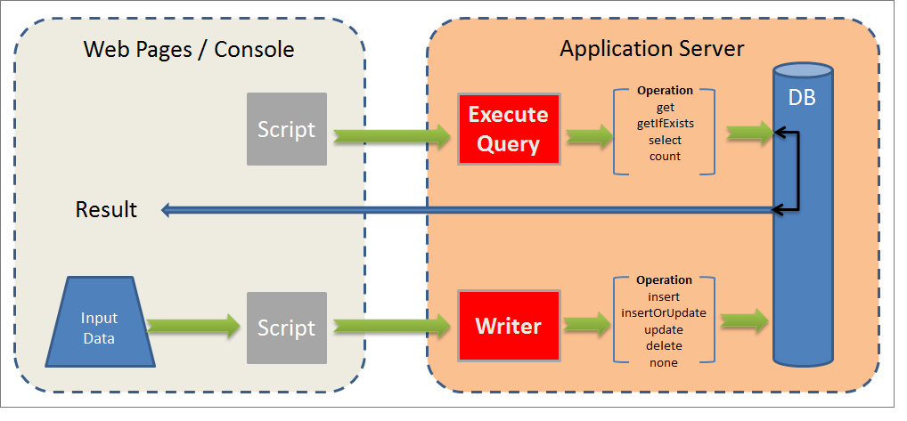

# データ指向の API{#data-oriented-apis}

データ指向APIにより、データモデル全体に対応できます。

## データモデルの概要 {#overview-of-the-datamodel}

Adobe Campaignでは、エンティティごとに専用の読み取りAPIを提供しません（getRecipientやgetDelivery関数など）。 QUERY &amp; WRITER データの読み取り方法と変更方法を使用して、モデルのデータにアクセスします。

Adobe Campaignでは、コレクションを管理できます。クエリを使用すると、ベース全体で収集された一連の情報を復元できます。 SQL モードでのアクセスとは異なり、Adobe Campaign APIはデータ列の代わりにXML ツリーを返します。 Adobe Campaignは、収集されたすべてのデータを含む複合ドキュメントを作成します。

この操作モードでは、XML ドキュメントの属性と要素、およびデータベース内のテーブルの列の間の1対1のマッピングは提供されません。

XML文書は、データベースのMEMO型フィールドに格納されます。

## モデルの説明 {#description-of-the-model}

スクリプト内のデータベースのフィールドに対応するには、Adobe Campaign データモデルに精通している必要があります。

データモデルのプレゼンテーションについては、[Adobe Campaign データモデルの説明](../../configuration/using/data-model-description.md)を参照してください。

## クエリとライター {#query-and-writer}

次の概要スキーマでは、データベースとお客様（web ページまたはAdobe Campaign クライアントコンソール）間の読み取り（ExecuteQuery）と書き込み（Writer）のローレベルの交換について説明します。



### ExecuteQuery {#executequery}

列と条件の場合は、クエリを使用できます。

これにより、基になるSQLを分離できます。 クエリ言語は基になるエンジンに依存しません。一部の関数は再マッピングされ、複数のSELECT SQL注文が生成される可能性があります。

詳しくは、スキーマ「xtk:queryDef」 ](../../configuration/using/web-service-calls.md#example-on-the--executequery--method-of-schema--xtk-querydef-)の「ExecuteQuery」メソッドの[例を参照してください。

**ExecuteQuery** メソッドは、[ExecuteQuery （xtk:queryDef） ](#executequery--xtk-querydef-)で提示されます。

### 書き込み {#write}

書き込みコマンドを使用すると、基本となる1つ以上のテーブルにエントリを含んだシンプルまたは複雑なドキュメントを書き込むことができます。

トランザクション APIを使用すると、**updateOrInsert** コマンドを使用して調整を管理できます。1つのコマンドでデータを作成または更新できます。 変更結合（**結合**）を設定することもできます。この操作モードでは、部分的な更新を承認できます。

XML構造は、データの論理的なビューを提供し、SQL テーブルの物理構造を回避することができます。

Write メソッドは、[Write / WriteCollection （xtk:session） ](#write---writecollection--xtk-session-)に表示されます。

## ExecuteQuery （xtk:queryDef） {#executequery--xtk-querydef-}

このメソッドでは、スキーマに関連付けられたデータからクエリを実行できます。 認証文字列（ログインする必要があります）と、パラメーターとして送信するクエリを説明するXML ドキュメントが必要です。 戻り値パラメーターは、クエリの結果を、クエリが参照するスキーマの形式で含むXML ドキュメントです。

「xtk:queryDef」スキーマの「ExecuteQuery」メソッドの定義：

```xml
<method name="ExecuteQuery" const="true">
  <parameters>
    <param desc="Output XML document" name="output" type="DOMDocument" inout="out"/>
  </parameters>
</method>
```

>[!NOTE]
>
>これは「const」メソッドです。 入力パラメーターは、「xtk:queryDef」スキーマの形式でXML ドキュメントに含まれます。

### 入力クエリのXML ドキュメントの形式 {#format-of-the-xml-document-of-the-input-query}

クエリのXML ドキュメントの構造は、「xtk:queryDef」スキーマに記載されています。 このドキュメントでは、SQL クエリの句を説明します。「select」、「where」、「order by」、「group by」、「having」です。

```xml
<queryDef schema="schema_key" operation="operation_type">
  <select>
    <node expr="expression1">
    <node expr="expression2">
    ...
  </select>
  <where> 
    <condition expr="expression1"/> 
    <condition expr="expression2"/>
    ... 
  </where>
  <orderBy>
    <node expr="expression1">
    <node expr="expression2">
    ...
  </orderBy>
  <groupBy>
    <node expr="expression1">
    <node expr="expression2">
    ...
  </groupBy>
  <having>
    <condition expr="expression1"/> 
    <condition expr="expression2"/>
    ...
  </having>
</queryDef>
```

サブクエリ （`<subquery>`）は、`<condition> `要素で定義できます。 `<subquery> `要素の構文は、`<querydef>`の構文に基づいています。

`<subquery>  : </subquery>`例

```xml
<condition setOperator="NOT IN" expr="@id" enabledIf="$(/ignored/@ownerType)=1">
  <subQuery schema="xtk:operatorGroup">
     <select>
       <node expr="[@operator-id]" />
     </select>
     <where>
       <condition expr="[@group-id]=$long(../@owner-id)"/>
     </where>
   </subQuery>
</condition>  
  
```

クエリは、**スキーマ**&#x200B;属性から開始スキーマを参照する必要があります。

必要な操作のタイプは&#x200B;**operation**&#x200B;属性に入力され、次のいずれかの値が含まれます。

* **get**: テーブルからレコードを取得し、データが存在しない場合にエラーを返します。
* **getIfExists**: テーブルからレコードを取得し、データが存在しない場合は空のドキュメントを返します。
* **select**：複数のレコードを返すカーソルを作成し、データがない場合は空のドキュメントを返します。
* **count**: データ数を返します。

**XPath**&#x200B;構文は、入力スキーマに基づいてデータを検索するために使用されます。 XPathについて詳しくは、[ データスキーマ ](../../configuration/using/data-schemas.md)を参照してください。

#### 「get」操作の例 {#example-with-the--get--operation}

メールにフィルターが適用された受信者（「nms:recipient」スキーマ）の姓と名を取得します。

```xml
<queryDef schema="nms:recipient" operation="get">
  <!-- fields to retrieve -->
  <select>
    <node expr="@firstName"/>
    <node expr="@lastName"/>
  </select> 

  <!-- condition on email -->
  <where>  
    <condition expr="@email= 'john.doe@aol.com'"/>
  </where>
</queryDef>
```

#### 「select」操作の例 {#example-with-the--select--operation}

フォルダーでフィルタリングされた受信者のリストと、生年月日に降順で並べ替えたメールドメインを返します。

```xml
<queryDef schema="nms:recipient" operation="select">
  <select>
    <node expr="@email"/>
    <!-- builds a string with the concatenation of the last name and first name separated by a dash -->      
    <node expr="@lastName+'-'+@firstName"/>
    <!-- get year of birth date -->
    <node expr="Year(@birthDate)"/>
  </select> 

  <where>  
     <condition expr="[@folder-id] = 1234 and @domain like 'Adobe%'"/>
  </where>

  <!-- order by birth date -->
  <orderBy>
    <node expr="@birthDate" sortDesc="true"/> <!-- by default sortDesc="false" -->
  </orderBy>
</queryDef>
```

式には、単純なフィールドや、算術演算や文字列の連結などの複雑な式を使用できます。

返されるレコード数を制限するには、**lineCount**&#x200B;属性を`<querydef>`要素に追加します。

クエリによって返されるレコードの数を100に制限するには、次の手順を実行します。

```xml
<queryDef schema="nms:recipient" operation="select" lineCount="100">
...
```

次の100 レコードを取得するには、同じクエリをもう一度実行し、**startLine**&#x200B;属性を追加します。

```xml
<queryDef schema="nms:recipient" operation="select" lineCount="100" startLine="100">
...
```

#### 「count」操作の例 {#example-with-the--count--operation}

クエリのレコード数をカウントするには：

```xml
<queryDef schema="nms:recipient" operation="count"">
  <!-- condition on the folder and domain of the email -->
  <where>  
    <condition expr="[@folder-id] = 1234" and @domain like 'Adobe%'"/>
  </where>
</queryDef>
```

>[!NOTE]
>
>繰り返しますが、前の例の条件を使用します。 `<select>`と句は使用されません。`</select>`

#### データのグループ化 {#data-grouping}

複数回参照されたメールアドレスを取得するには：

```xml
<queryDef schema="nms:recipient" operation="select">
  <select>
    <node expr="@email"/>
    <node expr="count(@email)"/>
  </select>

  <!-- email grouping clause -->
  <groupby>
    <node expr="@email"/>
  </groupby>

  <!-- grouping condition -->
  <having>
    <condition expr="count(@email) > 1"/>
  </having>

</queryDef>
```

クエリは、グループ化するフィールドに&#x200B;**groupBy**&#x200B;属性を直接追加することで簡素化できます。

```xml
<select>
  <node expr="@email" groupBy="true"/>
</select>
```

>[!NOTE]
>
>`<groupby>`要素に入力する必要はなくなりました。

#### 条件での括弧 {#bracketing-in-conditions}

同じ条件での括弧の例を2つ示します。

* 単一の式の単純なバージョン：

  ```xml
  <where>
    <condition expr="(@age > 15 or @age <= 45) and  (@city = 'Newton' or @city = 'Culver City') "/>
  </where>
  ```

* `<condition>`要素を含む構造化バージョン：

  ```xml
  <where>
    <condition bool-operator="AND">
      <condition expr="@age > 15" bool-operator="OR"/>
      <condition expr="@age <= 45"/>
    </condition>
    <condition>
      <condition expr="@city = 'Newton'" bool-operator="OR"/>
      <condition expr="@city = 'Culver City'"/>
    </condition>
  </where>
  ```

同じフィールドに複数の条件が適用される場合、「OR」演算子を「IN」演算に置き換えることができます。

```xml
<where>
  <condition>
    <condition expr="@age IN (15, 45)"/>
    <condition expr="@city IN ('Newton', 'Culver City')"/>
  </condition>
</where>
```

この構文は、条件で2つ以上のデータを使用する場合にクエリを簡素化します。

#### リンクの例 {#examples-on-links}

* リンク 1-1またはN1：テーブルに外部キー（リンクがテーブルから始まる）がある場合、リンクされたテーブルのフィールドを直接フィルタリングまたは取得できます。

  フォルダーラベルのフィルターの例：

  ```xml
  <where>
    <condition expr="[folder/@label] like 'Segment%'"/>
  </where>
  ```

  フォルダーのフィールドを「nms:recipient」スキーマから取得するには：

  ```xml
  <select>
    <!-- label of recipient folder -->
    <node expr="[folder/@label]"/>
    <!-- displays the string count of the folder -->
    <node expr="partition"/>
  </select>
  ```

* コレクションリンク （1N）: コレクションテーブルのフィールドに対するフィルタリングは、**EXISTS**&#x200B;または&#x200B;**NOT EXISTS**&#x200B;演算子を使用して実行する必要があります。

  「ニュースレター」情報サービスを購読している受信者をフィルタリングするには：

  ```xml
  <where>
    <condition expr="subscription" setOperator="EXISTS">
      <condition expr="@name = 'Newsletter'"/>
    </condition>
  </where>
  ```

  クエリが基数の製品を返すため、コレクション リンクのフィールドを`<select>`句から直接取得することは推奨されません。 リンクされたテーブルにレコードが1つしかない場合にのみ使用されます（例：`<node expr="">`）。

  「サブスクリプション」収集リンクの例：

  ```xml
  <select>
    <node expr="subscription/@label"/>
  </select>
  ```

  `<select>`句のコレクション リンクの要素を含むサブリストを取得できます。 参照フィールドのXPathは、コレクション要素のコンテキストです。

  フィルター（`<orderby>`）要素と制限（`<where>`）要素をコレクション要素に追加できます。

  この例では、受信者ごとに、クエリは受信者が購読する情報サービスのメールとリストを返します。

  ```xml
  <queryDef schema="nms:recipient" operation="select">
    <select>
      <node expr="@email"/>
  
      <!-- collection table (unbound type) -->
      <node expr="subscription">  
        <node expr="[service/@label]"/>    
        <!-- sub-condition on the collection table -->
        <where>  
          <condition expr="@expirationDate >= GetDate()"/>
        </where>
        <orderBy>
          <node expr="@expirationDate"/> 
        </orderBy>
      </node>
    </select> 
  </queryDef>
  ```

#### 「where」および「select」句のパラメーターのバインド {#binding-the-parameters-of-the--where--and--select--clause}

パラメーターのバインディングにより、エンジンはクエリで使用されるパラメーターの値を設定できます。 エンジンは値のエスケープを担当し、取得するパラメータのキャッシュの追加の利点があるので、これは非常に便利です。

クエリが作成されると、「連結」値は文字（?）に置き換えられます。 ODBCでは、postgresでは`#[index]#`...） sql クエリの本文に表示されます。

```xml
<select>
  <!--the value will be bound by the engine -->
  <node expr="@startDate = #2002/02/01#"/>                   
  <!-- the value will not be bound by the engine but visible directly in the query -->
  <node expr="@startDate = #2002/02/01#" noSqlBind="true"/> 
</select>
```

パラメーターをバインドしないようにするには、「noSqlBind」属性に「true」という値を入力する必要があります。

>[!IMPORTANT]
>
>クエリに「order-by」または「group-by」命令が含まれている場合、データベースエンジンは値を「バインド」できません。 @noSqlBind=&quot;true&quot;属性は、クエリの&quot;select&quot;や&quot;where&quot;の命令に配置する必要があります。


### 出力ドキュメント形式 {#output-document-format}

戻り値パラメーターは、クエリに関連付けられたスキーマ形式のXML ドキュメントです。

「get」操作の「nms:recipient」スキーマからのリターンの例：

```
<recipient email="john.doe@adobe.com" lastName"Doe" firstName="John"/>
```

「選択」操作で、返されるドキュメントは要素の列挙です。

```xml
<!-- the name of the first element does not matter -->
<recipient-collection>   
  <recipient email="john.doe@adobe.com" lastName"Doe" firstName="John"/>
  <recipient email="peter.martinez@adobe.com" lastName"Martinez" firstName="Peter"/>
  <recipient...
</recipient-collection>  
```

「count」タイプの操作で返されるドキュメントの例：

```xml
<recipient count="3"/>
```

#### エイリアス {#alias}

エイリアスを使用すると、出力ドキュメント内のデータの場所を変更できます。 **alias**&#x200B;属性では、対応するフィールドにXPathを指定する必要があります。

```xml
<queryDef schema="nms:recipient" operation="get">
  <select>
    <node expr="@firstName" alias="@firstName"/>
    <node expr="@lastName"/>
    <node expr="[folder/@label]" alias="@My_folder"/>
  </select> 
</queryDef>
```

返品：

```xml
<recipient My_folder="Recipients" First name ="John" lastName="Doe"/>
```

次の代わりに：

```xml
<recipient firstName="John" lastName="Doe">
  <folder label="Recipients"/>
</recipient>
```

### SOAP メッセージの例 {#example-of-soap-messages}

* クエリ :

  ```xml
  <?xml version='1.0' encoding='ISO-8859-1'?>
  <SOAP-ENV:Envelope xmlns:xsd='http://www.w3.org/2001/XMLSchema' xmlns:xsi='http://www.w3.org/2001/XMLSchema-instance' xmlns:ns='http://xml.apache.org/xml-soap' xmlns:SOAP-ENV='http://schemas.xmlsoap.org/soap/envelope/'>
    <SOAP-ENV:Body>
      <ExecuteQuery xmlns='urn:xtk:queryDef' SOAP-ENV:encodingStyle='http://schemas.xmlsoap.org/soap/encoding/'>
        <__sessiontoken xsi:type='xsd:string'/>
        <entity xsi:type='ns:Element' SOAP-ENV:encodingStyle='http://xml.apache.org/xml-soap/literalxml'>
          <queryDef operation="get" schema="nms:recipient" xtkschema="xtk:queryDef">
            <select>
              <node expr="@email"/>
              <node expr="@lastName"/>
              <node expr="@firstName"/>
            </select>
            <where>
              <condition expr="@id = 3599"/>
            </where>
          </queryDef>
        </entity>
      </ExecuteQuery>
    </SOAP-ENV:Body>
  </SOAP-ENV:Envelope>
  ```

* 応答：

  ```xml
  <?xml version='1.0' encoding='ISO-8859-1'?>
  <SOAP-ENV:Envelope xmlns:xsd='http://www.w3.org/2001/XMLSchema' xmlns:xsi='http://www.w3.org/2001/XMLSchema-instance' xmlns:ns='http://xml.apache.org/xml-soap' xmlns:SOAP-ENV='http://schemas.xmlsoap.org/soap/envelope/'>
    <SOAP-ENV:Body>
      <ExecuteQueryResponse xmlns='urn:xtk:queryDef' SOAP-ENV:encodingStyle='http://schemas.xmlsoap.org/soap/encoding/'>
        <pdomOutput xsi:type='ns:Element' SOAP-ENV:encodingStyle='http://xml.apache.org/xml-soap/literalxml'>
          <recipient email="john.doe@adobe.com" lastName"Doe" firstName="John"/>
        </pdomOutput>
      </ExecuteQueryResponse>
    </SOAP-ENV:Body>
  </SOAP-ENV:Envelope>
  ```

## Write / WriteCollection （xtk:session） {#write---writecollection--xtk-session-}

これらのサービスは、エンティティ（「Write」メソッド）またはエンティティのコレクション（「WriteCollection」メソッド）の挿入、更新、削除に使用されます。

更新されるエンティティは、データスキーマに関連付けられます。 入力パラメーターは、認証文字列（ログインする必要があります）と、更新するデータを含むXML ドキュメントです。

このドキュメントには、書き込み手順を設定する手順が記載されています。

この呼び出しは、エラーを除き、データを返しません。

「xtk:session」スキーマの「Write」および「WriteCollection」メソッドの定義：

```xml
<method name="Write" static="true">
  <parameters>
    <param name="doc" type="DOMDocument" desc="Difference document"/>
  </parameters>
</method>
<method name="WriteCollection" static="true">
  <parameters>
    <param name="doc" type="DOMDocument" desc="Difference collection document"/>
  </parameters>
</method>
```

>[!NOTE]
>
>これは「静的」メソッドです。 入力パラメーターは、更新するスキーマの形式でXML ドキュメントに含まれます。

### 概要 {#overview}

データ紐付けは、関連するスキーマに入力されたキーの定義に基づいて実行されます。 書き込み手順では、入力ドキュメントに入力されたデータに基づいて、最初の対象キーを探します。 エンティティは、データベース内の存在に基づいて挿入または更新されます。

**xtkschema**&#x200B;属性に基づいて、更新するエンティティのスキーマのキーが完了しました。

したがって、紐付けキーは、キーを構成するXPathのリストを含む&#x200B;**_key**&#x200B;属性（カンマで区切る）で強制できます。

操作の種類を強制的に指定するには、**_operation**&#x200B;属性に次の値を入力します。

* **insert**: レコードを強制的に挿入します（紐付けキーは使用されません）。
* **insertOrUpdate**：紐付けキー（デフォルトモード）に応じてレコードを更新または挿入します。
* **update**: レコードを更新します。データが存在しない場合は何も実行しません。
* **delete**：レコードを削除します。
* **none**：更新または挿入なしで、リンク紐付けにのみ使用されます。

### 「Write」メソッドの例 {#example-with-the--write--method}

メールアドレス、生年月日、町を含む受信者の更新または挿入（暗黙的な「insertOrUpdate」操作）:

```xml
<recipient xtkschema="nms:recipient" email="john.doe@adobe.com" birthDate="1956/05/04" folder-id=1203 _key="@email, [@folder-id]">
  <location city="Newton"/>
</recipient>
```

受信者の削除：

```xml
<recipient xtkschema="nms:recipient" _operation="delete" email="rene.dupont@adobe.com" folder-id=1203 _key="@email, [@folder-id]"/>
```

>[!NOTE]
>
>削除操作の場合、入力ドキュメントには、紐付けキーを構成するフィールドのみを含める必要があります。

### 「WriteCollection」メソッドの例 {#example-with-the--writecollection--method}

複数の受信者の更新または挿入：

```xml
<recipient-collection xtkschema="nms:recipient">    
  <recipient email="john.doe@adobe.com" firstName="John" lastName="Doe" _key="@email"/>
  <recipient email="peter.martinez@adobe.com" firstName="Peter" lastName="Martinez" _key="@email"/>
  <recipient ...
</recipient-collection>
```

### リンクの例 {#example-on-links}

#### 例 1 {#example-1}

内部名（@name）に基づいて、フォルダーを受信者に関連付けます。

```xml
<recipient _key="[folder/@name], @email" email="john.doe@adobe.net" lastName="Doe" firstName="John" xtkschema="nms:recipient">
  <folder name="Folder2" _operation="none"/>
</recipient>
```

「_key」属性と「_operation」属性は、リンクされたエレメントに入力できます。 この要素の動作は、入力スキーマのメイン要素と同じです。

メインエンティティ （「nms:recipient」）のキーの定義は、リンクされたテーブル （要素`<folder>` スキーマ「xtk:folder」）のフィールドと電子メールで構成されます。

>[!NOTE]
>
>フォルダー要素に入力された操作「なし」は、更新または挿入なしでフォルダーの紐付けを定義します。

#### 例 2 {#example-2}

受信者から会社（「cus:company」スキーマ内のリンクされたテーブル）を更新しています：

```xml
<recipient _key="[folder/@name], @email" email="john.doe@adobe.net" lastName="Doe" firstName="John" xtkschema="nms:recipient">
  <company name="adobe" code="ERT12T" _key="@name" _operation="update"/>
</recipient>
```

#### 例 3 {#example-3}

グループ関係テーブル （「nms:rcpGrpRel」）を持つグループに受信者を追加します。

```xml
<recipient _key="@email" email="martin.ledger@adobe.net" xtkschema="nms:recipient">
  <rcpGrpRel _key="[rcpGroup/@name]">
    <rcpGroup name="GRP1"/>
  </rcpGrpRel>
</recipient>
```

>[!NOTE]
>
>グループ名に基づく暗黙的なキーが「nms:group」スキーマで定義されているため、キーの定義は`<rcpgroup>`要素に入力されません。

### XML コレクション要素 {#xml-collection-elements}

デフォルトでは、XML コレクション要素を更新するには、すべてのコレクション要素に入力する必要があります。 データベースのデータは、入力ドキュメントのデータに置き換えられます。 文書に更新する要素のみが含まれている場合は、データベースのXML データとの結合を強制するために、更新するすべてのコレクション要素に「_operation」属性を設定する必要があります。

### SOAP メッセージの例 {#example-of-soap-messages-1}

* クエリ :

  ```xml
  <?xml version='1.0' encoding='ISO-8859-1'?>
  <SOAP-ENV:Envelope xmlns:xsd='http://www.w3.org/2001/XMLSchema' xmlns:xsi='http://www.w3.org/2001/XMLSchema-instance' xmlns:ns='http://xml.apache.org/xml-soap' xmlns:SOAP-ENV='http://schemas.xmlsoap.org/soap/envelope/'>
    <SOAP-ENV:Body>
      <Write xmlns='urn:xtk:persist' SOAP-ENV:encodingStyle='http://schemas.xmlsoap.org/soap/encoding/'>
        <__sessiontoken xsi:type='xsd:string'/>
        <domDoc xsi:type='ns:Element' SOAP-ENV:encodingStyle='http://xml.apache.org/xml-soap/literalxml'>
          <recipient xtkschema="nms:recipient" email="rene.dupont@adobe.com" firstName="René" lastName="Dupont" _key="@email">
        </domDoc>
      </Write>
    </SOAP-ENV:Body>
  </SOAP-ENV:Envelope>
  ```

* 応答：

  ```xml
  <?xml version='1.0' encoding='ISO-8859-1'?>
  <SOAP-ENV:Envelope xmlns:xsd='http://www.w3.org/2001/XMLSchema' xmlns:xsi='http://www.w3.org/2001/XMLSchema-instance' xmlns:ns='http://xml.apache.org/xml-soap' xmlns:SOAP-ENV='http://schemas.xmlsoap.org/soap/envelope/'>
    <SOAP-ENV:Body>
      <WriteResponse xmlns='urn:' SOAP-ENV:encodingStyle='http://schemas.xmlsoap.org/soap/encoding/'>
      </WriteResponse>
    </SOAP-ENV:Body>
  </SOAP-ENV:Envelope>
  ```

  エラーを返す：

  ```xml
  <?xml version='1.0'?>
  <SOAP-ENV:Envelope xmlns:xsd="http://www.w3.org/2001/XMLSchema" xmlns:xsi="http://www.w3.org/2001/XMLSchema-instance" xmlns:SOAP-ENV='http://schemas.xmlsoap.org/soap/envelope/'>
    <SOAP-ENV:Body>
      <SOAP-ENV:Fault>
        <faultcode>SOAP-ENV:Server</faultcode>
        <faultstring xsi:type="xsd:string">Error while executing the method 'Write' of service 'xtk:persist'.</faultstring>
        <detail xsi:type="xsd:string">PostgreSQL error: ERROR:  duplicate key violates unique constraint &quot;nmsrecipient_id&quot;Impossible to save document of type 'Recipients (nms:recipient)'</detail>
      </SOAP-ENV:Fault>
    </SOAP-ENV:Body>
  </SOAP-ENV:Envelope>
  ```
