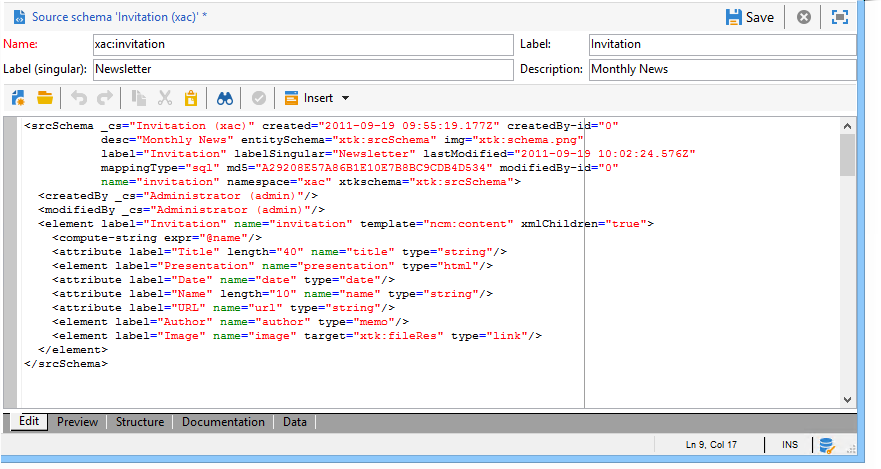

# データスキーマ{#data-schemas}

## 原則 {#principles}

スキーマを編集、作成および設定するには、Adobe Campaignクライアントコ **[!UICONTROL Administration > Configuration > Data schemas]** ンソールのノードをクリックします。

>[!NOTE]
>
>デフォルトのデータスキーマは、Adobe Campaign Classicコンソールの管理者のみが削除できます。


編集フィールドには、ソーススキーマのXMLコンテンツが表示されます。



>[!NOTE]
>
>「名前」編集コントロールを使用すると、名前と名前空間で構成されるスキーマキーを入力できます。 スキーマのルート要素の「name」属性と「namespace」属性は、スキーマのXML編集ゾーンで自動的に更新されます。

プレビューによって、拡張スキーマが自動的に生成されます。


>[!NOTE]
>
>ソーススキーマを保存すると、拡張スキーマの生成が自動的に開始されます。

スキーマの構造全体を確認する必要がある場合は、「プレビュー」タブを使用できます。 スキーマが拡張されると、そのすべての拡張を視覚化できます。 「ドキュメント」タブには、すべてのスキーマ属性と要素、およびそのプロパティ（SQLフィールド、タイプ/長さ、ラベル、説明）が表示されます。 「ドキュメント」タブは、生成されたスキーマにのみ適用されます。 For more on this, refer to the [Regenerating schemas](../../configuration/using/regenerating-schemas.md) section.

## 例：契約表の作成 {#example--creating-a-contract-table}

次の例では、Adobe Campaignデータベースのデータベースモデル **に** 、契約の新しい表を作成します。 この表には、各契約の所有者および共有者の姓と名と電子メールアドレスを保存できます。

これを行うには、テーブルのスキーマを作成し、対応するテーブルを生成するようにデータベース構造を更新する必要があります。 次のような流れになります。

1. Adobe Campaignツリー **[!UICONTROL Administration > Configuration > Data schemas]** のノードを編集し、をクリックしま **[!UICONTROL New]** す。
1. オプションを選 **[!UICONTROL Create a new table in the data model]** 択し、をクリックしま **[!UICONTROL Next]** す。

   

1. テーブル名と名前空間を指定します。

   

   >[!NOTE]
   >
   >デフォルトでは、ユーザーが作成したスキーマは&#39;cus&#39;名前空間に保存されます。 詳しくは、「スキーマの識別」 [を参照してください](../../configuration/using/about-schema-reference.md#identification-of-a-schema)。

1. テーブルのコンテンツを作成します。 入力ウィザードを使用して、設定が見つからないことを確認することをお勧めします。 これを行うには、ボタンをク **[!UICONTROL Insert]** リックし、追加する設定のタイプを選択します。

   

1. 契約表の設定を定義します。

   ```
   <srcSchema desc="Active contracts" img="ncm:channels.png" label="Contracts" labelSingular="Contract" mappingType="sql" name="Contracts" namespace="cus" xtkschema="xtk:srcSchema">
     <element desc="Active contracts" img="ncm:channels.png" label="Contracts" labelSingular="Contract"
              name="Contracts" autopk="true">
              <attribute name="holderName" label="Holder last name" type="string"/>
              <attribute name="holderFirstName" label="Holder first name" type="string"/>
              <attribute name="holderEmail" label="Holder email" type="string"/>
              <attribute name="co-holderName" label="Co-holder last name" type="string"/>           
              <attribute name="co-holderFirstName" label="Co-holder first name" type="string"/>           
              <attribute name="co-holderEmail" label="Co-holder email" type="string"/>    
              <attribute name="date" label="Subscription date" type="date"/>     
              <attribute name="noContract" label="Contract number" type="long"/>  
     </element>
   </srcSchema>
   ```

   契約のタイプを追加し、契約番号に索引を付けます。

   ```
   <srcSchema _cs="Contracts (cus)" desc="Active contracts" entitySchema="xtk:srcSchema" img="ncm:channels.png"
              label="Contracts" labelSingular="Contract" name="Contracts" namespace="cus" xtkschema="xtk:srcSchema">
     <enumeration basetype="byte" name="typeContract">
       <value label="Home" name="home" value="0"/>
       <value label="Car" name="car" value="1"/>
       <value label="Health" name="health" value="2"/>
       <value label="Pension fund" name="pension fund" value="2"/>
     </enumeration>
     <element autopk="true" desc="Active contracts" img="ncm:channels.png" label="Contracts"
              labelSingular="Contract" name="Contracts">
       <attribute label="Holder last name" name="holderName" type="string"/>
       <attribute label="Holder first name" name="holderFirstName" type="string"/>
       <attribute label="Holder email" name="holderEmail" type="string"/>
       <attribute label="Co-holder last name" name="co-holderName" type="string"/>
       <attribute label="Co-holder first name" name="co-holderFirstName" type="string"/>
       <attribute label="Co-holder email" name="co-holderEmail" type="string"/>
       <attribute label="Subscription date" name="date" type="date"/>
      <attribute desc="Type of contract" enum="cus:Contracts:typeContract" label="Type of contract"
                  name="type" type="byte"/>
       <attribute label="Contract number" name="noContract" type="long"/>
       <dbindex name="noContract" unique="true">
         <keyfield xpath="@noContract"/>
       </dbindex>
     </element>
   </srcSchema>
   ```

1. スキーマを保存して構造を生成します。

   

1. データベース構造を更新して、スキーマがリンクされるテーブルを作成します。 詳しくは、「データベース構造の更 [新」を参照してください](../../configuration/using/updating-the-database-structure.md)。

