# フォームの編集{#editing-forms}

## 概要

マーケターやオペレーターは、入力フォームを使用してレコードを作成、変更、プレビューできます。 Forms：データを視覚的に表現

入力フォームを作成および変更できます。

* デフォルトで配信されるファクトリ入力フォームを変更できます。 工場出荷時の入力フォームは、工場のデータスキーマに基づいています。
* 定義したデータスキーマにもとづいて、カスタム入力フォームを作成できます。

Formsは`xtk:form` タイプのエンティティです。 入力フォーム構造は、`xtk:form` スキーマで表示できます。 このスキーマを表示するには、メニューから&#x200B;**[!UICONTROL 管理]** > **[!UICONTROL 設定]** > **[!UICONTROL データスキーマ]**&#x200B;を選択します。 [ フォーム構造](form-structure.md)の詳細をご覧ください。

入力フォームにアクセスするには、メニューから&#x200B;**[!UICONTROL 管理] > [!UICONTROL 設定] > [!UICONTROL 入力フォーム]**&#x200B;を選択します。

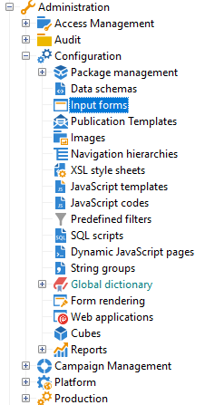

フォームをデザインするには、XML エディターでXML コンテンツを編集します。

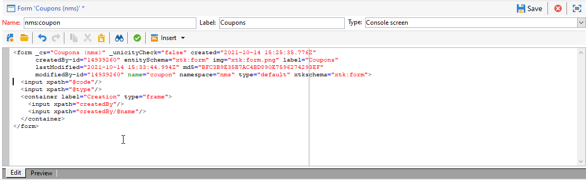

[詳細情報](form-structure.md#formatting)。

フォームをプレビューするには、「**[!UICONTROL プレビュー]**」タブをクリックします。

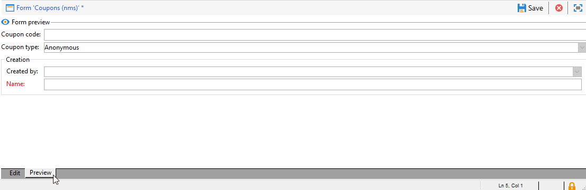

## フォームタイプ

さまざまな種類の入力フォームを作成できます。 フォームタイプは、ユーザーがフォームをどのように移動するかを決定します。

* コンソール画面

  これはデフォルトのフォームタイプです。 フォームは1 ページで構成されます。

  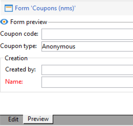

* コンテンツ管理

  コンテンツ管理にこのフォームタイプを使用します。 この[ ユースケース ](../../delivery/using/use-case-creating-content-management.md)を参照してください。

  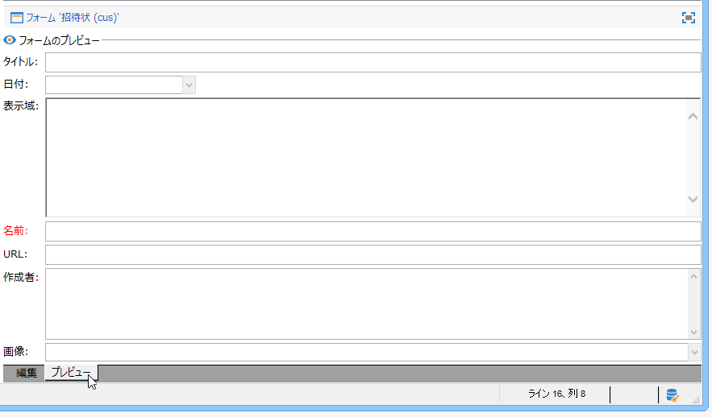

* アシスタント

  このフォームは、特定の順序で並べられた複数のフローティングスクリーンで構成されます。 利用者は、ある画面から次の画面へ移動します。 [詳細情報](form-structure.md#wizards)。

* アイコンボックス

  このフォームは複数のページで構成されます。 フォームを移動するには、フォームの左側にあるアイコンを選択します。

  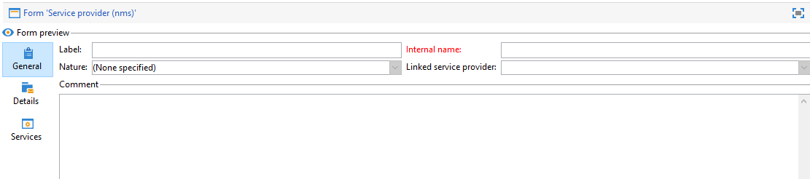

* ノートブック

  このフォームは複数のページで構成されます。 フォームを移動するには、ユーザーはフォームの上部にあるタブを選択します。

  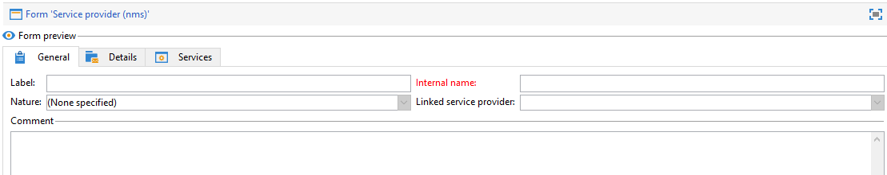

* 縦長ペイン

  このフォームにはナビゲーションツリーが表示されます。

* 横長ペイン

  このフォームには、項目のリストが表示されます。

## コンテナ

フォームでは、様々な目的でコンテナを使用できます。

* フォーム内のコンテンツの整理
* 入力フィールドへのアクセスを定義
* 他のフォーム内にフォームをネストする

[詳細情報](form-structure.md#containers)。

### コンテンツを整理

コンテナを使用して、フォーム内のコンテンツを整理します。

* フィールドをセクションにグループ化することができます。
* ページを複数のページフォームに追加できます。

コンテナを挿入するには、`<container>`要素を使用します。 [詳細情報](form-structure.md#containers)。

#### グループフィールド

コンテナを利用して、入力フィールドを整理されたセクションにグループ化できます。

フォームにセクションを挿入するには、次の要素を使用します：`<container type="frame">`。 必要に応じて、セクションタイトルを追加するには、`label`属性を使用します。

構文：`<container type="frame" label="`*section_title*`"> […] </container>`

この例では、コンテナが&#x200B;**作成** セクションを定義します。このセクションには、**[!UICONTROL 作成者]**&#x200B;および&#x200B;**[!UICONTROL 名前]**&#x200B;の入力フィールドが含まれます。

```xml
<form _cs="Coupons (nms)" entitySchema="xtk:form" img="xtk:form.png" label="Coupons"
      name="coupon" namespace="nms" type="default" xtkschema="xtk:form">
  <input xpath="@code"/>
  <input xpath="@type"/>
  <container label="Creation" type="frame">
    <input xpath="createdBy"/>
    <input xpath="createdBy/@name"/>
  </container>
</form>
```


#### 複数ページフォームへのページの追加

複数ページフォームの場合は、コンテナを使用してフォームページを作成します。

次の例は、フォームの&#x200B;**General**&#x200B;および&#x200B;**Details** ページのコンテナを示しています。

```xml
<container img="ncm:book.png" label="General">
[…]
</container>
<container img="ncm:detail.png" label="Details">
[…]
</container>
```

### フィールドへのアクセスを定義

コンテナを使用して表示内容を定義し、フィールドへのアクセスを定義します。 フィールドグループのオンとオフを切り替えることができます。

### ネストフォーム

コンテナを使用して、他のフォーム内にフォームをネストします。 [詳細情報](#add-pages-to-multipage-forms)。

## 画像への参照

画像を検索するには、メニューから&#x200B;**[!UICONTROL 管理]** > **[!UICONTROL 構成]** > **[!UICONTROL 画像]**&#x200B;を選択します。

画像をフォーム内の要素（アイコンなど）に関連付けるには、画像への参照を追加します。 例えば、`<container>`要素で`img`属性を使用します。

構文：`img="`*`namespace`*`:`*`filename`*`.`*`extension`*`"`

次の例は、`ncm`名前空間から`book.png`および`detail.png`画像への参照を示しています。

```xml
<container img="ncm:book.png" label="General">
[…]
</container>
<container img="ncm:detail.png" label="Details">
[…]
</container>
```

これらの画像は、ユーザーがクリックして複数ページのフォームを移動するアイコンに使用されます。

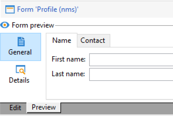


## シンプルなフォームの作成 {#create-simple-form}

フォームを作成するには、次の手順に従います。

1. メニューから、**[!UICONTROL 管理]** > **[!UICONTROL 設定]** > **[!UICONTROL 入力フォーム]**&#x200B;を選択します。
1. リストの右上にある「**[!UICONTROL 新規]**」ボタンをクリックします。

   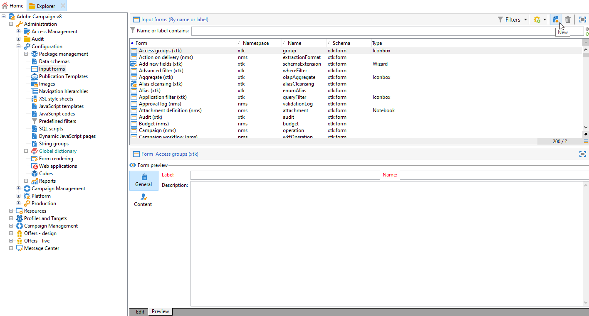

1. フォームプロパティを指定します。

   * フォーム名と名前空間を指定します。

     フォーム名と名前空間は、関連するデータスキーマと一致する可能性があります。  次の例は、`cus:order` データスキーマのフォームを示しています。

     ```xml
     <form entitySchema="xtk:form" img="xtk:form.png" label="Order" name="order" namespace="cus" type="iconbox" xtkschema="xtk:form">
       […]
     </form>
     ```

     または、`entity-schema`属性でデータスキーマを明示的に指定することもできます。

     ```xml
     <form entity-schema="cus:stockLine" entitySchema="xtk:form" img="xtk:form.png" label="Stock order" name="stockOrder" namespace="cus" xtkschema="xtk:form">
       […]
     </form>
     ```

   * フォームに表示するラベルを指定します。
   * 必要に応じて、フォームタイプを指定します。 フォームタイプを指定しない場合は、デフォルトでコンソール画面タイプが使用されます。

     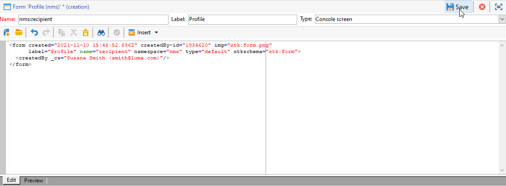

     マルチページフォームをデザインする場合は、`<form>`要素でフォームタイプを省略し、コンテナでタイプを指定できます。

1. 「**[!UICONTROL 保存]**」をクリックします。

1. フォーム要素を挿入します。

   例えば、入力フィールドを挿入するには、`<input>`要素を使用します。 `xpath`属性をXPath式としてフィールド参照に設定します。 [詳細情報](schema-structure.md#referencing-with-xpath)。

   この例では、`nms:recipient` スキーマに基づく入力フィールドを示します。

   ```xml
   <input xpath="@firstName"/>
   <input xpath="@lastName"/>
   ```

1. フォームが特定のスキーマタイプに基づいている場合は、このスキーマのフィールドを検索できます。

   1. **[!UICONTROL 挿入]**/**[!UICONTROL ドキュメントフィールド]**&#x200B;をクリックします。

      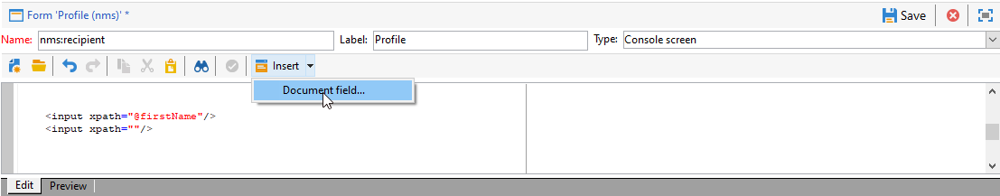

   1. フィールドを選択し、**[!UICONTROL OK]**&#x200B;をクリックします。

      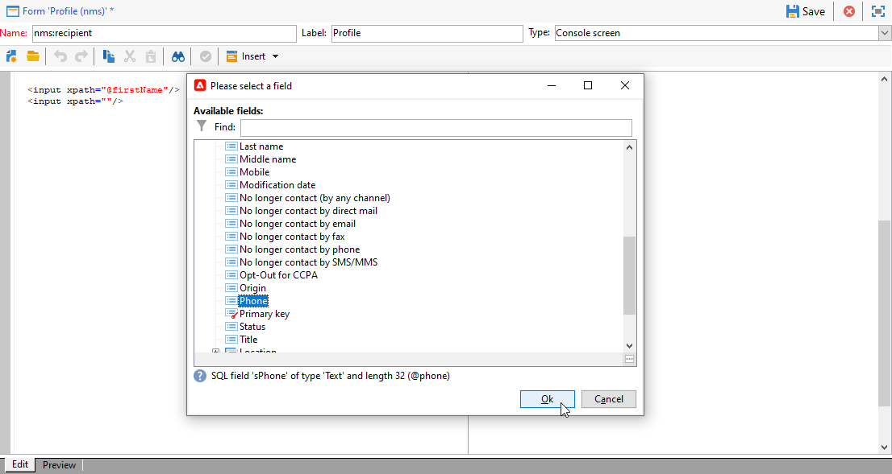

1. 必要に応じて、フィールドエディターを指定します。

   デフォルトのフィールドエディターは、各データタイプに関連付けられます。
   * 日付タイプフィールドの場合、フォームには入力カレンダーが表示されます。
   * 列挙タイプのフィールドの場合、フォームには選択リストが表示されます。

   次のフィールドエディタータイプを使用できます。

   | フィールドエディター | フォーム属性 |
   | --- | --- |
   | ラジオボタン | `type="radiobutton"` |
   | チェックボックス | `type="checkbox"` |
   | ツリーを編集 | `type="tree"` |

   詳しくは、[ メモリリストコントロール ](form-structure.md#memory-list-controls)を参照してください。

1. オプションで、フィールドへのアクセスを定義します。

   | 要素 | 属性 | 説明 |
   | --- | --- | --- |
   | `<input>` | `read-only="true"` | フィールドへの読み取り専用アクセスを提供します |
   | `<container>` | `type="visibleGroup" visibleIf="`*edit-expr*`"` | 条件付きで表示されるフィールドグループ |
   | `<container>` | `type="enabledGroup" enabledIf="`*edit-expr*`"` | 条件付きでフィールドグループを有効にする |

   例：

   ```xml
   <container type="enabledGroup" enabledIf="@gender=1">
     […]
   </container>
   <container type="enabledGroup" enabledIf="@gender=2">
     […]
   </container>
   ```

1. 必要に応じて、コンテナを使用してフィールドをセクションにグループ化します。

   ```xml
   <container type="frame" label="Name">
      <input xpath="@firstName"/>
      <input xpath="@lastName"/>
   </container>
   <container type="frame" label="Contact details">
      <input xpath="@email"/>
      <input xpath="@phone"/>
   </container>
   ```

   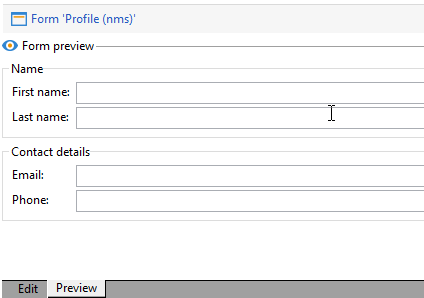

## 複数ページフォームの作成 {#create-multipage-form}

複数のページフォームを作成できます。 他のフォーム内にフォームをネストすることもできます。

### `iconbox` フォームの作成

`iconbox` フォームの種類を使用して、フォームの左側にアイコンを表示し、ユーザーをフォーム内の別のページに移動させます。


既存のフォームの種類を`iconbox`に変更するには、次の手順に従います。

1. `<form>`要素の`type`属性を`iconbox`に変更します：

   ```xml
   <form […] type="iconbox">
   ```

1. 各フォームページのコンテナを設定します。

   1. `<container>`要素を`<form>`要素の子として追加します。
   1. アイコンのラベルと画像を定義するには、`label`属性と`img`属性を使用します。

      ```xml
      <form entitySchema="xtk:form" name="Service provider" namespace="nms" type="iconbox" xtkschema="xtk:form">
          <container img="xtk:properties.png" label="General">
              <input xpath="@label"/>
              <input xpath="@name"/>
              […]
          </container>
          <container img="nms:msgfolder.png" label="Details">
              <input xpath="@address"/>
              […]
          </container>
          <container img="nms:supplier.png" label="Services">
              […]
          </container>
      </form>
      ```

   または、既存の`<container>`要素から`type="frame"`属性を削除します。

### ノートブックフォームの作成

`notebook` フォームの種類を使用して、ユーザーを別のページに移動させるタブをフォームの上部に表示します。


既存のフォームの種類を`notebook`に変更するには、次の手順に従います。

1. `<form>`要素の`type`属性を`notebook`に変更します：

   ```xml
   <form […] type="notebook">
   ```

1. 各フォームページのコンテナを追加します。

   1. `<container>`要素を`<form>`要素の子として追加します。
   1. アイコンのラベルと画像を定義するには、`label`属性と`img`属性を使用します。

   ```xml
     <form entitySchema="xtk:form" name="Service provider" namespace="nms" type="notebook" xtkschema="xtk:form">
         <container label="General">
             <input xpath="@label"/>
             <input xpath="@name"/>
             […]
         </container>
         <container label="Details">
             <input xpath="@address"/>
             […]
         </container>
         <container label="Services">
             […]
         </container>
     </form>
   ```

   または、既存の`<container>`要素から`type="frame"`属性を削除します。

### ネストフォーム

他のフォーム内にフォームをネストできます。 例えば、ノートブックフォームをアイコンボックスフォーム内にネストすることができます。

ネストのレベルでナビゲーションを制御します。 利用者は、サブフォームにドリルダウンできます。

別のフォーム内にフォームをネストするには、`<container>`要素を挿入し、`type`属性をフォームタイプに設定します。 最上位フォームの場合、外部コンテナまたは`<form>`要素でフォームタイプを設定できます。

### 例

次の例は、複雑なフォームを示しています。

* 最上位のフォームはアイコンボックスフォームです。 このフォームは、**General**&#x200B;と&#x200B;**Details**&#x200B;の2つのコンテナで構成されています。

  その結果、外側のフォームには、上位レベルに&#x200B;**General** ページと&#x200B;**Details** ページが表示されます。 これらのページにアクセスするには、フォームの左側にあるアイコンをクリックします。

* サブフォームは、**General** コンテナ内にネストされたノートブックフォームです。 サブフォームは、**名前**&#x200B;と&#x200B;**連絡先**&#x200B;のラベルが付いた2つのコンテナで構成されています。

```xml
<form _cs="Profile (nms)" entitySchema="xtk:form" img="xtk:form.png" label="Profile" name="profile" namespace="nms" xtkschema="xtk:form">
  <container type="iconbox">
    <container img="ncm:general.png" label="General">
      <container type="notebook">
        <container label="Name">
          <input xpath="@firstName"/>
          <input xpath="@lastName"/>
        </container>
        <container label="Contact">
          <input xpath="@email"/>
        </container>
      </container>
    </container>
    <container img="ncm:detail.png" label="Details">
      <input xpath="@birthDate"/>
    </container>
  </container>
</form>
```

その結果、外部フォームの&#x200B;**General** ページには、**Name**&#x200B;と&#x200B;**Contact** タブが表示されます。


別のフォーム内にフォームをネストするには、`<container>`要素を挿入し、`type`属性をフォームタイプに設定します。 最上位フォームの場合、外部コンテナまたは`<form>`要素でフォームタイプを設定できます。

### 例

次の例は、複雑なフォームを示しています。

* 最上位のフォームはアイコンボックスフォームです。 このフォームは、**General**&#x200B;と&#x200B;**Details**&#x200B;の2つのコンテナで構成されています。

  その結果、外側のフォームには、上位レベルに&#x200B;**General** ページと&#x200B;**Details** ページが表示されます。 これらのページにアクセスするには、フォームの左側にあるアイコンをクリックします。

* サブフォームは、**General** コンテナ内にネストされたノートブックフォームです。 サブフォームは、**名前**&#x200B;と&#x200B;**連絡先**&#x200B;のラベルが付いた2つのコンテナで構成されています。

```xml
<form _cs="Profile (nms)" entitySchema="xtk:form" img="xtk:form.png" label="Profile" name="profile" namespace="nms" xtkschema="xtk:form">
  <container type="iconbox">
    <container img="ncm:general.png" label="General">
      <container type="notebook">
        <container label="Name">
          <input xpath="@firstName"/>
          <input xpath="@lastName"/>
        </container>
        <container label="Contact">
          <input xpath="@email"/>
        </container>
      </container>
    </container>
    <container img="ncm:detail.png" label="Details">
      <input xpath="@birthDate"/>
    </container>
  </container>
</form>
```

その結果、外部フォームの&#x200B;**General** ページには、**Name**&#x200B;と&#x200B;**Contact** タブが表示されます。


## 工場出荷時の入力フォームの変更 {#modify-factory-form}

ファクトリフォームを変更するには、次の手順に従います。

1. 工場出荷時の入力フォームを変更します。

   1. メニューから、**[!UICONTROL 管理]** > **[!UICONTROL 設定]** > **[!UICONTROL 入力フォーム]**&#x200B;を選択します。
   1. 入力フォームを選択して修正します。

   ファクトリ データ スキーマを拡張することはできますが、ファクトリ入力フォームを拡張することはできません。 ファクトリ入力フォームを再作成することなく、直接変更することをお勧めします。 ソフトウェアのアップグレード時に、工場出荷時の入力フォームの変更がアップグレードと結合されます。 自動結合が失敗した場合は、競合を解決できます。 [詳細情報](../../production/using/upgrading.md#resolving-conflicts)。

   例えば、追加フィールドを含むファクトリスキーマを拡張する場合、このフィールドを関連するファクトリフォームに追加できます。

## フォームの検証 {#validate-forms}

フォームに検証コントロールを含めることができます。

### フィールドへの読み取り専用アクセス権の付与

フィールドへの読み取り専用アクセス権を付与するには、`readOnly="true"`属性を使用します。 例えば、レコードのプライマリキーを表示し、読み取り専用アクセスを使用する場合があります。 [詳細情報](form-structure.md#non-editable-fields)。

この例では、`nms:recipient` スキーマのプライマリキー（`iRecipientId`）が読み取り専用アクセスで表示されます。

```xml
<value xpath="@iRecipientId" readOnly="true"/>
```

### 必須フィールドの確認

次の必須情報を確認できます。

* 必須フィールドには`required="true"`属性を使用します。
* `<leave>` ノードを使用して、これらのフィールドを確認し、エラーメッセージを表示します。

この例では、電子メールアドレスが必要で、ユーザーがこの情報を提供していない場合はエラーメッセージが表示されます。

```xml
<input xpath="@email" required="true"/>
<leave>
  <check expr="@email!=''">
    <error>The email address is required.</error>
  </check>
</leave>
```

[式フィールド ](form-structure.md#expression-field)と[ フォームコンテキスト ](form-structure.md#context-of-forms)の詳細をご確認ください。

### 値の検証

JavaScript SOAP呼び出しを使用して、コンソールからフォームデータを検証できます。 これらの呼び出しを使用して複雑な検証を行います。例えば、値を承認済み値のリストと照合します。 [詳細情報](form-structure.md#soap-methods)。

1. JS ファイルに検証関数を作成します。

   例：

   ```js
   function nms_recipient_checkValue(value)
   {
     logInfo("checking value " + value)
     if (…)
     {
       logError("Value " + value + " is not valid")
     }
     return 1
   }
   ```

   この例では、関数の名前は`checkValue`です。 この関数は、`nms`名前空間の`recipient` データ型を確認するために使用されます。 チェックされている値がログに記録されます。 値が無効な場合は、エラーメッセージがログに記録されます。 値が有効な場合は、値1が返されます。

   返された値を使用して、フォームを変更できます。

1. フォームで、`<soapCall>`要素を`<leave>`要素に追加します。

   この例では、SOAP呼び出しを使用して`@valueToCheck`文字列を検証します。

   ```xml
   <form name="recipient" (…)>
   (…)
     <leave>
       <soapCall name="checkValue" service="nms:recipient">
         <param exprIn="@valueToCheck" type="string"/>
       </soapCall>
     </leave>
   </form>
   ```

   この例では、`checkValue` メソッドと`nms:recipient` サービスが使用されています。

   * サービスは名前空間とデータタイプです。
   * メソッドは関数名です。 名前では大文字と小文字が区別されます。

   呼び出しは同期して実行されます。

   すべての例外が表示されます。 `<leave>`要素を使用する場合、入力された情報が検証されるまで、ユーザーはフォームを保存できません。

次の例では、フォーム内からサービス呼び出しを行う方法を示します。

```xml
<enter>
  <soapCall name="client" service="c4:ybClient">
    <param exprIn="@id" type="string"/>
    <param type="boolean" xpathOut="/tmp/@count"/>
  </soapCall>
</enter>
```

この例では、入力はプライマリキーであるIDです。 ユーザーがこのIDのフォームに入力すると、このIDを入力パラメーターとしてSOAP呼び出しが行われます。 出力はこのフィールドに書き込まれるブール値です：`/tmp/@count`。 このブール値はフォーム内で使用できます。 [ フォームコンテキスト ](form-structure.md#context-of-forms)の詳細をご覧ください。
