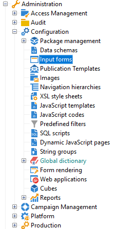

# フォームの編集{#editing-forms}

入力フォームの作成と設定画面には、Adobe Campaignクライアントコンソールの **[!UICONTROL 管理] / [!UICONTROL 設定] / [!UICONTROL Input forms]** フォルダーからアクセスできます。

編集領域を使用して、入力フォームの XML コンテンツを入力できます。

プレビューは、入力フォームの表示を生成します。

