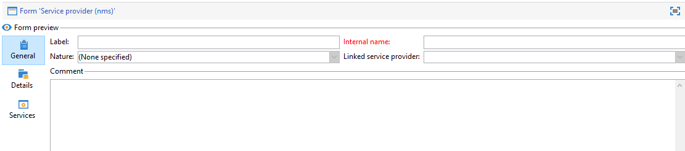

# フォームの編集{#editing-forms}

## 概要

マーケターやオペレーターは、入力フォームを使用して、レコードの作成、変更、プレビューをおこないます。 Formsは、情報を視覚的に表現します。

入力フォームを作成および変更できます。

* デフォルトで配信されるファクトリ入力フォームを変更できます。 ファクトリの入力フォームは、ファクトリデータスキーマに基づいています。
* 定義したデータスキーマに基づいて、カスタムの入力フォームを作成できます。

Formsは `xtk:form` タイプ。 入力フォームの構造は、 `xtk:form` スキーマ。 このスキーマを表示するには、 **[!UICONTROL 管理]** > **[!UICONTROL 設定]** > **[!UICONTROL データスキーマ]** を選択します。 詳細を表示 [フォーム構造](form-structure.md).

入力フォームにアクセスするには、 **[!UICONTROL 管理] > [!UICONTROL 設定] > [!UICONTROL 入力フォーム]** メニューから、次の操作を実行します。

フォームをデザインするには、XML エディターで XML コンテンツを編集します。

[詳細情報](form-structure.md#formatting)。

フォームをプレビューするには、 **[!UICONTROL プレビュー]** タブ：

## フォームタイプ

様々なタイプの入力フォームを作成できます。 フォームの種類によって、ユーザーによるフォームのナビゲーション方法が決まります。

* コンソール画面

   これはデフォルトのフォームタイプです。 フォームは単一のページで構成されます。

   

* コンテンツ管理

   このフォームタイプをコンテンツ管理に使用します。 参照 [使用例](../../delivery/using/use-case--creating-content-management.md).

   

* ウィザード

   このフォームは、特定のシーケンスで並べられた複数のフローティングスクリーンで構成されます。 ユーザーは画面間を移動します。 [詳細情報](form-structure.md#wizards)。

* アイコンボックス

   このフォームは複数のページで構成されます。 フォームに移動するには、フォームの左側でアイコンを選択します。

   

* ノートブック

   このフォームは複数のページで構成されます。 フォームに移動するには、フォーム上部のタブを選択します。

   

* 縦長ペイン

   このフォームは、ナビゲーションツリーを表示します。

* 横長ペイン

   このフォームは、項目のリストを表示します。

