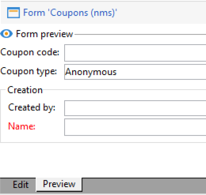

# フォームの編集{#editing-forms}


## 概要

マーケターやオペレーターは、入力フォームを使用して、レコードの作成、変更、プレビューをおこないます。 Formsは、情報を視覚的に表現します。

入力フォームを作成および変更できます。

* デフォルトで配信されるファクトリ入力フォームを変更できます。 ファクトリの入力フォームは、ファクトリデータスキーマに基づいています。
* 定義したデータスキーマに基づいて、カスタムの入力フォームを作成できます。

Formsは `xtk:form` タイプ。 入力フォームの構造は、 `xtk:form` スキーマ。 このスキーマを表示するには、 **[!UICONTROL 管理]** > **[!UICONTROL 設定]** > **[!UICONTROL データスキーマ]** を選択します。 詳細を表示 [フォーム構造](form-structure.md).

入力フォームにアクセスするには、 **[!UICONTROL 管理] > [!UICONTROL 設定] > [!UICONTROL 入力フォーム]** メニューから、次の操作を実行します。


フォームをデザインするには、XML エディターで XML コンテンツを編集します。


[詳細情報](form-structure.md#formatting)。

フォームをプレビューするには、 **[!UICONTROL プレビュー]** タブ：


## フォームタイプ

様々なタイプの入力フォームを作成できます。 フォームの種類によって、ユーザーによるフォームのナビゲーション方法が決まります。

* コンソール画面

   これはデフォルトのフォームタイプです。 フォームは単一のページで構成されます。

   

* コンテンツ管理

   このフォームタイプをコンテンツ管理に使用します。 参照 [使用例](../../delivery/using/use-case--creating-content-management.md).

   

* ウィザード

   このフォームは、特定のシーケンスで並べられた複数のフローティングスクリーンで構成されます。 ユーザーは画面間を移動します。 [詳細情報](form-structure.md#wizards)。

* アイコンボックス

   このフォームは複数のページで構成されます。 フォームに移動するには、フォームの左側でアイコンを選択します。

   

* ノートブック

   このフォームは複数のページで構成されます。 フォームに移動するには、フォーム上部のタブを選択します。

   

* 縦長ペイン

   このフォームは、ナビゲーションツリーを表示します。

* 横長ペイン

   このフォームは、項目のリストを表示します。

## コンテナ

フォームでは、次のような様々な目的でコンテナを使用できます。

* フォーム内のコンテンツを整理する
* 入力フィールドへのアクセスを定義
* 他のフォーム内でのフォームのネスト

[詳細情報](form-structure.md#containers)。

### コンテンツを整理

コンテナを使用してフォーム内のコンテンツを整理する：

* フィールドを複数のセクションにグループ化できます。
* 複数ページのフォームにページを追加できます。

コンテナを挿入するには、 `<container>` 要素。 [詳細情報](form-structure.md#containers)。

#### グループフィールド

コンテナを使用して、入力フィールドを整理されたセクションにグループ化します。

フォームにセクションを挿入するには、次の要素を使用します。 `<container type="frame">`. （オプション）セクションタイトルを追加するには、 `label` 属性。

構文： `<container type="frame" label="`*section_title*`"> […] </container>`

この例では、コンテナによって **作成** セクション ( **[!UICONTROL 作成者]** および **[!UICONTROL 名前]** 入力フィールド：

```xml
<form _cs="Coupons (nms)" entitySchema="xtk:form" img="xtk:form.png" label="Coupons"
      name="coupon" namespace="nms" type="default" xtkschema="xtk:form">
  <input xpath="@code"/>
  <input xpath="@type"/>
  <container label="Creation" type="frame">
    <input xpath="createdBy"/>
    <input xpath="createdBy/@name"/>
  </container>
</form>
```


#### 複数ページのフォームにページを追加

複数ページフォームの場合は、コンテナを使用してフォームページを作成します。

この例では、 **一般** および **詳細** フォームのページ：

```xml
<container img="ncm:book.png" label="General">
[…]
</container>
<container img="ncm:detail.png" label="Details">
[…]
</container>
```

### フィールドへのアクセスを定義

コンテナを使用して、表示内容を定義し、フィールドへのアクセスを定義します。 フィールドのグループのオン/オフを切り替えることができます。

### フォームのネスト

コンテナを使用して、他のフォーム内にフォームをネストします。 [詳細情報](#add-pages-to-multipage-forms)。

## 画像への参照

画像を検索するには、「 」を選択します。 **[!UICONTROL 管理]** > **[!UICONTROL 設定]** > **[!UICONTROL 画像]** を選択します。

画像をフォーム内の要素（アイコンなど）に関連付けるには、画像への参照を追加します。 以下を使用： `img` 属性 ( 例： `<container>` 要素。

構文: `img="`*`namespace`*`:`*`filename`*`.`*`extension`*`"`

この例では、 `book.png` および `detail.png` 画像 `ncm` 名前空間：

```xml
<container img="ncm:book.png" label="General">
[…]
</container>
<container img="ncm:detail.png" label="Details">
[…]
</container>
```

これらの画像は、ユーザーがクリックして複数ページフォームを移動するアイコンに使用されます。


## シンプルなフォームの作成 {#create-simple-form}

フォームを作成するには、次の手順に従います。

1. メニューから、を選択します。 **[!UICONTROL 管理]** > **[!UICONTROL 設定]** > **[!UICONTROL 入力フォーム]**.
1. 次をクリック： **[!UICONTROL 新規]** 」ボタンをクリックします。

   

1. フォームのプロパティを指定します。

   * フォーム名と名前空間を指定します。

      フォーム名と名前空間は、関連するデータスキーマと一致させることができます。  この例では、 `cus:order` データスキーマ：

      ```xml
      <form entitySchema="xtk:form" img="xtk:form.png" label="Order" name="order" namespace="cus" type="iconbox" xtkschema="xtk:form">
        […]
      </form>
      ```

      または、 `entity-schema` 属性。

      ```xml
      <form entity-schema="cus:stockLine" entitySchema="xtk:form" img="xtk:form.png" label="Stock order" name="stockOrder" namespace="cus" xtkschema="xtk:form">
        […]
      </form>
      ```

   * フォームに表示するラベルを指定します。
   * 必要に応じて、フォームタイプを指定します。 フォームタイプを指定しない場合、コンソール画面タイプがデフォルトで使用されます。

      

      複数ページのフォームをデザインする場合は、 `<form>` 要素を選択して、コンテナのタイプを指定します。

1. 「**[!UICONTROL 保存]**」をクリックします。

1. フォーム要素を挿入します。

   例えば、入力フィールドを挿入するには、 `<input>` 要素。 を `xpath` 属性を XPath 式としてフィールド参照に追加します。 [詳細情報](schema-structure.md#referencing-with-xpath)。

   この例では、 `nms:recipient` スキーマ。

   ```xml
   <input xpath="@firstName"/>
   <input xpath="@lastName"/>
   ```

1. フォームが特定のスキーマタイプに基づいている場合は、このスキーマのフィールドを検索できます。

   1. クリック **[!UICONTROL 挿入]** > **[!UICONTROL ドキュメントフィールド]**.

      

   1. フィールドを選択し、 **[!UICONTROL OK]**.

      

1. 必要に応じて、フィールドエディターを指定します。

   デフォルトのフィールドエディターは、各データタイプに関連付けられています。
   * 日付タイプのフィールドの場合、フォームには入力カレンダーが表示されます。
   * 列挙タイプのフィールドの場合、フォームに選択リストが表示されます。

   次のタイプのフィールドエディターを使用できます。

   | フィールドエディター | フォーム属性 |
   | --- | --- |
   | ラジオボタン | `type="radiobutton"` |
   | チェックボックス | `type="checkbox"` |
   | ツリーを編集 | `type="tree"` |

   詳細を表示 [メモリリスト制御](form-structure.md#memory-list-controls).

1. オプションで、次のフィールドへのアクセスを定義します。

   | 要素 | 属性 | 説明 |
   | --- | --- | --- |
   | `<input>` | `read-only:"true"` | フィールドへの読み取り専用アクセスを提供します |
   | `<container>` | `type="visibleGroup" visibleIf="`*edit-expr*`"` | 条件付きでフィールドのグループを表示します |
   | `<container>` | `type="enabledGroup" enabledIf="`*edit-expr*`"` | 条件に応じてフィールドのグループを有効にします |

   例：

   ```xml
   <container type="enabledGroup" enabledIf="@gender=1">
     […]
   </container>
   <container type="enabledGroup" enabledIf="@gender=2">
     […]
   </container>
   ```

1. オプションで、コンテナを使用してフィールドをセクションにグループ化します。

   ```xml
   <container type="frame" label="Name">
      <input xpath="@firstName"/>
      <input xpath="@lastName"/>
   </container>
   <container type="frame" label="Contact details">
      <input xpath="@email"/>
      <input xpath="@phone"/>
   </container>
   ```

   

## 複数ページフォームの作成 {#create-multipage-form}

複数ページのフォームを作成できます。 また、他のフォーム内にフォームをネストすることもできます。

### の作成 `iconbox` フォーム

以下を使用： `iconbox` フォームの左側にアイコンを表示するフォームタイプ。このアイコンにより、ユーザーはフォーム内の別のページに移動できます。


既存のフォームの種類を次に変更するには `iconbox`を使用する場合は、次の手順に従います。

1. を `type` の属性 `<form>` 要素から `iconbox`:

   ```xml
   <form […] type="iconbox">
   ```

1. 各フォームページにコンテナを設定します。

   1. を追加します。 `<container>` 要素を `<form>` 要素。
   1. アイコンのラベルと画像を定義するには、 `label` および `img` 属性。

      ```xml
      <form entitySchema="xtk:form" name="Service provider" namespace="nms" type="iconbox" xtkschema="xtk:form">
          <container img="xtk:properties.png" label="General">
              <input xpath="@label"/>
              <input xpath="@name"/>
              […]
          </container>
          <container img="nms:msgfolder.png" label="Details">
              <input xpath="@address"/>
              […]
          </container>
          <container img="nms:supplier.png" label="Services">
              […]
          </container>
      </form>
      ```
   または、 `type="frame"` 既存の `<container>` 要素。

### ノートブックフォームの作成

以下を使用： `notebook` フォームの上部にタブを表示するフォームタイプ（ユーザーを別のページに移動させます）。


既存のフォームの種類を次に変更するには `notebook`を使用する場合は、次の手順に従います。

1. を `type` の属性 `<form>` 要素から `notebook`:

   ```xml
   <form […] type="notebook">
   ```

1. 各フォームページにコンテナを追加します。

   1. を追加します。 `<container>` 要素を `<form>` 要素。
   1. アイコンのラベルと画像を定義するには、 `label` および `img` 属性。

   ```xml
     <form entitySchema="xtk:form" name="Service provider" namespace="nms" type="notebook" xtkschema="xtk:form">
         <container label="General">
             <input xpath="@label"/>
             <input xpath="@name"/>
             […]
         </container>
         <container label="Details">
             <input xpath="@address"/>
             […]
         </container>
         <container label="Services">
             […]
         </container>
     </form>
   ```

   または、 `type="frame"` 既存の `<container>` 要素。

### フォームのネスト {#nest-forms}

他のフォーム内にフォームをネストすることができます。 例えば、iconbox フォーム内でノートブックフォームをネストできます。

ネスト制御のレベル。 ユーザーはサブフォームにドリルダウンできます。

