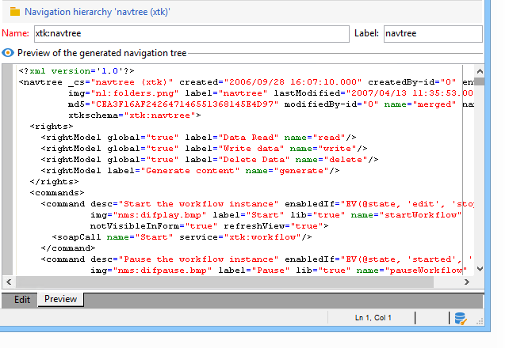

# 版{#edition}

ナビゲーション階層設定ドキュメントを作成および設定する画面は、次のノードからアクセスで **[!UICONTROL Administration > Configuration > Navigation hierarchies]** きます。

ナビゲーション階層の設定は、複数のXMLドキュメントに分かれています。 スキーマ拡張と同じ原理に基づいて動作します。すべてのドキュメントがマージされ、設定全体を含む単一のドキュメントが生成されます。 このドキュメントは編集できず、「プレビュー」タブで表示されます。

編集フィールドには、XMLドキュメントのコンテンツが表示されます。

>[!NOTE]
>
>「名前」編集コントロールを使用すると、名前と名前空間で構成されるドキュメントキーを入力できます。 The &quot;name&quot; and &quot;namespace&quot; attributes of the **`<navtree>`** element are automatically updated in the XML edit field of the schema.

プレビューにより、次の設定を含む結合ドキュメントが自動的に生成されます。

