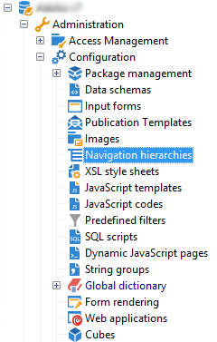

# Campaignエクスプローラーのナビゲーションツリーを編集{#edition}

ナビゲーション階層設定ドキュメントを作成および設定する画面には、**[!UICONTROL 管理/設定/ナビゲーション階層]**&#x200B;ノードからアクセスできます。

ナビゲーション階層の設定は、複数のXMLドキュメントに分割されます。 これは、スキーマ拡張と同様の原則に基づいて動作します。設定全体を含む単一のドキュメントを生成するために、すべてのドキュメントが結合されます。 このドキュメントは編集できず、「プレビュー」タブに表示されます。

編集フィールドは、XMLドキュメントのコンテンツを提供します。

>[!NOTE]
>
>「名前」編集コントロールを使用して、名前と名前空間で構成されるドキュメントキーを入力できます。 **`<navtree>`**&#x200B;要素の「name」属性と「namespace」属性は、スキーマのXML編集フィールドで自動的に更新されます。

プレビューは、完全な設定を含む結合ドキュメントを自動的に生成します。

