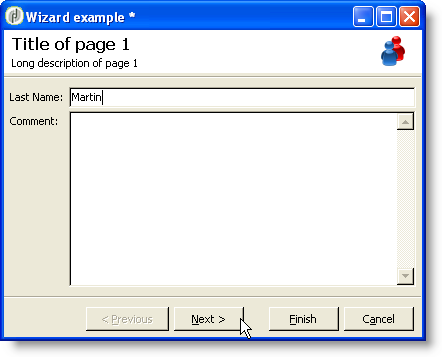

# フォームの構造{#form-structure}

The description of a form is a structured XML document that observes the grammar of the form schema **xtk:form**.

The XML document of the input form must contain the `<form>` root element with the  **name** and  **namespace** attributes to populate the form name and namespace.

```
<form name="form_name" namespace="name_space">
...
</form>
```

デフォルトでは、フォームはデータスキーマに同じ名前と名前空間で関連付けられます。 フォームに別の名前を関連付けるには、要素の **entity-スキーマ** 属性をスキーマキーの名前に設定し `<form>` ます。 入力フォームの構造を理解するために、「cus:受信者」のサンプルスキーマを使用したインターフェイスを説明します。

```
<srcSchema name="recipient" namespace="cus">
  <enumeration name="gender" basetype="byte">    
    <value name="unknown" label="Not specified" value="0"/>    
    <value name="male" label="Male" value="1"/>   
    <value name="female" label="Female" value="2"/>   
  </enumeration>

  <element name="recipient">
    <attribute name="email" type="string" length="80" label="Email" desc="E-mail address of recipient"/>
    <attribute name="birthDate" type="datetime" label="Date"/>
    <attribute name="gender" type="byte" label="Gender" enum="gender"/>
  </element>
</srcSchema>
```

サンプルスキーマに基づく入力フォーム：


```
<form name="recipient" namespace="cus">
  <input xpath="@gender"/>
  <input xpath="@birthDate"/>
  <input xpath="@email"/>
</form>
```

編集の説明は、 `<form>` ルート要素の開始を制御します。 編集コントロールが、スキーマ内のフィールドのパスを格納した **xpath** 属性を持つ **`<input>`** 要素に入力されます。

編集コントロールは、対応するデータタイプに自動的に適応し、スキーマで定義されているラベルを使用します。

>[!NOTE]
>
>データ要素に **label** 属性を追加すると、データスキーマに定義されたラベルをオーバーロードでき `<input>` ます。\
>`<input label="E-mail address" xpath="@name" />`

デフォルトでは、各フィールドは1行に表示され、データの種類に応じて使用可能なすべてのスペースを占有します。

## 書式設定 {#formatting}

コントロールのレイアウトは、HTMLテーブルで使用されているレイアウトと同じように見えます。コントロールを複数の列に分割したり、要素をインターレースしたり、使用可能な領域の占有を指定したりできます。 ただし、書式設定は領域を縦横比で分割する場合にのみ使用できます。オブジェクトに固定寸法を指定することはできません。

上記の例のコントロールを2つの列に表示するには：


```
<form name="recipient" namespace="cus">
  <container colcount="2">
    <input xpath="@gender"/>
    <input xpath="@birthDate"/>
    <input xpath="@email"/>
  </container>
</form>
```

colcount **`<container>`** 属性を持つ **** 要素を使用すると、2つの列に子コントロールを強制的に表示できます。

コントロールの **colspan** 属性は、値に入力された列数だけコントロールを拡張します。


```
<form name="recipient" namespace="cus">
  <container colcount="2">
    <input xpath="@gender"/>
    <input xpath="@birthDate"/>
    <input xpath="@email" colspan="2"/>
  </container>
</form> 
```

コンテナは、 **type=&quot;frame&quot;** 属性に値を入力することで、子コントロールの周囲にフレームを追加し、 **label** 属性に含まれるラベルを追加します。


```
<form name="recipient" namespace="cus">
  <container colcount="2" type="frame" label="General">
    <input xpath="@gender"/>
    <input xpath="@birthDate"/>
    <input xpath="@email" colspan="2"/>
  </container>
</form>
```

要素を使用して、入力フォームの形式を設定できます。 **`<static>`**


```
<form name="recipient" namespace="cus">
  <static type="separator" colspan="2" label="General"/>
  <input xpath="@gender"/>
  <input xpath="@birthDate"/>
  <input xpath="@email" colspan="2"/>
  <static type="help" label="General information about recipient with date of birth, gender, and e-mail address." colspan="2"/>
</form>
```

区切り **`<static>`** 記号の **種類が付いたタグを使用すると****** 、ラベルの属性にラベルが含まれた区切り記号バーを追加できます。

ヘルプタイプの `<static>` タグを使用して、ヘルプテキストが追加されました。 テキストの内容が **label** 属性に入力されます。

## コンテナ {#containers}

コンテナを使用すると、一連のコントロールをグループ化できます。これらは要素で表され **`<container>`** ます。 上記の例は、複数の列のコントロールを書式設定する際に使用されています。

子コントロールの **xpath** 属性 `<container>` を使用すると、子コントロールを簡単に参照できます。 次に、コントロールの参照は、親の `<container>` 親に対する相対パスになります。

「xpath」を使用しないコンテナの例：

```
<container colcount="2">
  <input xpath="location/@zipCode"/>
  <input xpath="location/@city"/>
</container>
```

「location」という要素に「xpath」を追加した例を次に示します。

```
<container colcount="2" xpath="location">
  <input xpath="@zipCode"/>
  <input xpath="@city"/>
</container>
```

### コンテナの種類 {#types-of-container}

コンテナは、ページ形式の一連のフィールドを使用して複雑なコントロールを作成する場合に使用します。

#### タブコンテナ {#tab-container}

タブコンテナは、タブからアクセス可能なページのデータの形式を設定します。


```
<container type="notebook">
  <container colcount="2" label="General">
    <input xpath="@gender"/>
    <input xpath="@birthDate"/>
    <input xpath="@email" colspan="2"/>
  </container>
  <container colcount="2" label="Location">
    ...
  </container>
</container>
```

メインコンテナは、 **type=&quot;notebook&quot;** 属性で定義します。 タブは子コンテナで宣言され、タブのラベルは **label** 属性から入力されます。

>[!NOTE]
>
>**style=&quot;down|up**（デフォルト）**&quot;** フィーチャは、タブラベルをコントロールの下または上に強制的に垂直位置に配置します。 この機能はオプションです。
>
>`<container style="down" type="notebook">  ... </container>`

#### アイコンリスト {#icon-list}

このコンテナには、表示するページを選択できる垂直のアイコンバーが表示されます。


```
<container type="iconbox">
  <container colcount="2" label="General" img="xtk:properties.png">
    <input xpath="@gender"/>
    <input xpath="@birthDate"/>
    <input xpath="@email" colspan="2"/>
  </container>
  <container colcount="2" label="Location" img="nms:msgfolder.png">
    ...
  </container>
</container>
```

メインコンテナは **type=&quot;iconbox&quot;** 属性で定義します。 アイコンに関連付けられたページは、子コンテナで宣言されます。 アイコンのラベルは、 **label** 属性から入力されます。

ページのアイコンは、 `img="<image>"` 属性に基づいて設定されます。 `<image>` は、名前と名前空間で構成されるキーに対応する画像の名前です（「xtk:properties.png」など）。

画像は、 **[!UICONTROL 管理/設定/画像]** ノードから使用できます。

#### 表示コンテナ {#visibility-container}

動的条件を使用して、一連のコントロールをマスクできます。

次の例は、「性別」フィールドの値に対するコントロールの表示/非表示を示しています。

```
<container type="visibleGroup" visibleIf="@gender=1">
  ...
</container>
<container type="visibleGroup" visibleIf="@gender=2">
  ...
</container>
```

表示コンテナは、attribute **type=&quot;visibleGroup&quot;で定義され**&#x200B;ます。 visibleIf **** 属性には表示条件が含まれます。

条件の構文の例：

* **visibleIf=&quot;@email=&#39;peter.martinezATneolane.net&#39;&quot;**:文字列型のデータに対して等しい値をテストします。 比較値は引用符で囲む必要があります。
* **visibleIf=&quot;@gender >= 1 and @gender != 2&#39;&#39;**:条件を数値に設定します。
* **visibleIf=&quot;@boolean1==trueまたは@boolean2==false&quot;**:ブール値フィールドをテストします。

#### コンテナの有効化 {#enabling-container}

このコンテナを使用すると、動的条件に基づく一連のデータを有効または無効にできます。 コントロールを無効にすると、コントロールを編集できなくなります。 次の例は、「性別」フィールドの値からコントロールを有効にする方法を示しています。

```
<container type="enabledGroup" enabledIf="@gender=1">
  ...
</container>
<container type="enabledGroup" enabledIf="@gender=2">
  ...
</container>
```

有効にするコンテナは、 **type=&quot;enabledGroup&quot;** 属性で定義します。 enabledIf **属性には** 、アクティベーション条件が含まれます。

## リンクの編集 {#editing-a-link}

データスキーマでは、次のようにリンクが宣言されていることに注意してください。

```
<element label="Company" name="company" target="cus:company" type="link"/>
```

入力フォーム内のリンクの編集コントロールは次のとおりです。


```
<input xpath="company"/>
```

ターゲットの選択には、編集フィールドからアクセスできます。 入力は、入力した最初の数文字からターゲット要素を簡単に見つけられるように、タイプアヘッドによって支援されます。 次に、対象のスキーマで定義された **計算文字列** (Compute string)に基づいて検索が行われます。 コントロールに検証後にスキーマが存在しない場合は、オンザフライターゲット作成の確認メッセージが表示されます。 確認は、ターゲットテーブルに新しいレコードを作成し、それをリンクに関連付けます。

ドロップダウンリストを使用して、既に作成されたレコードのリストからターゲット要素を選択します。

リンク **[!UICONTROL (フォルダー]** )を変更アイコンをクリックすると、ターゲット要素とフィルターゾーンをリストした選択フォームが起動します。


リン **[!UICONTROL クを編集]** （虫めがね）アイコンをクリックすると、リンクされた要素の編集フォームが起動します。 デフォルトでは、対象スキーマのキーに基づいて使用されるフォームが推定されます。 **form** 属性を使用すると、編集フォームの名前(&quot;cus:会社2&quot;)。

You can restrict the choice of target elements by adding the **`<sysfilter>`** element from the link definition in the input form:

```
<input xpath="company">
  <sysFilter>
    <condition expr="[location/@city] =  'Newton"/>
  </sysFilter>
</input>
```

要素を使用してリストを並べ替えることもでき **`<orderby>`** ます。

```
<input xpath="company">
  <orderBy>
    <node expr="[location/@zipCode]"/>
  </orderBy>
</input>
```

### コントロールのプロパティ {#control-properties}

* **noAutoComplete**:type-ahead（値が「true」の場合）を無効にします。
* **createMode**:リンクが存在しない場合は、その場でリンクが作成されます。 次のような値を選択できます。

   * **none**:を無効にします。 リンクが存在しない場合は、エラーメッセージが表示されます
   * **inline**:編集フィールドにコンテンツを含むリンクを作成します
   * **edition**:リンク上に編集フォームを表示します。 フォームの検証時に、データが保存されます（デフォルトモード）。

* **noZoom**:リンク上に編集フォームがない（値が「true」の場合）
* **form**:ターゲット要素の編集フォームをオーバーロードします。

## リンクのリスト {#list-of-links}

データスキーマにコレクション要素として入力されたリンク(unbound=&quot;true&quot;)は、そのリンクに関連付けられたすべての要素を表示するためにリストを経由する必要があります。

この原則は、データの読み込みが最適化された、リンクされた要素のリストの表示(データバッチによるダウンロード、リストが表示されている場合のみの実行)から構成されます。

スキーマ内のコレクションリンクの例：

```
<element label="Events" name="rcpEvent" target="cus:event" type="link" unbound="true">
...
</element>
```

入力フォームのリスト:


```
 <input xpath="rcpEvent" type="linklist">
  <input xpath="@label"/>
  <input xpath="@date"/>
</input>
```

リストコントロールは、 **type=&quot;linklist&quot;** 属性で定義されます。 リストパスは、コレクションリンクを参照する必要があります。

The columns are declared via the **`<input>`** elements of the list. xpath **** 属性は、ターゲットスキーマ内のフィールドのパスを参照します。

(スキーマ内のリンク上に定義された)ラベル付きのツールバーは、自動的にリストの上に配置されます。

リストは、 **[!UICONTROL フィルター]** ・ボタンでフィルタできます。また、列の追加や並べ替えを行うように設定できます。

「 **[!UICONTROL 追加]** 」 **[!UICONTROL ボタンと「]** 削除」ボタンを使用すると、リンク上のコレクション要素を追加および削除できます。 デフォルトでは、要素を追加すると、ターゲットスキーマの編集フォームが起動します。

リストの **[!UICONTROL タグで]** zoom=&quot;true&quot; **属性が完了すると、「** Detail **`<input>`** 」ボタンが自動的に追加されます。選択した行の編集フォームを開始できます。

フィルタリングと並べ替えは、リストの読み込み時に適用できます。

```
 <input xpath="rcpEvent" type="linklist">
  <input xpath="@label"/>
  <input xpath="@date"/>
  <sysFilter>
    <condition expr="@type = 1"/>
  </sysFilter>
  <orderBy>
    <node expr="@date" sortDesc="true"/>
  </orderBy>
</input>
```

### 関係テーブル {#relationship-table}

関連テーブルを使用すると、2つのテーブルをN-N基数とリンクできます。 関係テーブルには、2つのテーブルへのリンクのみが含まれます。

したがって、リストに要素を追加すると、関連テーブルの2つのリンクの1つからリストを完了できる必要があります。

スキーマ内の関係テーブルの例：

```
<srcSchema name="subscription" namespace="cus">
  <element name="recipient" type="link" target="cus:recipient" label="Recipient"/>
  <element name="service" type="link" target="cus:service" label="Subscription service"/>
</srcSchema>
```

この例では、「cus:受信者」スキーマの入力形式と開始しています。 リストは、サービスに対する購読との関連付けを表示し、既存のサービスを選択して購読を追加できる必要があります。


```
<input type="linklist" xpath="subscription" xpathChoiceTarget="service" xpathEditTarget="service" zoom="true">
  <input xpath="recipient"/>
  <input xpath="service"/>
</input>
```

xpathChoiceTarget **** 属性を使用すると、入力したリンクから選択フォームを起動できます。 関連テーブルレコードを作成すると、現在の受信者と選択したサービスへのリンクが自動的に更新されます。

>[!NOTE]
>
>xpathEditTarget **** 属性を使用すると、入力したリンク上で選択した行を強制的に編集できます。

### リストプロパティ {#list-properties}

* **noToolbar**:ツールバーを非表示（値「true」）
* **toolbarCaption**:ツールバーのラベルをオーバーロードします
* **toolbarAlign**:ツールバーの垂直または水平ジオメトリを修正します(可能な値：&quot;垂直&quot;|&quot;水平&quot;
* **img**:リストに関連付けられた画像を表示します
* **form**:ターゲット要素の編集フォームをオーバーロードします。
* **zoom**:ターゲットの要素を編集する **[!UICONTROL ズーム]** ボタンを追加します。
* **xpathEditTarget**:入力されたリンクの編集を設定
* **xpathChoiceTarget**:さらに、入力したリンクの選択フォームを起動します。

## メモリリストコントロール {#memory-list-controls}

メモリリストを使用すると、リストデータのプリロードを使用してコレクション要素を編集できます。 このリストはフィルターまたは構成できません。

これらのリストは、XMLでマッピングされたコレクション要素またはボリュームの少ないリンクで使用されます。

### 列リスト {#column-list}

このコントロールは、「追加」ボタンと「削除」ボタンを含むツールバー付きの編集可能な列リストを表示しています。


```
<input xpath="rcpEvent" type="list">
  <input xpath="@label"/>
  <input xpath="@date"/>
</input>
```

リストコントロールは、**type=&quot;list&quot;** 属性を使用して設定する必要があります。リストのパスは、コレクション要素を参照する必要があります。

The columns are declared in the child **`<input>`** tags of the list. 列のラベルとサイズは、 **label** 属性と **colSize** 属性を使用して強制的に指定できます。

>[!NOTE]
>
>並べ替え順の矢印は、 **ordered=&quot;true&quot;** 属性がデータスキーマのコレクション要素に追加されたときに自動的に追加されます。

ツールバーのボタンは、水平方向に並べることができます。


```
<input nolabel="true" toolbarCaption="List of events" type="list" xpath="rcpEvent" zoom="true">
  <input xpath="@label"/>
  <input xpath="@date"/>
</input>
```

The **toolbarCaption** attribute forces the horizontal alignment of the toolbar and enters the title above the list.

#### リストの詳細表示 {#zoom-in-a-list}

リスト内のデータの挿入と編集は、別の編集フォームに入力できます。


```
<input nolabel="true" toolbarCaption="List of events" type="list" xpath="rcpEvent" zoom="true" zoomOnAdd="true">
  <input xpath="@label"/>
  <input xpath="@date"/>

  <form colcount="2" label="Event">
    <input xpath="@label"/>
    <input xpath="@date"/>
  </form>
</input>
```

編集フォームは、リスト定義の下の `<form>` 要素から入力されます。 この構造は、入力フォームと同じです。 リストの **[!UICONTROL タグで]** zoom=&quot;true&quot; **属性が完了すると、「** Detail **`<input>`** 」ボタンが自動的に追加されます。 この属性を使用すると、選択した行の編集フォームを起動できます。

>[!NOTE]
>
>zoomOnAdd=&quot;true&quot; **** 属性を追加すると、リスト要素の挿入時に編集フォームが強制的に呼び出されます。

### リストプロパティ {#list-properties-1}

* **noToolbar**:ツールバーを非表示（値「true」）
* **toolbarCaption**:ツールバーのラベルをオーバーロードします
* **toolbarAlign**:ツールバーの位置を変更します(可能な値：&quot;垂直&quot;|&quot;水平&quot;
* **img**:リストに関連付けられた画像を表示します
* **form**:ターゲット要素の編集フォームをオーバーロードします。
* **zoom**:ターゲットの要素を編集する **[!UICONTROL ズーム]** ボタンを追加します。
* **zoomOnAdd**:追加時に編集フォームを起動
* **xpathChoiceTarget**:さらに、入力したリンクの選択フォームを起動します。

## 編集不可のフィールド {#non-editable-fields}

フィールドを表示し、編集されないようにするには、タグを使用するか、タグの **`<value>`** readOnly=&quot;true&quot; **属性を設定し****`<input>`** ます。

「性別」フィールドの例：


```
<value value="@gender"/>
<input xpath="@gender" readOnly="true"/>
```

## ラジオボタン {#radio-button}

ラジオボタンを使用すると、複数のオプションから選択できます。 タグを使用して選択可能なオプションをリストし、 **`<input>`** checkedValue **** 属性で選択肢に関連付けられた値を指定します。

「性別」フィールドの例：

```
<input type="RadioButton" xpath="@gender" checkedValue="0" label="Choice 1"/>
<input type="RadioButton" xpath="@gender" checkedValue="1" label="Choice 2"/>
<input type="RadioButton" xpath="@gender" checkedValue="2" label="Choice 3"/>
```


## チェックボックス {#checkbox}

チェックボックスはブール値の状態を反映します（選択されているかどうか）。 デフォルトでは、このコントロールは「ブール値」(true/false)フィールドで使用されます。 デフォルト値の0または1を持つ変数をこのボタンに関連付けることができます。 この値は、 **checkValue** 属性を使用してオーバーロードできます。

```
<input xpath="@boolean1"/>
<input xpath="@field1" type="checkbox" checkedValue="Y"/>
```


## ナビゲーション階層の編集 {#navigation-hierarchy-edit}

このコントロールは、編集する一連のフィールドにツリーを構築します。

編集するコントロールは、ツリーコントロールのタグの下に **`<container>`** 入力され **`<input>`** たコントロールにグループ化されます。

```
<input nolabel="true" type="treeEdit">
  <container label="Text fields">
    <input xpath="@text1"/>
    <input xpath="@text2"/>
  </container>
  <container label="Boolean fields">
    <input xpath="@boolean1"/>
    <input xpath="@boolean2"/>
  </container>
</input>
```


## 式場 {#expression-field}

式フィールドは、式から動的にフィールドを更新します。この **`<input>`** タグは、 **xpath** 属性と共に使用し、更新するフィールドのパスと、更新式を含む **expr** 属性を入力します。

```
<!-- Example: updating the boolean1 field from the value contained in the field with path /tmp/@flag -->
<input expr="Iif([/tmp/@flag]=='On', true, false)" type="expr" xpath="@boolean1"/>
<input expr="[/ignored/@action] == 'FCP'" type="expr" xpath="@launchFCP"/>
```

## フォームのコンテキスト {#context-of-forms}

入力フォームを実行すると、編集するエンティティのデータを含むXMLドキュメントが初期化されます。 このドキュメントはフォームのコンテキストを表し、ワークスペースとして使用できます。

### コンテキストの更新 {#updating-the-context}

フォームのコンテキストを変更するには、 **`<set expr="<value>" xpath="<field>"/>`** タグを使用します。 **`<field>`** ここで、は更新式または更新値 **`<value>`** です。

タグの使用例を次に示し **`<set>`** ます。

* **`<set expr="'Test'" xpath="/tmp/@test" />`**:を指定すると、一時的な場所/tmp/@test1に「Test」値が配置されます。
* **`<set expr="'Test'" xpath="@lastName" />`**:「lastName」属性のエンティティを「Test」値で更新します
* **`<set expr="true" xpath="@boolean1" />`**:「boolean1」フィールドの値を「true」に設定します。
* **`<set expr="@lastName" xpath="/tmp/@test" />`**:「lastName」属性の内容に合わせて更新

タグとタグを使用してフォームを初期化したり閉じたりする場合は、フォームのコンテキストを更新でき **`<enter>`****`<leave>`** ます。

```
<form name="recipient" namespace="cus">
  <enter>
    <set...
  </enter>
  ...
  <leave>
    <set...
  </leave>
</form>
```

>[!NOTE]
>
>タグ `<enter>` と `<leave>` タグは、ページ `<container>` の上で使用できます（「notebook」タイプと「iconbox」タイプ）。

### 式言語 {#expression-language-}

マクロ言語をフォーム定義で使用して、条件付きテストを実行できます。

式が検証される場合、 **`<if expr="<expression>" />`** タグは、タグの下で指定された命令を実行します。

```
<if expr="([/tmp/@test] == 'Test' or @lastName != 'Doe') and @boolean2 == true">
  <set xpath="@boolean1" expr="true"/>
</if>
```

タグと組み合わせた **`<check expr="<condition>" />`****`<error>`** タグは、フォームの検証を妨げ、条件が満たされない場合はエラーメッセージを表示します。

```
<leave>
  <check expr="/tmp/@test != ''">
    <error>You must populate the 'Test' field!</error> 
  </check>
</leave>
```

## ウィザード {#wizards}

ウィザードに従って、一連のデータ入力手順をページ形式で進めます。 入力したデータは、フォームを検証するときに保存されます。

ウィザードの構造は次のとおりです。

```
<form type="wizard" name="example" namespace="cus" img="nms:rcpgroup32.png" label="Wizard example" entity-schema="nms:recipient">
  <container title="Title of page 1" desc="Long description of page 1">
    <input xpath="@lastName"/>
    <input xpath="comment"/>
  </container>
  <container title="Title of page 2" desc="Long description of page 2">
    ...
  </container>
  ...
</form>
```



要素に **type=&quot;wizard&quot;**`<form>` 属性が存在する場合、フォームの構築時にウィザードモードを定義できます。 ページは、要素の子である `<container>` 要素から完成し `<form>` ます。 ページの `<container>` 要素に、titleとdescのtitle属性が設定され、ページタイトルの下に説明が表示されます。 「 **[!UICONTROL 前へ]** 」ボタンと「 **[!UICONTROL 次へ]** 」ボタンが自動的に追加され、ページ間を移動できます。

「 **[!UICONTROL 完了]** 」ボタンをクリックすると、入力したデータが保存され、フォームが閉じます。

### SOAP メソッド {#soap-methods}

SOAPメソッドの実行は、ページの最後に挿入された **`<leave>`** タグから開始できます。

この **`<soapcall>`** タグには、次の入力パラメーターを持つメソッドの呼び出しが含まれます。

```
<soapCall name="<name>" service="<schema>">
  <param type="<type>" exprIn="<xpath>"/>  
  ...
</soapCall>
```

サービスの名前とその導入スキーマは、 **タグの** 名前 **と****`<soapcall>`** サービス属性を使用して入力されます。

入力パラメーターは、タグの下の **`<param>`** 要素で説明され **`<soapcall>`** ます。

パラメータータイプは、 **type** 属性で指定する必要があります。 使用できるタイプは次のとおりです。

* **string**:文字列
* **boolean**:ブール値
* **byte**:8ビット整数
* **short**:16ビット整数
* **long**:32ビット整数
* **short**:16ビット整数
* **重複**:重複精度浮動小数点数
* **DOMElement**:要素型ノード

exprIn **属性には** 、パラメーターとして渡すデータの場所が含まれます。

**例**：

```
<leave>
  <soapCall name="RegisterGroup" service="nms:recipient">         
    <param type="DOMElement" exprIn="/tmp/entityList"/>         
    <param type="DOMElement" exprIn="/tmp/choiceList"/>         
    <param type="boolean"    exprIn="true"/>       
  </soapCall>
</leave>
```

