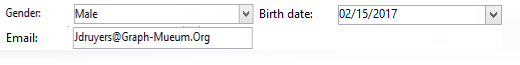

# フォームの構造{#form-structure}

The description of a form is a structured XML document that observes the grammar of the form schema **xtk:form**.

The XML document of the input form must contain the `<form>` root element with the  **name** and  **namespace** attributes to populate the form name and namespace.

```
<form name="form_name" namespace="name_space">
...
</form>
```

デフォルトでは、フォームは同じ名前と名前空間を持つデータスキーマに関連付けられます。 フォームを別の名前に関連付けるには、要素の **entity** -schema属性を `<form>` スキーマキーの名前に設定します。 入力フォームの構造を説明するには、「cus:recipient」のサンプルスキーマを使用したインターフェイスを説明します。

```
<srcSchema name="recipient" namespace="cus">
  <enumeration name="gender" basetype="byte">    
    <value name="unknown" label="Not specified" value="0"/>    
    <value name="male" label="Male" value="1"/>   
    <value name="female" label="Female" value="2"/>   
  </enumeration>

  <element name="recipient">
    <attribute name="email" type="string" length="80" label="Email" desc="E-mail address of recipient"/>
    <attribute name="birthDate" type="datetime" label="Date"/>
    <attribute name="gender" type="byte" label="Gender" enum="gender"/>
  </element>
</srcSchema>
```

サンプルスキーマに基づく入力フォーム：


```
<form name="recipient" namespace="cus">
  <input xpath="@gender"/>
  <input xpath="@birthDate"/>
  <input xpath="@email"/>
</form>
```

編集コントロールの説明は、ルート要素から始 `<form>` まります。 An edit control is entered in an **`<input>`** element with the **xpath** attribute containing the path of the field in its schema.

編集コントロールは、対応するデータタイプに自動的に適応し、スキーマで定義されているラベルを使用します。

>[!NOTE]
>
>要素にlabel属性を追加すると、データスキーマで定義されたラベルをオーバ **ーロードで** き `<input>` ます。\
>`<input label="E-mail address" xpath="@name" />`

デフォルトでは、各フィールドは1行に表示され、データの種類に応じて使用可能なスペースをすべて占有します。

## 書式設定 {#formatting}

コントロールのレイアウトは、HTMLテーブルで使用されるレイアウトのように見えます。コントロールを複数の列に分割したり、要素をインターレースしたり、使用可能な領域の占有を指定したりできます。 ただし、形式設定では領域を縦横比で分割することしかできません。オブジェクトに固定寸法を指定することはできません。

上記の例のコントロールを2列に表示するには：



```
<form name="recipient" namespace="cus">
  <container colcount="2">
    <input xpath="@gender"/>
    <input xpath="@birthDate"/>
    <input xpath="@email"/>
  </container>
</form>
```

colcount属 **`<container>`** 性を持つ要 **素を使用すると** 、2つの列に子コントロールを強制的に表示できます。

コント **ロールの** colspan属性は、値に入力された列数だけコントロールを拡張します。


```
<form name="recipient" namespace="cus">
  <container colcount="2">
    <input xpath="@gender"/>
    <input xpath="@birthDate"/>
    <input xpath="@email" colspan="2"/>
  </container>
</form> 
```

コンテナは **type=&quot;frame&quot;属性に値を入力することで** 、子コントロールの周囲にフレームを追加し、label属性にlabelが含まれて **います** 。


```
<form name="recipient" namespace="cus">
  <container colcount="2" type="frame" label="General">
    <input xpath="@gender"/>
    <input xpath="@birthDate"/>
    <input xpath="@email" colspan="2"/>
  </container>
</form>
```

要素を **`<static>`** 使用して、入力フォームの形式を設定できます。


```
<form name="recipient" namespace="cus">
  <static type="separator" colspan="2" label="General"/>
  <input xpath="@gender"/>
  <input xpath="@birthDate"/>
  <input xpath="@email" colspan="2"/>
  <static type="help" label="General information about recipient with date of birth, gender, and e-mail address." colspan="2"/>
</form>
```

区切り **`<static>`** 文字タイプの **タグで** 、label属性にラベルが含まれる区切り線を追加 **でき** ます。

ヘルプタイプのタグを使用してヘルプテキ `<static>` ストが追加されました。 テキストの内容がlabel属性に入力さ **れます** 。

## コンテナ {#containers}

コンテナを使用すると、一連のコントロールをグループ化できます。要素によって表され **`<container>`** ます。 これらは、複数の列に対するコントロールの書式設定に使用されました。

子コ **ントロー**`<container>` ルのxpath属性を使用すると、子コントロールを簡単に参照できます。 次に、コントロールの参照は親に対する相対パスにな `<container>` ります。

「xpath」を含まないコンテナの例：

```
<container colcount="2">
  <input xpath="location/@zipCode"/>
  <input xpath="location/@city"/>
</container>
```

要素「location」に「xpath」を追加した例を次に示します。

```
<container colcount="2" xpath="location">
  <input xpath="@zipCode"/>
  <input xpath="@city"/>
</container>
```

### コンテナのタイプ {#types-of-container}

コンテナは、ページで形式設定された一連のフィールドを使用して複雑なコントロールを作成するために使用します。

#### タブコンテナ {#tab-container}

タブコンテナは、タブからアクセス可能なページのデータの形式を設定します。


```
<container type="notebook">
  <container colcount="2" label="General">
    <input xpath="@gender"/>
    <input xpath="@birthDate"/>
    <input xpath="@email" colspan="2"/>
  </container>
  <container colcount="2" label="Location">
    ...
  </container>
</container>
```

メインコンテナは、 **type=&quot;notebook&quot;属性で定義します** 。 タブは子コンテナ内で宣言され、タブのラベルはlabel属性から入力さ **れます** 。

>[!NOTE]
>
>**style=&quot;down|up**（デフォルト）**** &quot;機能は、タブラベルを強制的にコントロールの下または上に配置します。 この機能はオプションです。
>
>`<container style="down" type="notebook">  ... </container>`

#### アイコンリスト {#icon-list}

このコンテナには、表示するページを選択できる垂直方向のアイコンバーが表示されます。


```
<container type="iconbox">
  <container colcount="2" label="General" img="xtk:properties.png">
    <input xpath="@gender"/>
    <input xpath="@birthDate"/>
    <input xpath="@email" colspan="2"/>
  </container>
  <container colcount="2" label="Location" img="nms:msgfolder.png">
    ...
  </container>
</container>
```

メインコンテナは、 **type=&quot;iconbox&quot;属性で定義します** 。 アイコンに関連付けられたページは、子コンテナ内で宣言されます。 アイコンのラベルは、label属性から入力さ **れます** 。

ページのアイコンは属性から入力されます。 `img="<image>"``<image>` は、名前と名前空間で構成されるキーに対応する画像の名前です（例：「xtk:properties.png」）。

画像はノードから使用でき **[!UICONTROL Administration > Configuration > Images]** ます。

#### 表示コンテナ {#visibility-container}

動的条件を使用して、一連のコントロールをマスクできます。

次の例は、「性別」フィールドの値に対するコントロールの表示/非表示を示しています。

```
<container type="visibleGroup" visibleIf="@gender=1">
  ...
</container>
<container type="visibleGroup" visibleIf="@gender=2">
  ...
</container>
```

表示コンテナは、attribute **type=&quot;visibleGroup&quot;で定義します**。 visibleIf属 **性には** 、表示条件が含まれます。

条件構文の例：

* **visibleIf=&quot;@email=&#39;peter.martinezATneolane.net&#39;&quot;**:文字列型のデータに対して等価性をテストします。 比較値は引用符で囲む必要があります。
* **visibleIf=&quot;@gender >= 1 and @gender != 2&#39;&#39;**:条件を数値に設定します。
* **visibleIf=&quot;@boolean1==trueまたは@boolean2==false&quot;**:ブール値フィールドをテストします。

#### コンテナの有効化 {#enabling-container}

このコンテナを使用すると、動的条件からの一連のデータを有効または無効にできます。 コントロールを無効にすると、コントロールは編集できなくなります。 次の例は、「性別」フィールドの値からコントロールを有効にする方法を示しています。

```
<container type="enabledGroup" enabledIf="@gender=1">
  ...
</container>
<container type="enabledGroup" enabledIf="@gender=2">
  ...
</container>
```

有効化コンテナは、 **type=&quot;enabledGroup&quot;属性で定義します** 。 enabledIf属性 **には** 、アクティブ化条件が含まれます。

## リンクの編集 {#editing-a-link}

リンクは次のようにデータスキーマで宣言されます。

```
<element label="Company" name="company" target="cus:company" type="link"/>
```

入力フォーム内のリンクの編集制御は次のとおりです。


```
<input xpath="company"/>
```

ターゲットの選択は、編集フィールドからアクセスできます。 入力は先頭の型によって支援され、入力した最初の数文字からターゲット要素を簡単に見つけることができます。 次に、対象のスキーマで定義された **Compute文字列** (Compute string)に基づいて検索が行われます。 コントロールに検証後にスキーマが存在しない場合は、その場でターゲットを作成することを示す確認メッセージが表示されます。 確認によって、ターゲットテーブルに新しいレコードが作成され、リンクに関連付けられます。

コンボボックスを使用して、作成済みのレコードのリストからターゲット要素を選択します。

(フォ **[!UICONTROL Modify the link]** ルダー)アイコンをクリックすると、ターゲットエレメントのリストとフィルターゾーンを含む選択フォームが起動します。


虫めが **[!UICONTROL Edit link]** ねアイコンをクリックすると、リンクされた要素の編集フォームが起動します。 使用されるフォームは、デフォルトでターゲットスキーマのキーに対して推理されます。 form属 **性を使用すると** 、編集フォームの名前(&quot;cus:company2&quot;)。

You can restrict the choice of target elements by adding the **`<sysfilter>`** element from the link definition in the input form:

```
<input xpath="company">
  <sysFilter>
    <condition expr="[location/@city] =  'Newton"/>
  </sysFilter>
</input>
```

要素を使用してリストを並べ替えることもで **`<orderby>`** きます。

```
<input xpath="company">
  <orderBy>
    <node expr="[location/@zipCode]"/>
  </orderBy>
</input>
```

### コントロールのプロパティ {#control-properties}

* **noAutoComplete**:先行入力を無効にします（値が「true」の場合）。
* **createMode**:リンクが存在しない場合は、その場でリンクを作成します。 次のような値を選択できます。

   * **none**:作成を無効にします。 リンクが存在しない場合は、エラーメッセージが表示されます
   * **inline**:編集フィールドにコンテンツを含むリンクを作成します
   * **edition**:リンク上に編集フォームを表示します。 フォームを検証すると、データが保存されます（デフォルトモード）

* **noZoom**:リンク上の編集フォームがない（値が「true」の場合）
* **form**:ターゲット要素の編集フォームをオーバーロードします。

## リンクのリスト {#list-of-links}

データスキーマにコレクション要素として入力されたリンク(unbound=&quot;true&quot;)は、リストを通じて、それに関連付けられたすべての要素を表示する必要があります。

プリンシパルは、データの読み込みが最適化されたリンクされた要素のリストの表示（データバッチによるダウンロード、リストが表示されている場合のみのリストの実行）で構成されます。

スキーマ内のコレクションリンクの例：

```
<element label="Events" name="rcpEvent" target="cus:event" type="link" unbound="true">
...
</element>
```

入力フォーム内のリスト：


```
 <input xpath="rcpEvent" type="linklist">
  <input xpath="@label"/>
  <input xpath="@date"/>
</input>
```

リストコントロールは **type=&quot;linklist&quot;属性で定義され** ます。 リストパスは、コレクションリンクを参照する必要があります。

The columns are declared via the **`<input>`** elements of the list. xpath属 **性は** 、ターゲットスキーマのフィールドのパスを参照します。

（スキーマ内のリンクで定義された）ラベルを持つツールバーは、自動的にリストの上に配置されます。

このリストは、ボタンを使用してフィルタリング **[!UICONTROL Filters]** し、列を追加および並べ替えるように設定することができます。

およびボ **[!UICONTROL Add]** タンを使 **[!UICONTROL Delete]** 用して、リンク上のコレクション要素を追加および削除できます。 デフォルトでは、要素を追加すると、ターゲットスキーマの編集フォームが起動します。

このボ **[!UICONTROL Detail]** タンは、リストのタグで **zoom=&quot;true&quot;** 属性が完了すると、自動的に **`<input>`** 追加されます。選択した行の編集フォームを起動できます。

フィルタリングと並べ替えは、リストの読み込み中に適用できます。

```
 <input xpath="rcpEvent" type="linklist">
  <input xpath="@label"/>
  <input xpath="@date"/>
  <sysFilter>
    <condition expr="@type = 1"/>
  </sysFilter>
  <orderBy>
    <node expr="@date" sortDesc="true"/>
  </orderBy>
</input>
```

### 関係テーブル {#relationship-table}

関係テーブルを使用すると、2つのテーブルをN-N基数とリンクできます。 関係テーブルには、2つのテーブルへのリンクのみが含まれます。

したがって、リストに要素を追加すると、関係テーブル内の2つのリンクのうち1つからリストを完成できます。

スキーマ内の関係テーブルの例：

```
<srcSchema name="subscription" namespace="cus">
  <element name="recipient" type="link" target="cus:recipient" label="Recipient"/>
  <element name="service" type="link" target="cus:service" label="Subscription service"/>
</srcSchema>
```

この例では、「cus:recipient」スキーマの入力フォームから始めます。 このリストには、サービスへの購読との関連付けが表示され、既存のサービスを選択して購読を追加できる必要があります。


```
<input type="linklist" xpath="subscription" xpathChoiceTarget="service" xpathEditTarget="service" zoom="true">
  <input xpath="recipient"/>
  <input xpath="service"/>
</input>
```

xpathChoiceTarget属 **性を使用すると** 、入力したリンクから選択フォームを起動できます。 関係テーブルレコードを作成すると、現在の受信者と選択したサービスへのリンクが自動的に更新されます。

>[!NOTE]
>
>xpathEditTarget属 **性を使用すると** 、入力したリンク上で選択した行を強制的に編集できます。

### Listプロパティ {#list-properties}

* **noToolbar**:ツールバーを非表示（値「true」）
* **toolbarCaption**:ツールバーのラベルをオーバーロード
* **toolbarAlign**:ツールバーの垂直または水平ジオメトリを修正します（以下の値を指定できます）。&quot;垂直&quot;|&quot;水平&quot;
* **img**:リストに関連付けられた画像を表示します
* **form**:ターゲット要素の編集フォームをオーバーロードします。
* **zoom**:ターゲットの要 **[!UICONTROL Zoom]** 素を編集するボタンを追加します。
* **xpathEditTarget**:入力したリンクの編集を設定
* **xpathChoiceTarget**:さらに、入力したリンク上の選択フォームを起動します。

## メモリリストコントロール {#memory-list-controls}

メモリリストを使用すると、リストデータのプリロードを使用してコレクション要素を編集できます。 このリストはフィルターまたは構成できません。

これらのリストは、XMLでマッピングされたコレクション要素またはボリュームの少ないリンクで使用されます。

### 列リスト {#column-list}

このコントロールは、「追加」ボタンと「削除」ボタンを含むツールバー付きの編集可能な列リストを表示しています。


```
<input xpath="rcpEvent" type="list">
  <input xpath="@label"/>
  <input xpath="@date"/>
</input>
```

リストコントロールは、**type=&quot;list&quot;** 属性を使用して設定する必要があります。リストのパスは、コレクション要素を参照する必要があります。

The columns are declared in the child **`<input>`** tags of the list. 列のラベルとサイズは、label属性とcolSize属性を使用し **て** 、強制的 **に指定できます** 。

>[!NOTE]
>
>並べ替え順序の矢印は、ordered=&quot; **true&quot;属性がデータスキーマのコレクション要素** に追加されると自動的に追加されます。

ツールバーボタンは、水平方向に整列できます。


```
<input nolabel="true" toolbarCaption="List of events" type="list" xpath="rcpEvent" zoom="true">
  <input xpath="@label"/>
  <input xpath="@date"/>
</input>
```

The **toolbarCaption** attribute forces the horizontal alignment of the toolbar and enters the title above the list.

#### リストの詳細表示 {#zoom-in-a-list}

リスト内のデータの挿入と編集は、別の編集フォームに入力できます。


```
<input nolabel="true" toolbarCaption="List of events" type="list" xpath="rcpEvent" zoom="true" zoomOnAdd="true">
  <input xpath="@label"/>
  <input xpath="@date"/>

  <form colcount="2" label="Event">
    <input xpath="@label"/>
    <input xpath="@date"/>
  </form>
</input>
```

編集フォームは、リスト定義の下の要素か `<form>` ら入力されます。 構造は入力フォームの構造と同じです。 このボ **[!UICONTROL Detail]** タンは、リストのタグで **zoom=&quot;true&quot;** 属性が完了すると自動的に **`<input>`** 追加されます。 この属性を使用すると、選択した行の編集フォームを起動できます。

>[!NOTE]
>
>zoomOnAdd=&quot;true&quot; **属性を追加すると** 、リスト要素が挿入されたときに編集フォームが強制的に呼び出されます。

### Listプロパティ {#list-properties-1}

* **noToolbar**:ツールバーを非表示（値「true」）
* **toolbarCaption**:ツールバーのラベルをオーバーロード
* **toolbarAlign**:ツールバーの位置を変更します(可能な値：&quot;垂直&quot;|&quot;水平&quot;
* **img**:リストに関連付けられた画像を表示します
* **form**:ターゲット要素の編集フォームをオーバーロードします。
* **zoom**:ターゲットの要 **[!UICONTROL Zoom]** 素を編集するボタンを追加します。
* **zoomOnAdd**:追加時に編集フォームを起動
* **xpathChoiceTarget**:さらに、入力したリンク上の選択フォームを起動します。

## 編集不可能なフィールド {#non-editable-fields}

フィールドを表示し、編集されないようにするには、タグを使用す **`<value>`** るか、タグのreadOnly=&quot; **true&quot;** 属性を設定し **`<input>`** ます。

「性別」フィールドの例：


```
<value value="@gender"/>
<input xpath="@gender" readOnly="true"/>
```

## ラジオボタン {#radio-button}

ラジオボタンを使用すると、複数のオプションから選択できます。 タグを **`<input>`** 使用して、選択肢のリストが表示されます。 **checkedValue属性では、選択肢に関連付けられた値を指定します** 。

「性別」フィールドの例：

```
<input type="RadioButton" xpath="@gender" checkedValue="0" label="Choice 1"/>
<input type="RadioButton" xpath="@gender" checkedValue="1" label="Choice 2"/>
<input type="RadioButton" xpath="@gender" checkedValue="2" label="Choice 3"/>
```


## チェックボックス {#checkbox}

チェックボックスはブール値の状態を反映します（選択されているかどうか）。 デフォルトでは、このコントロールは「ブール値」(true/false)フィールドで使用されます。 デフォルト値の0または1を持つ変数をこのボタンに関連付けることができます。 この値は、 **checkValue属性を使用してオーバーロードで** きます。

```
<input xpath="@boolean1"/>
<input xpath="@field1" type="checkbox" checkedValue="Y"/>
```


## ナビゲーション階層の編集 {#navigation-hierarchy-edit}

このコントロールは、編集する一連のフィールドにツリーを構築します。

編集するコントロールは、ツリーコントロールのタ **`<container>`** グの下に入力さ **`<input>`** れたコントロールにグループ化されます。

```
<input nolabel="true" type="treeEdit">
  <container label="Text fields">
    <input xpath="@text1"/>
    <input xpath="@text2"/>
  </container>
  <container label="Boolean fields">
    <input xpath="@boolean1"/>
    <input xpath="@boolean2"/>
  </container>
</input>
```


## 式フィールド {#expression-field}

式フィールドは、式から動的にフィールドを更新します。タグを **`<input>`** xpath属性と共に使用し **て** 、更新するフィールドのパスと、更新式を含む **** expr属性を入力します。

```
<!-- Example: updating the boolean1 field from the value contained in the field with path /tmp/@flag -->
<input expr="Iif([/tmp/@flag]=='On', true, false)" type="expr" xpath="@boolean1"/>
<input expr="[/ignored/@action] == 'FCP'" type="expr" xpath="@launchFCP"/>
```

## フォームのコンテキスト {#context-of-forms}

入力フォームを実行すると、編集中のエンティティのデータを含むXMLドキュメントが初期化されます。 このドキュメントはフォームのコンテキストを表し、ワークスペースとして使用できます。

### コンテキストの更新 {#updating-the-context}

フォームのコンテキストを変更するには、タグを使用します。 **`<set expr="<value>" xpath="<field>"/>`** ここで、 **`<field>`** は宛先フィールド、は **`<value>`** 更新式または値です。

タグの使用例を次に示 **`<set>`** します。

* **`<set expr="'Test'" xpath="/tmp/@test" />`**:一時的な場所/tmp/@test1に「Test」値を配置します。
* **`<set expr="'Test'" xpath="@lastName" />`**:「lastName」属性のエンティティを「Test」値で更新します
* **`<set expr="true" xpath="@boolean1" />`**:「boolean1」フィールドの値を「true」に設定します。
* **`<set expr="@lastName" xpath="/tmp/@test" />`**:「lastName」属性の内容に対する更新

タグとタグを使用してフォームを初期化および閉じる際に、フォームのコンテキストを更 **`<enter>`** 新でき **`<leave>`** ます。

```
<form name="recipient" namespace="cus">
  <enter>
    <set...
  </enter>
  ...
  <leave>
    <set...
  </leave>
</form>
```

>[!NOTE]
>
>タグ `<enter>` とタ `<leave>` グは、ページの `<container>` タイプ（「notebook」と「iconbox」）で使用できます。

### 式の言語 {#expression-language-}

マクロ言語をフォーム定義で使用して、条件付きテストを実行できます。

式が検 **`<if expr="<expression>" />`** 証されると、タグで指定された命令が実行されます。

```
<if expr="([/tmp/@test] == 'Test' or @lastName != 'Doe') and @boolean2 == true">
  <set xpath="@boolean1" expr="true"/>
</if>
```

タグと **`<check expr="<condition>" />`** 組み合わせると、 **`<error>`** フォームの検証が行われなくなり、条件が満たされない場合にエラーメッセージが表示されます。

```
<leave>
  <check expr="/tmp/@test != ''">
    <error>You must populate the 'Test' field!</error> 
  </check>
</leave>
```

## ウィザード {#wizards}

ウィザードに従って、一連のデータ入力手順がページ形式で表示されます。 入力したデータは、フォームを検証する際に保存されます。

ウィザードの構造は次のとおりです。

```
<form type="wizard" name="example" namespace="cus" img="nms:rcpgroup32.png" label="Wizard example" entity-schema="nms:recipient">
  <container title="Title of page 1" desc="Long description of page 1">
    <input xpath="@lastName"/>
    <input xpath="comment"/>
  </container>
  <container title="Title of page 2" desc="Long description of page 2">
    ...
  </container>
  ...
</form>
```


要素に **type=&quot;wizard&quot;属性があると、フォームの構**`<form>` 築時にウィザードモードを定義できます。 ページは、要素の子で `<container>` ある要素から完成し `<form>` ます。 ペー `<container>` ジの要素にtitleとdescのtitle属性が設定され、ページタイトルの下に説明が表示されます。 ページ間 **[!UICONTROL Previous]** を移動で **[!UICONTROL Next]** きるように、ボタンとボタンが自動的に追加されます。

入力し **[!UICONTROL Finish]** たデータがボタンに保存され、フォームが閉じます。

### SOAP メソッド {#soap-methods}

SOAPメソッドの実行は、ページの最後に配置さ **`<leave>`** れたタグから開始できます。

このタ **`<soapcall>`** グには、次の入力パラメーターを持つメソッドの呼び出しが含まれます。

```
<soapCall name="<name>" service="<schema>">
  <param type="<type>" exprIn="<xpath>"/>  
  ...
</soapCall>
```

サービスの名前とその実装スキーマは、タグの名前と **サー** ビス **属性を使** 用して入 **`<soapcall>`** 力します。

入力パラメーターは、タグの下のエ **`<param>`** レメントに記述さ **`<soapcall>`** れます。

パラメータータイプは **type属性で指定する必要があ** ります。 使用できるタイプは次のとおりです。

* **string**:文字列
* **boolean**:ブール値
* **byte**:8ビット整数
* **short**:16ビット整数
* **long**:32ビット整数
* **short**:16ビット整数
* **double**:倍精度浮動小数点数
* **DOMElement**:要素型ノード

exprIn属 **性は** 、パラメーターとして渡すデータの場所を指定します。

**例**：

```
<leave>
  <soapCall name="RegisterGroup" service="nms:recipient">         
    <param type="DOMElement" exprIn="/tmp/entityList"/>         
    <param type="DOMElement" exprIn="/tmp/choiceList"/>         
    <param type="boolean"    exprIn="true"/>       
  </soapCall>
</leave>
```

