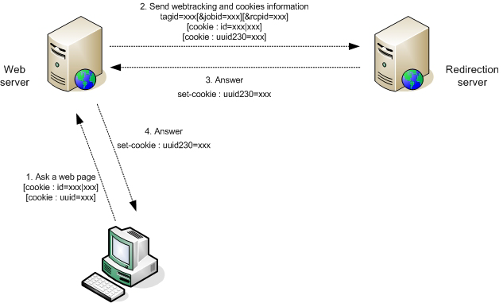

# Web トラッキングタグをサイトに挿入する{#inserting-tags-in-your-site}

## シンプルな方法 {#simple-method}

このメソッドは、トラッキングするweb ページのHTML ソースコードに&#x200B;**``** HTML タグを挿入して、リダイレクトサーバーにHTTP呼び出しを送信することで構成されます。

>[!IMPORTANT]
>
>この方法は、web ブラウザーから送信されたCookieを使用して受信者を識別するもので、100%信頼できるものではありません。

**例**：

```

  <...>
  <body>
  <script>
      document.write("");
    </script>
    <noscript>
     
    </noscript>
    <h1>My site</h1>
    <form action="http://localhost/amount.md">
      Quantity: <input type="text" name="quantity"/><br/><br/>
      Amount: <input type="text" name="amount"/><br/><br/>
      <input value="Save" type="submit">
    </form>
  </body>
</html>
```

確認ページ（「amount.md」）にトランザクション型のweb トラッキングタグを挿入します。

```
<html>
  <body>
    <script>
      function getURLparam(name) 
      {
        var m = location.search.match new RegExp("[?&]" + name + "=([^&]+)"));
        return m ? unescape(m[1]) : "";
      }
 
       var params = "https://localhost/r/" + Math.random().toString() + "?tagid=amount&amount="
                      +getURLparam("amount")+"&article="+getURLparam("quantity");
       document.write("");
    </script>

    <h1>Approval confirmation</h1>
  </body>
</html>
```

### Web トラッキングタグの動的な生成 {#dynamic-generation-of-web-tracking-tags}

web ページが動的に生成される場合、ページ生成時にweb トラッキングタグを追加できます。

**例**: Web トラッキングがJSPに追加されました。

```
<%@page import="java.util.Random" %>
<html>
  <body>
    ?tagid=home'>
    <h1>My site</h1>
    <form action="https://localhost/amount.md">
      Quantity: <input type="text" name="quantity"/><br/><br/>
      Amount: <input type="text" name="amount"/><br/><br/>
      <input value="Save" type="submit">
    </form>
  </body>
</html>
```

```
<%@page import="java.util.Random" %>
<html>
  <body>
    <%  
      String strParams = new Random().nextInt() + "?tagid=amount";
      strParams += "&amount="+request.getParameter("amount");
      strParams += "&article="+request.getParameter("quantity");
    %>
    '>
    <h1>Approval confirmation</h1>
    </body>
</html>
```

## Optimum メソッド {#optimum-method-}

リダイレクションサーバーに送信される情報を制御する場合、最も信頼できる方法は、ページ生成言語を使用してHTTP クエリを自分自身で同期して実行することです。

作成するURLは、[Web トラッキングタグ：定義](../../configuration/using/web-tracking-tag-definition.md)で定義された構文ルールに従う必要があります。



>[!NOTE]
>
>リダイレクトとweb トラッキングはCookieを使用するため、同期HTTP呼び出しを実行するweb サーバーは、リダイレクトサーバーと同じドメイン内に配置することが重要です。 様々なHTTP交換は、「id」、「uuid」、「uuid230」のCookieを伝える必要があります。

**例**：受信者がアカウント番号を使用して認証するJavaでの動的な生成。

```
[...]
  // Recipient account, amount and articles
  String strAccount = request.getParameter("account");
  String strAmount = request.getParameter("amount");
  String strArticle = request.getParameter("article");

  StringBuffer strCookies = new StringBuffer();
  String strSetCookie = null;

  // Get cookies from client request
  Cookie[] cookies = request.getCookies();
  for(int i=0; i< cookies.length; i++ )
  {
    Cookie c = cookies[i];
    String strName = c.getName();
    if( strName.equals("id") || strName.equals("uuid") || strName.equals("uuid230") )
      // Helper function to add cookies in string
      AddCookie(strCookies, c);
  }
  // Now perform a synchronous HTTP request to inform redirection server
  // Add a tagid in auto-discover mode, and a default jobId to use (in hexa)
  StringBuffer strURL = new StringBuffer("https://www.adobe.com/r/a?tagid=cmd_page%7Ct&jobid=27EE");
  if( strAccount != null )
    AddParameter(strURL, "rcpid", "saccount="+strAccount);
  if( strAmount != null )
    AddParameter(strURL, "amount", strAmount);
  if( strArticle != null )
    AddParameter(strURL, "article", strArticle);
  
  URL url = new URL(strURL.toString());
  HttpURLConnection connection = (HttpURLConnection)url.openConnection();
  // Add the client cookies
  if( strCookies.length() > 0 )
    connection.setRequestProperty("Cookie", strCookies.toString());

  int errcode = connection.getResponseCode();

  // Now add the Adobe Campaign cookies if the server returned one :
  if( errcode == 200 )
  {
    strSetCookie = connection.getHeaderField("Set-Cookie");
    if( strSetCookie != null && strSetCookie.length() > 0 )
      response.addHeader("Set-Cookie", strSetCookie);
  }
  [...]
```
