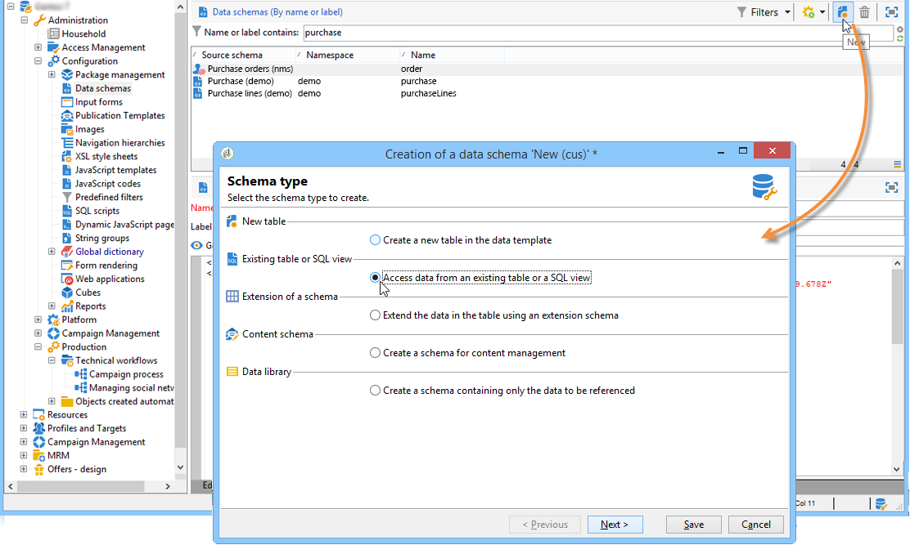

# 既存のテーブルのスキーマ{#schema-of-an-existing-table}

## 概要 {#overview}

アプリケーションが既存の表、SQLビューまたはリモートデータベースのデータにアクセスする必要がある場合は、次のデータを含むスキーマをAdobe Campaignで作成します。

* テーブル名：「sqltable」属性を使用して、テーブルの名前（DBリンクを使用する場合は別名）を入力します。
* スキーマキー：調整フィールドを参照する場合、
* インデックス：クエリーを生成するために使用され、
* XML構造内のフィールドとその場所：アプリで使用するフィールドにのみ入力し、
* リンク：ベースの他のテーブルとの結合がある場合。

## 実装 {#implementation}

対応するスキーマを作成するには、次のステージを適用します。

1. Adobe Campaignツリー **[!UICONTROL Administration>Configuration>Data schemas]** のノードを編集し、をクリックしま **[!UICONTROL New]** す。
1. オプションを選 **[!UICONTROL Access data from an existing table or an SQL view]** 択し、をクリックしま **[!UICONTROL Next]** す。

   

1. テーブルまたは既存のビューを選択します。

   

1. ニーズに合わせてスキーマのコンテンツを調整します。

   

   テーブル作成SQLスクリプトを生成しないように、スキーマに `<srcSchema>` root要素のview=&quot;true&quot;属性を設定する必要があります。

**例**：

```
<srcSchema name="recipient" namespace="cus" view="true">
  <element name="recipient" sqltable="dbsrv.recipient">
    <key name="email">
      <keyfield xpath="@email"/>
    </key>   
    <attribute name="email" type="string" length="80" sqlname="email"/>
  </element>
</srcSchema>
```

## 外部データベースへのアクセス {#accessing-an-external-database}

「 **Federated Data Access - FDA** 」オプションを使用すると、外部データベースに保存されているデータにアクセスできます。

外部データベースのデータにアクセスするためにスキーマに対して実行する設定については、このページで [詳しく説明しま](../../platform/using/accessing-an-external-database.md#creating-the-data-schema)す。
