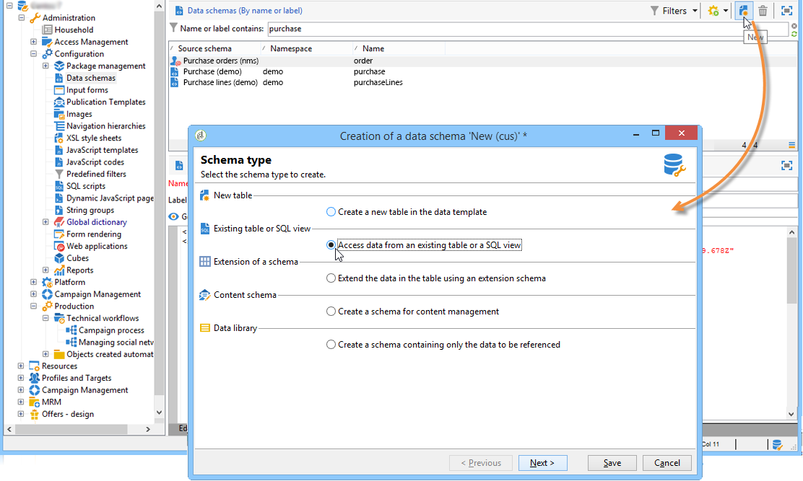

# 既存のテーブルのスキーマ{#schema-of-an-existing-table}

## 概要 {#overview}

アプリケーションが既存のテーブル、SQL ビュー、またはリモートデータベースからのデータにアクセスする必要がある場合は、次のデータを使用してAdobe Campaignでスキーマを作成します。

* テーブルの名前：&quot;sqltable&quot;属性を持つテーブルの名前（dblinkを使用する場合はエイリアスを含む）を入力します。
* スキーマキー：紐付けフィールドを参照し、
* インデックス：クエリの生成に使用されます。
* XML構造内のフィールドとその場所：アプリケーションで使用されるフィールドのみを入力し、
* リンク：ベースの他のテーブルとの結合がある場合。

## 実装 {#implementation}

対応するスキーマを作成するには、次のステージを適用します。

1. Adobe Campaign ツリーの&#x200B;**[!UICONTROL 管理>設定> データスキーマ]** ノードを編集し、**[!UICONTROL 新規]**&#x200B;をクリックします。
1. 既存のテーブルまたはSQL ビュー&#x200B;**オプションから** データにアクセスを選択し、「**[!UICONTROL 次へ]**」をクリックします。

   

1. テーブルまたは既存のビューを選択します。

   

1. ニーズに合わせてスキーマコンテンツを適応させます。

   

   テーブル作成SQL スクリプトを生成しないように、スキーマに`<srcSchema>` ルート要素のview=&quot;true&quot;属性を入力する必要があります。

**例** :

```
<srcSchema name="recipient" namespace="cus" view="true">
  <element name="recipient" sqltable="dbsrv.recipient">
    <key name="email">
      <keyfield xpath="@email"/>
    </key>   
    <attribute name="email" type="string" length="80" sqlname="email"/>
  </element>
</srcSchema>
```

## 外部データベースへのアクセス {#accessing-an-external-database}

**Federated Data Access - FDA** オプションを使用すると、外部データベースに保存されているデータにアクセスできます。

外部データベースのデータにアクセスするためにスキーマで実行する設定については、[このページ &#x200B;](../../installation/using/creating-data-schema.md)で詳しく説明しています。
