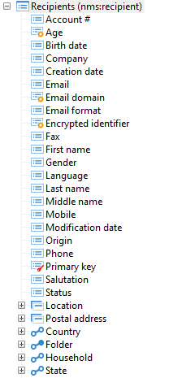

# データスキーマの構造{#structure-of-a-data-schema}

データスキーマの構造は、ツリー構造の形式で表示されます。 Adobe Campaign クライアントコンソールでグラフィカルに表示するには、ターゲットスキーマを選択し、**[!UICONTROL 構造]** サブタブをクリックします。

標準として、フィールドが最初に表示されます（アクティブ、アクティブなど）。 アルファベット順です。 構造化要素は次に来ます（郵送先住所、場所）、そして最後にリンク（電子メール情報、フォルダーなど）。

プライマリキーは赤いキーで識別され、外部キーは黄色いキーで識別されます。

リンクは、テーブルに属しているかどうかに応じてグラフィカルに区別されます。 テーブルから始まるもの、つまりテーブル内に外部キーを持つもの（メール情報、フォルダー、国）が最初に表示されます。 「逆」収集リンク（サブスクリプション、注文など） 最後に表示されます。
