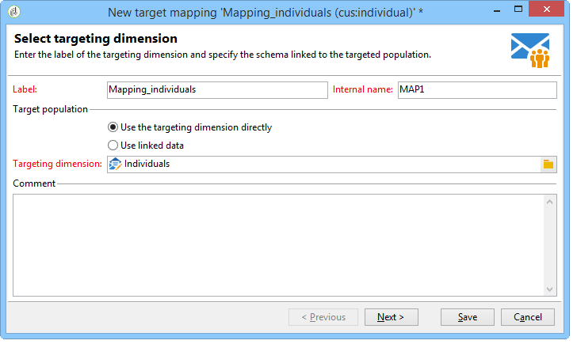
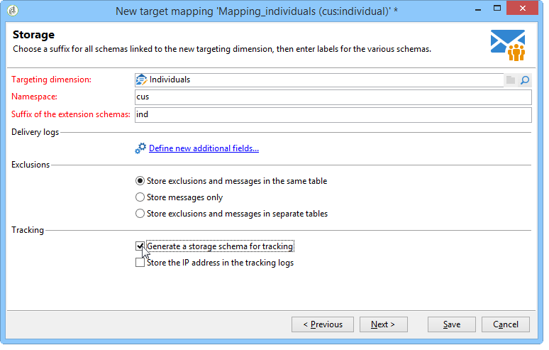
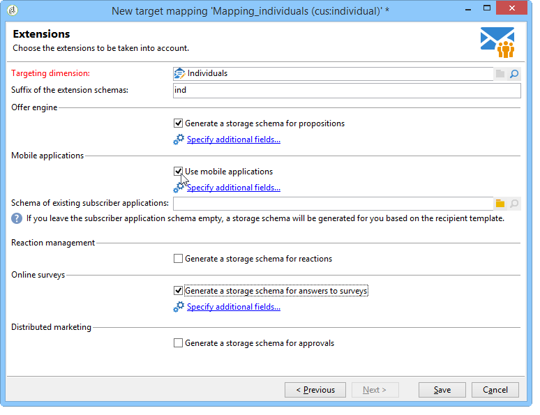
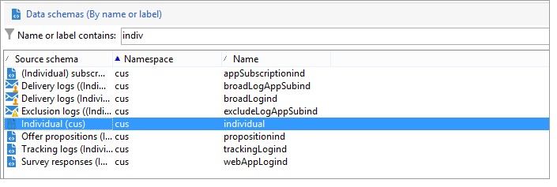

# ターゲットマッピング{#target-mapping}

ターゲットマッピングの作成は、次の2つの場合に必要です。

* Adobe Campaignが提供する以外の受信者テーブルを使用する場合，
* ターゲットマッピング画面の標準ターゲティングディメンションとは異なるフィルタリングディメンションを設定する場合。

ターゲットマッピング作成アシスタントは、カスタムテーブルの使用に必要なすべてのスキーマの作成に役立ちます。

## カスタムテーブルにリンクされたスキーマの作成と設定 {#creating-and-configuring-schemas-linked-to-the-custom-table}

ターゲットマッピングを作成する前に、Adobe Campaignで新しい受信者データスキーマを使用するには、いくつかの設定が必要です。

それには、次の手順に従います。

1. 使用するカスタムテーブルのフィールドを統合する新しいデータスキーマを作成します。

   詳しくは、[&#x200B; スキーマリファレンス （xtk:srcSchema） &#x200B;](../../configuration/using/about-schema-reference.md)を参照してください。

   この例では、顧客スキーマ、ID、名、姓、メールアドレス、携帯電話番号のフィールドを含む非常にシンプルなテーブルを作成します。 目的は、このテーブルに保存されている個人に電子メールまたはSMS アラートを送信できるようにすることです。

   スキーマの例（cus:individual）

   ```
   <srcSchema name="individual" namespace="cus" label="Individuals">
     <element name="individual">
       <key name="id" internal="true">
         <keyfield xpath="@id"/>
       </key>
       <attribute name="id" type="long" length="32"/>
       <attribute name="lastName" type="string" length="100"/>
       <attribute name="firstName" type="string" length="100"/>
       <attribute name="email" type="string" length="100"/>
       <attribute name="mobile" type="string" length="100"/>
     </element>
   </srcSchema>
   ```

1. =&quot;true&quot;属性を使用して、スキーマを外部ビューとして宣言します。 [&#x200B; ビュー属性](../../configuration/using/schema-characteristics.md#the-view-attribute)を参照してください。

   ```
    <srcSchema desc="External recipient table" namespace="cus" view="true"....>
      ...
    </srcSchema>
   ```

1. ダイレクトメールアドレスを追加する必要がある場合は、次のタイプの構造を使用してください。

   ```
   <element advanced="true" name="postalAddress" template="nms:common:postalAddress">
        <attribute expr="SubString(JuxtWords(Smart([../infos/@firstname]), Upper([../infos/@name])), 1, 80)"
                   name="line1"/>
        <attribute expr="Upper([../address/@line2])" name="line2"/>
        <attribute expr="Upper([../address/@line])" name="line3"/>
        <attribute expr="Upper([../address/@line])" name="line4"/>
        <attribute expr="Upper([../address/@line])" name="line5"/>
        <attribute expr="Upper([../address/@line])" name="line6"/>
        <attribute _operation="delete" name="line7"/>
        <attribute _operation="delete" name="addrErrorCount"/>
        <attribute _operation="delete" name="addrQuality"/>
        <attribute _operation="delete" name="addrLastCheck"/>
        <element expr="@line1+'n'+@line2+'n'+@line3+'n'+@line4+'n'+@line5+'n'+@line6"
                 name="serialized"/>
        <attribute expr="AllNonNull2([../address/@line], [../infos/@name])" name="addrDefined"/>
      </element>
   ```

1. **[!UICONTROL 管理/ キャンペーン管理/ ターゲットマッピング]** ノードをクリックします。
1. 「**新規**」ボタンをクリックして、ターゲットマッピング作成アシスタントを開きます。
1. **ラベル** フィールドを入力し、**ターゲティングディメンション** フィールドで作成したスキーマを選択します。

   

1. **アドレスフォームを編集** ウィンドウで、様々な配信アドレスに一致するスキーマのフィールドを選択します。 ここでは、**@email**&#x200B;と&#x200B;**@mobile**&#x200B;のフィールドをマッピングできます。

   

1. 次の&#x200B;**ストレージ** ウィンドウで、拡張機能スキーマ **の** サフィックス フィールドを入力して、新しいスキーマをAdobe Campaignが提供する標準スキーマと区別します。

   「**[!UICONTROL 新しい追加フィールドを定義]**」をクリックして、配信でターゲットにするディメンションを選択します。

   デフォルトでは、除外の管理はメッセージと同じテーブルに保存されます。

   ターゲットマッピングにリンクされたトラッキング用にストレージを設定する場合は、「**トラッキング用にストレージスキーマを生成**」ボックスをオンにします。

   

   >[!IMPORTANT]
   >
   >Adobe Campaignでは、同じブロードログやトラッキングログスキーマにリンクされた、ターゲティングスキーマと呼ばれる複数の受信者スキーマはサポートされていません。 そうしなければ、その後のデータ調整に異常が生じる可能性があります。 詳しくは、[推奨事項と制限事項](../../configuration/using/about-custom-recipient-table.md) ページを参照してください。

1. **Extensions** ウィンドウで、生成するオプションのスキーマを選択します（使用可能なスキーマのリストは、Adobe Campaign プラットフォームにインストールされているモジュールによって異なります）。

   

1. 「**保存**」ボタンをクリックして、アシスタントを閉じます。

   アシスタントは開始スキーマを使用して、新しいターゲットマッピングを機能させるために必要なその他すべてのスキーマを作成します。

   

## ターゲットマッピングの使用 {#using-target-mapping}

配信のターゲットとして新しいスキーマを使用するには、次の2つの方法があります。

* マッピングに基づいて1つ以上の配信テンプレートを作成
* 次に示すように、配信の作成時にターゲットの選択中に直接マッピングを選択します。


