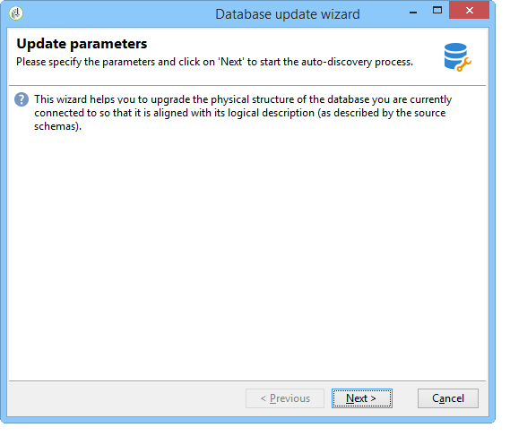

# データベース構造の更新{#updating-the-database-structure}

スキーマに対して行われた変更を適用するには、データベース更新ウィザードを起動します。 このウィザードには、を使用してアクセスできま **[!UICONTROL Tools > Advanced > Update database structure]** す。 データベースの物理構造が論理記述と一致するかどうかを確認し、SQL更新スクリプトを実行します。

データベース内のモジュールが自動的に入力され、アクティブ化されます。

とのオ **[!UICONTROL Add stored procedures]** プシ **[!UICONTROL Import initialization data]** ョンを使用して、初期SQLスクリプトと、データベースの作成時に実行されるデータパッケージを起動します。

外部データパッケージからデータのセットを読み込むことができます。 これを行うには、パッケージ **[!UICONTROL Import a package]** のXMLファイルを選択して入力します。

次の手順に従って、データベース更新SQLスクリプトを表示します。

>[!NOTE]
>
>これは編集フィールドにあり、SQLコードを削除または追加するために変更できます。

次に、データベースの更新を起動します。

