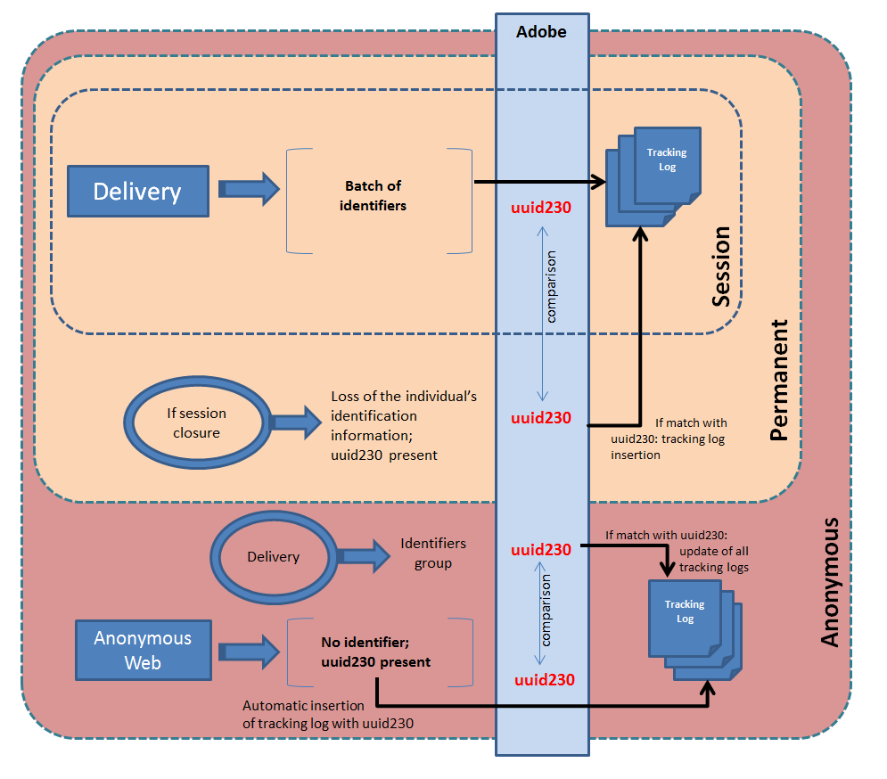

# Web トラッキングモード{#web-tracking-mode}


Adobe Campaignでは、アプリケーションでのトラッキングログの処理方法を定義するweb トラッキングモードを選択できます。

使用可能なWeb トラッキングモードは3つあります。**「セッショントラッキング」**、**「永続的トラッキング」**&#x200B;および&#x200B;**「匿名トラッキング」**。


各モードには特定の特性があります。 「永続的」 Web トラッキングモードには「セッション」 Web トラッキングモードの特性が含まれ、「匿名」モードには「永続的」モードと「セッション」モードの特性が含まれます。

>[!IMPORTANT]
>
>「リード」パッケージが有効になっている場合、「匿名」 Web トラッキングモードはデフォルトで有効になります。 それ以外の場合は、デフォルトで「セッション」 Web トラッキングモードが有効になっています。
>
>インスタンスのデプロイメントウィザードでは、いつでもデフォルトモードを変更できます。

**permanent web**&#x200B;または&#x200B;**匿名**&#x200B;のトラッキングモードを使用している場合は、トラッキングテーブル（trackingLogXXX）の「sourceID」列（uuid230）にインデックスを追加する必要があります。

1. 永続的なトラッキングの対象となるトラッキングテーブルを特定します。
1. 次の行を追加して、これらのテーブルに一致するスキーマを拡張します。

```
<dbindex name="sourceId">
 <keyfield xpath="@sourceId"/>
</dbindex>
```

**Permanent**&#x200B;および&#x200B;**匿名** Web トラッキングモードには、**強制配信**&#x200B;と&#x200B;**最終配信**&#x200B;の2つのオプションが含まれます。

**強制配信** オプションを使用すると、トラッキング中に配信（@jobid）の識別子を指定できます。

「**最終配信**」オプションを使用すると、現在のトラッキングログを最後にトラッキングされた配信にリンクできます。

**セッション Web トラッキングの特性：**

このモードは、セッション Cookieを持つユーザーのトラッキングログを作成します。 Adobe Campaignから送信されたメール内のURLをクリックしたユーザーは、以下の情報を追跡できます。

* 配信 ID
* 連絡先ID
* 配信ログ
* 永続的なCookie （uuid230）
* トラッキング URL
* トラッキングログの日付

このWeb トラッキングモードでは、情報の一部が欠落している場合、アプリケーションにトラッキングログは作成されません。

このモードは、ボリューム（trackingLog テーブル内のレコードの数が限られている）と計算（紐付けなし）で経済的です。

**永続的なWeb トラッキング モードの特性：**

このWeb トラッキングモードでは、永続的なuuid230 Cookieの存在に基づいてトラッキングログを作成できます。 訪問者がセッションを閉じると、Adobe Campaignは永続的なCookieを使用して、以前のトラッキングログから情報を復元します。 現在のセッションのuuid230が、トラッキングテーブルにすでに保存されているuuid230と同じ値を持つ場合、Adobe Campaignはトラッキングログを再挿入します。

つまり、uuid230値に関する紐付けを有効にするには、以前にAdobe Campaignで（配信経由で）訪問者を特定する必要があります。

デフォルトでは、以前のトラッキングログの検索は「trackingLog」テーブルで実行されます。 リードパッケージが有効になっている場合、「trackingLog」テーブルを検索する前に、Adobe Campaignは「incomingLead」テーブルで以前のトラッキングログレコードを検索します。

このモードは、ログ調整中の計算に関してコストがかかります。

**匿名Web トラッキングモードの特性：**

このWeb トラッキングモードを使用すると、Adobe Campaignで匿名ブラウジングにリンクされたトラッキングログを取得できます。 トラッキング対象URLをクリックするたびに、トラッキングログが自動的に作成されます。 このログの値はuuid230のみです。 マーケティング施策では、すべての識別情報を含むトラッキングログが自動的に作成されます（セッションのトラッキングを参照）。 Adobe Campaignは、このマーケティングキャンペーンのトラッキングログの値と同じ「uuid230」値を以前のログで自動的に検索します。 同じ値が見つかった場合、以前のすべてのトラッキングログには、マーケティングキャンペーントラッキングログのすべての情報が入力されます。

このモードは、計算とボリュームの点で最もコストがかかります。

>[!NOTE]
>
>**[!UICONTROL リード]** パッケージがインストールされている場合は、アクティビティテーブル （**crm:incomingLead**）にも同じことを行う必要があります

次のスキーマは、3つのWeb トラッキングモードすべての機能の合計です。



**最後の配信に基づく永続的なweb トラッキングの例：**

Florenceは配信を受け取り、メールを開き、リンクをクリックし、小売サイトを閲覧しましたが、購入はしませんでした。 翌日、Florenceは小売サイトに戻り、閲覧して購入します。 永続的なweb トラッキング（最終配信）が有効になっているので、2回目の訪問のすべてのログは、前日に彼女に送信された配信にリンクされます。
