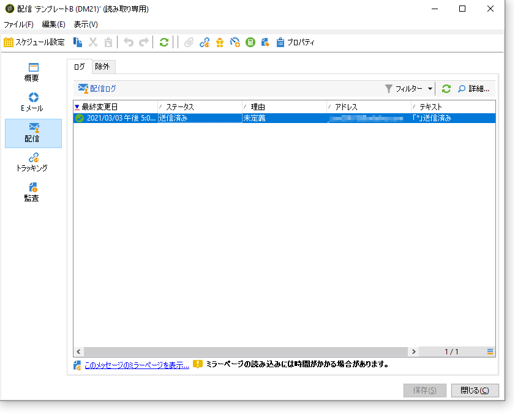
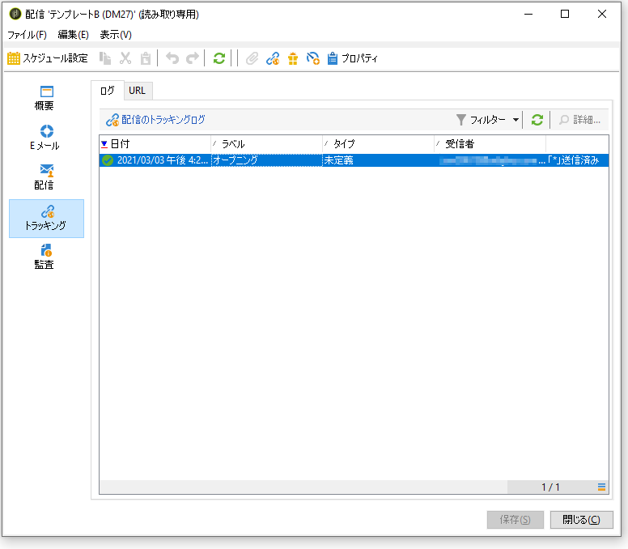
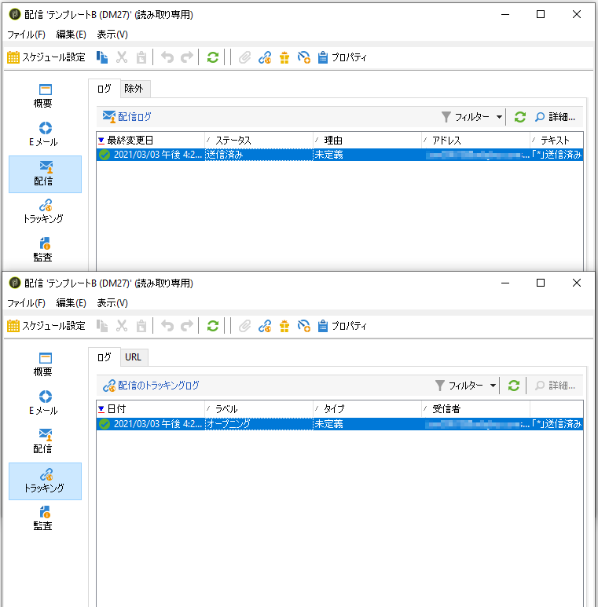
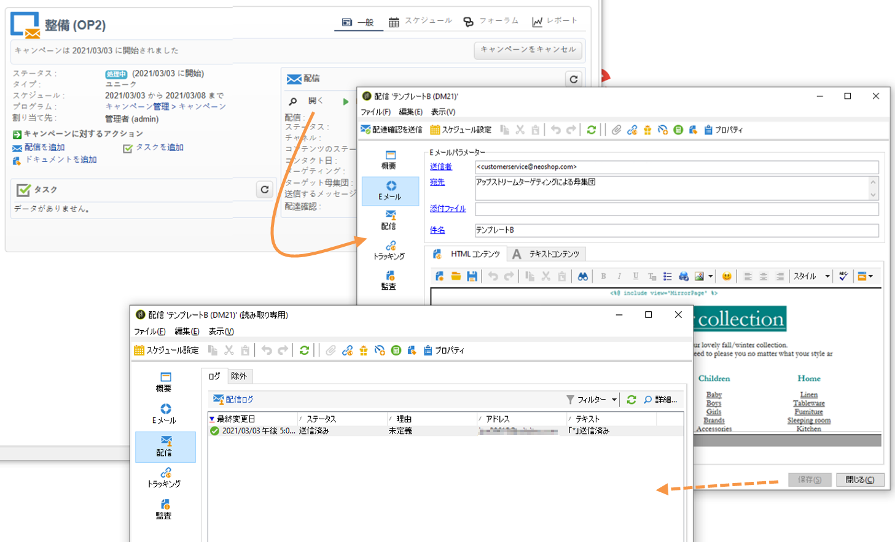

# 結果の分析 {#step-8--analyzing-the-result}

テストの配信が完了したら、どの受信者に配信をおこなったかをチェックし、開封の有無を確認します。

* どの受信者がターゲットになっていて、キャンペーンダッシュボードから配信を開封したのかを確認するには、「**[!UICONTROL 配信]**」タブをクリックします。

   

* 配信が開封されたかどうかを確認するには、「**[!UICONTROL トラッキング]**」タブに移動します。

   

* ほかの配信との比較

   

この例では、配信 B の開封率が最も高くなっています。これは、コンテンツ B が最終の配信で使用されることを意味します。

