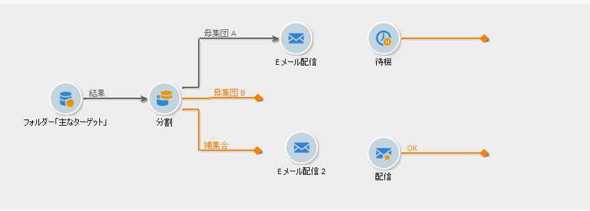
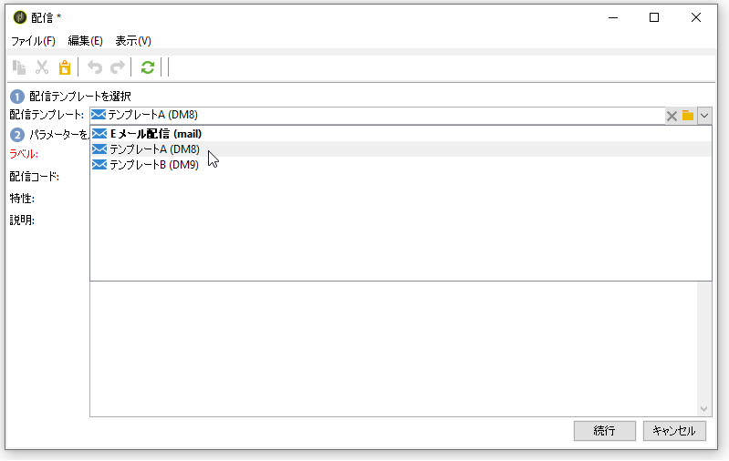
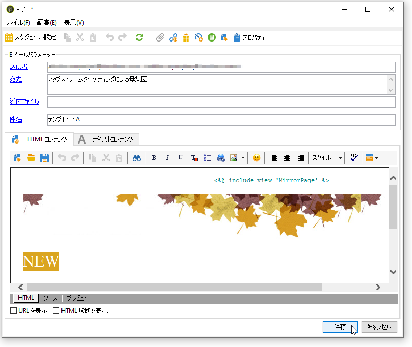
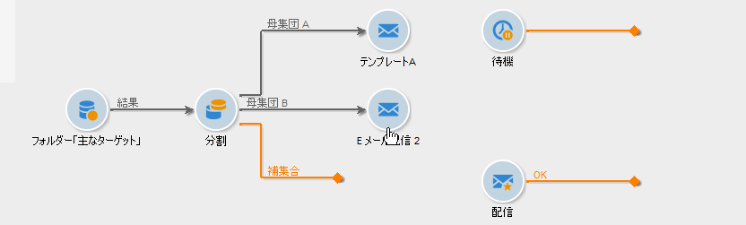
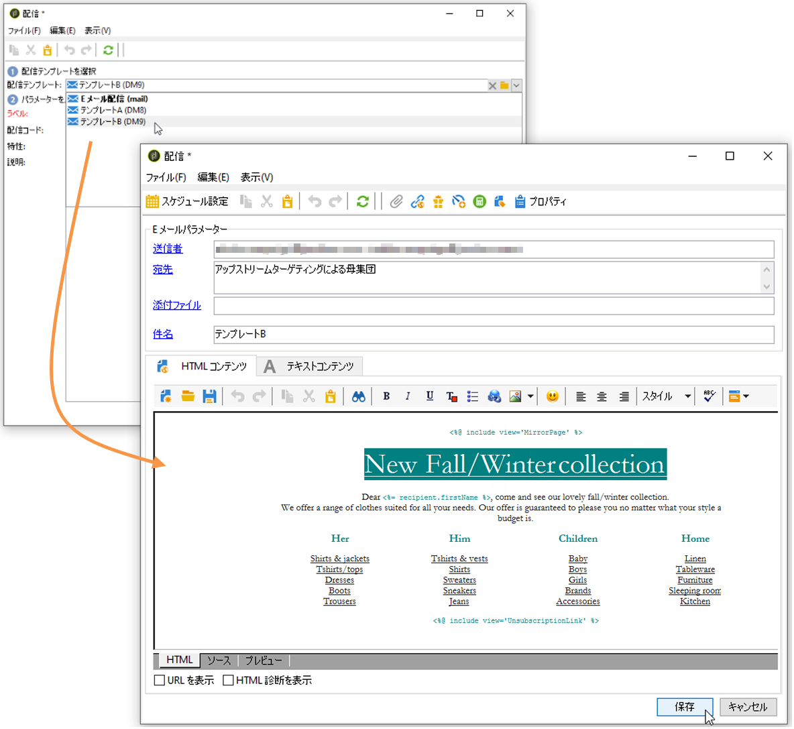
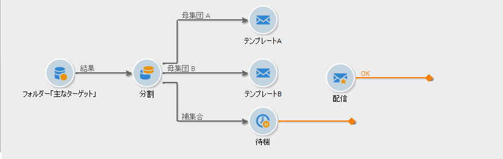
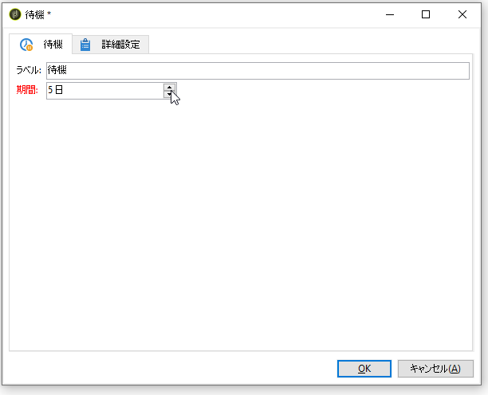
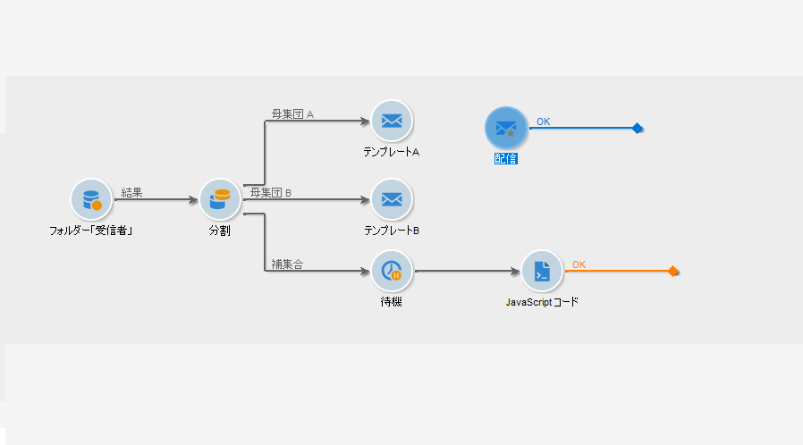

# ワークフローで配信を設定 {#step-4--configuring-the-deliveries-in-the-workflow}

次のステップで配信を設定します。設定する配信は、前のステージの[手順 2：母集団サンプルの設定](#step-2--configuring-population-samples)で作成した 3 つの母集団用のものです。最初の 2 つの配信では、母集団 A と母集団 B にそれぞれ異なるコンテンツを送信することができます。一方、3 番目の配信は、A の配信も B の配信も受信しない母集団用のものです。このコンテンツはスクリプトで割り出します。A のコンテンツと B のコンテンツのどちらかと同一のものになり、どちらのコンテンツの開封率が高いかに応じて決まります。3 番目の配信の待機期間を設定し、配信 A、配信 B の結果を特定する必要があります。そのため、3 番目の配信には「**[!UICONTROL 待機]**」アクティビティを実装します。

1. 「**[!UICONTROL 分割]**」アクティビティに移動し、母集団 A 用のトランジションを、既にワークフローにある E メール配信のトランジションとリンクします。

   

1. 配信をダブルクリックして開きます。
1. ドロップダウンリストで、配信 A のテンプレートを選択します。

   

1. 「**[!UICONTROL 続行]**」をクリックして配信を表示し、保存します。

   

1. 母集団 B 用の「**[!UICONTROL 分割]**」アクティビティのトランジションを 2 番目の E メール配信にリンクします。

   

1. 配信を開き、配信 B のテンプレートを選択し、配信を保存します。

   

1. その他の母集団用のトランジションを「**[!UICONTROL 待機]**」アクティビティとリンクします。

   

1. **[!UICONTROL 待機]**&#x200B;アクティビティを開き、5 日の待機期間を設定します。

   

1. 「**[!UICONTROL 待機]**」アクティビティを「**[!UICONTROL JavaScript コード]**」アクティビティとリンクします。

   
