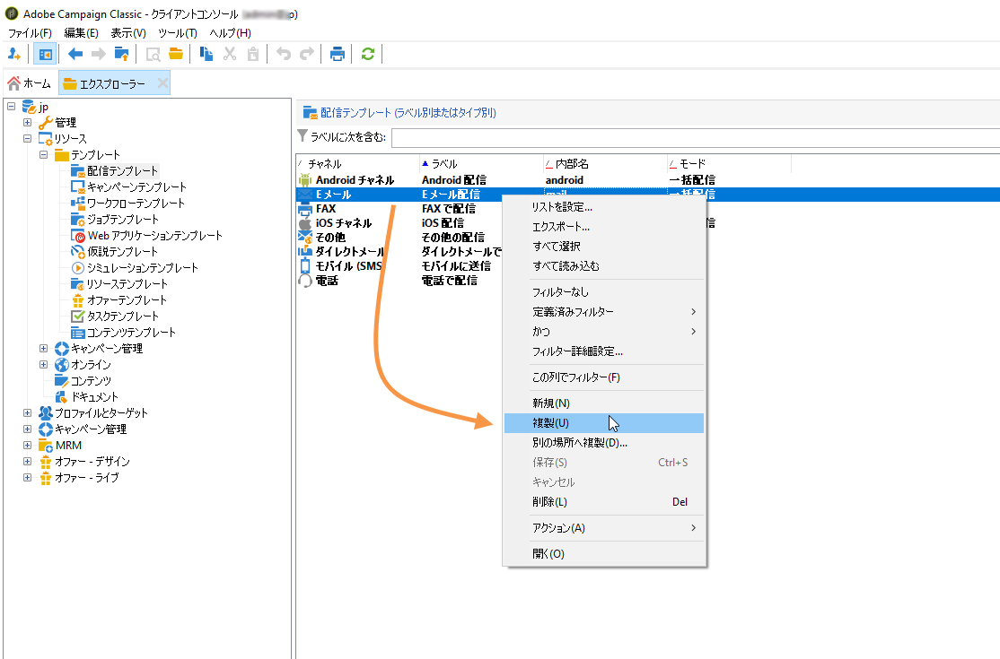
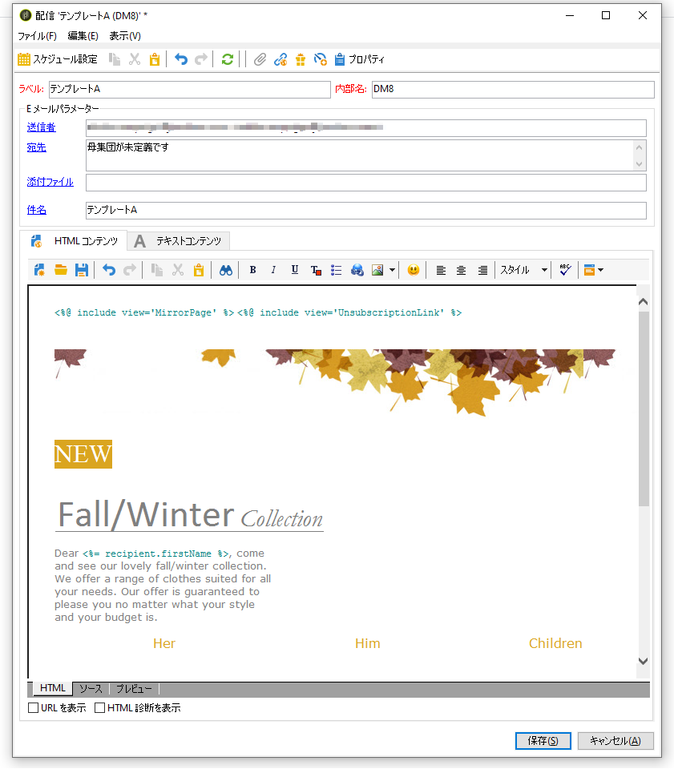
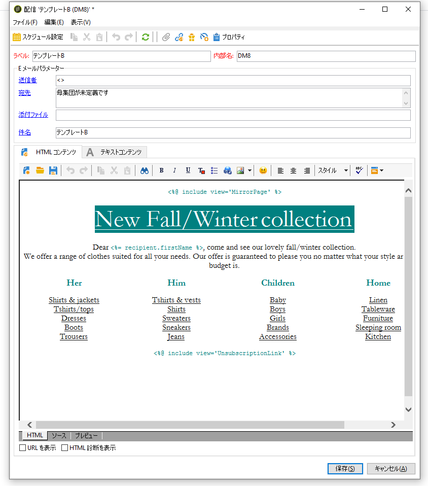

# 配信テンプレートの作成{#step-3--creating-two-delivery-templates}

ここでは、2 つの配信テンプレートを作成します。各テンプレートは、「**[!UICONTROL 分割]**」アクティビティとリンクした「**[!UICONTROL E メール配信]**」アクティビティで参照されます。詳しくは、[この節](../../delivery/using/about-templates.md)を参照してください。

1. **[!UICONTROL リソース／配信テンプレート]**&#x200B;フォルダーへ移動します。
1. 「**[!UICONTROL E メール]**」配信テンプレートを複製します。

   

1. 配信 A に使用するコンテンツを作成します。

   

1. この手順を繰り返し、配信 B のテンプレートも作成します。

   
