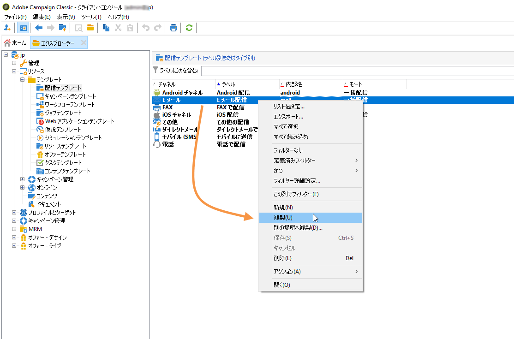
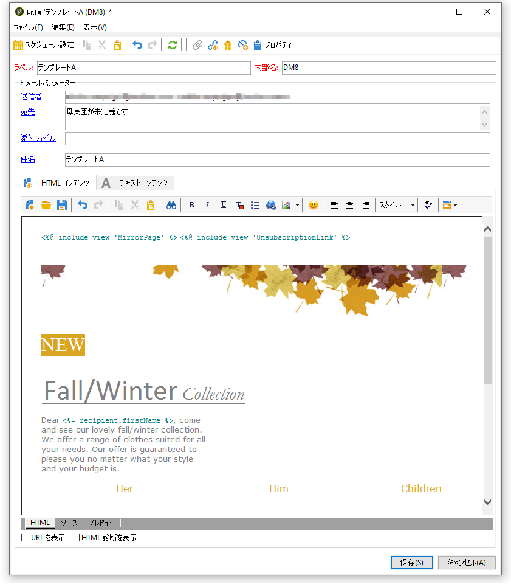
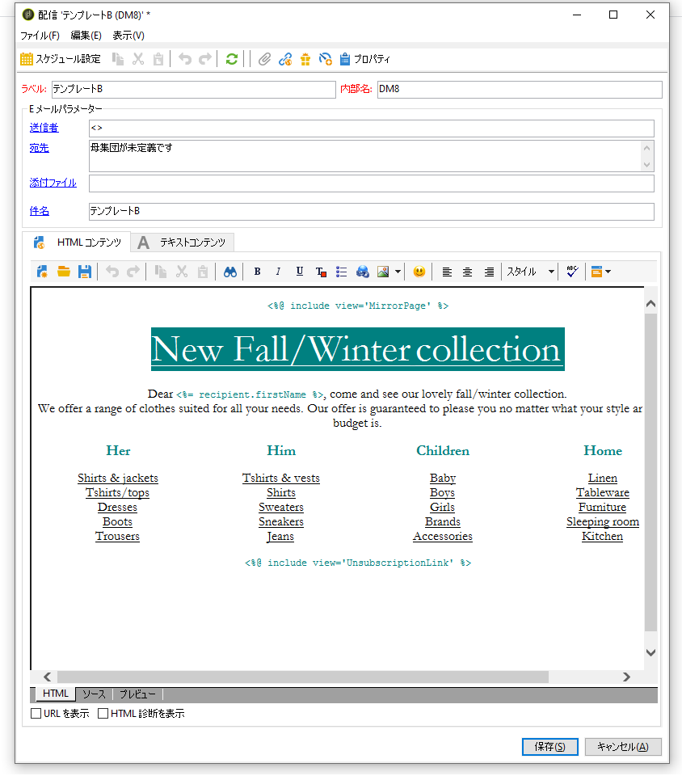

# A/B テスト：配信テンプレートを作成 {#step-3--creating-two-delivery-templates}

ここでは、2 つの配信テンプレートを作成します。 各テンプレートは、「**[!UICONTROL 分割]**」アクティビティとリンクした「**[!UICONTROL メール配信]**」アクティビティで参照されます。 詳しくは、[Campaign v8 ドキュメント](https://experienceleague.adobe.com/docs/campaign/campaign-v8/send/create-templates.html?lang=ja){target="_blank"}を参照してください。

1. **[!UICONTROL リソース／配信テンプレート]**&#x200B;フォルダーを参照します。
1. 「**[!UICONTROL メール]**」配信テンプレートを複製します。

   

1. 配信 A に使用するコンテンツを作成します。

   

1. この手順を繰り返し、配信 B のテンプレートも作成します。

   

これで、ワークフローに配信を設定できるようになりました。 [詳細情報](a-b-testing-uc-configuring-deliveries.md)。
