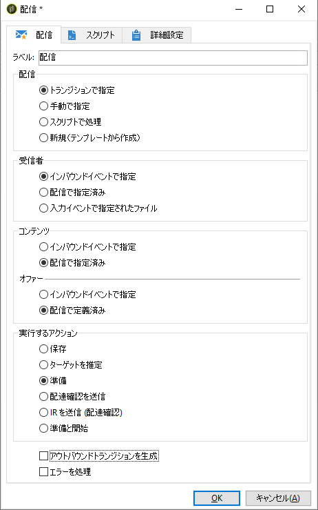

# 最終配信の定義 {#step-6--defining-the-final-delivery}

A/B テストの勝者を選択するスクリプトの作成後は、最終配信のパラメーターを定義できます。

1. 「**[!UICONTROL JavaScript コード]**」アクティビティを残りの「**[!UICONTROL 配信]**」アクティビティに接続します。
1. 「**[!UICONTROL 配信]**」アクティビティを開きます。
1. このアクティビティによってワークフローを終了するために「**[!UICONTROL アウトバウンドトランジションを生成]**」オプションをオフにします。
1. その他のオプションはデフォルト値のままにしておきます。

   

（「**[!UICONTROL Javascript コード]**」アクティビティで定義された）トランジションで指定された配信を準備することで、次の手順で説明する、承認と配信の開始が可能になります。

これで、ワークフローを開始できます([手順7を参照：ワークフロー](../../delivery/using/a-b-testing-uc-start-workflow.md)の開始を参照)。
