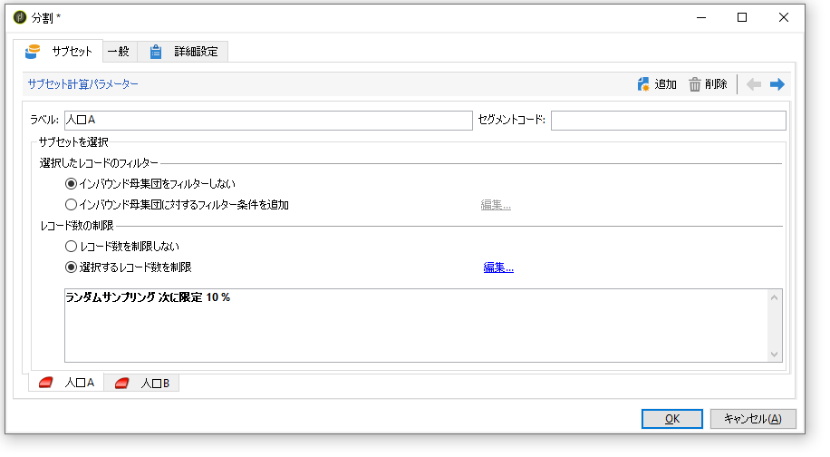

# 母集団サンプルの設定 {#step-2--configuring-population-samples}

## 「クエリ」アクティビティの設定{#configuring-the-query-activity}

* 「**[!UICONTROL クエリ]**」アクティビティをダブルクリックします。

   

* 「**[!UICONTROL クエリを編集]**」リンクをクリックし、ターゲティング対象の受信者を選択します。

   

* 「**[!UICONTROL クエリ]**」アクティビティを「**[!UICONTROL 分割]**」アクティビティとリンクします。

   

## 分割アクティビティの設定 {#configuring-the-split-activity}

このアクティビティでは、配信 A を受信する母集団、配信 B を受信する母集団、その他の母集団といったように複数の母集団を作成することができます。ランダムな抽出をおこなうことで、各配信の母集団の部分のみをターゲティングすることが可能です。

1. 母集団 A の作成

   * 「**[!UICONTROL 分割]**」アクティビティをダブルクリックします。

      

   * 既存のタブで、ラベルを母集団 A に変更します。

      

   * 「**[!UICONTROL 選択レコード数の制限]**」オプションを選択します。

      

   * 「**[!UICONTROL 編集]**」リンクをクリックし、「**[!UICONTROL ランダムサンプリングを有効化]**」を選択して、「**[!UICONTROL 次へ]**」をクリックします。

      

   * しきい値を 10% に設定して、「**[!UICONTROL 完了]**」をクリックします。

      

1. 母集団 B の作成

   * 「**[!UICONTROL 追加]**」をクリックして、母集団 B に使用する新しいタブを作成します。

      

   * A と同じように、母集団を 10% に制限します。

      

1. その他の母集団の作成

   * 「**[!UICONTROL 一般]**」タブに移動します。

      

   * 「**[!UICONTROL 補集合を生成]**」を選択します。

      

   * ラベルを変更して、この母集団には A も B も含まれないように指定し、「**[!UICONTROL OK]**」をクリックしてアクティビティを閉じます。

      

これで2つの配信テンプレートを作成できます([手順3:2つの配信テンプレート](../../delivery/using/a-b-testing-uc-delivery-templates.md)を作成します)。
