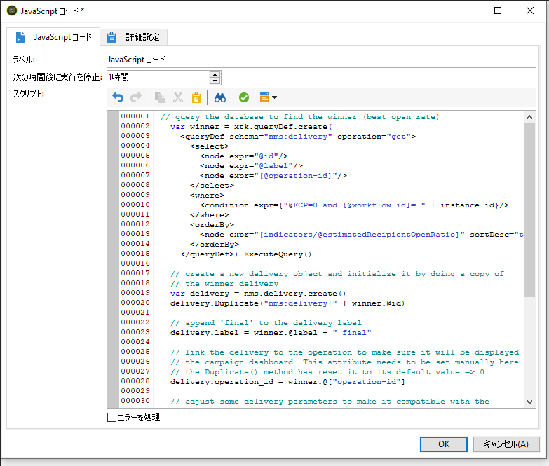
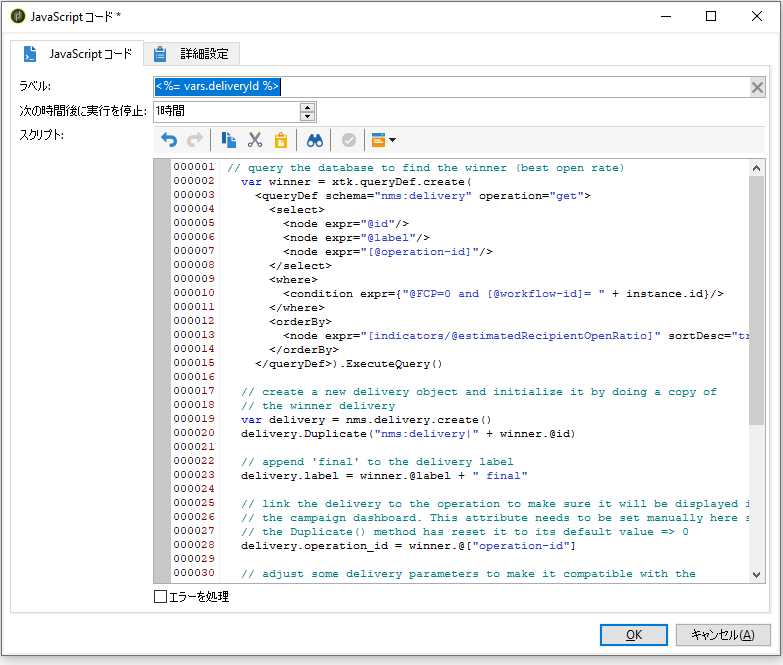

# スクリプトの作成 {#step-5--creating-the-script}

その他の母集団用の配信コンテンツを、スクリプトで割り出します。このスクリプトでは、最も開封率の高い配信について情報を復元し、その内容を最終の配信にコピーします。

## スクリプトの例 {#example-of-a-script}

ターゲティングワークフローで、以下のようにスクリプトを使用します。詳しくは、[実装](#implementation)を参照してください。

```
 // query the database to find the winner (best open rate)
   var winner = xtk.queryDef.create(
     <queryDef schema="nms:delivery" operation="get">
       <select>
         <node expr="@id"/>
         <node expr="@label"/>
         <node expr="[@operation-id]"/>
         <node expr="[@workflow-id]"/>
       </select>
       <where>
         <condition expr={"@FCP=0 and [@workflow-id]= " + instance.id}/>
       </where>
       <orderBy>
         <node expr="[indicators/@estimatedRecipientOpenRatio]" sortDesc="true"/>
       </orderBy>
     </queryDef>).ExecuteQuery()
   
   // create a new delivery object and initialize it by doing a copy of
   // the winner delivery
   var delivery = nms.delivery.create()
   delivery.Duplicate("nms:delivery|" + winner.@id)

   // append 'final' to the delivery label
   delivery.label = winner.@label + " final"

   // link the delivery to the operation to make sure it will be displayed in
   // the campaign dashboard. This attribute needs to be set manually here since 
   // the Duplicate() method has reset it to its default value => 0
   delivery.operation_id = winner.@["operation-id"]
   delivery.workflow_id = winner.@["workflow-id"]

   // adjust some delivery parameters to make it compatible with the 
   // "Prepare and start" option selected in the Delivery tab of this activity
   delivery.scheduling.validationMode = "manual"
   delivery.scheduling.delayed = 0
 
   // save the delivery in database
   delivery.save()
 
   // store the new delivery Id in event variables
   vars.deliveryId = delivery.id
```

スクリプトについて詳しくは、[スクリプトの詳細](#details-of-the-script)を参照してください。

## 実装 {#implementation}

1. 「**[!UICONTROL JavaScript コード]**」アクティビティを開きます。
1. [スクリプトの例](#example-of-a-script)で提供されたスクリプトを **[!UICONTROL JavaScript コード]**&#x200B;ウィンドウにコピーします。

   

1. 「**[!UICONTROL ラベル]**」フィールドに、次のようなスクリプト名を入力します。

   ```
   <%= vars.deliveryId %>
   ```

   

1. 「**[!UICONTROL JavaScript コード]**」アクティビティを閉じます。
1. ワークフローの保存

## スクリプトの詳細 {#details-of-the-script}

このセクションでは、スクリプトの様々な機能とその動作モードについて詳しく説明します。

* まずはじめは、クエリです。**queryDef** コマンドでは、ターゲティングワークフローを実行して作成した配信を「**NmsDelivery**」テーブルから復元することや、それらの配信を推定の開封率に応じて並べ替えることでき、開封率の高い配信の情報が復元されます。

   ```
   // query the database to find the winner (best open rate)
      var winner = xtk.queryDef.create(
        <queryDef schema="nms:delivery" operation="get">
          <select>
            <node expr="@id"/>
            <node expr="@label"/>
            <node expr="[@operation-id]"/>
          </select>
          <where>
            <condition expr={"@FCP=0 and [@workflow-id]= " + instance.id}/>
          </where>
          <orderBy>
            <node expr="[indicators/@estimatedRecipientOpenRatio]" sortDesc="true"/>
          </orderBy>
        </queryDef>).ExecuteQuery()
   ```

* 開封率の最も高い配信を複製します。

   ```
    // create a new delivery object and initialize it by doing a copy of
    // the winner delivery
   var delivery = nms.delivery.create()
   delivery.Duplicate("nms:delivery|" + winner.@id)
   ```

* 複製した配信のラベルを変更し、&quot;**final**&quot; という単語を追加します。

   ```
   // append 'final' to the delivery label
   delivery.label = winner.@label + " final"
   ```

* キャンペーンのダッシュボードに配信をコピーします。

   ```
   // link the delivery to the operation to make sure it will be displayed in
   // the campaign dashboard. This attribute needs to be set manually here since 
   // the Duplicate() method has reset it to its default value => 0
   delivery.operation_id = winner.@["operation-id"]
   delivery.workflow_id = winner.@["workflow-id"]
   ```

   ```
   // adjust some delivery parameters to make it compatible with the 
   // "Prepare and start" option selected in the Delivery tab of this activity
   delivery.scheduling.validationMode = "manual"
   delivery.scheduling.delayed = 0
   ```

* 配信をデータベースに保存します。

   ```
   // save the delivery in database
   delivery.save()
   ```

* 複製した配信の一意の識別子をワークフロー変数として保存します。

   ```
   // store the new delivery Id in event variables
   vars.deliveryId = delivery.id
   ```

## その他の選択基準 {#other-selection-criteria}

上記の例では、E メールの開封率に応じて配信するコンテンツを選択することができます。次のようなその他の配信固有の指標を基にすることが可能です。

* 最も高いクリックスルー率：`[indicators/@recipientClickRatio]`
* 最も高い反応率（E メールの開封やメッセージのクリック）：`[indicators/@reactivity]`
* 最も低いクレーム率：`[indicators/@refusedRatio]`（sortDesc 属性には、値 false を使用）
* 最も高いコンバージョン率：`[indicators/@transactionRatio]`
* メッセージの受信後に訪問のあったページの数：`[indicators/@totalWebPage]`
* 最も低い購読解除率：`[indicators/@optOutRatio]`
* トランザクション金額: `[indicators/@amount]`.
