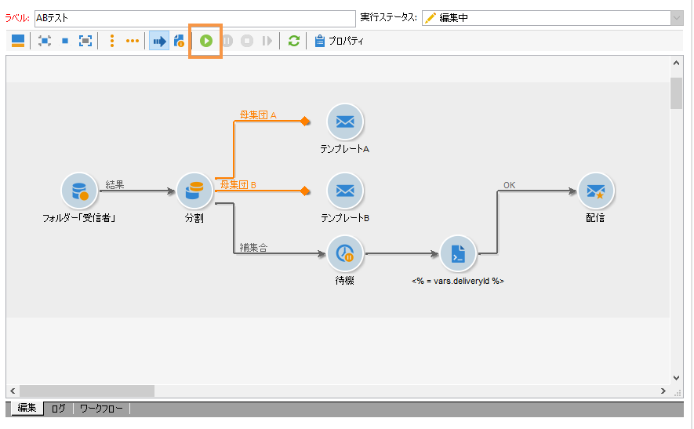
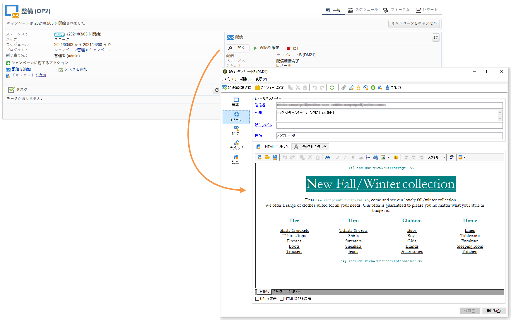

# ワークフローの開始 {#step-7--starting-the-workflow}

1. 「**[!UICONTROL 開始]**」ワークフローをクリックします。

   

1. キャンペーンダッシュボードで、配信 A と配信 B のターゲットとコンテンツを承認します。
1. 配信を確定します。
1. 5 日間の待機が終了した後に、どのコンテンツが割り出されたのかを判断します。

   

   このケースでは、テンプレート B が選択されます。

1. 3 番目の配信のコンテンツが決定したら、ターゲットとコンテンツを承認します。

これで結果を分析できます([手順8を参照：結果](../../delivery/using/a-b-testing-uc-analyzing.md)を分析します)。
