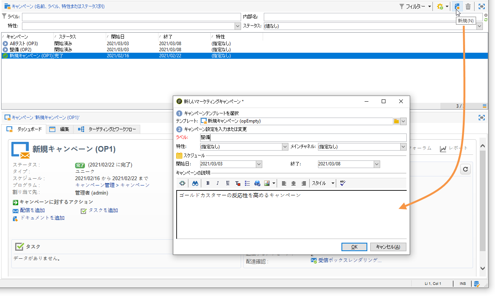
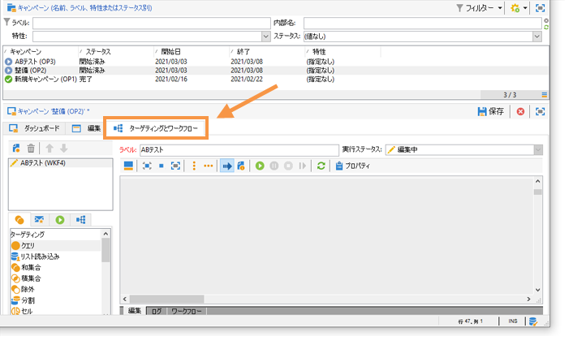
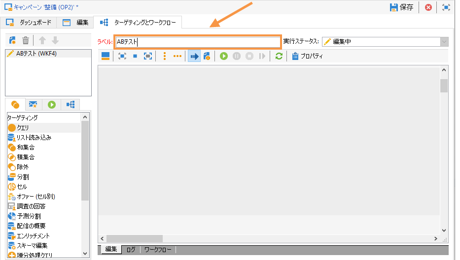
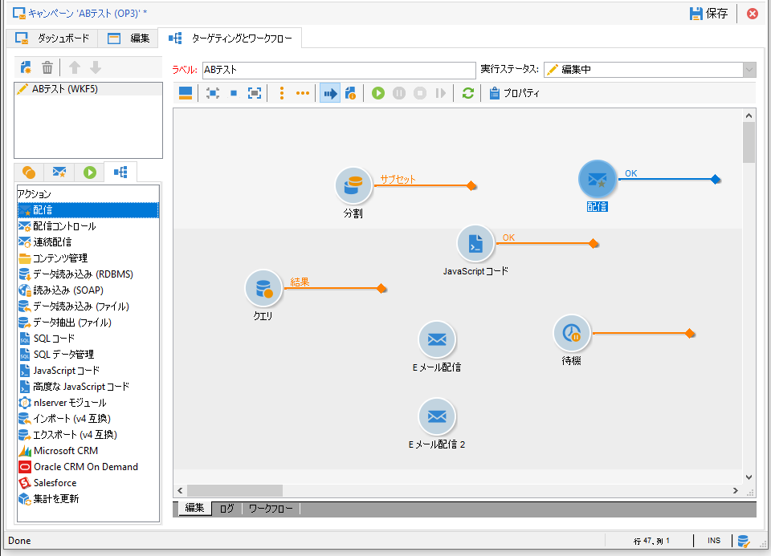

# A/B テスト：ターゲティングワークフローを作成 {#step-1--creating-a-targeting-workflow}

キャンペーンの「**[!UICONTROL ターゲティングとワークフロー]**」タブでワークフローを作成する必要があります。 このワークフローは、1 つの「**[!UICONTROL クエリ]**」アクティビティ、2 つの「**[!UICONTROL メール配信]**」アクティビティとリンクした 1 つの「**[!UICONTROL 分割]**」アクティビティ、1 つの「**[!UICONTROL 待機]**」アクティビティ、1 つの「**[!UICONTROL JavaScript コード]**」アクティビティ、1 つの「**[!UICONTROL 配信]**」アクティビティから構成されます。

1. まだキャンペーンを作成していない場合は、作成します。 詳しくは、[Campaign v8 ドキュメント](https://experienceleague.adobe.com/docs/campaign/automation/campaign-orchestration/set-up-campaigns.html?lang=ja){target=_blank}を参照してください。

   

1. 「**[!UICONTROL ターゲティングとワークフロー]**」タブに移動します。

   

1. 既存のワークフローのラベルを変更するか、「**[!UICONTROL 追加]**」をクリックして、新しいラベルを作成します（詳しくは、[Campaign v8 ドキュメント](https://experienceleague.adobe.com/docs/campaign/automation/campaign-orchestration/marketing-campaign-target.html?lang=ja){target="_blank"}を参照してください）。

   

1. マウスを使用してワークフローダイアグラムにアクティビティをドラッグ＆ドロップします。対象となるアクティビティには、1 つの「**[!UICONTROL クエリ]**」アクティビティ（「**[!UICONTROL ターゲット]**」タブ）、1 つの「**[!UICONTROL 分割]**」アクティビティ（「**[!UICONTROL ターゲット]**」タブ）、2 つの「**[!UICONTROL メール配信]**」アクティビティ（「**[!UICONTROL 配信]**」タブ）、1 つの「**[!UICONTROL 待機]**」アクティビティ（「**[!UICONTROL フロー制御]**」タブ）、1 つの「**[!UICONTROL JavaScript コード]**」アクティビティ（「**[!UICONTROL アクション]**」タブ）、1 つの「**[!UICONTROL 配信]**」アクティビティ（「**[!UICONTROL アクション]**」タブ）などがあります。

これで、母集団サンプルを設定できます。 [詳細情報](a-b-testing-uc-population-samples.md)。
