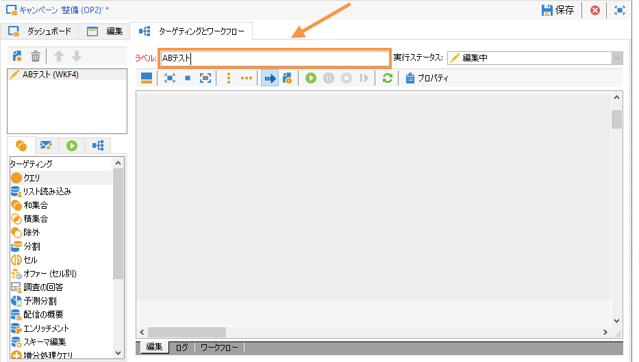

# ターゲティングワークフローの作成 {#step-1--creating-a-targeting-workflow}

キャンペーンの「**[!UICONTROL ターゲティングとワークフロー]**」タブでワークフローを作成する必要があります。このワークフローは、1 つの「**[!UICONTROL クエリ]**」アクティビティ、2 つの「**[!UICONTROL E メール配信]**」アクティビティとリンクした 1 つの「**[!UICONTROL 分割]**」アクティビティ、1 つの「**[!UICONTROL 待機]**」アクティビティ、1 つの「**[!UICONTROL JavaScript コード]**」アクティビティ、1 つの「**[!UICONTROL 配信]**」アクティビティから構成されます。

1. まだ作成していない場合は、キャンペーンを作成します（詳細は、この[節](../../campaign/using/setting-up-marketing-campaigns.md#creating-a-campaign)を参照してください）。

   

1. 「**[!UICONTROL ターゲティングとワークフロー]**」タブに移動します。

   

1. 既存のワークフローのラベルを変更するか、「**[!UICONTROL 追加]**」をクリックして、新しいラベルを作成します（これについて詳細は、この[節](../../campaign/using/marketing-campaign-deliveries.md#selecting-the-target-population)を参照してください）。

   

1. マウスを使用してワークフローダイアグラムにアクティビティをドラッグ＆ドロップします。対象となるアクティビティには、1 つの「**[!UICONTROL クエリ]**」アクティビティ（「**[!UICONTROL ターゲット]**」タブ）、1 つの「**[!UICONTROL 分割]**」アクティビティ（「**[!UICONTROL ターゲット]**」タブ）、2 つの「**[!UICONTROL E メール配信]**」アクティビティ（「**[!UICONTROL 配信]**」タブ）、1 つの「**[!UICONTROL 待機]**」アクティビティ（「**[!UICONTROL フロー制御]**」タブ）、1 つの「**[!UICONTROL JavaScript コード]**」アクティビティ（「**[!UICONTROL アクション]**」タブ）、1 つの「**[!UICONTROL 配信]**」アクティビティ（「**[!UICONTROL アクション]**」タブ）などがあります。

