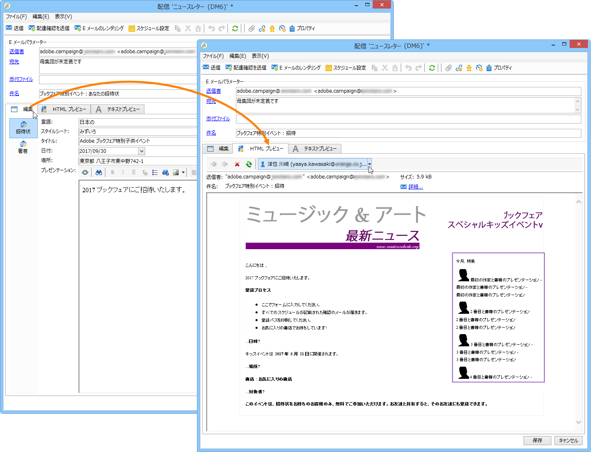

# コンテンツ管理について{#about-content-management}

Adobe Campaign Content Managerモジュールは、定期的なニュースレターやWebサイトを作成す [るために](../../installation/using/installing-campaign-standard-packages.md) 、Campaign Classicの標準パッケージとしてインストールできます。 このモジュールを使用して、メッセージを作成、検証、パブリッシュできます。

>[!NOTE]
>
>この節では、コンテンツ管理モジュールについて説明します。 電子メール配信コンテンツの設計方法について詳しくは、この節を参照 [してください](../../delivery/using/defining-the-email-content.md)。

コンテンツ管理モジュールは、作業グループ、ワークフロー、およびコンテンツ集約機能を組み込んでいます。 そのため、メッセージを自動的に書式設定できます（E メール、郵便、SMS、Web など）。

配信でコンテンツ管理を利用すると、コンテンツの作成を担当するオペレーターに入力フィールドまたは選択フィールドを提供できます。このコンテンツのレイアウトと表示、変更は、スタイルシートを使用して自動的に管理されます。

>[!CAUTION]
>
>スタイルシートに対する変更はすべて、使用するコンテンツテンプレートに基づいて、配信レベルで実施されます。

コンテンツ管理には次のメリットがあります。

* 入力インターフェイスを通じて構造化されたメッセージ編集ができる
* データコンテンツとその表示方法を分離できる（XML フォーマットで生成）
* グラフィックガイドラインに則ったスタイルシートに基づき、複数フォーマット（html、txt、XML など）のドキュメントを生成できる
* 外部コンテンツフローを復元し、自動集計できる
* データの検証や確認をおこなうワークフローと連携できる

ただし、このコンテンツ作成モードには、次のように、いくつかの制約があります。

* ドキュメントの最終デザインに関する制限
* 機能の不足によってエンドユーザーが不便を感じることのないように、要件は厳密に分析する必要があります。

