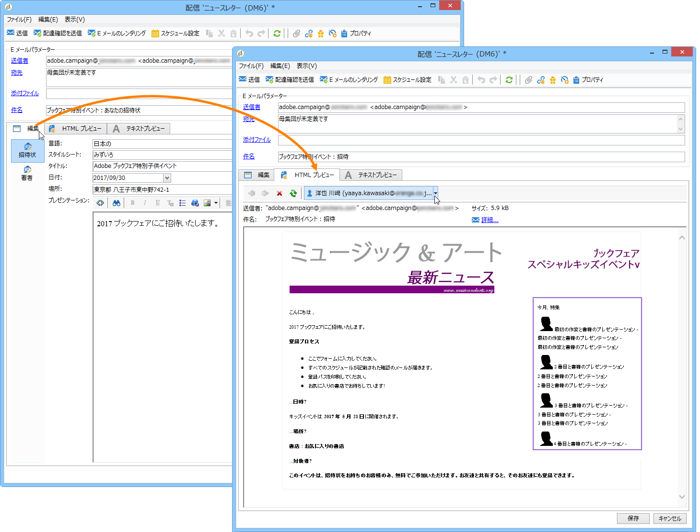

# コンテンツ管理について{#about-content-management}

Adobe Campaign コンテンツマネージャーモジュールは、定期的なニュースレターや web サイトを作成するためにインストールできる、特化した Campaign Classic [ビルトインパッケージ](../../installation/using/installing-campaign-standard-packages.md)です。 このモジュールを使用して、メッセージを作成、検証、パブリッシュできます。

>[!NOTE]
>
>この節では、コンテンツ管理モジュールについて説明します。 メール配信コンテンツのデザイン方法について詳しくは、[Campaign v8 ドキュメント](https://experienceleague.adobe.com/docs/campaign/campaign-v8/send/emails/defining-the-email-content.html?lang=ja){target="_blank"}を参照してください。

コンテンツ管理モジュールには、作業グループ、ワークフローおよびコンテンツ集計機能が含まれます。 そのため、メッセージを自動的に書式設定できます（メール、郵便、SMS、Web など）。

配信でコンテンツ管理を利用すると、コンテンツの作成を担当するオペレーターに入力フィールドまたは選択フィールドを提供できます。 このコンテンツのレイアウトと表示、変更は、スタイルシートを使用して自動的に管理されます。

>[!CAUTION]
>
>スタイルシートに対する変更はすべて、使用するコンテンツテンプレートに基づいて、配信レベルで実施されます。

コンテンツ管理には次のメリットがあります。

* 入力インターフェイスを通じて構造化されたメッセージ編集ができる
* データコンテンツとその表示方法を分離できる（XML フォーマットで生成）
* 複数フォーマット（html、txt、XMLなど）でのドキュメント生成 スタイルシートにもとづいて、グラフィカルな憲章への準拠を保証し，
* 外部コンテンツフローを復元し、自動集計できる
* データの検証や確認をおこなうワークフローと連携できる

ただし、このコンテンツ作成モードには、次のように、いくつかの制約があります。

* ドキュメントの最終デザインに関する制限
* 機能の不足によってエンドユーザーが不便を感じることのないように、要件は厳密に分析する必要があります。
