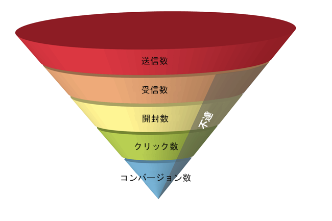
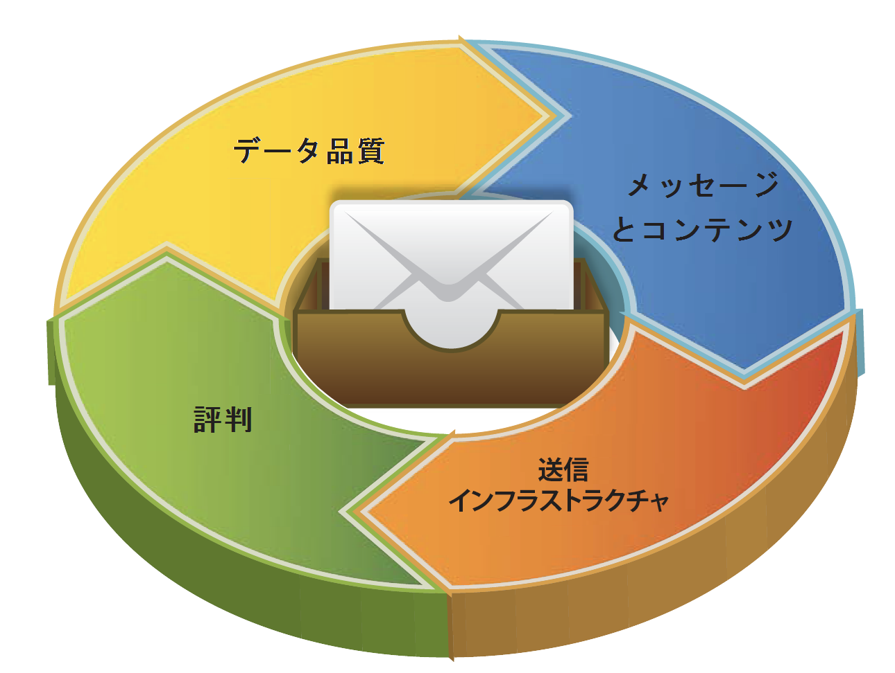

# 配信品質について{#about-deliverability}

Adobe Campaignには、お使いのプラットフォームの配信品質パフォーマンスを追跡するためのツールがいくつか用意されています。 また、配信品質を管理および最適化する際に考慮すべき主な原則についても説明します。

## 設定 {#configuration}

この機能は、Adobe Campaignの専用パッケージを通じて使用できます。 このパッケージを使用するには、このパッケージをインストールする必要があります。 完了したら、パッケージを考慮するためにサーバーを再起動します。
* ホストクライアントおよびハイブリッドクラ **イアントの場合** 、配信品質監視はアドビのテクニカルサポートおよびコンサルタントによってインスタンスに設定されます。 詳しくは、アドビのアカウント担当者にお問い合わせください。

* オンプレミスインストールの場合は、> >メニューを使用し **[!UICONTROL Deliverability monitoring (Email Deliverability)]** てパッケージをインスト **[!UICONTROL Tools]** ールす **[!UICONTROL Advanced]** る必要があ **[!UICONTROL Import package]** ります。 詳しくは、「Campaign Classic標準パッケージのイ [ンストール」を参照してください](../../installation/using/installing-campaign-standard-packages.md)。

Adobe Campaign Classicでは、配信品質の監視は **ワークフロー** で管理さ **[!UICONTROL Refresh for deliverability]** れます。 デフォルトでは、すべてのインスタンスにインストールされ、バウンスメールの資格ルールのリスト、ドメインのリスト、MXのリストを初期化できます。 パッケージがイ **[!UICONTROL Deliverability monitoring (Email Deliverability)]** ンストールされると、このワークフローは夜間に実行され、ルールのリストを定期的に更新し、プラットフォームの配信品質をアクティブに管理できます。

## 背景 {#background}

E メールの配信品質は、メッセージの送信数が数千通であれ、数十億通であれ、マーケティング担当者にとって重要な課題です。メッセージの 5 通に 1 通は、受信ボックス、または目的の受信者に届いていません。

かつては、E メールの配信品質は「技術的な問題」として IT 部門に任されていました。しかし、現在は、マーケティングの検討課題として、その位置付けが上昇し続けています。それは、E メール配信品質の問題は技術的な要素が多いものの、結局のところ、配信品質は利益に大きく関係するビジネス上の問題であると、経験豊富なマーケティング担当者が認識しているからです。

E メールマーケティングを漏斗だと思ってください。配信品質によって受信メッセージ数が決定されると、それは漏斗の後続の各ステージに影響します。受信する E メール数が少なければ少ないほど、E メールの開封数、クリック数、コンバージョン数は少なくなります。**大規模なデータベースを保有する企業で、配信品質が平均的な場合と高い場合とを比較すると、利益に数十万ドルから数百万ドルの差が生じます。**

配信品質を平均（80％）で妥協すると、マーケティング担当者は、非常に多くのコンバージョン数（および利益）を机上で放棄していることになります。

E メール配信品質とは、厳密にはどのような意味なのでしょうか。また、漏斗の口を広げて E メールキャンペーンの成果を拡大するために、マーケティング担当者は、どのような方法で到達率を向上させることができるでしょうか。

E メール配信品質とは、期待される品質のコンテンツとフォーマットを持つメッセージが、個人の E メールアドレスを通じて短時間で宛先に到達する能力を判断する一連の特性のことを指します。これらの特性は、データ品質、メッセージとコンテンツ、送信インフラストラクチャ、レピュテーションの 4 つの主なカテゴリに分類されます。これらにより、成功する E メール配信品質プログラムの基礎が形成されます。この概要では、E メール配信品質を高めるための 4 つの基本事項について説明します。また、E メールを受信ボックスに到達させ、E メールマーケティングプログラムから得られる利益を向上させるためのベストプラクティスについても説明します。

