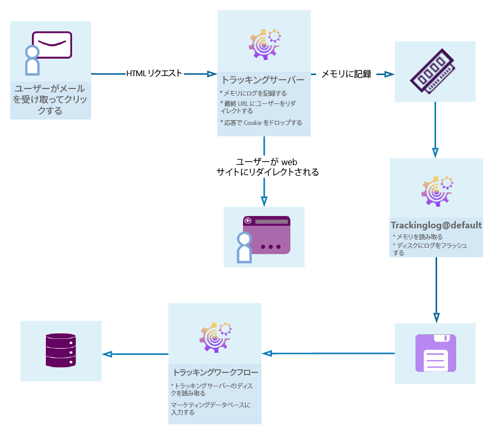

# メッセージトラッキングの概要 {#get-started-tracking}

Adobe Campaign のトラッキング機能により、送信されたメッセージをトラッキングし、開封、リンクのクリック、購読解除といった受信者の動作を確認できます。

この情報は、配信の各受信者のプロファイルの「**[!UICONTROL トラッキング]**」タブで取得されます。このタブには、リストから選択した受信者がトラッキングおよびクリックしたすべての URL が表示されます。これは、配信画面に現在も表示されている配信内でトラッキングされたすべての URL の累積です。このリストは設定可能で、一般的には、クリックされた URL、クリックの日時、URL が含まれていたドキュメントが表示されます。詳しくは、[この節](../../platform/using/editing-a-profile.md#tracking-tab)を参照してください。

**配信ダッシュボード**&#x200B;は、配信と、メッセージの送信時に結果として起こる問題を監視するための重要な要素でもあります。詳しくは[この節](../../delivery/using/delivery-dashboard.md)を参照してください。

次の図に、ユーザーと様々なサーバー間のダイアログのステージを示します。

## トラッキングの設定 {#configure-tracking}

**動作の仕組み**

トラッキングを使用する前に、まずインスタンスに対して設定する必要があります。[詳細情報](../../installation/using/deploying-an-instance.md#operating-principle)

**トラッキングサーバー**

トラッキングを設定するには、インスタンスを宣言し、トラッキングサーバーに登録する必要があります。[詳細情報](../../installation/using/deploying-an-instance.md#tracking-server)

**トラッキングの保存**

トラッキングを設定し、URL を入力したら、トラッキングサーバーを登録する必要があります。[詳細情報](../../installation/using/deploying-an-instance.md#saving-tracking)

## メッセージトラッキング {#message-tracking}

**トラッキングされたリンク**

メッセージの受信、およびメッセージコンテンツに挿入されたリンクのアクティベーションをトラッキングし、受信者の動作を詳しく把握できます。[詳細情報](../../delivery/using/how-to-configure-tracked-links.md)

**URL トラッキング**

トラッキングオプションは、トラッキングされる URL をアクティブ化または非アクティブ化することで設定できます。[詳細情報](../../delivery/using/personalizing-url-tracking.md)

**トラッキングされたリンクのパーソナライゼーション**

Campaign Classic のトラッキング機能を使用すると、パーソナライズ可能な E メールにリンクを追加し、トラッキングをサポートできます。[詳細情報](../../delivery/using/tracking-personalized-links.md)

**トラッキングログ**

配信が送信され、トラッキングがアクティブ化されると、トラッキングテクニカルワークフローはトラッキングデータを取得します。このデータは、配信の「トラッキング」タブに表示されます。[詳細情報](../../delivery/using/accessing-the-tracking-logs.md)

**トラッキングのテスト**

トラッキング用のメッセージを送信する前に、ミラーページ、E メールログ、リンクでトラッキングをテストできます。[詳細情報](../../delivery/using/testing-tracking.md)

## web アプリケーショントラッキング {#web-application-tracking}

**web アプリケーションのトラッキング**

また、トラッキングタグを含む web アプリケーションページの訪問をトラッキングおよび測定できます。この機能は、フォームやオンライン調査など、すべての種類の web アプリケーションで使用できます。[詳細情報](../../web/using/tracking-a-web-application.md)

**web アプリケーショントラッキングのオプトアウト**

web アプリケーショントラッキングのオプトアウトを使用すると、行動トラッキングをオプトアウトしたエンドユーザーの web 行動のトラッキングを停止できます。web アプリケーションやランディングページにバナーを表示して、ユーザーがオプトアウトできるようにする機能を追加できます。[詳細情報](../../web/using/web-application-tracking-opt-out.md)

## トラッキングレポート{#tracking-reports}

**トラッキング統計**

このレポートは、開封数、クリック数、トランザクション数に関する統計を提供し、配信のマーケティング効果をトラッキングできます。[詳細情報](../../reporting/using/delivery-reports.md#tracking-statistics)

**URL とクリックストリーム**

このレポートは、配信後に訪問されたページのリストを表示します。[詳細情報](../../reporting/using/delivery-reports.md#urls-and-click-streams)

**「人」と「受信者」**

この例で、Adobe Campaign においての「人」と「受信者」のトラッキングの違いをより深く理解します。[詳細情報](../../reporting/using/person-people-recipients.md)

**トラッキング指標**

このレポートは、開封、クリックスルー率、クリックストリームなど、配信を受け取ったときの受信者の行動をトラッキングする主要指標を組み合わせたものです。[詳細情報](../../reporting/using/delivery-reports.md#tracking-indicators)

**指標の計算**

各テーブルには、様々なレポートで使用される指標のリストと、配信タイプに応じた計算式が示されます。[詳細情報](../../reporting/using/indicator-calculation.md)

## トラッキングのトラブルシューティング {#tracking-troubleshooting}

以下のトラブルシューティングのヒントは、Adobe Campaign Classic でトラッキングを使用する場合に発生する最も一般的な問題の解決に役立ちます。より高度なトラブルシューティングについては、[この節](../../delivery/using/tracking-troubleshooting.md)を参照してください。

* trackinglogd プロセスが実行中であることを確認します。

   このプロセスは、IIS/web サーバーの共有メモリから読み取り、リダイレクトログを書き込みます。

   ホームページからアクセスするには、インスタンスの「監視」タブを選択します。また、インスタンスで次のコマンドを実行することもできます。`<user>@<instance>:~$ nlserver pdump`

   trackinglogd プロセスがリストに表示されない場合は、インスタンスで次のコマンドを使用して起動します。`<user>@<instance>:~$ nlserver start trackinglogd`

* トラッキングテクニカルワークフローが最近実行されていることを確認します。

   トラッキングのテクニカルワークフローは、管理／製品／テクニカルワークフローのフォルダーで確認できます。
