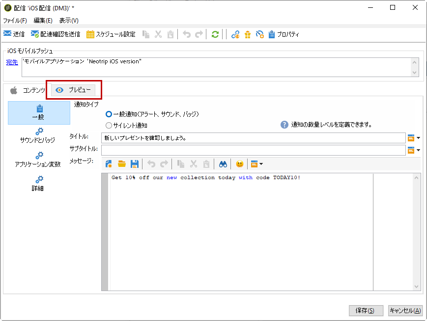
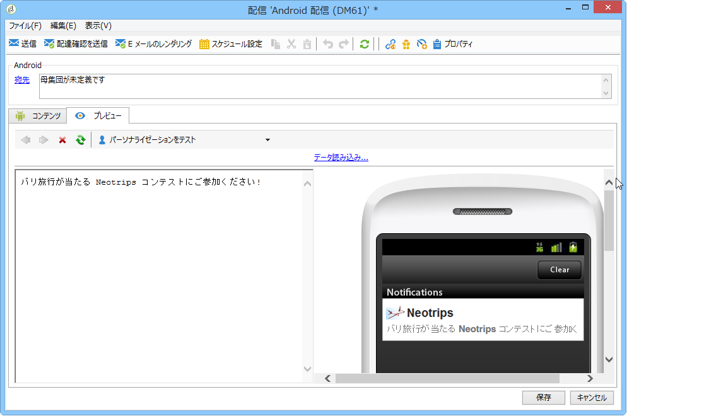
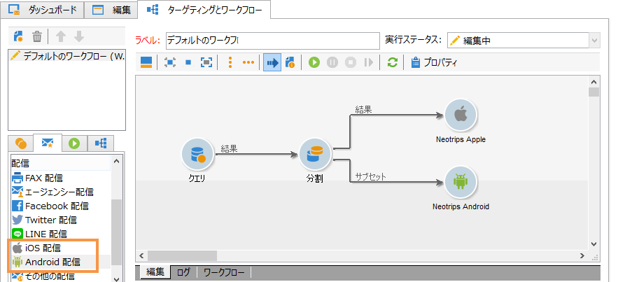
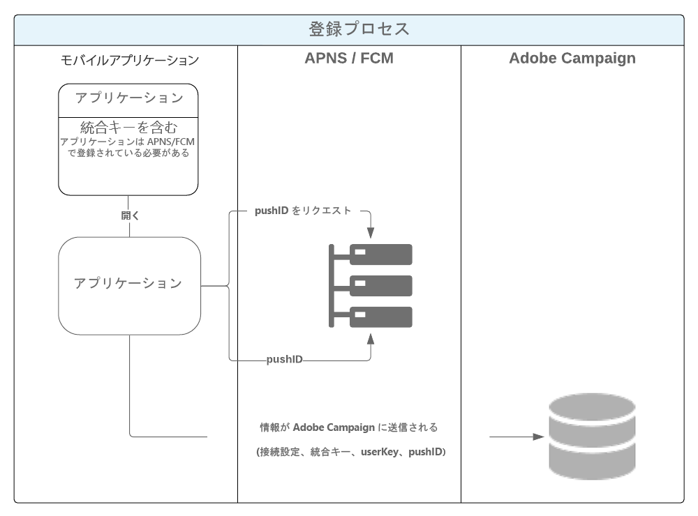
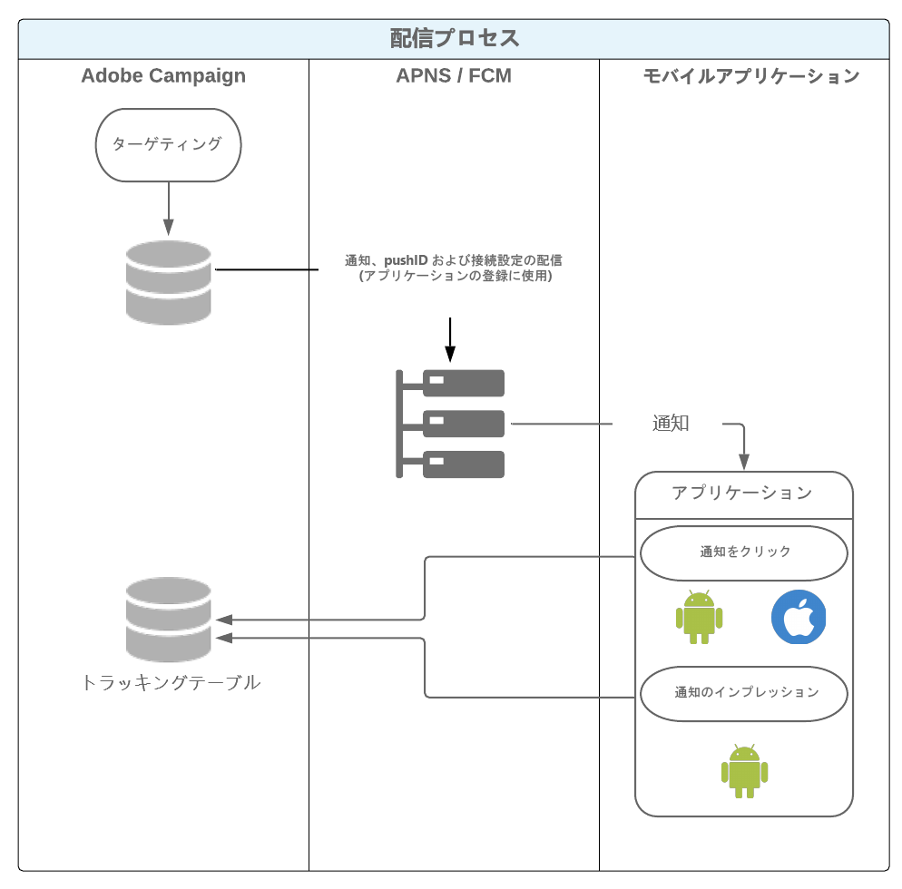

# モバイルアプリチャネルについて{#about-mobile-app-channel}

>[!CAUTION]
>
>このドキュメントは、モバイルアプリケーションを Adobe Campaign プラットフォームに統合するプロセスについて説明しています。モバイルアプリケーションの作成方法や、通知を管理するためのモバイルアプリケーションの設定方法については説明していません。If you would like further information on this, refer to the official Apple [documentation](https://developer.apple.com/) and Android [documentation](https://developer.android.com/index.html).

以下の節では、モバイルアプリチャネルに固有の情報を示します。

For global information on how to create a delivery, refer to [this section](../../delivery/using/steps-about-delivery-creation-steps.md).

**モバイルアプリチャネル**&#x200B;では、Adobe Campaign プラットフォームを使用して iOS および Android の端末にパーソナライズされた通知をアプリ経由で送信できます。2 つの配信チャネルが使用可能です。

* Apple  のモバイルデバイスへの通知の送信を有効にする iOS チャネル：

   

* Android のモバイルデバイスへのデータメッセージの送信を有効にする Android チャネル。

   

これら 2 つのチャネルに対応して、キャンペーンワークフローには 2 つの配信アクティビティがあります。



>[!NOTE]
>
>また、トランザクションメッセージに使用できるトランザクションメッセージテンプレートも 2 つあります。

ユーザーがアプリケーションのコンテキストに一致する画面を表示するための通知を有効化した場合のアプリケーションの動作を定義することもできます。次に例を示します。

* 荷物が倉庫から出荷されたことを顧客に知らせるために通知を送信します。顧客が通知を有効にすると、配信関連の情報が記載されたページが開きます。
* ユーザーがカートに商品を追加したものの、購入を完了することなくアプリケーションを終了した場合、カートの内容が破棄されたことを知らせる通知を送信します。ユーザーが通知を有効化すると、画面にその商品が表示されます。

>[!CAUTION]
>
>* モバイルアプリケーションに送信される通知が、Apple(Apple Push Notification Service)およびGoogle(Firebase Cloud Messaging)で指定された前提条件と条件に準拠していることを確認する必要があります。
>* 警告：国によっては、モバイルアプリケーションから収集するデータタイプとその処理の目的についてユーザーに知らせることが法律によって定められている場合があります。法律を確認する必要があります。


The **[!UICONTROL NMAC opt-out management]** (mobileAppOptOutMgt) workflow updates notification unsubscriptions on mobile devices. このワークフローについて詳しくは、[ワークフローガイド](../../workflow/using/mobile-app-channel.md)を参照してください。

Adobe Campaign はバイナリと HTTP/2 APNS の両方に対応しています。設定手順の詳細については、「Adobe Campaignでのモバイルア [プリケーションの設定](../../delivery/using/configuring-the-mobile-application.md) 」を参照してください。

## データパス {#data-path}

後述のスキーマでは、モバイルアプリケーションが Adobe Campaign とデータをやり取りできるようにするステップを説明しています。このプロセスには 3 つのエンティティが含まれます。

* モバイルアプリケーション
* 通知サービス：Apple向けAPNS(Apple Push Notification Service)およびAndroid向けFCM(Firebase Cloud Messaging)
* Adobe Campaign

通知プロセスの 3 つの主要なステップは、Adobe Campaign でのアプリケーションの登録（購読コレクション）、配信およびトラッキングです。

### 手順1:購読コレクション {#step-1--subscription-collection}

モバイルアプリケーションが、App Store または Google Play からユーザーによってダウンロードされます。このアプリケーションには、接続設定（iOS 証明書および Android のプロジェクトキー）と統合キーが含まれます。アプリケーションを最初に開いた際に、（設定に応じて）ユーザーは登録情報（@userKey：例えば E メールやアカウント番号）を入力するように求められる場合があります。同時に、アプリケーションは通知サービスに対し、通知 ID（プッシュ ID）収集の問い合わせをおこないます。これらすべての情報（接続設定、統合キー、通知識別子、userKey）は、Adobe Campaign に送信されます。



### 手順2:配信 {#step-2--delivery}

マーケティング担当者は、アプリケーションの利用者をターゲットにします。配信プロセスは、通知サービス（iOS 証明書および Android のプロジェクトキー）に対する接続設定、通知 ID（プッシュ ID）および通知の内容を送信します。通知サービスは、ターゲットとなる端末に通知を送信します。

次の情報が Adobe Campaign で使用可能です。

* Android のみ：通知を表示したデバイスの数（インプレッション数）
* Android および iOS：通知のクリック数



Adobe Campaign サーバーが、次のポートで APNS サーバーと通信できる必要があります。

* iOS バイナリコネクタの場合：2195（送信）および 2186（フィードバックサービス）
* iOS HTTP/2 コネクタの場合：443

正しく動作することを確認するには、次のコマンドを使用します。

* テスト用：

   ```
   telnet gateway.sandbox.push.apple.com
   ```

* 本番：

   ```
   telnet gateway.push.apple.com
   ```

iOS バイナリコネクタを使用した場合、MTA および Web サーバーはポート 2195（送信）で、ワークフローサーバーはポート 2196（フィードバックサービス）でそれぞれ APNS と通信できる必要があります。

iOS HTTP/2 コネクタを使用した場合、MTA、Web サーバーおよびワークフローサーバーは、ポート 443 で APNS と通信できる必要があります。

