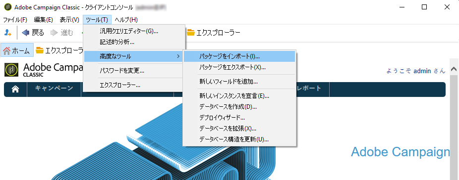
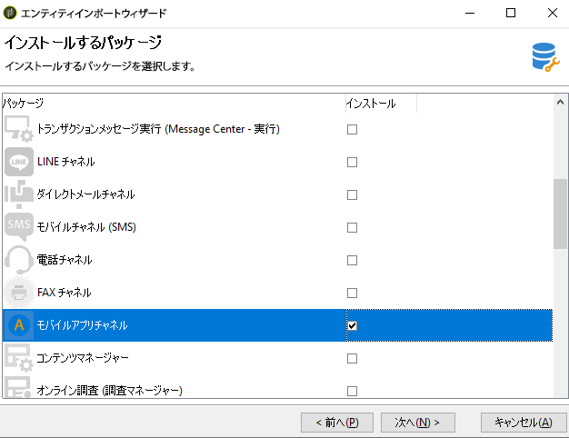
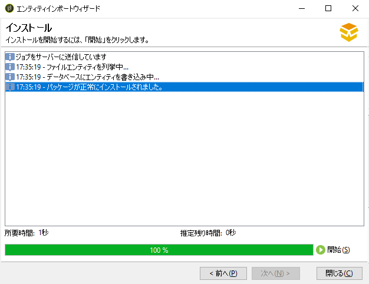

# モバイルアプリチャネルの基本を学ぶ{#about-mobile-app-channel}

Adobe Campaign を使用すると、モバイルアプリのユーザーにパーソナライズされたメッセージを送信するプッシュ通知配信を作成できます。

プッシュ通知を使用すると、iOS と Android のユーザーとリアルタイムに関わることができます。 更新、お知らせ、プロモーションなどを送信する場合に、コンテンツ、タイミング、ターゲティングを制御できます。 プッシュチャネルの設定と使用、サブスクリプションの管理、APN と FCM との統合、メッセージのパーソナライズの方法については、[Adobe Campaign v8 ドキュメント](https://experienceleague.adobe.com/ja/docs/campaign/campaign-v8/send/emails/email){target=_blank}を参照してください。

Campaign v7 から v8 への移行の一環として、Campaign Classic のドキュメントセットを効率化および再編成しました。 共通機能は、Campaign v8 ドキュメントセットでのみ使用できるようになりました。

>[!BEGINTABS]

>[!TAB プッシュチャネルドキュメント]

プッシュ通知チャネルについて詳しくは、[Campaign v8 ドキュメント](https://experienceleague.adobe.com/docs/campaign/campaign-v8/send/push/push.html?lang=ja){target=_blank}を参照してください。

{target=_blank}

>[!TAB プッシュ配信の作成]

プッシュ配信の作成に関連する主な手順について詳しくは、**Campaign v8 ドキュメント**&#x200B;を参照してください。

* [プッシュ通知の作成](https://experienceleague.adobe.com/ja/docs/campaign/campaign-v8/send/push/push#push-create){target="_blank"}：プッシュ配信の作成に必要な様々な手順について説明します。
* [プッシュ通知の送信と監視](https://experienceleague.adobe.com/ja/docs/campaign/campaign-v8/send/push/push#push-test){target="_blank"}：配信を検証、送信、トラッキングする方法について説明します。
* [Androidのリッチなプッシュ配信のデザイン ](https://experienceleague.adobe.com/ja/docs/campaign/campaign-v8/send/push/rich-push/rich-push-android){target="_blank"}：Android デバイス向けのリッチなプッシュ通知を作成および設定する方法を説明します。
* [iOS のリッチなプッシュ配信のデザイン](https://experienceleague.adobe.com/ja/docs/campaign/campaign-v8/send/push/rich-push/rich-push-ios){target="_blank"}：Adobe Campaign v8 で iOS デバイス向けのリッチなプッシュ通知をデザインし、設定する方法を説明します。

>[!TAB プッシュパラメーター]

プッシュパラメーターについて詳しくは、**Campaign v8 ドキュメント**&#x200B;の次のページを参照してください。

* [設定の前提条件](https://experienceleague.adobe.com/ja/docs/campaign/campaign-v8/send/push/push-settings#before-starting){target="_blank"}：権限を設定し、アプリを設定する方法について説明します。
* [Launch プロパティの設定](https://experienceleague.adobe.com/ja/docs/campaign/campaign-v8/send/push/push-settings#launch-property){target="_blank"}：Adobe Experience Platform データ収集でモバイルタグプロパティを設定して、プッシュ通知を有効にする方法を説明します。
* [プッシュサービスのモバイルサービスの設定](https://experienceleague.adobe.com/ja/docs/campaign/campaign-v8/send/push/push-settings#push-service){target="_blank"}：Adobeで iOS および Android のプッシュサービスを設定して、モバイルアプリユーザー向けのターゲティングプッシュ通知を有効にします。
* [モバイルプロパティでの拡張機能の設定](https://experienceleague.adobe.com/ja/docs/campaign/campaign-v8/send/push/push-settings#configure-extension){target="_blank"}：モバイルプロパティに Campaign 拡張機能を統合して、プッシュ通知を有効にし、ユーザーのインタラクションを効果的に管理します。

>[!ENDTABS]

次の情報は、Campaign Classic に固有のものです。

+++ **パッケージのインストール**

 [モバイルアプリパッケージのインストール方法をビデオで確認](https://experienceleague.adobe.com/docs/campaign-classic-learn/tutorials/sending-messages/push-channel/installing-the-mobile-app-channel.html?lang=ja#sending-messages)

ハイブリッド／ホスト型のお客様は、[アドビカスタマーケア](https://helpx.adobe.com/jp/enterprise/admin-guide.html/enterprise/using/support-for-experience-cloud.ug.html)チームに連絡して、Campaign のプッシュ通知チャネルにアクセスします。

オンプレミスのお客様は、ビルトインのパッケージをインストールする必要があります。

>[!CAUTION]
>
>Campaign のビルトインパッケージ、ベストプラクティス、レコメンデーションについて詳しくは、[このページ](../../installation/using/installing-campaign-standard-packages.md)を参照してください。

インストール手順は次のとおりです。

1. Adobe Campaign クライアントコンソールの&#x200B;**[!UICONTROL ツール／高度なツール／パッケージをインポート]**&#x200B;から、パッケージインポートアシスタントにアクセスします。

   

1. 「**[!UICONTROL 標準パッケージをインストール]**」を選択します。

1. 表示されるリストで、「**[!UICONTROL モバイルアプリチャネル]**」をチェックします。

   

1. 「**[!UICONTROL 次へ]**」、「**[!UICONTROL 開始]**」の順にクリックして、パッケージのインストールを開始します。

   パッケージがインストールされると、進行状況バーに **100%** と表示され、インストールログに、「**[!UICONTROL パッケージが正常にインストールされました]**」と表示されます。

   

1. インストールウィンドウを&#x200B;**[!UICONTROL 閉じます]**。

この手順が完了したら、Android および iOS アプリを設定できます。 Campaign v8 [ドキュメント](https://experienceleague.adobe.com/docs/campaign/campaign-v8/send/push/push.html?lang=ja){target="_blank"} 参照してください。

+++

+++ **トラブルシューティング**

モバイルデバイスが Wi-Fi に接続されているにも関わらず通知を受信できない場合は、FCM または APNs のポートがファイアウォールによってブロックされていないか確認してみてください。

**Android**：モバイルデバイスは、ポート 5228 ～ 5230 で FCM サーバーに接続します。 したがって、FCM への接続を許可するようにファイアウォールを設定する必要があります。 開くポートは、5228（最も使用頻度が高い）、5229 および 5230 です。

**iOS**：

HTTP/2 コネクタ：次のサーバーとの間での通信を許可する必要があります。

* api.push.apple.com：ポート 443
* api.development.push.apple.com：ポート 443

>[!NOTE]
>
>この 2 種類のコネクタについて詳しくは、Campaign v8 [ドキュメント](https://experienceleague.adobe.com/docs/campaign/campaign-v8/send/push/push-settings.html?lang=ja){target="_blank"}を参照してください。

+++
