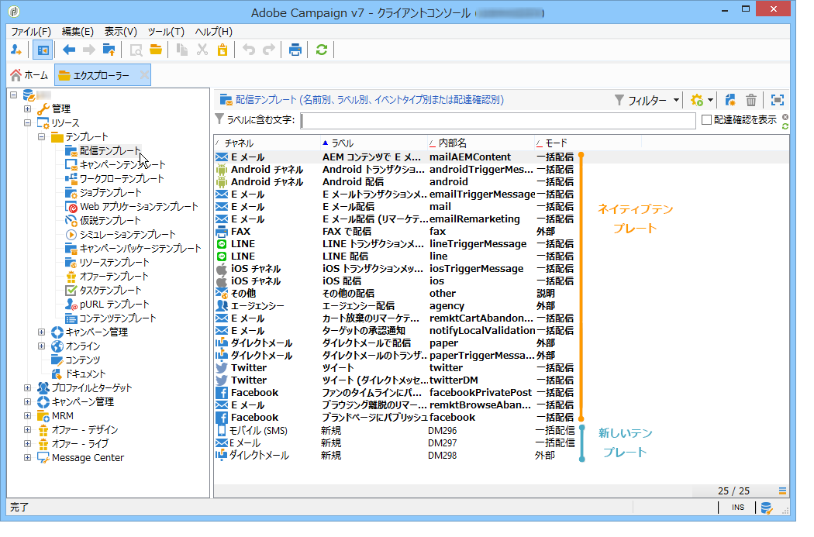

# 配信テンプレートの操作 {#about-templates}

配信設定は、再利用できるように配信テンプレートに保存できます。 テンプレートには配信の完全な設定を保存したり、部分的な設定のみ保存したりできます。

テンプレートには次の 2 つのタイプがあります。

1. Adobe Campaign のネイティブ配信テンプレート - ネイティブテンプレートは絶対にシステムから削除しないでください。 各種の配信チャネルで使用する必要最小限の設定内容がネイティブテンプレートに含まれています。 ただし、特定の機能を制限する目的や、ユーザーに独自のデフォルト設定（トラッキングの有効化、送信者メールアドレスなど）を提供する目的のために Adobe Campaign 管理者が変更を加えることは可能です。 テンプレートのリスト上では、ネイティブシナリオは太字で表示されます。 変更する場合は、複製を作成する必要があります。

1. 定義済みの配信テンプレート - Adobe Campaign 管理者は、新しい配信テンプレートを作成できます。 作成した配信テンプレートは、オペレーター（適切なアクセス権を持っている場合）が再利用することも、サーバープロセスを使用して自動的に再利用することもできます。 例えば、メール配信テンプレートを設定できます。ユーザーがそのテンプレートを使用して配信を作成する際は、テキストまたは HTML コンテンツを入力して配信するだけで済みます。それ以外の選択項目は、管理者によって既に設定されています。

配信テンプレートを作成および使用する方法について詳しくは、[Campaign v8 ドキュメント](https://experienceleague.adobe.com/ja/docs/campaign/campaign-v8/send/create-templates){target="_blank"}を参照してください。