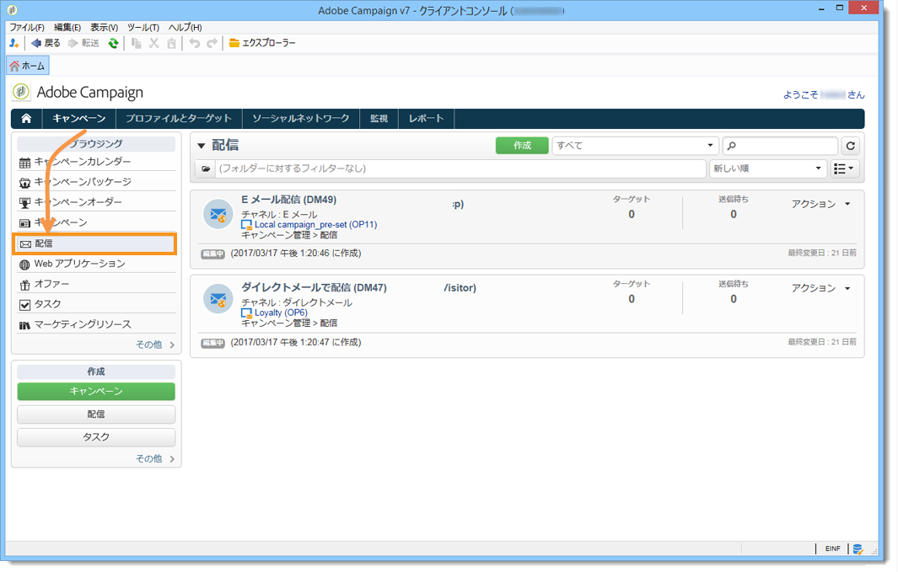
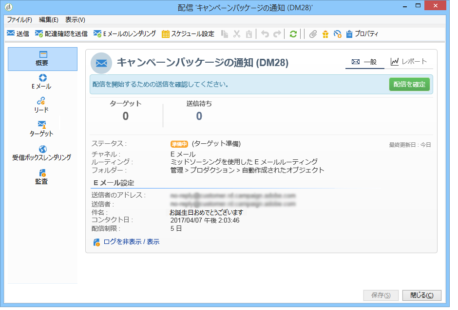
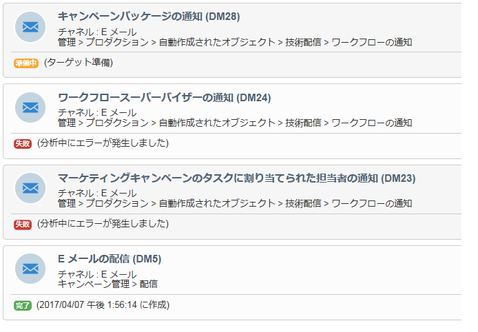
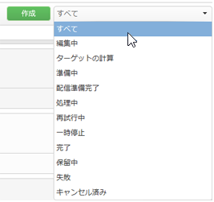
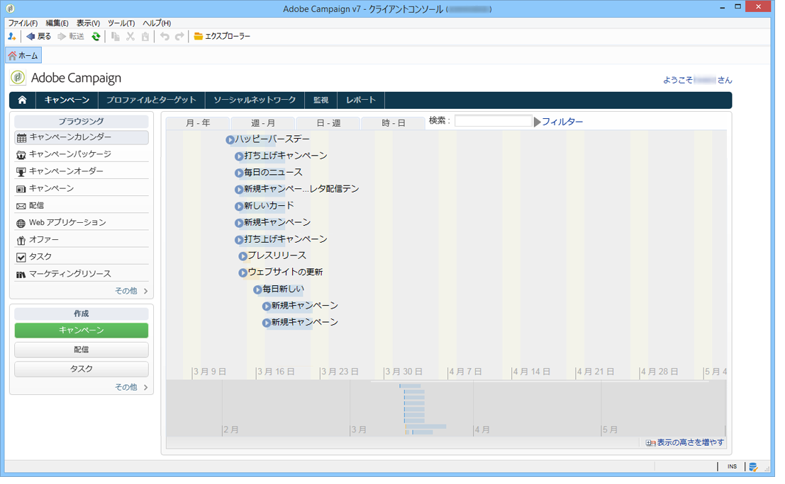
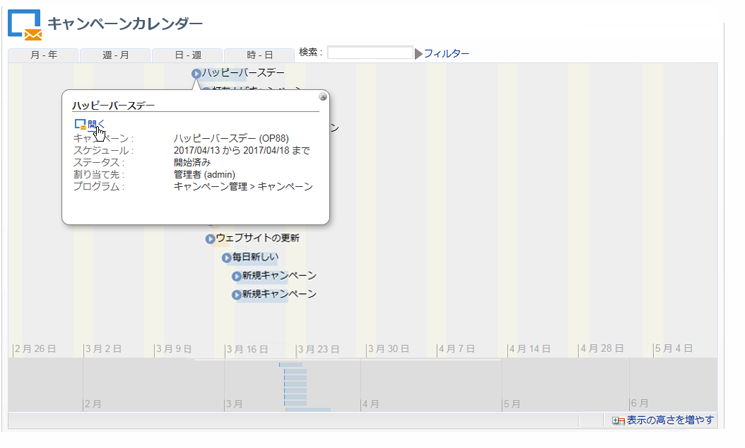
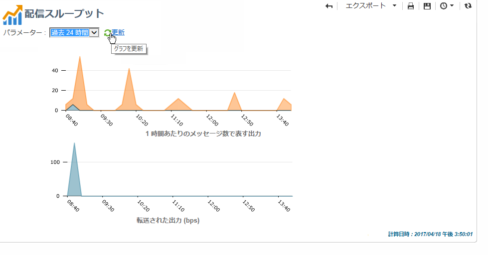

# 配信情報へのアクセス{#accessing-deliveries-information}

## 配信のリストへのアクセス {#accessing-the-list-of-deliveries}

配信のリストにアクセスするには、**[!UICONTROL キャンペーン]**&#x200B;ウィンドウに移動して、「**[!UICONTROL 配信]**」リンクをクリックします。

[エクスプローラービュー](../../platform/using/adobe-campaign-workspace.md#about-adobe-campaign-explorer)を使用している場合は、ツリーの&#x200B;**[!UICONTROL キャンペーン管理／配信]**&#x200B;ノードから、すべての配信にアクセスできます。

>[!NOTE]
>
>Adobe Campaign のワークスペースについては、[この節](../../platform/using/adobe-campaign-workspace.md)で説明しています。

このページでは、配信の概要を表示できます。ここにはデータベース内のすべての配信が表示され、ステータス、成功率、および変更日を確認できます。

>[!NOTE]
>
>情報のフィルターについては、[この節](../../platform/using/filtering-options.md)で説明しています。

配信ウィザードによって、配信を設定し、承認プロセスを開始して送信できます。ウィザードの内容は、通信チャネル（E メール、モバイル、プッシュ、ダイレクトメール）およびオペレーター権限によって異なります。

リスト内の配信を操作するには、配信をクリックします。新しいウィンドウが開き、例えば、配信を確認したり、一時停止したりできます。

配信サイクルのステージに応じて、主なステータスは次のように表示されます。

* キャンセル済み
* 失敗
* 保留中
* 終了
* 一時停止
* 再試行中
* 処理中
* 配信準備完了
* 準備中
* ターゲットの計算
* 編集中

それぞれのステータスには、独自の色とラベルがあります。

「**[!UICONTROL 作成]**」ボタンの横にあるドロップダウンリストを使用して、ステータスに基づいて配信をフィルターできます。

## 配信カレンダーへのアクセス {#accessing-the-delivery-calendar}

配信カレンダーにアクセスするには、**[!UICONTROL キャンペーン]**&#x200B;ウィンドウに移動して、「**[!UICONTROL キャンペーンカレンダー]**」リンクをクリックします。このカレンダーは、キャンペーンの分類を時系列で表示します。月、週、日単位で表示をパーソナライズできます。

配信の名前をクリックして、配信の主要情報を表示します。必要に応じて、「**[!UICONTROL 開く]**」をクリックしてキャンペーンを開くこともできます。

## 配信スループット情報へのアクセス {#accessing-deliveries-throughput-information}

**[!UICONTROL 配信スループット]**&#x200B;ページの情報は、プラットフォームのすべての配信に関連しています。メッセージが配信される速度を測定するには、1 時間に送信されたメッセージの数とメッセージのサイズ（bps）が基準になります。次の例では、最初のグラフに正常な配信を青で、誤った配信をオレンジで示しています。

スループットを計算する時間枠を選択できます。そのためには、ドロップダウンリストから値を選択して、「**[!UICONTROL 更新]**」をクリックします。

>[!NOTE]
>
>ホストインストールまたはハイブリッドインストールで Enhanced MTA にアップグレードした場合、**[!UICONTROL 配信スループット]**&#x200B;ページには E メールの受信者へのスループットが表示されなくなります。Campaign から Enhanced MTA へのメッセージのリレーのスループット速度が表示されます。
>
>Adobe Campaign Enhanced MTA について詳しくは、この[ドキュメント](https://helpx.adobe.com/jp/campaign/kb/campaign-enhanced-mta.html)を参照してください。