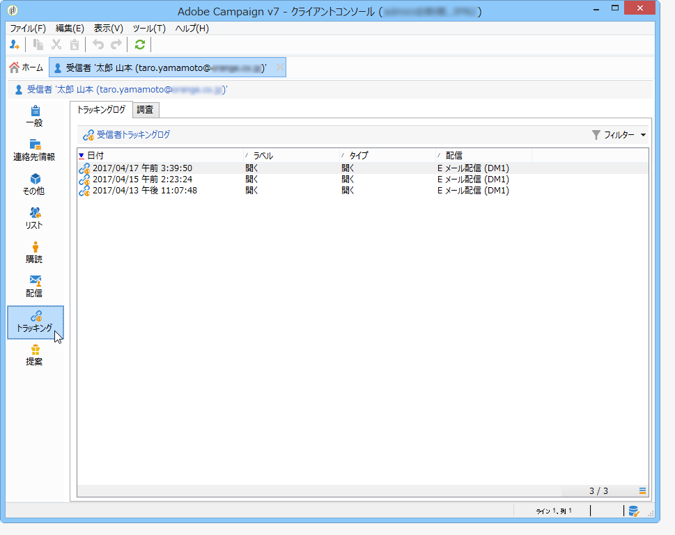
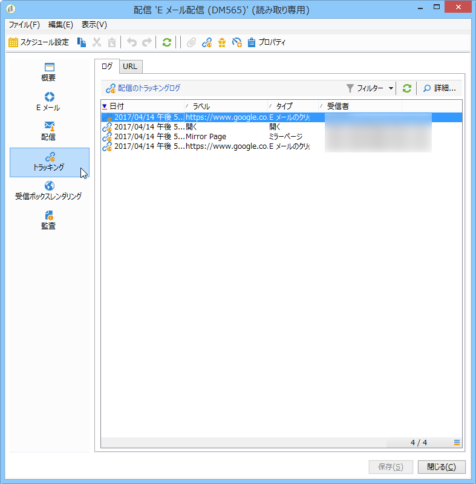

# トラッキングログへのアクセス{#accessing-the-tracking-logs}

When the delivery has been sent and tracking activated, the **[!UICONTROL Tracking]** technical workflow is in charge of retrieving the tracking data. デフォルトでは 1 時間ごとに取得されます。

This information appears in the **[!UICONTROL Tracking]** tab of the profile of recipients targeted by the delivery, as in the following example:

It is also accessible via the **[!UICONTROL Tracking]** tab of the delivery.

>[!NOTE]
>
>If you cannot see the **[!UICONTROL Tracking]** tab of a delivery, it means that tracking has not been activated. [この節](../../delivery/using/how-to-configure-tracked-links.md)を参照してください。
