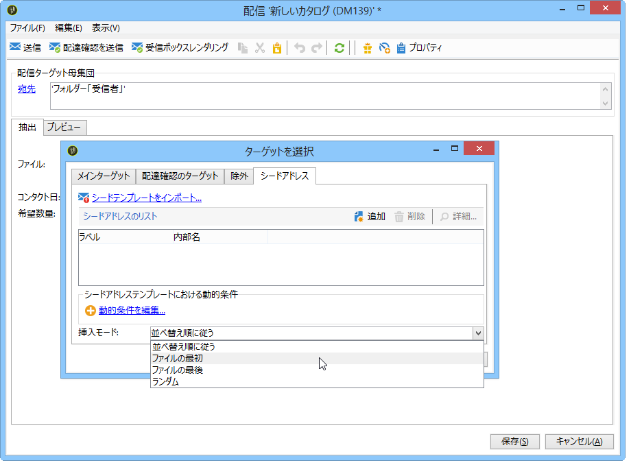
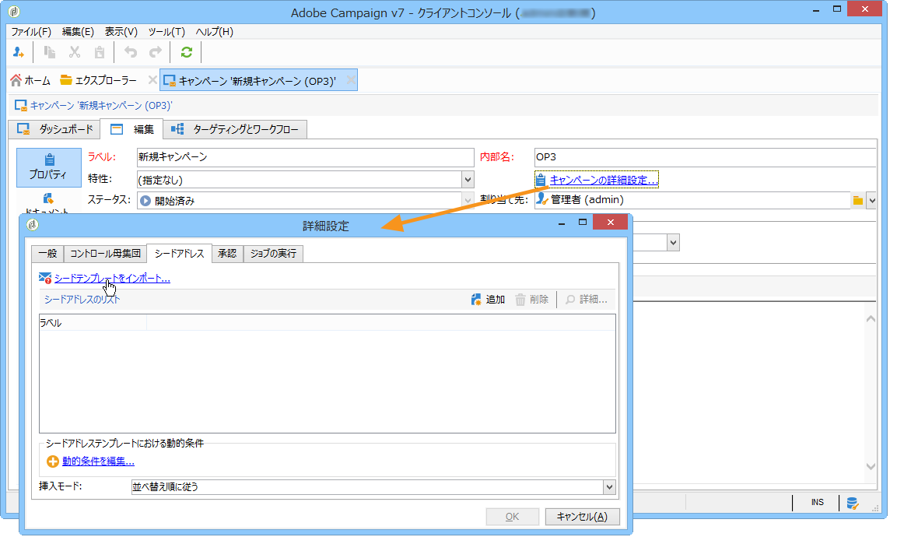

# シードアドレスの追加{#adding-seed-addresses}

## 配信のシードアドレス {#seed-addresses-in-a-delivery}

To add specific seed addresses for a delivery, click the **[!UICONTROL To]** link, then select the **[!UICONTROL Seed addresses]** tab.

次の 3 種類の挿入モードがあります。

1. 単一のシードアドレスを入力する。

   To do this, click the **[!UICONTROL Add]** button and define the content of the address fields. この操作を各アドレスに対して繰り返します。詳しくは、[この節](../../message-center/using/managing-seed-addresses-in-transactional-messages.md#creating-a-seed-address)を参照してください。

1. アドレステンプレートをインポートし、ニーズに合わせて変更する。

   To do this, click the **[!UICONTROL Import seed templates...]** link and select the folder which contains the address templates. 詳しくは、シードアドレステンプレートの作 [成を参照してください](../../delivery/using/creating-seed-addresses.md#creating-seed-address-templates)。

   If necessary, once they are added, you can doucle-click them or click the **[!UICONTROL Detail...]** button to adapt the content of each address.

1. 挿入する制御アドレスを動的に選択する条件を作成する。

   To do this, click the **[!UICONTROL Edit the dynamic condition...]** link, then enter the seed address selection parameters. 例えば、ある特定のフォルダーに格納されているすべてのシードアドレスや、組織の特定の部門に属しているシードアドレスを含めることができます。

   この節では、次の例を示します。使 [用例：条件のシードアドレスの選択](../../delivery/using/use-case--selecting-seed-addresses-on-criteria.md)。

>[!NOTE]
>
>This option is used when the recipient table used is not the default **nms:recipient** table and you are using the Inbox Rendering functionality provided with Adobe Campaign&#39;s **[!UICONTROL Deliverability]** module.
>
>詳しくは、「外部受信者テーブルの使用 [」および「インボックスのレンダリング](../../delivery/using/using-an-external-recipient-table.md) 」のドキュメントを参照 [してください](../../delivery/using/inbox-rendering.md)。

また、配信では、アドレスを抽出ファイルに挿入する際の方法をカスタマイズすることもできます。デフォルトでは出力ファイルの並べ替え順に従って挿入されますが、ファイルの冒頭または末尾に挿入する指定や、メインターゲットの送信者中にランダムに挿入する指定が可能です。

## キャンペーンのシードアドレス {#seed-addresses-in-a-campaign}

To add seed addresses to a target for a campaign, select the operation and click the **[!UICONTROL Edit]** tab.

次に示すよ **[!UICONTROL Advanced campaign settings...]** うに、リンクをク **[!UICONTROL Seed addresses]** リックし、タブをクリックします。

キャンペーンから挿入したシードアドレスは、キャンペーンの各配信のターゲットに追加されます。
