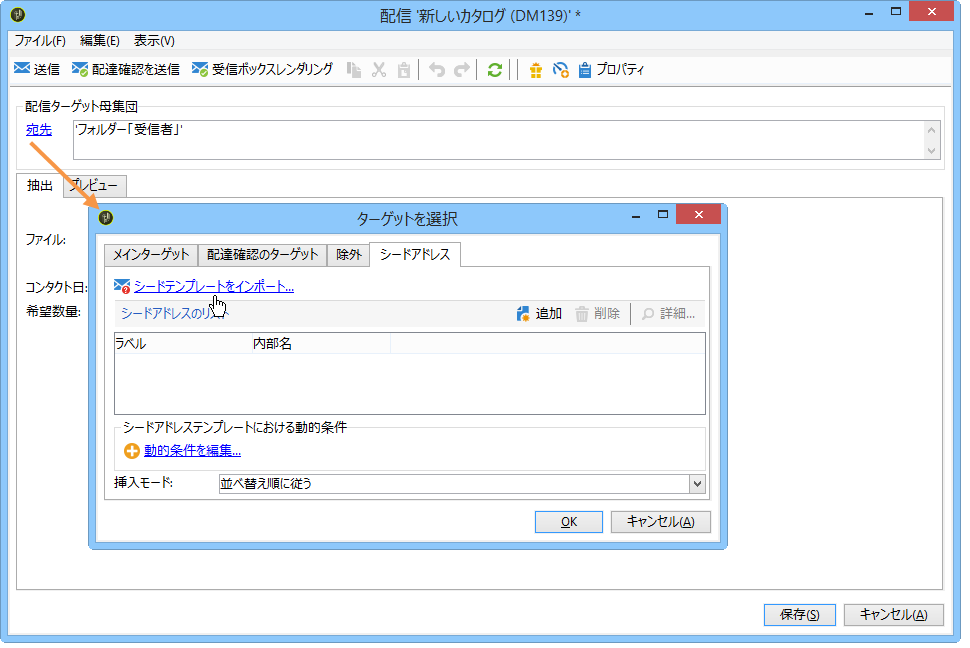

# シードアドレスの追加{#adding-seed-addresses}

## 配信のシードアドレス {#seed-addresses-in-a-delivery}

特定のシードアドレスを配信に追加するには、**[!UICONTROL 宛先]**&#x200B;リンクをクリックし、「**[!UICONTROL シードアドレス]**」タブを選択します。

次の 3 種類の挿入モードがあります。

1. 単一のシードアドレスを入力する。

   そのためには、「**[!UICONTROL 追加]**」ボタンをクリックし、アドレスフィールドの内容を設定します。この操作を各アドレスに対して繰り返します。詳しくは、[この節](../../message-center/using/managing-seed-addresses-in-transactional-messages.md#creating-a-seed-address)を参照してください。

1. アドレステンプレートをインポートし、ニーズに合わせて変更する。

   そのためには、**[!UICONTROL シードテンプレートをインポート...]** リンクをクリックし、アドレステンプレートを含んだフォルダーを選択します。詳しくは、[シードアドレステンプレートの作成](../../delivery/using/creating-seed-addresses.md#creating-seed-address-templates)を参照してください。

   必要な場合は、アドレスを追加した後にアドレスをダブルクリックするか、「**[!UICONTROL 詳細]**」ボタンをクリックして、各アドレスの内容を変更します。

1. 挿入する制御アドレスを動的に選択する条件を作成する。

   そのためには、**[!UICONTROL 動的条件を編集...]** リンクをクリックし、シードアドレスの選択パラメーターを入力します。例えば、ある特定のフォルダーに格納されているすべてのシードアドレスや、組織の特定の部門に属しているシードアドレスを含めることができます。

   この例については、[使用例：条件によるシードアドレスの選択](../../delivery/using/use-case--selecting-seed-addresses-on-criteria.md)の節で説明しています。

>[!NOTE]
>
>このオプションを選択するのは、デフォルトの **nms:recipient** テーブル以外の受信者テーブルを使用し、Adobe Campaign の&#x200B;**[!UICONTROL 配信品質]**&#x200B;モジュールに備わっている受信ボックスレンダリング機能を利用する場合です。
>
>詳しくは、[外部の受信者テーブルの使用](../../delivery/using/using-an-external-recipient-table.md)および[受信ボックスレンダリング](../../delivery/using/inbox-rendering.md)に関するドキュメントを参照してください。

また、配信では、アドレスを抽出ファイルに挿入する際の方法をカスタマイズすることもできます。デフォルトでは出力ファイルの並べ替え順に従って挿入されますが、ファイルの冒頭または末尾に挿入する指定や、メインターゲットの送信者中にランダムに挿入する指定が可能です。

## キャンペーンのシードアドレス {#seed-addresses-in-a-campaign}

キャンペーンのターゲットにシードアドレスを追加するには、キャンペーンを選択し、「**[!UICONTROL 編集]**」タブをクリックします。

次のように、「**[!UICONTROL キャンペーンの詳細設定]**」リンクをクリックし、「**[!UICONTROL シードアドレス]**」タブを選択します。

キャンペーンから挿入したシードアドレスは、キャンペーンの各配信のターゲットに追加されます。
