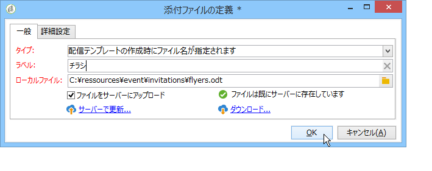

# ファイルの添付{#attaching-files}

## E メールの添付ファイルについて {#about-email-attachments}

E メール配信には 1 つまたは複数のファイルを添付できます。次の 2 つの場合が考えられます。

* ファイルを選択し、そのまま配信に添付する。
* 添付ファイルのコンテンツを受信者ごとにパーソナライズする。In this case, you need to create a **calculated attachment**: the name of the attachment is computed at the time of delivery for each message depending on the recipient. また、**Variable Digital Printing** オプションがインストールされている場合は、コンテンツをパーソナライズし、配信時に PDF 形式に変換して添付することもできます。

>[!NOTE]
>
>多くの場合、このタイプの設定は配信テンプレートを使用して実行されます。For more on this, refer to [About templates](../../delivery/using/about-templates.md).

## ローカルファイルの添付 {#attaching-a-local-file}

ローカルファイルを配信に添付するには、次の手順に従います。

>[!NOTE]
>
>配信には複数のファイルを添付できます。 添付ファイルは、任意の形式（Zip形式を含む）で指定できます。

1. リンクをクリック **[!UICONTROL Attachments]** します。
1. ボタンをク **[!UICONTROL Add]** リックし、をク **[!UICONTROL File...]** リックして、配信に添付するファイルを選択します。

また、「配信」フィールドにファイルを直接ドラッグ&amp;ドロップする **[!UICONTROL Attachments]** ことも、配信ウィザードのツー **[!UICONTROL Attach]** ルバーからアイコンを使用することもできます。

1. ファイルを選択すると、そのファイルは直ちにサーバーにアップロードされ、配信時に使用できるようになります。 フィールドにリスト表示さ **[!UICONTROL Attachments]** れます。

## 自動生成添付ファイルの作成 {#creating-a-calculated-attachment}

自動生成添付ファイルを作成する際には、各メッセージの分析または配信時にファイル名を生成させることができ、受信者に応じて異なるファイル名を付けることができます。また、内容をパーソナライズして PDF に変換することもできます。

パーソナライズされた添付ファイルを作成するには、次の手順に従います。

1. リンクをクリック **[!UICONTROL Attachments]** します。
1. ボタンをクリ **[!UICONTROL Add]** ックし、を選択しま **[!UICONTROL Calculated attachment]**&#x200B;す。
1. Select the type of calculation from the **[!UICONTROL Type]** drop-down list:

次のオプションを使用できます。

* **配信テンプレートの作成時にファイル名を生成**
* **メッセージの配信中にファイルのコンテンツはパーソナライズされて PDF に変換**
* **配信分析時にファイル名を生成（受信者プロファイルは利用不可）**
* **メッセージの配信中にファイル名を生成（受信者プロファイルを利用可）**

### ローカルファイルの添付 {#attach-a-local-file}

If the attachment is a local file, select the option: **[!UICONTROL File name is specified when creating the delivery template]**. ファイルはローカルで選択され、サーバーにアップロードされます。次の手順に従います。

1. Select the file to upload in the **[!UICONTROL Local file]** field.
1. 必要な場合はラベルを指定します。このラベルは、メッセージングシステム上でファイル名の代わりに表示されます。指定しない場合はデフォルトでファイル名が表示されます。

   

1. 必要に応じて、を選択 **[!UICONTROL Upload file on the server]**&#x200B;し、をクリックして **[!UICONTROL Update on server]** 転送を開始します。

   

   このファイルは、サーバー上で、このテンプレートから作成された別の配信に添付できるようになります。

### パーソナライズされたメッセージの添付 {#attach-a-personalized-message}

このオプション **[!UICONTROL The file content is personalized and converted into PDF format at the time of delivery for each message]** を使用すると、対象の受信者の姓と名など、パーソナライゼーションフィールドの罰金を選択できます。

このタイプの添付ファイルについては、次の設定手順に従います。

1. アップロードするファイルを選択します。

   >[!NOTE]
   >
   >ソースファイルは LibreOffice で作成する必要があります。インスタンスは、[この節](../../installation/using/before-starting.md)で説明されている前提条件に沿って設定されている必要があります。

1. 必要な場合はラベルを指定します。
1. を選択 **[!UICONTROL Upload file on the server]**&#x200B;し、をクリックして転 **[!UICONTROL Update on server]** 送を開始します。
1. プレビューを表示するには、受信者を選択します。

   

1. 配信を分析し、開始します。

   各受信者に、配信に添付されたパーソナライズ済み PDF が届きます。

   

### 計算ファイルの添付 {#attach-a-calculated-file}

配信の準備中に添付ファイルの名前を計算できます。To do this, select the option **[!UICONTROL The file name is calculated during delivery analysis (it cannot depend on the recipient)]**.

>[!NOTE]
>
>このオプションは、配信が外部のプロセスまたはワークフローによって送信される場合にのみ使用されます。

1. 添付ファイルに適用するラベルを指定します。
1. 定義ウィンドウで、ファイルのパスと正確な名前を指定します。

   >[!CAUTION]
   >
   >ファイルはサーバー上に置かれている必要があります。

   

1. 配信を分析し、開始します。

   ファイル名の処理は分析ログに記録されます。

   

### パーソナライズされたファイルの添付 {#attach-a-personalized-file}

添付ファイルを選択する際に、このオプションを選択できま **[!UICONTROL The file name is calculated during delivery for each recipient (it can depend on the recipient)]**&#x200B;す。 その後、送信するファイル名と受信者のパーソナライズデータをマップできます。

>[!NOTE]
>
>このオプションは、配信が外部のプロセスまたはワークフローによって送信される場合にのみ使用されます。

1. 添付ファイルに適用するラベルを指定します。
1. 定義ウィンドウで、ファイルのパスと正確な名前を指定します。ファイル名をパーソナライズする場合は、パーソナライゼーションフィールドを使用して適切な値を取得できます。

   

   >[!CAUTION]
   >
   >ファイルはサーバー上に置かれている必要があります。

1. 配信を分析し、開始します。

   下の例では、結合フィールドを使用して定義されたファイル名に基づいて添付ファイルを選択しています。

   

### 添付ファイルの設定 {#attachment-settings}

最初の2つのオプションは、適切なオプションを選 **[!UICONTROL Upload file on the server]** 択することで選択できます。 このリン **[!UICONTROL Update the file on the server]** クを使用して、アップロードを開始できます。

ファイルがアップロードされていることを示す、次のようなメッセージが表示されます。

ファイルが変更されている場合は、次のような警告メッセージが表示されます。

The **[!UICONTROL Advanced]** tab lets you define advanced options on attached files:

* フィルターオプションを指定すると、添付ファイルの送り先とする受信者を限定できます。このオプション **[!UICONTROL Enable filtering of recipients who will receive the attachment]** は、受信者選択スクリプトの定義に使用する入力フィールドをアクティブにします。このフィールドはJavaScriptで入力する必要があります。
* ファイル名をパーソナライズするためのスクリプトを指定できます。

   ウィンドウにテキストを入力し、ドロップダウンリストから使用可能なパーソナライゼーションフィールドを選択します。次の例では、ファイル名がパーソナライズされ、今日の日付と受信者の名前が含まれています。

   
