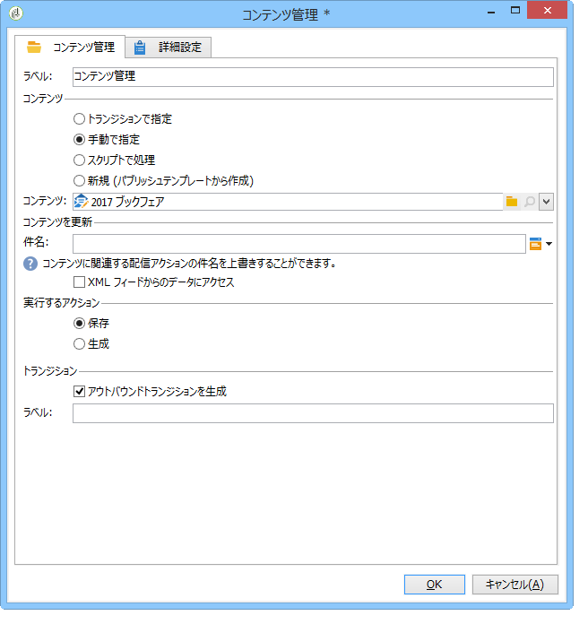

# ワークフローを使用した自動化{#automating-via-workflows}

## コンテンツ管理アクティビティ {#content-management-activity}

Adobe Campaign のクライアントインターフェイスで設定したワークフローを使用して、コンテンツの作成、編集およびパブリッシュを自動化できます。

**コンテンツ管理**&#x200B;アクティビティには、ワークフローダイアグラムの&#x200B;**[!UICONTROL ツール]**&#x200B;ツールバーからアクセスします。

アクティビティのプロパティは、次の 4 つの手順に分類されます。

* **[!UICONTROL コンテンツ]**：既存のコンテンツを入力することも、コンテンツを作成することもできます。
* **[!UICONTROL コンテンツを更新]**：XML データの流れを利用してコンテンツの件名を変更したり、コンテンツを更新したりできます。
* **[!UICONTROL 実行するアクション]**：コンテンツを保存または生成できます。
* **[!UICONTROL トランジション]**：出力トランジションを生成するかどうかを選択し、名前を付けることができます。



### コンテンツ {#content}

* **トランジションで指定**

   使用するコンテンツは以前作成したものです。プロセスでは、受信イベントで伝搬されるコンテンツインスタンスが使われます。コンテンツ識別子には、イベントの「contentId」変数を使用してアクセスします。

* **明示**

   以前作成したコンテンツを選択できます。

* **スクリプトで計算**

   JavaScript テンプレートに基づいてコンテンツインスタンスを選択します。評価するコードを使用して、コンテンツ識別子を取得できます。

* **新規（パブリッシュテンプレートから作成）**

   パブリッシュテンプレートを使用して、新しいコンテンツを作成します。コンテンツインスタンスは、設定済みの「文字列」フォルダーに保存されます。

### コンテンツを更新 {#update-the-content}

* **件名**

   パブリッシュ時に配信アクションの件名を変更できます。

* **XML フィードからデータにアクセス**

   コンテンツは、外部ソースからの XML フィードで更新されます。データのダウンロードを実行するための URL を入力する必要があります。

   XSL スタイルシートを使用して、受信する XML データを変換できます。

### 実行するアクション {#action-to-execute}

* **保存**

   作成または変更したコンテンツを保存します。保存されたコンテンツの識別子は、送信イベントの「contentId」変数で伝搬されます。

* **生成**

   「ファイル」タイプのパブリッシュによって、変換テンプレートごとに出力ファイルを生成します。生成されたファイルごとに送信トランジションが有効化されます。パラメーターは、「contentId」変数に保存されているコンテンツの識別子と、「filename」変数に保存されているファイル名です。

### トランジション {#transition}

「**アウトバウンドトランジションを生成**」オプションを使用して、**[!UICONTROL コンテンツ管理]**&#x200B;アクティビティに出力トランジションを追加し、新しいアクティビティをワークフローの実行にリンクできます。このオプションをオンにしてから、トランジションのラベルを入力します。

## 例 {#examples}

### コンテンツの作成および配信の自動化 {#automating-content-creation-and-delivery}

次の例では、コンテンツブロックの作成および配信を自動化します。


コンテンツは、「コンテンツ管理」アクティビティを使用して設定します。


新しいコンテンツインスタンスは、パブリッシュモデルとコンテンツ文字列のフォルダーを使用して作成されます。

この例では、配信の件名がオーバーロードされています。この件名が、**[!UICONTROL 配信]**&#x200B;テンプレートに入力された件名の代わりに使用されるようになります。

コンテンツは、入力された URL から呼び出される XML フィードで自動的に設定されます。

```
<?xml version='1.0' encoding='ISO-8859-1'?>
<book name="Content automation test" date="2008/06/08" language="eng" computeString="Content automation test">
  <section id="1" name="Introduction">
    <page>Introduction to input forms.</page>
  </section>
</book>
```

データフォーマットがパブリッシュテンプレート（この例では **cus:book**）に入力したデータスキーマと一致していないので、**`<section>`** 要素を **`<chapter>`** 要素で置き換える必要があります。「cus:book-workflow.xsl」スタイルシートを適用して、必要な変更をおこなう必要があります。

使用する XSLT スタイルシートのソースコード：

```
<?xml version="1.0" encoding="utf-8"?>
<xsl:stylesheet version="1.0" xmlns:xsl="http://www.w3.org/1999/XSL/Transform">
 <xsl:output indent="yes" method="xml"  encoding="ISO-8859-1"/>

 <xsl:template match="text()|@*"/>

  <xsl:template match="*">
    <xsl:variable name="element.name" select="name(.)"/>
    <xsl:element name="{$element.name}">
      <xsl:copy-of select="text()|@*"/>
      <xsl:apply-templates/>
    </xsl:element>
  </xsl:template>

  <xsl:template match="book">
  <book name="test">
     <xsl:apply-templates/>
    <book>
 </xsl:template>

  <xsl:template match="section">
    <chapter>
      <xsl:for-each select="@*">
        <xsl:copy-of select="."/>
      </xsl:for-each>
       <xsl:apply-templates/>
    </chapter>
  </xsl:template>
  
</xsl:stylesheet>
```

アクティビティの最後のアクションは、コンテンツインスタンスを保存して、次のタスクに進むことです。

ターゲティングは、**クエリ**&#x200B;アクティビティによって実行されます。

ターゲットのクエリとコンテンツの更新が完了した場合にのみ配信を開始するように、**AND 結合**&#x200B;アクティビティが追加されています。

配信アクションは、**配信**&#x200B;アクティビティを使用して設定します。


テンプレートをベースとして、新しい配信アクションが作成されます。

アクティビティの配信テンプレートを使用して、パブリッシュテンプレートの変換テンプレートを選択します。コンテンツ生成では、配信テンプレートを持たない、またはアクティビティと同じテンプレートを使用して参照される、すべての HTML テンプレートおよびテキストテンプレートが対象とするようになります。

配信するターゲットは、受信イベントを使用して入力します。

配信コンテンツは、受信イベントを使用して入力します。

アクティビティの最後のアクションは、配信を準備し、開始することです。

### コンテンツを作成して後でパブリッシュ {#creating-content-and-publishing-it-later}

この例では、コンテンツブロックを作成し、特定の時間が経過した後にファイルのパブリッシュを開始します。


最初の&#x200B;**コンテンツ管理**&#x200B;タスクがコンテンツインスタンスを作成します。


>[!NOTE]
>
>変換テンプレートウィンドウの「**[!UICONTROL パブリッシュ]**」タブに、生成するターゲットのロケーションを設定する必要があります。

次のトランジションを 1 週間一時停止するために、待機アクティビティを追加します。


この期間中にコンテンツを手動で入力します。

次のタスクがコンテンツ生成を開始します。


パブリッシュするコンテンツは、受信イベントを使用して入力します。

最後のアクションは、パブリッシュディレクトリを指定して、このコンテンツを生成することです。

**JavaScript コード**&#x200B;アクティビティが、生成された各ファイルの完全な名前を取得します。


### 配信とコンテンツの作成 {#creating-the-delivery-and-its-content}

この例も最初の例と同じ考え方です。最初の手順では、配信アクションを作成するだけです。


最初の&#x200B;**配信を作成**&#x200B;タスクが配信アクションを作成します。

分岐アクティビティを使用して、ターゲットの計算とコンテンツインスタンスの作成を同時に開始できます。

タスクを実行すると、AND 結合ボックスが&#x200B;**配信**&#x200B;タスクを有効化して、以前作成したコンテンツとターゲティングで配信を開始します。


開始する配信アクションは、トランジションを使用して入力します。

配信するターゲットは、受信イベントを使用して入力します。

配信コンテンツは、受信イベントを使用して入力します。

アクティビティの最後のアクションは、配信を準備し、開始することです。

### FTP からコンテンツをインポート {#importing-content-from-ftp}

FTP または SFTP サーバー上の HTML ファイルに配信コンテンツが格納されている場合、このコンテンツを Adobe Campaign 配信に容易に読み込むことができます。[この例](../../workflow/using/loading-delivery-content.md)を参照してください。

### Amazon Simple Storage Service（S3）コネクタからのコンテンツのインポート {#importing-content-from-amazon-simple-storage-service--s3--connector}

配信コンテンツが Amazon Simple Storage Service（S3）バケットにある場合、このコンテンツを Adobe Campaign 配信に容易に読み込むことができます。[この例](../../workflow/using/loading-delivery-content.md)を参照してください。

## 半自動更新 {#semi-automatic-update}

コンテンツデータは、「半自動」モードで更新できます。このデータは、URL を介して XML フィードから復元できます。

データ復元の有効化は、入力フォームから手動で実行します。

その目的は、フォーム内に **editBtn** タイプの **`<input>`** フィールドを宣言することです。このコントロールは、編集領域と、処理を開始するためのボタンで構成されます。

編集領域では、取得するデータの XML フィードの URL を生成するために使用する可変データを入力できます。

ボタンは、**`<input>`** タグの下に入力された **GetAndTransform** SOAP メソッドを実行します。

フォーム内のコントロールの宣言は、次のようになります。

```
<input type="editbtn" xpath="<path>">
  <enter>
    <soapCall name="GetAndTransform" service="ncm:content">
      <param exprIn="<url>" type="string"/>
      <param exprIn="'xtk:xslt|<style sheet>'" type="string"/>
      <param type="DOMElement" xpathOut="<output path>"/>
    </soapCall>
  </enter>
</input>
```

**GetAndTransform** メソッドは、**`<input>`** タグの **`<enter>`** 要素の下で宣言する必要があります。このタグは、動的に生成される式から、XML データを復元する URL をパラメーターとして取得します。この関数の 2 番目のパラメーター設定は任意で、取得した XML データがコンテンツと同じフォーマットではない場合に、中間変換で使用されるスタイルシートを参照します。

出力では、最後のパラメーターに入力されたパスをベースとして、コンテンツを更新します。

**例**：この例を、「cus:book」スキーマを使用して説明します。

半自動更新編集コントロールの入力フォームを追加します。


```
<input label="File name" type="editbtn" xpath="/tmp/@name">
  <enter>
    <soapCall name="GetAndTransform" service="ncm:content">
      <param exprIn="'https://server/incoming/' + [/tmp/@name] + '.xml'" type="string"/>
      <param exprIn="'xtk:xslt|cus:book-workflow.xsl'" type="string"/>
      <param type="DOMElement" xpathOut="."/>
    </soapCall>
  </enter>
</input>
```

編集領域で、取得するファイルの名前を入力できます。URL は、この名前をベースとして生成されます（例：https://server/incomin/data.xml）。

取得するデータのフォーマットは、ワークフローの自動化の例 1 と同じです。この例の「cus:book-workflow.xsl」スタイルシートを使用する必要があります。

ジョブの実行結果によって、パス「.」からコンテンツインスタンスが更新されます。
