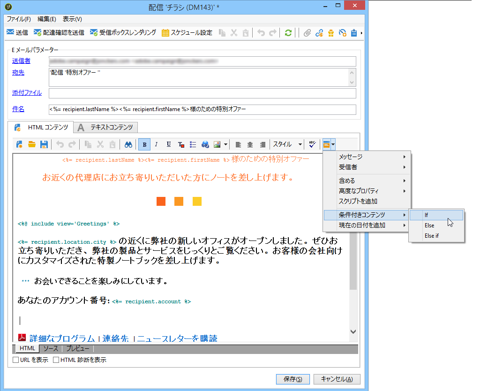
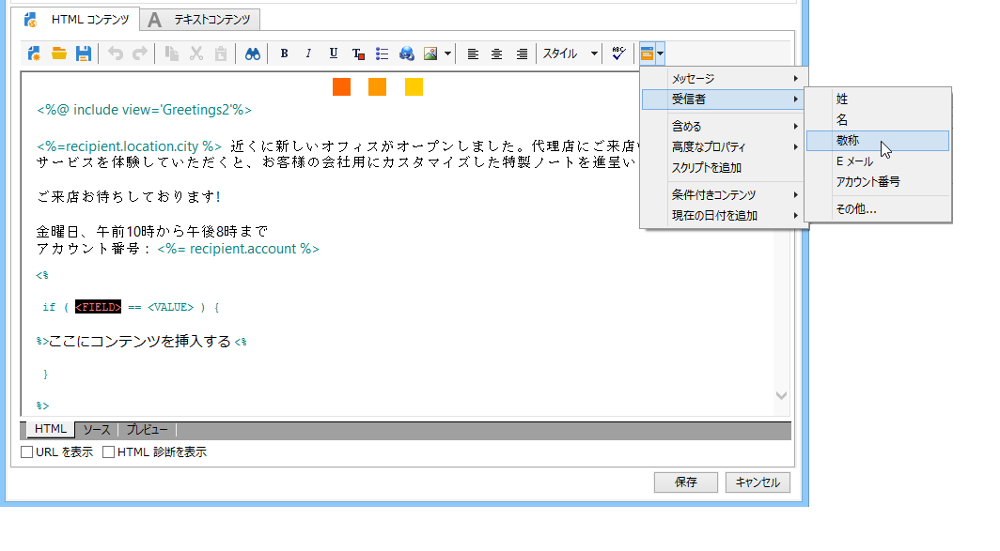
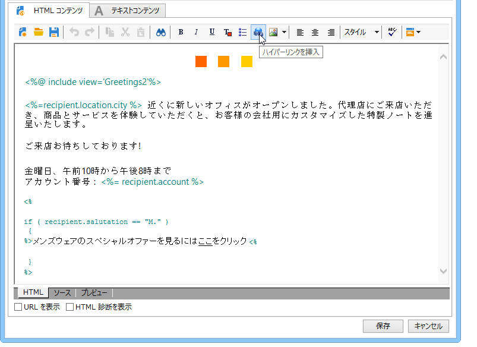
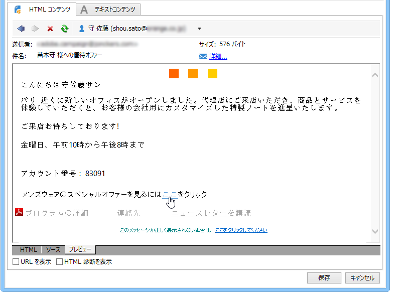
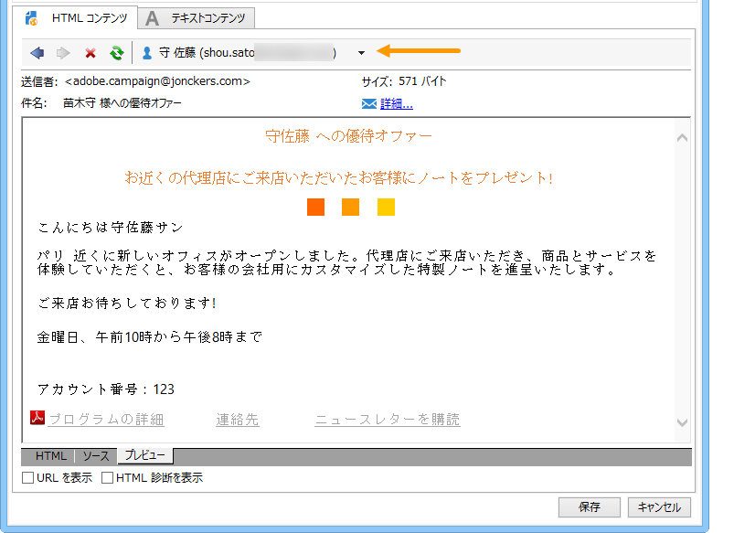
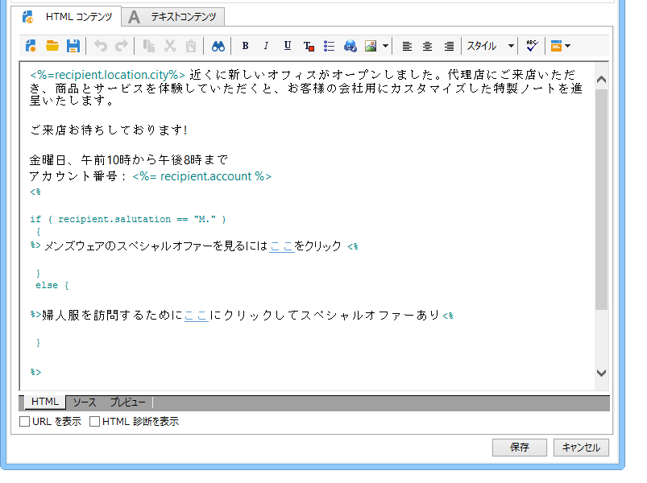
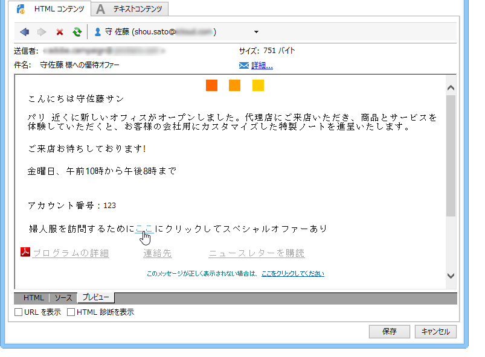

# 条件付きコンテンツ{#conditional-content}

条件付きコンテンツフィールドを設定することで、例えば受信者のプロファイルに基づいて動的パーソナライゼーションを作成できます。特定の条件が成立した場合に、テキストブロックや画像を切り替えることができます。

## E メール内での条件の使用 {#using-conditions-in-an-email}

次の例では、受信者の性別と興味の対象に基づいて動的にパーソナライズされるメッセージを作成する方法について説明します。

* 「Mr.」と表示する 「Ms」 データソース内のフ **[!UICONTROL Gender]** ィールド（MまたはF）の値に従って、
* 顧客が表明した関心事項や検出された関心事項に基づいて、次のようにニュースレターや優待販売案内の構成をパーソナライズする

   * 興味 1 -- > ブロック 1
   * 興味 2 -- > ブロック 2
   * 興味 3 -- > ブロック 3
   * 興味 4 -- > ブロック 4

あるフィールドの値に基づく条件付きコンテンツを作成するには、次の手順に従います。

1. パーソナライゼーションアイコンをクリックし、「」を選択しま **[!UICONTROL Conditional content > If]**&#x200B;す。

   

   パーソナライゼーション要素がメッセージ本文に挿入されます。それらを設定する必要があります。

1. 次に、**If** 式のパラメーターを入力します。

   手順は次のとおりです。

   * Select the first element of the expression, **`<field>`**, (by default, this element is highlighted during insertion of the **if** expression) and click the personalization icon to replace it with the test field.

      

   * Replace **`<value>`** with the value of the field for which the condition will be satisfied. この値は二重引用符で囲む必要があります。
   * 条件が成立したときに挿入するコンテンツを指定します。このコンテンツにはテキスト、画像、フォーム、ハイパーテキストリンクなどを含めることができます。

      

1. Click the **[!UICONTROL Preview]** tab to view the content of the message according to the delivery recipient:

   * 条件が成立する受信者を選択した場合：

      

   * 条件が成立しない受信者を選択した場合：

      

さらに多くの場合分けを追加し、1 つまたは複数のフィールドに基づいてコンテンツの切り替えを定義することもできます。これを行うには、とを使用 **[!UICONTROL Conditional content > Else]** します **[!UICONTROL Conditional content > Else if]**。 式の設定方法は、**If** 式の場合と同様です。



>[!CAUTION]
>
>**Else** 条件や **Else if** 条件を追加した後は、JavaScript の構文を尊重するために、**%> &lt;%** の文字を削除する必要があります。

Click **[!UICONTROL Preview]** and select a recipient to view the conditional content.



## 多言語の E メールの作成 {#creating-multilingual-email}

以下の例では、多言語の E メールを作成する方法について説明します。コンテンツは、受信者の優先言語に基づいて、いずれかの言語で表示されます。

1. E メールを作成し、ターゲット母集団を選択します。この例では、表示するバージョンを決定する条件は、受信者のプロファイルの&#x200B;**言語**&#x200B;の値に基づいています。この例では、これらの値は **EN**、**FR**、**ES** に設定されています。
1. In the email HTML content, click the **[!UICONTROL Source]** tab and paste the following code:

   ```
   <% if (language == "EN" ) { %>
   <DIV id=en-version>Hello <%= recipient.firstName %>,</DIV>
   <DIV>Discover your new offers!</DIV>
   <DIV><a href="https://www.adobe.com/products/en">www.adobe.com/products/en</A></FONT></DIV><%
    } %>
   <% if (language == "FR" ) { %>
   <DIV id=fr-version>Bonjour <%= recipient.firstName %>,</DIV>
   <DIV>Découvrez nos nouvelles offres !</DIV>
   <DIV><a href="https://www.adobe.com/products/fr">www.adobe.com/products/fr</A></DIV><%
    } %>
    <% if (language == "ES" ) { %>
   <DIV id=es-version><FONT face=Arial>
   <DIV>Olà <%= recipient.firstName %>,</DIV>
   <DIV>Descubra nuestros nuevas ofertas !</DIV>
   <DIV><a href="https://www.adobe.com/products/es">www.adobe.com/products/es</A></DIV>
   <% } %>
   ```

1. Test email content in the **[!UICONTROL Preview]** tab by selecting recipients with different preferred languages.

   >[!NOTE]
   >
   >この E メールコンテンツには代替バージョンが定義されていないので、E メールを送信する前にターゲット母集団をフィルタリングしてください。
