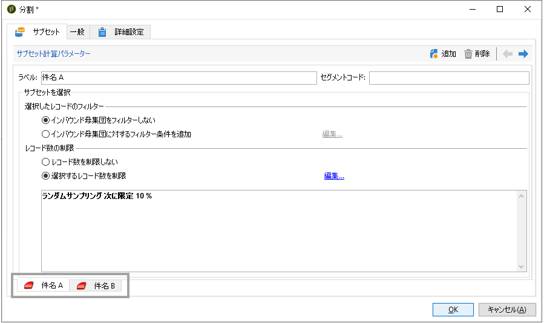
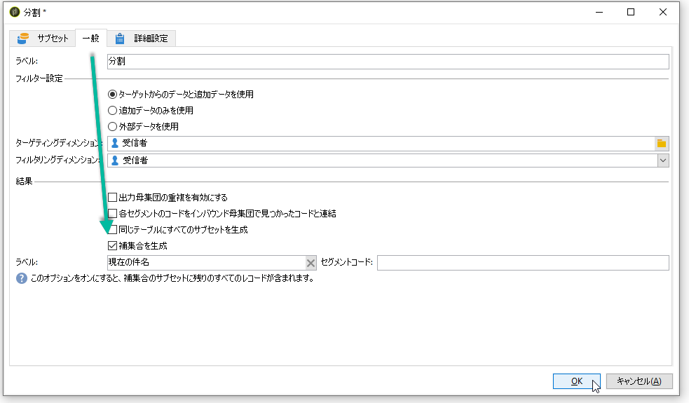
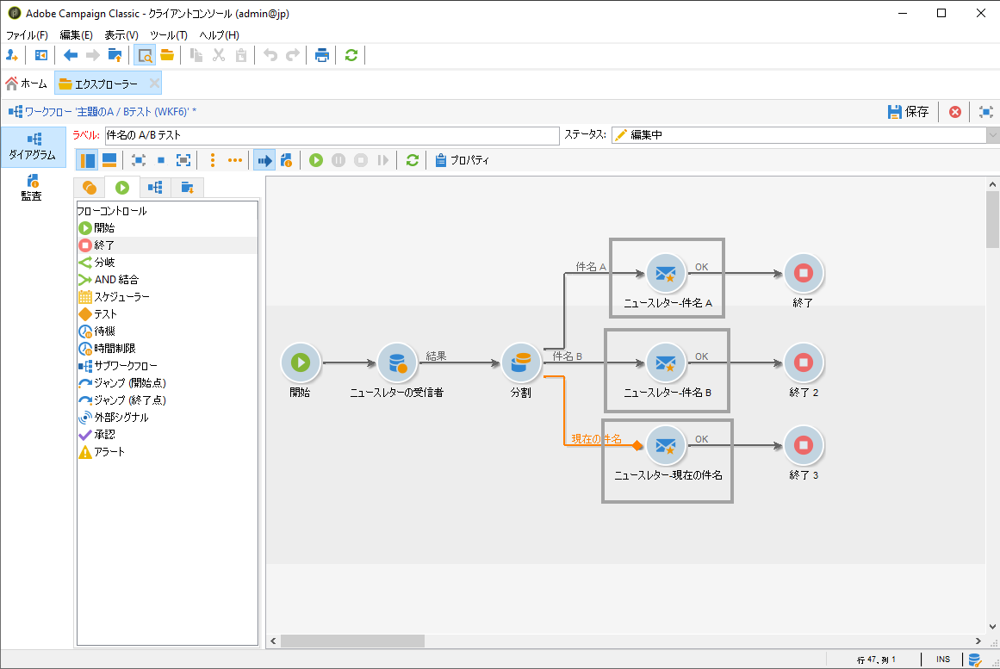

# A/Bテストの設定{#configuring-a-b-testing}

ここでは、A/Bテストを実行するワークフローを構築する方法について説明します。

1. 新しいワークフローを作成し、必要な母集団をターゲットする[クエリ](../../workflow/using/query.md)アクティビティを設定します。

1. 追加[分割](../../workflow/using/split.md)アクティビティ。ターゲット母集団を複数のサブセットに分割します。

1. アクティビティを開き、必要に応じて各サブセットを設定します。 **[!UICONTROL Split]**&#x200B;アクティビティの構成方法の詳細については、[この](../../workflow/using/split.md)を参照してください。

   この例では、対象となる訪問者の10%に対して各テーマを提示し、ニュースレター用に2つの新しい主題をテストします。

   

1. 現在追加の件名を含むニュースレターを残りの訪問者に送信するトランジションです。 これを行うには、**[!UICONTROL 一般]**&#x200B;タブの&#x200B;**[!UICONTROL 補数を生成]**&#x200B;オプションを有効にします。

   

1. サブセットごとに、テストする配信のバージョンを追加します。

   

これで、ワークフローを開始できます。配信が送信されると、配信ログ内の3つのサブセットの動作を追跡して、どのサブセットが最も成功したかを確認できます。

また、ワークフローを使用すると、より良いパフォーマンスを示した配信バリアントを自動的に識別し、残りの訪問者に送信することで、プロセスを自動化できます。 詳しくは、この専用の[使用例](../../delivery/using/a-b-testing-use-case.md)を参照してください。
