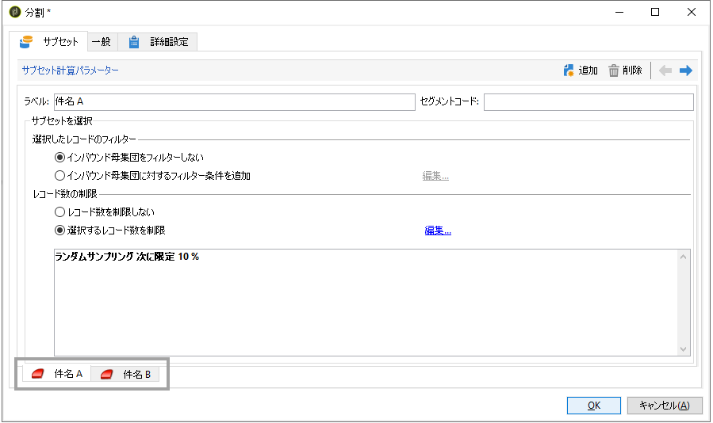
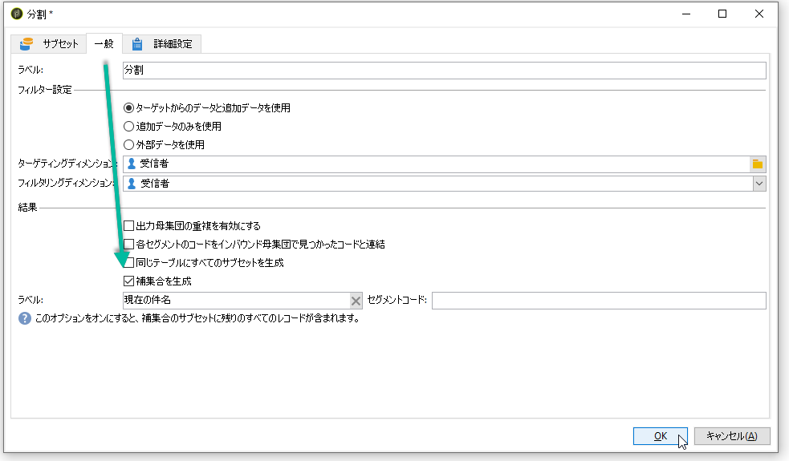
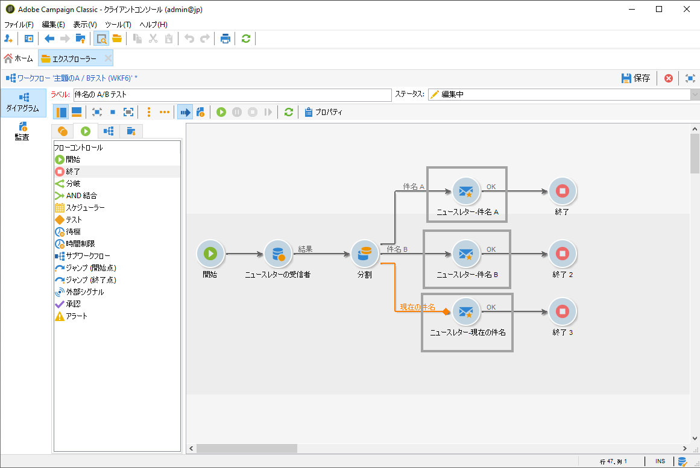

# A/B テストの設定 {#configuring-a-b-testing}

この節では、A/B テストを実行するワークフローを構築する方法について説明します。

1. 新しいワークフローを作成し、目的の母集団をターゲットに設定するクエリアクティビティを設定します。 詳しくは、[Campaign v8 ドキュメント](https://experienceleague.adobe.com/docs/campaign/automation/workflows/wf-activities/targeting-activities/query.html?lang=ja){target="_blank"}を参照してください。

1. 分割アクティビティを追加して、ターゲット母集団を複数のサブセットに分割します。 [Campaign v8 ドキュメント](https://experienceleague.adobe.com/docs/campaign/automation/workflows/wf-activities/targeting-activities/split.html?lang=ja){target="_blank"}を参照してください。

1. アクティビティを開き、必要に応じて各サブセットを設定します。 **[!UICONTROL 分割]**&#x200B;アクティビティの設定方法の詳細については、[こちらの節](../../workflow/using/split.md)を参照してください。

   この例では、ニュースレター用の 2 つの新しい件名を、それぞれターゲット母集団の 10%に提示して、テストをおこないます。

   

1. その他の母集団に、現在の件名でニュースレターを送信するためにトランジションを追加します。 これをおこなうには、「**[!UICONTROL 一般]**」タブの「**[!UICONTROL 補集合を生成]**」オプションを有効にします。

   

1. サブセットごとに、テストする配信のバージョンを追加します。

   

これで、ワークフローを開始できます。 配信が送信されると、3 つのサブセットの動作を配信ログでトラッキングして、どの件名が最も成功したかを確認できます。

また、ワークフローを使用すると、プロセスの自動化が可能です。より良いパフォーマンスを示した配信バリアントを自動的に識別して、その他の母集団に送信できます。 詳しくは、この専用の[ユースケース](a-b-testing-use-case.md)を参照してください。
