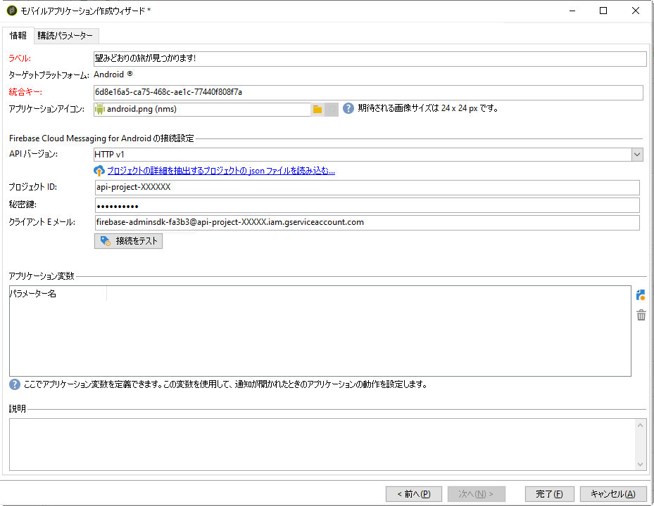
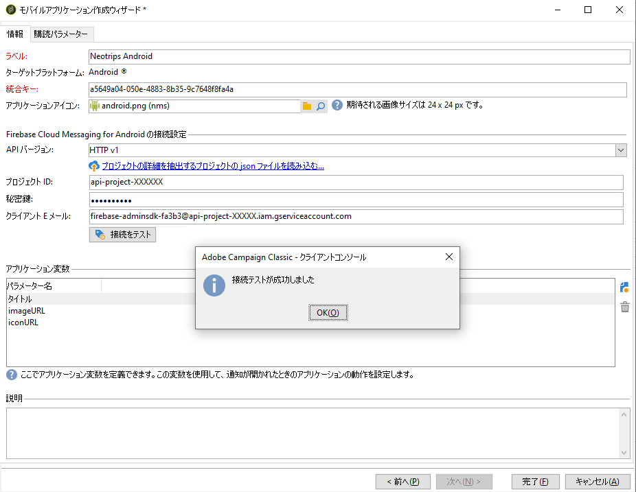
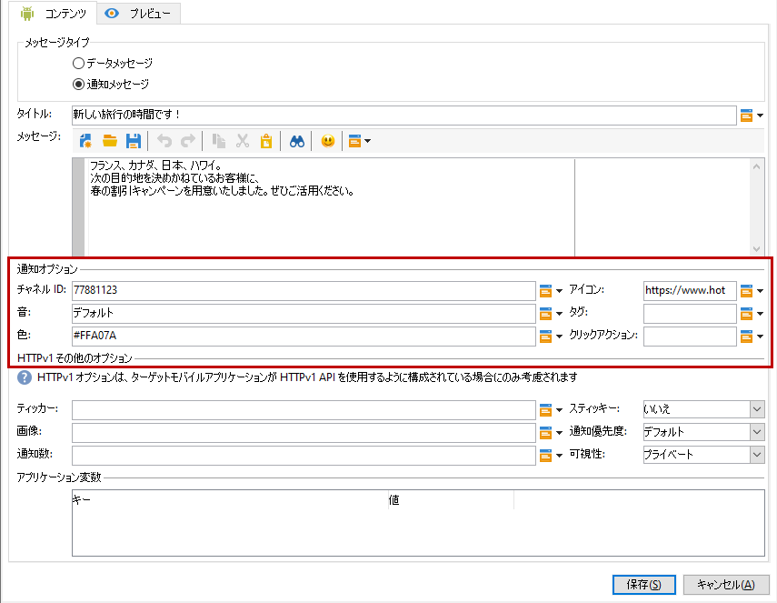
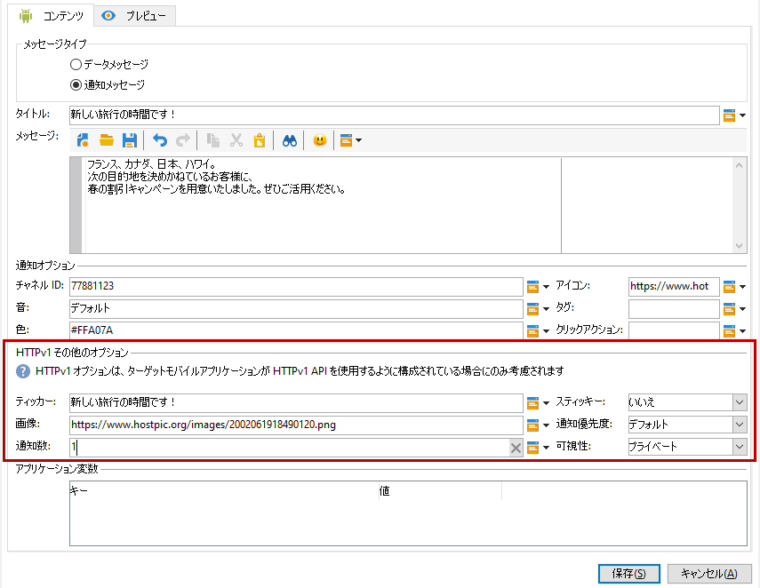

# Androidの設定手順

パッケージがインストールされたら、Adobe Campaign ClassicでAndroidアプリの設定を定義できます。

>[!NOTE]
>
>iOS用にアプリを設定する方法とiOS用の配信を作成する方法については、この [節を参照してください](../../delivery/using/configuring-the-mobile-application.md)。

## Configuring Android external account {#configuring-external-account-android}

Android の場合、2 種類のコネクタを使用できます。

* V1 コネクタでは、MTA の子 1 つにつき 1 つのコネクタを使用できます。
* V2 コネクタでは、スループット向上のために FCM サーバーへの同時接続が可能です。

使用するコネクタを選択するには、次の手順に従います。

1. **[!UICONTROL 管理／プラットフォーム／外部アカウント]**&#x200B;に移動します。
1. **[!UICONTROL Android ルーティング]**&#x200B;外部アカウントを選択します。
1. 「**[!UICONTROL コネクタ]**」タブで、「**[!UICONTROL コネクタで使用された JavaScript]**」フィールドに次のように入力します。

   Android V2 の場合：https://localhost:8080/nms/jsp/androidPushConnectorV2.js

   >[!NOTE]
   >
   > または、https://localhost:8080/nms/jsp/androidPushConnector.js に設定することもできますが、コネクタのバージョン 2 を使用することをお勧めします。

   

1. Android V2 では、アドビサーバー設定ファイル（serverConf.xml）で次の追加パラメーターを使用できます。

   * **maxGCMConnectPerChild**：それぞれの子サーバーで開始できる、FCM に対する並列 HTTP リクエストの最大数（デフォルト値は 8）。

## Androidサービスの設定 {#configuring-android-service}

1. **[!UICONTROL プロファイルとターゲット／サービスと購読]**&#x200B;ノードに移動して、「**[!UICONTROL 新規]**」をクリックします。

   

1. 「**[!UICONTROL ラベル]**」と「**[!UICONTROL 内部名]**」を定義します。
1. 「**[!UICONTROL タイプ]**」フィールドに移動して「**[!UICONTROL モバイルアプリケーション]**」を選択します。

   >[!NOTE]
   >
   >デフォルトの「**[!UICONTROL 購読者のアプリケーション（nms:appSubscriptionRcp）]**」ターゲットマッピングが受信者のテーブルにリンクされています。異なるターゲットマッピングを使用する場合は、新しいターゲットマッピングを作成し、サービスの「**[!UICONTROL ターゲットマッピング]**」フィールドに入力する必要があります。ターゲットマッピングの作成について詳しくは、[設定ガイド](../../configuration/using/about-custom-recipient-table.md)を参照してください。

   

1. 次に、「**[!UICONTROL 追加]**」ボタンをクリックして、アプリケーションタイプを選択します。

   

1. Androidアプリケーションを作成します。 詳しくは、[この節](../../delivery/using/configuring-the-mobile-application-android.md#creating-android-app)を参照してください。

## Androidモバイルアプリケーションの作成 {#creating-android-app}

サービスを作成した後、Androidアプリケーションを作成する必要があります。

1. 新しく作成したサービスで、 **** 追加ボタンをクリックしてアプリケーションの種類を選択します。

   

1. 「 **[!UICONTROL Androidアプリケーションを]** 作成する **[!UICONTROL 」を選択し、]**&#x200B;ラベルを入力します。

   

1. Adobe Campaign と、アプリケーションコード（SDK 経由）で同じ「**[!UICONTROL 統合キー]**」が定義されていることを確認します。詳しくは、[Campaign SDK をモバイルアプリケーションに統合する](../../delivery/using/integrating-campaign-sdk-into-the-mobile-application.md)を参照してください。

   >[!NOTE]
   >
   > **[!UICONTROL 統合キー]**&#x200B;は、文字列値を使用して完全にカスタマイズできますが、SDK で指定されたものと完全に同じにする必要があります。

1. 次のいずれかの **[!UICONTROL APIバージョンを選択します]**。
   * HTTP. For more information refer to this [section](../../delivery/using/configuring-the-mobile-application-android.md#android-service-http).
   * HTTPV1. For more information refer to this [section](../../delivery/using/configuring-the-mobile-application-android.md#android-service-httpv1).

1. Android接続 **[!UICONTROL フィールドのFirebase Cloud Messaging設定に入力します]** 。

1. 「**[!UICONTROL 完了]**」、「**[!UICONTROL 保存]**」の順にクリックします。これで、Campaign Classic で Android アプリケーションを使用する準備が整いました。

デフォルトでは、Adobe Campaign は&#x200B;**[!UICONTROL 購読者のアプリケーション（nms:appSubscriptionRcp）]**&#x200B;テーブルの「**[!UICONTROL ユーザー ID]**」（@userKey）フィールドにキーを保存します。このキーによって購読情報を受信者にリンクできます。追加データ（複雑な紐付けキーなど）を収集するには、次の設定を適用する必要があります。

1. 「**[!UICONTROL 購読者のアプリケーション（nms:appsubscriptionRcp）]**」スキーマの拡張を作成し、新しいフィールドを定義します。

1. 「**[!UICONTROL 購読パラメーター]**」タブでマッピングを定義します。

   >[!CAUTION]
   >
   >「**[!UICONTROL 購読パラメーター]**」タブの設定名が、モバイルアプリケーションコードの設定名と同じであることを確認します。[Campaign SDK をモバイルアプリケーションに統合する](../../delivery/using/integrating-campaign-sdk-into-the-mobile-application.md)の節を参照してください。

### APIバージョンを選択します{#select-api-version}

サービスと新しいモバイルアプリケーションを作成したら、選択したAPIバージョンに応じてモバイルアプリケーションを設定する必要があります。

サービスおよびモバイルアプリケーションの作成について詳しくは、この [節を参照してください](../../delivery/using/configuring-the-mobile-application-android.md#configuring-android-service)

#### HTTP v1 APIバージョンを使用する{#android-service-httpv1}

HTTP v1 APIバージョンを設定するには、次の手順に従います。

1. 「 **[!UICONTROL モバイルアプリケーション作成ウィザード]** 」ウィンドウの「 **[!UICONTROL APIバージョン]** 」ドロップダウンで「HTTPV1 **** 」を選択します。

1. 「 **[!UICONTROL プロジェクトのjsonファイルを読み込み」をクリックして、プロジェクトの詳細を抽出します。]** ...JSONキーファイルを直接読み込みます。 For more information on how to extract your JSON file, refer to this [page](https://firebase.google.com/docs/admin/setup#initialize-sdk).

1. 次の詳細を手動で入力することもできます。
   * **[!UICONTROL プロジェクト ID]**
   * **[!UICONTROL 秘密鍵]**
   * **[!UICONTROL クライアント E メール]**

   

1. 「 **[!UICONTROL 接続をテスト]** 」をクリックして、設定が正しいこと、およびマーケティングサーバーがFCMにアクセスできることを確認します。

   >[!CAUTION]
   >
   >ミッドソーシングデプロイメントの場合、「 **[!UICONTROL Test connection]** 」ボタンは、MIDサーバーがFCMサーバーにアクセスできるかどうかを確認しません。

   

1. オプションとして、必要に応じ、**[!UICONTROL アプリケーション変数]**&#x200B;を使用してプッシュメッセージのコンテンツを強化できます。これらは完全にカスタマイズ可能で、モバイルデバイスに送信されるメッセージペイロードの一部です。

1. 「**[!UICONTROL 完了]**」、「**[!UICONTROL 保存]**」の順にクリックします。これで、Campaign Classic で Android アプリケーションを使用する準備が整いました。

以下に、プッシュ通知をさらにパーソナライズするためのFCMペイロード名を示します。

| メッセージタイプ | 設定可能なメッセージ要素（FCMペイロード名） | 設定可能なオプション（FCMペイロード名） |
|:-:|:-:|:-:|
| データメッセージ | 該当なし | validate_only |
| 通知メッセージ | title, body, android_チャネル_id，アイコン，サウンド，タグ，色， click_action，画像，ティッカー，スティッキー， visibility, notification_priority, notification_count   | validate_only |

 
 

#### HTTP APIバージョン{#android-service-http}

HTTP（レガシー）APIバージョンを設定するには、次の手順に従います。

1. 「 **[!UICONTROL モバイルアプリケーションの作成ウィザード]** 」ウィンドウの「 **[!UICONTROL APIバージョン]** 」ドロップダウンで「 **[!UICONTROL HTTP（レガシー）]** 」を選択します。

1. モバイルアプリケーションの開発者が提供した **[!UICONTROL プロジェクトキー]** を入力します。

1. オプションとして、必要に応じ、**[!UICONTROL アプリケーション変数]**&#x200B;を使用してプッシュメッセージのコンテンツを強化できます。これらは完全にカスタマイズ可能で、モバイルデバイスに送信されるメッセージペイロードの一部です。

   次の例では、**title**、**imageURL** および **iconURL** を追加し、リッチなプッシュ通知を作成してさらに通知内に表示する画像、タイトル、アイコンをアプリケーションに提供します。

   

1. 「**[!UICONTROL 完了]**」、「**[!UICONTROL 保存]**」の順にクリックします。これで、Campaign Classic で Android アプリケーションを使用する準備が整いました。

以下に、プッシュ通知をさらにパーソナライズするためのFCMペイロード名を示します。

| メッセージタイプ | 設定可能なメッセージ要素（FCMペイロード名） | 設定可能なオプション（FCMペイロード名） |
|:-:|:-:|:-:|
| データメッセージ | 該当なし | dryRun |
| 通知メッセージ | title, body, android_action_id，アイコン，サウンド，タグ，色， click_action   | dryRun |

 

## Creating an Android rich notification {#creating-android-delivery}

Firebase Cloud Messagingを使用すると、次の2種類のメッセージの中から選択できます。

* **[!UICONTROL データメッセージ]**。クライアントアプリで処理されます。
    メッセージはモバイルアプリケーションに直接送信され、モバイルアプリケーションはAndroid通知を生成して表示します。 データメッセージには、カスタムアプリケーション変数のみが含まれます。

* **[!UICONTROL 通知メッセージ]**。FCM SDKによって自動的に処理されます。
     FCMは、クライアントアプリケーションに代わって、ユーザーのデバイスにメッセージを自動的に表示します。 通知メッセージには、事前に定義された一連のパラメーターとオプションが含まれていますが、カスタムアプリケーション変数を使用してさらにパーソナライズすることもできます。

Firebase Cloud Messagingのメッセージタイプについて詳しくは、 [FCMドキュメントを参照してください](https://firebase.google.com/docs/cloud-messaging/concept-options#notifications_and_data_messages)。

### データメッセージの作成 {#creating-data-message}

1. **[!UICONTROL キャンペーン管理]**／**[!UICONTROL 配信]**&#x200B;に移動します。

1. 「**[!UICONTROL 新規]**」をクリックします。

   

1. 「**[!UICONTROL 配信テンプレート]**」ドロップダウンで「**[!UICONTROL Android 配信（android）]**」を選択します。配信に&#x200B;**[!UICONTROL ラベル]**&#x200B;を追加します。

1. 「**[!UICONTROL 宛先]**」をクリックして、ターゲットにする母集団を定義します。デフォルトでは、**[!UICONTROL 購読者のアプリケーション]**&#x200B;ターゲットマッピングが適用されます。をクリックし **** 追加、サービスを選択します。

   

1. **[!UICONTROL ターゲットのタイプ]******&#x200B;ウィンドウで、「Android モバイルアプリケーションの購読者」を選択し、「**[!UICONTROL 次へ]**」をクリックします。

1. 「**[!UICONTROL サービス]**」ドロップダウンで、以前に作成したサービスとアプリケーションを選択して「**[!UICONTROL 完了]**」をクリックします。**[!UICONTROL アプリケーション変数]**&#x200B;は、設定手順で追加された内容に応じて自動的に追加されます。

   

1. 「 **[!UICONTROL Message Type]** 」として **[!UICONTROL データメッセージを選択します]**。

1. リッチ通知を編集します。

   

1. 必要に応じて、以前設定した **[!UICONTROL アプリケーション変数に情報を追加できます]** 。 **[!UICONTROL アプリケーション変数]** (Application variables)は、Androidサービスで設定する必要があり、モバイルデバイスに送信されるメッセージペイロードの一部です。

1. 「**[!UICONTROL 保存]**」をクリックし、配信を送信します。

プッシュ通知が購読者のモバイル Android デバイスで受信されると、画像と Web ページが表示されます。

### 通知メッセージの作成 {#creating-notification-message}

>[!NOTE]
>
>通知メッセージの追加オプションは、HTTP v1 API設定でのみ使用できます。 詳しくは、[この節](../../delivery/using/configuring-the-mobile-application-android.md#android-service-httpv1)を参照してください。

1. **[!UICONTROL キャンペーン管理]**／**[!UICONTROL 配信]**&#x200B;に移動します。

1. 「**[!UICONTROL 新規]**」をクリックします。

   

1. 「**[!UICONTROL 配信テンプレート]**」ドロップダウンで「**[!UICONTROL Android 配信（android）]**」を選択します。配信に&#x200B;**[!UICONTROL ラベル]**&#x200B;を追加します。

1. 「**[!UICONTROL 宛先]**」をクリックして、ターゲットにする母集団を定義します。デフォルトでは、**[!UICONTROL 購読者のアプリケーション]**&#x200B;ターゲットマッピングが適用されます。をクリックし **** 追加、サービスを選択します。

   

1. **[!UICONTROL ターゲットのタイプ]******&#x200B;ウィンドウで、「Android モバイルアプリケーションの購読者」を選択し、「**[!UICONTROL 次へ]**」をクリックします。

1. 「**[!UICONTROL サービス]**」ドロップダウンで、以前に作成したサービスとアプリケーションを選択して「**[!UICONTROL 完了]**」をクリックします。

   

1. 「 **[!UICONTROL 通知メッセージ]** 」を「 **[!UICONTROL メッセージタイプ]**」に選択します。

1. 追加タイトルを指定し、メッセージを編集します。 「 **[!UICONTROL 通知」オプションを使用して、プッシュ通知をパーソナライズします]**。

   * **[!UICONTROL チャネルID]**:通知のチャネルIDを設定します。 このチャネルIDを持つ通知を受信する前に、アプリでこのチャネルIDを持つチャネルを作成する必要があります。
   * **[!UICONTROL サウンド]**:デバイスが通知を受け取るときに再生するサウンドを設定します。
   * **[!UICONTROL 色]**:通知のアイコンの色を設定します。
   * **[!UICONTROL アイコン]**:プロファイルのデバイスに表示される通知のアイコンを設定します。
   * **[!UICONTROL タグ]**:通知ドロワー内の既存の通知を置き換えるために使用する識別子を設定します。
   * **[!UICONTROL クリックアクション]**:通知のクリックに関連付けられたアクションを設定します。

   「 **[!UICONTROL 通知オプション]** 」と「これらのフィールドに入力する方法」について詳しくは、 [FCMのドキュメントを参照してください](https://firebase.google.com/docs/reference/fcm/rest/v1/projects.messages#androidnotification)。

   

1. アプリケーションがHTTP v1 APIプロトコルを使用して設定されている場合は、以下の **[!UICONTROL HTTPV1追加オプションを使用して、プッシュ通知をさらにパーソナライズできます]**。

   * **[!UICONTROL ティッカー]**:通知のティッカーテキストを設定します。 Android 5.0 Lollipopに設定されたデバイスでのみ使用できます。
   * **[!UICONTROL 画像]**:通知に表示する画像のURLを設定します。
   * **[!UICONTROL 通知数]**:新しい未読情報をアプリケーションアイコンに直接表示する数を設定します。
   * **[!UICONTROL 定着]**:trueまたはfalseに設定します。 falseに設定した場合、ユーザーがクリックすると通知が自動的に閉じます。 trueに設定した場合、ユーザーがクリックしても通知は表示されます。
   * **[!UICONTROL 通知の優先度]**:通知の優先度レベルを、デフォルト、最小、低または高に設定します。 For more on this, refer to [FCM documentation](https://firebase.google.com/docs/reference/fcm/rest/v1/projects.messages#NotificationPriority).
   * **[!UICONTROL 表示]**:通知の表示レベルを公開、非公開、または秘密に設定します。 For more on this, refer to [FCM documentation](https://firebase.google.com/docs/reference/fcm/rest/v1/projects.messages#visibility).

   「 **[!UICONTROL HTTP v1追加のオプション]** 」と「これらのフィールドを設定する方法」について詳しくは、 [FCMドキュメントを参照してください](https://firebase.google.com/docs/reference/fcm/rest/v1/projects.messages#androidnotification)。

   

1. 必要に応じて、以前設定した **[!UICONTROL アプリケーション変数に情報を追加できます]** 。 **[!UICONTROL アプリケーション変数]** (Application variables)は、Androidサービスで設定する必要があり、モバイルデバイスに送信されるメッセージペイロードの一部です。

1. 「**[!UICONTROL 保存]**」をクリックし、配信を送信します。

プッシュ通知が購読者のモバイル Android デバイスで受信されると、画像と Web ページが表示されます。
