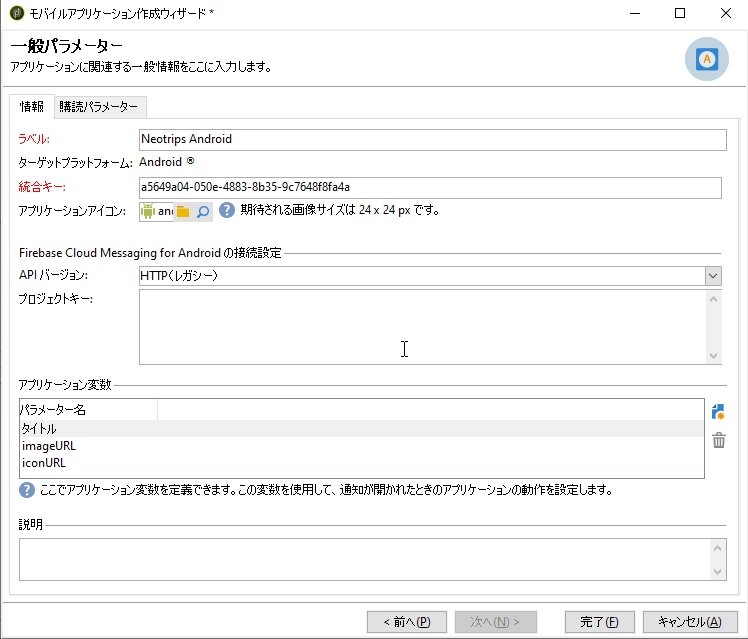

# Android の設定手順

パッケージがインストールされたら、Adobe Campaign Classic で Android アプリの設定を定義できます。

>[!NOTE]
>
>iOS 用にアプリを設定する方法と iOS 用の配信を作成する方法については、[この節](configuring-the-mobile-application.md)を参照してください。

主な手順は次のとおりです。

1. [Android 外部アカウントを設定する](#configuring-external-account-android)
1. [Android サービスを設定する](#configuring-android-service)
1. [Campaign でモバイルアプリを作成する](#creating-android-app)
1. [追加データでアプリスキーマを拡張する](#extend-subscription-schema)

これで、[Android リッチ通知を作成](create-notifications-android.md)できるようになります。

## Android 外部アカウントの設定 {#configuring-external-account-android}

Android の場合、2 種類のコネクタを使用できます。

* V1 コネクタでは、MTA の子 1 つにつき 1 つのコネクタを使用できます。
* V2 コネクタでは、スループット向上のために FCM サーバーへの同時接続が可能です。

使用するコネクタを選択するには、次の手順に従います。

1. **[!UICONTROL 管理／プラットフォーム／外部アカウント]**&#x200B;に移動します。
1. **[!UICONTROL Android ルーティング]**&#x200B;外部アカウントを選択します。
1. 「**[!UICONTROL コネクタ]**」タブで、「**[!UICONTROL コネクタで使用された JavaScript]**」フィールドに次のように入力します。

   Android V2 の場合：https://localhost:8080/nms/jsp/androidPushConnectorV2.js

   >[!NOTE]
   >
   > または、https://localhost:8080/nms/jsp/androidPushConnector.js に設定することもできますが、コネクタのバージョン 2 を使用することをお勧めします。

   

1. Android V2 では、アドビサーバー設定ファイル（serverConf.xml）で次の追加パラメーターを使用できます。

   * **maxGCMConnectPerChild**：それぞれの子サーバーで開始できる、FCM に対する並列 HTTP リクエストの最大数（デフォルト値は 8）。

## Android サービスの設定 {#configuring-android-service}

 [Android サービスの設定方法をビデオで説明します](https://experienceleague.adobe.com/docs/campaign-classic-learn/getting-started-with-push-notifications-for-android/configuring-an-android-service-in-campaign.html?lang=ja#configuring-an-android-service-and-creating-an-android-mobile-application-in-campaign)

1. **[!UICONTROL プロファイルとターゲット／サービスと購読]**&#x200B;ノードに移動して、「**[!UICONTROL 新規]**」をクリックします。

   

1. 「**[!UICONTROL ラベル]**」と「**[!UICONTROL 内部名]**」を定義します。
1. 「**[!UICONTROL タイプ]**」フィールドに移動して「**[!UICONTROL モバイルアプリケーション]**」を選択します。

   >[!NOTE]
   >
   >デフォルトの「**[!UICONTROL 購読者のアプリケーション（nms:appSubscriptionRcp）]**」ターゲットマッピングが受信者のテーブルにリンクされています。異なるターゲットマッピングを使用する場合は、新しいターゲットマッピングを作成し、サービスの「**[!UICONTROL ターゲットマッピング]**」フィールドに入力する必要があります。ターゲットマッピングの作成について詳しくは、[この節](../../configuration/using/about-custom-recipient-table.md)を参照してください。

   

1. 次に、「**[!UICONTROL 追加]**」ボタンをクリックして、アプリケーションタイプを選択します。

   

1. Android アプリケーションを作成します。詳しくは、[この節](configuring-the-mobile-application-android.md#creating-android-app)を参照してください。

## Android モバイルアプリケーションの作成 {#creating-android-app}

サービスの作成後に、Android アプリケーションを作成する必要があります。

1. 新しく作成したサービスで、「**[!UICONTROL 追加]**」ボタンをクリックしてアプリケーションタイプを選択します。

   

1. 「**[!UICONTROL Android アプリケーションを作成]**」を選択し、**[!UICONTROL ラベル]**&#x200B;を入力します。

   

1. Adobe Campaign と、SDK を使用するアプリケーションコードで同じ&#x200B;**[!UICONTROL 統合キー]**&#x200B;が定義されていることを確認します。詳しくは、[この節](integrating-campaign-sdk-into-the-mobile-application.md)を参照してください。

   >[!NOTE]
   >
   > **[!UICONTROL 統合キー]**&#x200B;は、文字列値を使用して完全にカスタマイズできますが、SDK で指定されたものと完全に同じにする必要があります。

1. **[!UICONTROL API バージョン]**&#x200B;として HTTP v1 または HTTP （レガシー）を選択します。 これらの設定について詳しくは、[こちらの節](#select-api-version)を参照してください。

1. **[!UICONTROL Firebase Cloud Messaging for Android の接続設定]**&#x200B;フィールドに入力します。

1. 「**[!UICONTROL 完了]**」、「**[!UICONTROL 保存]**」の順にクリックします。これで、Campaign Classic で Android アプリケーションを使用する準備が整いました。

デフォルトでは、Adobe Campaign は&#x200B;**[!UICONTROL 購読者のアプリケーション（nms:appSubscriptionRcp）]**&#x200B;テーブルの「**[!UICONTROL ユーザー ID]**」（@userKey）フィールドにキーを保存します。このキーによって購読情報を受信者にリンクできます。追加データ（複雑な紐付けキーなど）を収集するには、次の設定を適用する必要があります。

### API バージョンの選択{#select-api-version}

サービスと新しいモバイルアプリケーションを作成したら、選択した API バージョンに応じてモバイルアプリケーションを設定する必要があります。

* **HTTP v1** の設定について詳しくは、[この節](configuring-the-mobile-application-android.md#android-service-httpv1)を参照してください。
* **HTTP（レガシー）**&#x200B;の設定について詳しくは、[この節](configuring-the-mobile-application-android.md#android-service-http)を参照してください。

#### HTTP v1 API の設定{#android-service-httpv1}

HTTP v1 API バージョンを設定するには、次の手順に従います。

1. **[!UICONTROL モバイルアプリケーション作成ウィザード]**&#x200B;ウィンドウの「**[!UICONTROL API バージョン]**」ドロップダウンで「**[!UICONTROL HTTPV1]**」を選択します。

1. 「**[!UICONTROL プロジェクトの詳細を抽出するプロジェクトの json ファイルを読み込む...]**」をクリックして、JSON キーファイルを直接読み込みます。JSON ファイルの抽出方法について詳しくは、[このページ](https://firebase.google.com/docs/admin/setup#initialize-sdk)を参照してください。

   次の詳細を手動で入力することもできます。
   * **[!UICONTROL プロジェクト ID]**
   * **[!UICONTROL 秘密鍵]**
   * **[!UICONTROL クライアント E メール]**

   

1. 「**[!UICONTROL 接続をテスト]**」をクリックして、設定が正しいこと、およびマーケティングサーバーが FCM にアクセスできることを確認します。

   >[!CAUTION]
   >
   >ミッドソーシングデプロイメントの場合、「**[!UICONTROL 接続をテスト]**」ボタンは、MID サーバーが FCM サーバーにアクセスできるかどうかを確認しません。

   

1. オプションとして、必要に応じ、**[!UICONTROL アプリケーション変数]**&#x200B;を使用してプッシュメッセージのコンテンツを強化できます。これらは完全にカスタマイズ可能で、モバイルデバイスに送信されるメッセージペイロードの一部です。

1. 「**[!UICONTROL 完了]**」、「**[!UICONTROL 保存]**」の順にクリックします。これで、Campaign Classic で Android アプリケーションを使用する準備が整いました。

以下に、プッシュ通知をさらにパーソナライズするための FCM ペイロード名を示します。

| メッセージタイプ | 設定可能なメッセージ要素（FCM ペイロード名） | 設定可能なオプション（FCM ペイロード名） |
|:-:|:-:|:-:|
| データメッセージ | 該当なし | validate_only |
| 通知メッセージ | title、body、android_channel_id、icon、sound、tag、color、click_action、image、ticker、sticky、visibility、notification_priority、notification_count   | validate_only |

 
 

#### HTTP（レガシー）API の設定{#android-service-http}

HTTP（レガシー）API バージョンを設定するには、次の手順に従います。

1. **[!UICONTROL モバイルアプリケーションの作成ウィザード]**&#x200B;ウィンドウの「**[!UICONTROL API バージョン]**」ドロップダウンで「**[!UICONTROL HTTP (レガシー)]**」を選択します。

1. モバイルアプリケーションの開発者が提供した&#x200B;**[!UICONTROL プロジェクトキー]**&#x200B;を入力します。

1. オプションとして、必要に応じ、**[!UICONTROL アプリケーション変数]**&#x200B;を使用してプッシュメッセージのコンテンツを強化できます。これらは完全にカスタマイズ可能で、モバイルデバイスに送信されるメッセージペイロードの一部です。

   次の例では、**title**、**imageURL** および **iconURL** を追加し、リッチなプッシュ通知を作成してさらに通知内に表示する画像、タイトル、アイコンをアプリケーションに提供します。

   

1. 「**[!UICONTROL 完了]**」、「**[!UICONTROL 保存]**」の順にクリックします。これで、Campaign Classic で Android アプリケーションを使用する準備が整いました。

以下に、プッシュ通知をさらにパーソナライズするための FCM ペイロード名を示します。

| メッセージタイプ | 設定可能なメッセージ要素（FCM ペイロード名） | 設定可能なオプション（FCM ペイロード名） |
|:-:|:-:|:-:|
| データメッセージ | 該当なし | dryRun |
| 通知メッセージ | title、body、android_channel_id、icon、sound、tag、color、click_action   | dryRun |

 

## appsubscriptionRcp スキーマの拡張 {#extend-subscription-schema}

 [appsubscriptionRcp スキーマの拡張方法をビデオで説明します](https://experienceleague.adobe.com/docs/campaign-classic-learn/getting-started-with-push-notifications-for-android/extending-the-app-subscription-schema.html?lang=ja#extending-the-app-subscription-schema-to-personalize-push-notifications)

**appsubscriptionRcp** を拡張して、アプリのパラメーターを Campaign データベースに保存するための新しい追加フィールドを定義する必要があります。 これらのフィールドは、例えば、パーソナライゼーションに使用されます。 手順は次のとおりです。

1. 「**[!UICONTROL 購読者のアプリケーション（nms:appsubscriptionRcp）]**」スキーマの拡張を作成し、新しいフィールドを定義します。スキーマ拡張について詳しくは、[こちらのページ](../../configuration/using/about-schema-edition.md)を参照してください。

1. 「**[!UICONTROL 購読パラメーター]**」タブでマッピングを定義します。

   >[!CAUTION]
   >
   >「**[!UICONTROL 購読パラメーター]**」タブの設定名が、モバイルアプリケーションコードの設定名と同じであることを確認します。[この節](integrating-campaign-sdk-into-the-mobile-application.md)を参照してください。
