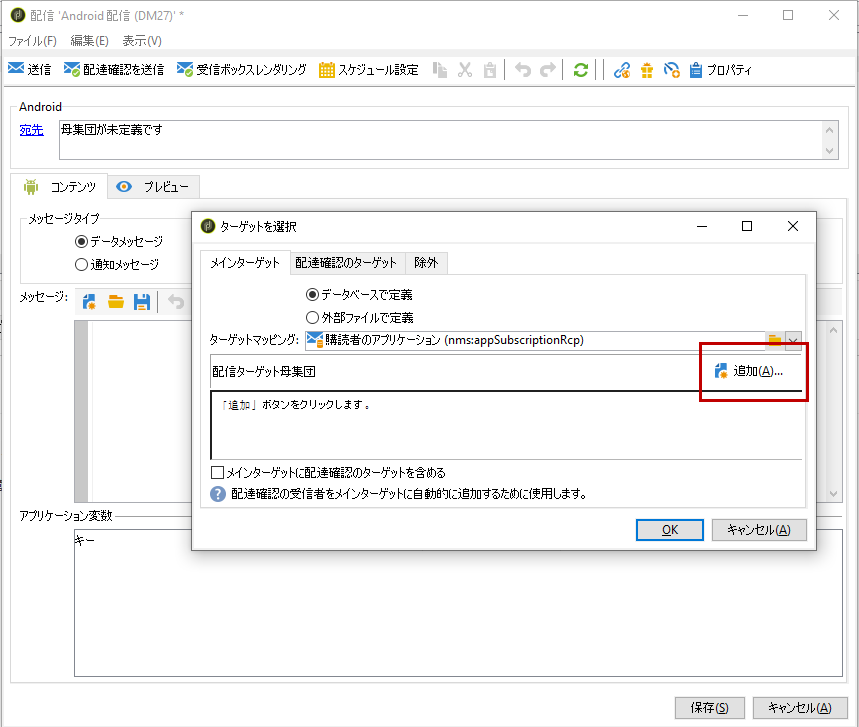

# Adobe Campaign でモバイルアプリケーションを設定する {#configuring-the-mobile-application-in-adobe-campaign}

以下は、オンラインホリデーパッケージを販売する会社を想定した設定例です。Hisのモバイルアプリケーション(Neotrips)は、次の2つのバージョンでお客様が利用できます。Android向けのNeotripsとiOS向けのNeotrips。 モバイルアプリケーションを Adobe Campaign で設定するには、次の手順に従います。

* Create a **[!UICONTROL Mobile application]** type information service for the Neotrips mobile application.
* このサービスに、iOS バージョンと Android バージョンのアプリケーションを追加します。
* iOSとAndroidの両方の配信を作成します。

>[!NOTE]
>
>Go to the **[!UICONTROL Subscriptions]** tab of the service to view the list of subscribers to the service, i.e. all people who have installed the application on their mobile and agreed to receive notifications.

## iOSでのモバイルアプリケーションの設定 {#configuring-the-mobile-application-ios}

>[!CAUTION]
>
>Adobe Campaign SDK に統合する前に、アプリケーションにプッシュアクションを設定する必要があります。
>
>If this is not the case, please refer to [this page](https://developer.apple.com/library/archive/documentation/NetworkingInternet/Conceptual/RemoteNotificationsPG/).

### 手順1:パッケージのインストール {#installing-package-ios}

1. Adobe Campaignクライアントコンソールからパッケ **[!UICONTROL Tools > Advanced > Package import...]** ージのインポートウィザードにアクセスします。

   

1. 選択 **[!UICONTROL Install a standard package]**.

1. 表示されるリストで、チェックをオンにしま **[!UICONTROL Mobile App Channel]**&#x200B;す。

   

1. をクリック **[!UICONTROL Next]**&#x200B;し、パッケージ **[!UICONTROL Start]** のインストールを開始します。

   パッケージがインストールされると、プログレスバーに **100%と表示さ** れ、インストールログに次のメッセージが表示されます。 **[!UICONTROL Installation of packages successful]**.

   

1. **[!UICONTROL Close]** インストールウィンドウ

### 手順2:iOS外部アカウントの設定 {#configuring-external-account-ios}

iOS の場合、2 種類のコネクタを使用できます。

* iOS バイナリコネクタ：旧式のバイナリ APNS サーバーで通知を送信します。
* iOS HTTP2 コネクタ：HTTP/2 APNS に通知を送信します。

使用するコネクタを選択するには、次の手順に従います。

1. 移動 **[!UICONTROL Administration > Platform > External accounts]**.
1. 外部アカウント **[!UICONTROL iOS routing]** を選択します。
1. タブで、 **[!UICONTROL Connector]** 次のフィールドに入力し **[!UICONTROL Access URL of the connector]** ます。

   iOS HTTP2 の場合：http://localhost:8080/nms/jsp/iosHTTP2.jsp

   

   >[!NOTE]
   >
   > また、https://localhost:8080/nms/jsp/ios.jspに従って設定することもできますが、コネクタのバージョン2を使用することをお勧めします。

1. クリック **[!UICONTROL Save]**.

これでiOSコネクタが設定されました。 サービスの作成を開始できます。

### 手順3:iOSサービスの設定 {#configuring-ios-service}

1. ノードに移動し、 **[!UICONTROL Profiles and Targets > Services and subscriptions]** をクリックしま **[!UICONTROL New]**&#x200B;す。

   

1. とを定義 **[!UICONTROL Label]** します **[!UICONTROL Internal name]**。
1. フィールドに移動 **[!UICONTROL Type]** し、を選択しま **[!UICONTROL Mobile application]**&#x200B;す。

   >[!NOTE]
   >
   >デフォルトのター **[!UICONTROL Subscriber applications (nms:appSubscriptionRcp)]** ゲットマッピングは、受信者テーブルにリンクされます。 If you want to use a different target mapping, you need to create a new target mapping and enter it in the **[!UICONTROL Target mapping]** field of the service. ターゲットマッピングの作成について詳しくは、[設定ガイド](../../configuration/using/about-custom-recipient-table.md)を参照してください。

   

1. 次に、ボタンをク **[!UICONTROL Add]** リックしてアプリの種類を選択します。

   

1. 次のウィンドウが表示されます。 を選択 **[!UICONTROL Create an iOS application]** し、を入力して開始しま **[!UICONTROL Label]**&#x200B;す。

   

1. オプションとして、必要に応じてプッシュメッセージの内容を拡張するこ **[!UICONTROL Application variables]** とができます。 これらは完全にカスタマイズ可能で、モバイルデバイスに送信されるメッセージペイロードの一部です。
次の例では、mediaURlと **mediaExtを追加してリッ** チプッシュ通知を作成し **** 、通知内に表示する画像をアプリケーションに提供します。

   

1. このタ **[!UICONTROL Subscription parameters]** ブでは、スキーマの拡張子を使用してマッピングを定義で **[!UICONTROL Subscriber applications (nms:appsubscriptionRcp)]** きます。

   >[!NOTE]
   >
   >アプリケーションの開発バージョン（サンドボックス）と本番バージョンに同じ証明書を使用しないでください。

1. このタ **[!UICONTROL Sounds]** ブでは、再生するサウンドを指定できます。 アプリケ **[!UICONTROL Add]** ーションに埋 **[!UICONTROL Internal name]** め込まれたファイルの名前またはシステムサウンドの名前を含むフィールドをクリックして入力します。

1. をクリック **[!UICONTROL Next]** して、開発アプリケーションの設定を開始します。

1. Make sure the same **[!UICONTROL Integration key]** is defined in Adobe Campaign and in the application code via the SDK. 詳しくは、次を参照してください。モバイ [ルアプリケーションへのCampaign SDKの統合](../../delivery/using/integrating-campaign-sdk-into-the-mobile-application.md)。 この統合キーは、各アプリケーションに対して固有で、モバイルアプリケーションを Adobe Campaign プラットフォームにリンクできます。

   >[!NOTE]
   >
   > この文 **[!UICONTROL Integration key]** 字列値は完全にカスタマイズ可能ですが、SDKで指定されているものと完全に同じにする必要があります。

1. フィールドからあらかじめ用意されているアイコンの1つを選択し、サービス内のモバイルア **[!UICONTROL Application icon]** プリケーションをパーソナライズします。

1. Click the **[!UICONTROL Enter the certificate...]** link then select the authentication certificate and enter the password that was provided by the mobile application developer. をクリックして、 **[!UICONTROL Test the connection]** 成功したことを確認できます。

   >[!NOTE]
   >
   >Appleでは、同じモバイルアプリケーションの開発版と実稼働版に異なる証明書が必要です。 Adobe Campaignで2つの異なるアプリを設定する必要があります。

   

1. をクリ **[!UICONTROL Next]** ックして実稼働アプリケーションの設定を開始し、上記と同じ手順に従います。

   

1. クリック **[!UICONTROL Finish]**. これで、iOSアプリケーションをCampaign Classicで使用する準備が整いました。

### 手順4:iOSリッチ通知の作成 {#creating-ios-delivery}

iOS 10 以降では、リッチ通知を生成することができます。Adobe Campaign では、変数を使用して通知を送信し、デバイスでリッチ通知を表示できます。

ここで、新しい配信を作成し、作成したモバイルアプリケーションにリンクする必要があります。

1. 移動 **[!UICONTROL Campaign management]** > **[!UICONTROL Deliveries]**.

1. クリック **[!UICONTROL New]**.

   

1. ドロッ **[!UICONTROL Deliver on iOS (ios)]** プダウン **[!UICONTROL Delivery template]** でを選択します。 配信にを **[!UICONTROL Label]** 追加します。

1. をクリック **[!UICONTROL To]** して、ターゲットとする母集団を定義します。 デフォルトでは、ターゲット **[!UICONTROL Subscriber application]** マッピングが適用されます。 以前に作 **[!UICONTROL Add]** 成したサービスを選択します。

   

1. ウィンドウ **[!UICONTROL Target type]** でを選択し、をク **[!UICONTROL Subscribers of an iOS mobile application (iPhone, iPad)]** リックしま **[!UICONTROL Next]**&#x200B;す。

1. ドロップダウ **[!UICONTROL Service]** ンで、以前に作成したサービスを選択し、ターゲットにするアプリを選択して、をクリックしま **[!UICONTROL Finish]**す。
は、 **[!UICONTROL Application variables]** 設定手順で追加された内容に応じて自動的に追加されます。

   

1. リッチ通知を編集します。

   

1. モバイルアプリケ **[!UICONTROL Mutable content]** ーションがメディアコンテンツをダウンロードできるようにするには、通知を編集ウィンドウのチェックボックスをオンにします。

1. Click **[!UICONTROL Save]** and send your delivery.

購読者のモバイルiOSデバイスで画像とWebページを受信した場合は、プッシュ通知に画像とWebページを表示する必要があります。

## Androidでのモバイルアプリケーションの設定 {#configuring-the-mobile-application-android}

### 手順1:パッケージのインストール {#installing-package-android}

1. Adobe Campaignクライアントコンソールからパッケ **[!UICONTROL Tools > Advanced > Package import...]** ージのインポートウィザードにアクセスします。

   

1. 選択 **[!UICONTROL Install a standard package]**.

1. 表示されるリストで、チェックをオンにしま **[!UICONTROL Mobile App Channel]**&#x200B;す。

   

1. をクリック **[!UICONTROL Next]**&#x200B;し、パッケージ **[!UICONTROL Start]** のインストールを開始します。

   パッケージがインストールされると、プログレスバーに **100%と表示さ** れ、インストールログに次のメッセージが表示されます。 **[!UICONTROL Installation of packages successful]**.

   

1. **[!UICONTROL Close]** インストールウィンドウ

### 手順2:Android外部アカウントの設定 {#configuring-external-account-android}

Android の場合、2 種類のコネクタを使用できます。

* V1 コネクタでは、MTA の子 1 つにつき 1 つのコネクタを使用できます。
* V2 コネクタでは、スループット向上のために FCM サーバーへの同時接続が可能です。

使用するコネクタを選択するには、次の手順に従います。

1. 移動 **[!UICONTROL Administration > Platform > External accounts]**.
1. 外部アカウント **[!UICONTROL Android routing]** を選択します。
1. タブで、 **[!UICONTROL Connector]** 次のフィールドに入力し **[!UICONTROL JavaScript used in the connector]** ます。

   Android V2 の場合：https://localhost:8080/nms/jsp/androidPushConnectorV2.js

   >[!NOTE]
   >
   > また、https://localhost:8080/nms/jsp/androidPushConnector.jsに従って設定することもできますが、コネクタのバージョン2を使用することをお勧めします。

   

1. Android V2 では、アドビサーバー設定ファイル（serverConf.xml）で次の追加パラメーターを使用できます。

   * **maxGCMConnectPerChild**:各子サーバーが開始するFCMに対する並列HTTP要求の最大数（デフォルトで8）。

### 手順3:Androidサービスの設定 {#configuring-android-service}

1. ノードに移動し、 **[!UICONTROL Profiles and Targets > Services and subscriptions]** をクリックしま **[!UICONTROL New]**&#x200B;す。

   

1. とを定義 **[!UICONTROL Label]** します **[!UICONTROL Internal name]**。
1. フィールドに移動 **[!UICONTROL Type]** し、を選択しま **[!UICONTROL Mobile application]**&#x200B;す。

   >[!NOTE]
   >
   >デフォルトのター **[!UICONTROL Subscriber applications (nms:appSubscriptionRcp)]** ゲットマッピングは、受信者テーブルにリンクされます。 If you want to use a different target mapping, you need to create a new target mapping and enter it in the **[!UICONTROL Target mapping]** field of the service. ターゲットマッピングの作成について詳しくは、[設定ガイド](../../configuration/using/about-custom-recipient-table.md)を参照してください。

   

1. 次に、ボタンをク **[!UICONTROL Add]** リックしてアプリの種類を選択します。

   

1. 選択 **[!UICONTROL Create an Android application]**.

   

1. aと入力しま **[!UICONTROL Label]**&#x200B;す。

1. Make sure the same **[!UICONTROL Integration key]** is defined in Adobe Campaign and in the application code via the SDK. 詳しくは、次を参照してください。モバイ [ルアプリケーションへのCampaign SDKの統合](../../delivery/using/integrating-campaign-sdk-into-the-mobile-application.md)。

   >[!NOTE]
   >
   > この文 **[!UICONTROL Integration key]** 字列値は完全にカスタマイズ可能ですが、SDKで指定されているものと完全に同じにする必要があります。

1. フィールドからあらかじめ用意されているアイコンの1つを選択し、サービス内のモバイルア **[!UICONTROL Application icon]** プリケーションをパーソナライズします。

1. アプリの接続設定を入力します。モバイルアプリケーションの開発者が提供したプロジェクトキーを入力します。

1. オプションとして、必要に応じてプッシュメッセージの内容を拡張するこ **[!UICONTROL Application variables]** とができます。 これらは完全にカスタマイズ可能で、モバイルデバイスに送信されるメッセージペイロードの一部です。

   次の例では、title、 **imageURL**、 ******** iconURLを追加してリッチプッシュ通知を作成し、通知内に表示する画像、タイトル、アイコンをアプリケーションに提供します。

   

1. 「>」をク **[!UICONTROL Finish]** リックしま **[!UICONTROL Save]**&#x200B;す。 これで、AndroidアプリケーションをCampaign Classicで使用する準備が整いました。

デフォルトでは、Adobe Campaignはテーブルの(@userKey) **[!UICONTROL User identifier]** フィールドにキーを保存し **[!UICONTROL Subscriber applications (nms:appSubscriptionRcp)]** ます。 このキーによって購読情報を受信者にリンクできます。追加データ（複雑な紐付けキーなど）を収集するには、次の設定を適用する必要があります。

1. スキーマの拡張子を作成し **[!UICONTROL Subscriber applications (nms:appsubscriptionRcp)]** 、新しいフィールドを定義します。
1. タブでマッピングを定義し **[!UICONTROL Subscription parameters]** ます。
   >[!CAUTION]
   >
   >Make sure the configuration names in the **[!UICONTROL Subscription parameters]** tab are the same as those in the mobile application code. 「モバイルアプリケ [ーションへのCampaign SDKの統合」の節を参照してください](../../delivery/using/integrating-campaign-sdk-into-the-mobile-application.md) 。

### 手順4:Androidリッチ通知の作成 {#creating-android-delivery}

ここで、新しい配信を作成し、作成したモバイルアプリケーションにリンクする必要があります。

1. 移動 **[!UICONTROL Campaign management]** > **[!UICONTROL Deliveries]**.

1. クリック **[!UICONTROL New]**.

   

1. ドロッ **[!UICONTROL Deliver on Android (android)]** プダウン **[!UICONTROL Delivery template]** でを選択します。 配信にを **[!UICONTROL Label]** 追加します。

1. をクリック **[!UICONTROL To]** して、ターゲットとする母集団を定義します。 デフォルトでは、ターゲット **[!UICONTROL Subscriber application]** マッピングが適用されます。 以前に作 **[!UICONTROL Add]** 成したサービスを選択します。

   

1. ウィンドウで、 **[!UICONTROL Target type]** Androidモバイルアプリケーションの購読者を選択し、をクリックしま **[!UICONTROL Next]**&#x200B;す。

1. ドロップダウン **[!UICONTROL Service]** で、以前に作成したサービスを選択し、「application」をクリックしま **[!UICONTROL Finish]**す。
は、 **[!UICONTROL Application variables]** 設定手順で追加された内容に応じて自動的に追加されます。

   

1. リッチ通知を編集します。

   

1. Click **[!UICONTROL Save]** and send your delivery.

プッシュ通知が購読者のモバイル Android デバイスで受信されると、画像と Web ページが表示されます。

